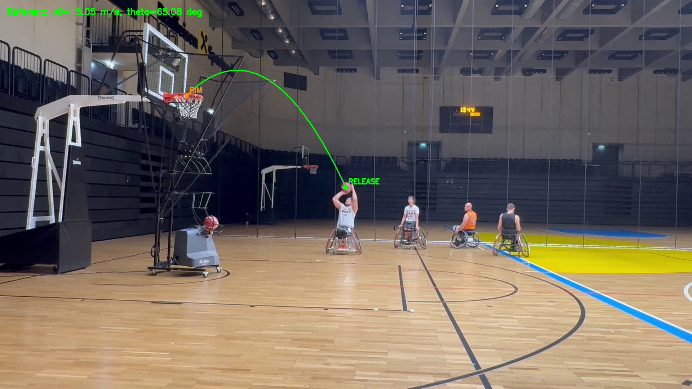
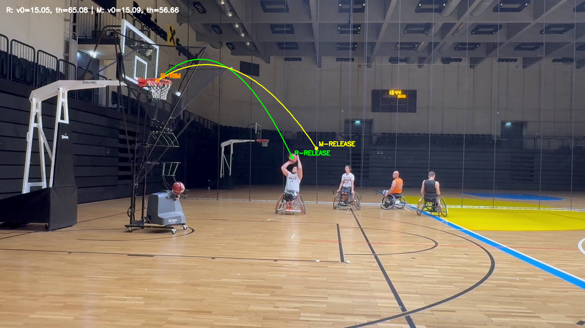

# Teilaufgabe Bacher Fabian
\textauthor{Bacher Fabian} 

## Aufgabenstellung Soll-Flugbahn
Im Alltag sowie in vielen Sportarten spielt das Werfen eines Körpers eine zentrale Rolle. Ob beim Werfen eines Balls, beim Korbwurf im Basketball oder beim gezielten Treffen eines Ziels – häufig gelingt ein Wurf nicht zufällig, sondern folgt bestimmten Gesetzmäßigkeiten. Für den Beobachter erscheint die Flugbahn zunächst schwer vorhersehbar, tatsächlich wird sie jedoch durch physikalische Zusammenhänge bestimmt.

In diesem Teil wird untersucht, wie sich ein geworfener Körper nach dem Abwurf bewegt und welche Faktoren seine Flugbahn beeinflussen. Dabei wird betrachtet, welche Rolle unter anderem Abwurfwinkel, Geschwindigkeit und Abwurfhöhe spielen und wie sich Veränderungen dieser Größen auf das Treffen eines Zielpunktes auswirken.

Aufbauend auf diesen Grundlagen wird anschließend versucht, eine optimale Flugbahn – eine sogenannte Sollflugbahn – zu bestimmen. Ziel ist es, jene Bedingungen zu ermitteln, unter denen ein vorgegebenes Ziel möglichst zuverlässig erreicht werden kann.

## Theorie

Dieses Kapitel behandelt die theoretischen Grundlagen der Arbeit. Im Fokus stehen die Bewegung geworfener Körper, die Flugkurve, der schiefe Wurf und die für die Sollflugbahn relevanten Einflussgrößen.

## Wurfbewegungen in Alltag und Sport

Abbildung: Basketballspieler beim Korbwurf während eines Spiels. Quelle: [@getty-basketball-shot]

Wurfbewegungen treten in vielen Bereichen des täglichen Lebens auf und sind besonders im Sport gut zu beobachten. Je nach Sportart unterscheiden sich Wurfentfernung, Zielhöhe und Bewegungsablauf. Für diese Arbeit ist vor allem der Basketball relevant, da dort das präzise Treffen eines erhöhten Korbes im Vordergrund steht.

Im Rahmen dieser Arbeit wird daher der Korbwurf im Basketball betrachtet. Diese Sportart eignet sich besonders gut für eine physikalische Analyse, da der Ball auf ein fest definiertes Ziel in einer bestimmten Höhe geworfen wird. Dadurch lässt sich die Flugbahn des Balls gut mit den physikalischen Modellen der Wurfbewegung beschreiben.

Unabhängig von der jeweiligen Situation lässt sich beobachten, dass ein geworfener Körper nicht geradlinig fliegt, sondern stets eine gekrümmte Bahn beschreibt. Die Flugbahn hängt von den Abwurfbedingungen (insbesondere Anfangsgeschwindigkeit, Abwurfwinkel und Abwurfhöhe) sowie von äußeren Einflüssen wie Gravitation und Luftwiderstand ab. Bereits kleine Änderungen dieser Größen können dazu führen, dass ein Ziel verfehlt wird. [@LernhelferWurf]

## Bewegung geworfener Körper

### Was versteht man unter der Bewegung eines geworfenen Körpers?

Unter der Bewegung eines geworfenen Körpers versteht man den Bewegungsablauf eines Gegenstandes ab dem Zeitpunkt, an dem er die Hand des Werfers verlässt. Beim Abwurf erhält der Körper eine Anfangsgeschwindigkeit. Nach dem Loslassen wirkt keine vom Werfer erzeugte Kraft mehr auf ihn; die weitere Bewegung wird durch äußere Kräfte bestimmt. Maßgeblich sind dabei die Erdanziehungskraft und in geringerem Ausmaß der Luftwiderstand.

Da nach dem Abwurf keine Korrektur mehr möglich ist, wird der weitere Bewegungsverlauf bereits im Moment des Loslassens festgelegt. Dabei bestimmen insbesondere Anfangsgeschwindigkeit, Abwurfwinkel und Abwurfhöhe die spätere Flugbahn des Körpers. [@LeifiPhysikWurfbewegung]

### Kräfte, die auf einen geworfenen Körper wirken

Auf einen geworfenen Körper wirken während seiner Flugphase hauptsächlich zwei Kräfte: die Erdanziehungskraft (Gravitation) und der Luftwiderstand.

Die Erdanziehungskraft ist in der Regel die dominierende Kraft. Sie wirkt ständig nach unten in Richtung Erdmittelpunkt und sorgt dafür, dass der Körper kontinuierlich zum Boden beschleunigt wird. Dadurch entsteht die charakteristische gekrümmte Flugbahn eines geworfenen Körpers.

Zusätzlich wirkt der Luftwiderstand. Dieser entsteht durch die Bewegung des Körpers durch die Luft und wirkt der Bewegungsrichtung entgegen. Im Vergleich zur Gravitation ist sein Einfluss bei üblichen Wurfgeschwindigkeiten jedoch deutlich geringer. Aus diesem Grund wird der Luftwiderstand in physikalischen Betrachtungen oft vernachlässigt. [@HyperPhysicsProjectile]

## Flugkurve (Trajektorie)

### Was versteht man unter einer Flugkurve?

Die Flugkurve, auch als Trajektorie bezeichnet, beschreibt den räumlichen Bewegungsverlauf eines Körpers während seines Fluges. Sie stellt die Bahn dar, die ein geworfener Körper vom Zeitpunkt des Abwurfs bis zum Auftreffen auf dem Boden oder am Ziel zurücklegt. [@OpenStaxProjectileMotion]

### Warum ist die Flugkurve gekrümmt?

Die gekrümmte Form der Flugbahn entsteht durch die Überlagerung zweier Bewegungen. In horizontaler Richtung bleibt die Geschwindigkeit näherungsweise konstant, in vertikaler Richtung wirkt die Erdanziehungskraft und verändert die vertikale Geschwindigkeit fortlaufend. Durch diese Überlagerung entsteht die gekrümmte Flugbahn. [@OpenStaxProjectileMotion]

### Höchster Punkt der Flugbahn

Während des Fluges steigt der geworfene Körper zunächst an, bis er einen höchsten Punkt erreicht. In diesem Punkt ist die vertikale Geschwindigkeit des Körpers für einen kurzen Moment gleich null. Anschließend beginnt der Körper wieder zu fallen.

Der höchste Punkt entsteht dadurch, dass die anfängliche Aufwärtsbewegung durch die Erdanziehungskraft zunehmend abgebremst wird. Schließlich kommt die Aufwärtsbewegung vollständig zum Stillstand, bevor die Bewegung in eine Abwärtsbewegung übergeht.

Dieser Punkt besitzt eine besondere Bedeutung, da er die maximale Flughöhe des Körpers darstellt und maßgeblich von der Anfangsgeschwindigkeit sowie dem Abwurfwinkel abhängt. [@OpenStaxProjectileMotion]

### Einfluss des Abwurfs auf die Flugbahn

Die genaue Form der Flugkurve wird bereits im Moment des Abwurfs festgelegt. Entscheidend ist dabei, mit welcher Geschwindigkeit, in welcher Richtung und aus welcher Höhe der Körper geworfen wird.

Ein flacher Wurf führt zu einer niedrigen und langen Flugbahn, während ein steiler Wurf eine höhere, jedoch kürzere Flugbahn erzeugt. Ebenso beeinflusst eine größere Anfangsgeschwindigkeit die Reichweite des Wurfes. Auch die Höhe des Abwurfpunktes verändert den Verlauf der Flugbahn, da der Körper länger in der Luft bleibt.

Somit hängt das Treffen eines Ziels direkt von den Anfangsbedingungen des Wurfes ab. Bereits kleine Änderungen dieser Parameter können dazu führen, dass ein Ziel verfehlt wird. [@OpenStaxProjectileMotion]

## Der schiefe Wurf als physikalisches Modell

### Begriffserklärung

Die zuvor beschriebene Flugkurve eines geworfenen Körpers lässt sich mathematisch mit dem sogenannten schiefen Wurf beschreiben. Darunter versteht man die Bewegung eines Körpers, der mit einer Anfangsgeschwindigkeit unter einem bestimmten Winkel zur Horizontalen in die Luft geworfen wird.

Der Körper besitzt dabei sowohl eine horizontale als auch eine vertikale Bewegungsrichtung. Nach dem Abwurf wirken keine antreibenden Kräfte mehr, sondern ausschließlich die Gravitation. Diese beeinflusst jedoch nur die vertikale Bewegung, während die horizontale Bewegung – abgesehen vom geringen Luftwiderstand – gleichförmig bleibt.

Der schiefe Wurf stellt somit ein mathematisches Modell dar, mit dem sich reale Wurfbewegungen näherungsweise berechnen lassen. [@OpenStaxProjectileEquations]

### Zerlegung der Bewegung in zwei Richtungen

Die Anfangsgeschwindigkeit wird in eine horizontale und eine vertikale Komponente zerlegt:

$v_{0x} = v_0 \cdot \cos(\alpha)$

$v_{0y} = v_0 \cdot \sin(\alpha)$

Diese beiden Komponenten beschreiben die Bewegung in horizontaler bzw. vertikaler Richtung getrennt voneinander. [@OpenStaxProjectileEquations]

### Horizontale Bewegung
Da in horizontaler Richtung keine beschleunigende Kraft wirkt, bleibt die horizontale Geschwindigkeitskomponente konstant. Es handelt sich somit um eine gleichförmige Bewegung. Der in horizontaler Richtung zurückgelegte Weg ergibt sich aus dem Produkt von horizontaler Geschwindigkeit und Zeit.

Für die horizontale Bewegung gilt (unter der Annahme, dass der Luftwiderstand vernachlässigt wird):

$x(t) = v_0 \cdot \cos(\alpha) \cdot t$

Dabei bezeichnet $x(t)$ die horizontale Entfernung vom Abwurfpunkt, $v_0$ die Anfangsgeschwindigkeit, $\alpha$ den Abwurfwinkel und $t$ die vergangene Zeit seit dem Abwurf. [@OpenStaxProjectileEquations]

### Vertikale Bewegung

In vertikaler Richtung wirkt die Erdanziehungskraft. Dadurch wird der Körper gleichmäßig nach unten beschleunigt. Neben der Anfangsgeschwindigkeit muss daher auch die Erdbeschleunigung $g$ berücksichtigt werden.

Für die vertikale Bewegung gilt:

$y(t) = h_0 + v_0 \cdot \sin(\alpha) \cdot t - \frac{1}{2} \cdot g \cdot t^2$

Hierbei beschreibt $y(t)$ die Höhe des Körpers über dem Boden, $h_0$ die Abwurfhöhe und $g$ die Erdbeschleunigung ($g \approx 9{,}81\,\mathrm{m/s^2}$). [@OpenStaxProjectileEquations]

### Mathematische Berechnung

Für die mathematische Berechnung des schiefen Wurfs werden die Anfangsbedingungen $v_0$, $\alpha$ und $h_0$ verwendet. Die Anfangsgeschwindigkeit wird dabei in eine horizontale und eine vertikale Komponente zerlegt:

$v_{0x} = v_0 \cdot \cos(\alpha)$ und $v_{0y} = v_0 \cdot \sin(\alpha)$.

Damit lässt sich die Bewegung in beiden Richtungen getrennt beschreiben und anschließend zur gesamten Flugbahn zusammenführen. [@OpenStaxProjectileEquations]

### Bahnkurve des schiefen Wurfs

Um die tatsächliche Form der Flugbahn zu bestimmen, muss die Zeit (t) aus den Gleichungen eliminiert werden. Ziel ist es, die Höhe (y) direkt in Abhängigkeit von der horizontalen Entfernung (x) zu beschreiben. In der folgenden Herleitung wird der Luftwiderstand vernachlässigt.

Aus der Gleichung der horizontalen Bewegung ergibt sich:

$t = \frac{x}{v_0 \cdot \cos(\alpha)}$

Setzt man diesen Ausdruck für $t$ in die Gleichung der vertikalen Bewegung ein, erhält man:

$y(x) = h_0 + x \cdot \tan(\alpha) - \frac{g \cdot x^2}{2 \cdot v_0^2 \cdot \cos^2(\alpha)}$

Diese Gleichung hat die Form einer quadratischen Funktion in $x$ und beschreibt damit eine Parabel. [@OpenStaxProjectileEquations]

## Einflussgrößen auf die Flugbahn

### Einfluss des Abwurfwinkels

Bei einem sehr kleinen Abwurfwinkel verläuft die Flugbahn relativ flach. Der Körper steigt nur geringfügig an und erreicht schnell wieder den Boden. Die maximale Höhe ist gering, jedoch kann die horizontale Reichweite bei ausreichender Geschwindigkeit dennoch groß sein.

Wird der Abwurfwinkel vergrößert, steigt der Körper steiler nach oben. Die maximale Flughöhe nimmt zu, während die horizontale Reichweite zunächst ebenfalls zunimmt. Bei einem Winkel von etwa 45° wird unter idealisierten Bedingungen (gleiche Abwurf- und Auftreffhöhe, Vernachlässigung des Luftwiderstands) die größte Reichweite erzielt.

Erhöht man den Winkel weiter in Richtung 90°, nimmt die horizontale Reichweite wieder ab. Der Körper bewegt sich zunehmend senkrecht nach oben und fällt nahezu an derselben Stelle wieder herunter. Die maximale Höhe ist in diesem Fall zwar groß, die horizontale Distanz jedoch gering.

Für jede Wurfbedingung gibt es daher einen optimalen Winkel, der je nach Zielsetzung – maximale Reichweite oder maximale Treffgenauigkeit – unterschiedlich ausfällt. [@DellaSchiava2016]

### Einfluss der Anfangsgeschwindigkeit

Die Anfangsgeschwindigkeit $v_0$ bestimmt, mit welcher Geschwindigkeit der Körper den Abwurfpunkt verlässt. Sie beeinflusst sowohl die maximale Flughöhe als auch die Reichweite des Wurfes.

Eine größere Anfangsgeschwindigkeit führt dazu, dass der Körper länger in der Luft bleibt. Dadurch vergrößert sich sowohl die maximale Höhe als auch die horizontale Entfernung. Mathematisch ist erkennbar, dass die Geschwindigkeit in der Parabelgleichung sowohl im linearen als auch im quadratischen Term enthalten ist. Eine Verdopplung der Geschwindigkeit führt daher zu einer deutlichen Veränderung der Flugbahn.

Ist die Anfangsgeschwindigkeit zu gering, erreicht der Körper das Ziel möglicherweise nicht, selbst wenn der Abwurfwinkel optimal gewählt wurde. Umgekehrt kann eine zu hohe Geschwindigkeit dazu führen, dass das Ziel überschossen wird.

Die Anfangsgeschwindigkeit ist daher eine entscheidende Größe für die Bestimmung einer Sollflugbahn. [@DellaSchiava2016]

### Einfluss der Abwurfhöhe

Die Abwurfhöhe $h_0$ beschreibt die vertikale Position des Körpers im Moment des Abwurfs. Sie beeinflusst die Flugdauer und damit indirekt die Reichweite des Wurfes.

Wird ein Körper aus einer größeren Höhe geworfen, bleibt er länger in der Luft, bevor er den Boden erreicht. Dadurch kann sich die horizontale Entfernung vergrößern. Gleichzeitig verändert sich jedoch auch die optimale Wahl des Abwurfwinkels.

In realen Situationen, beispielsweise bei sportlichen Würfen, ist die Abwurfhöhe von der Körpergröße und der Wurfhaltung abhängig. Sie stellt somit einen individuellen Einflussfaktor dar, der bei der Bestimmung einer optimalen Flugbahn berücksichtigt werden muss. [@DellaSchiava2016]

### Einfluss der Zielentfernung

Die Entfernung zwischen Abwurfpunkt und Ziel bestimmt, welche Kombination aus Abwurfwinkel $\alpha$ und Anfangsgeschwindigkeit $v_0$ erforderlich ist, um das Ziel zu erreichen. Für jede Distanz existieren dabei unterschiedliche mögliche Kombinationen dieser beiden Parameter.

Ein nahe gelegenes Ziel kann sowohl mit einem flachen als auch mit einem steileren Wurf erreicht werden. Bei größeren Distanzen ist eine geeignete Kombination aus Abwurfwinkel und Anfangsgeschwindigkeit entscheidend.

Somit hängt die Sollflugbahn stets von der jeweiligen Zielentfernung ab. Eine universell gültige Flugbahn existiert nicht, sondern sie muss immer an die konkreten Bedingungen angepasst werden. [@DellaSchiava2016]

## Bestimmung der Sollflugbahn

Aufbauend auf den theoretischen Grundlagen wird in diesem Kapitel die Sollflugbahn für den Basketballwurf mathematisch bestimmt. Dabei werden die zuvor hergeleiteten Gleichungen des schiefen Wurfs verwendet, um jene Abwurfparameter zu ermitteln, die ein zuverlässiges Treffen des Zielpunktes ermöglichen.

### Definition der Sollflugbahn

Unter einer Sollflugbahn wird jene Flugkurve verstanden, die unter gegebenen Randbedingungen eine optimale Zielerreichung ermöglicht. Dabei bezeichnet der Begriff „optimal“ diejenige Kombination aus Abwurfwinkel, Anfangsgeschwindigkeit und Abwurfhöhe, bei der ein vorgegebener Zielpunkt mit möglichst hoher Sicherheit getroffen werden kann.

Ziel dieses Kapitels ist es, auf Grundlage der zuvor hergeleiteten Bahnkurve jene Abwurfparameter zu bestimmen, die das Treffen eines definierten Zielpunktes ermöglichen. [@OpenStaxProjectileEquations]

Abbildung: Einfluss des Wurfbogens auf die Trefferwahrscheinlichkeit beim Basketballwurf. Quelle: [@noah-shooting-arc]

### Mathematische Bedingung für das Treffen eines Zielpunktes

Die Flugbahn eines geworfenen Körpers wird durch die Bahnkurvengleichung des schiefen Wurfs beschrieben (siehe Kapitel 4.5.6):

$$
y(x)=h_0 + x \tan(\alpha) - \frac{g x^2}{2 v_0^2 \cos^2(\alpha)}
$$

Ein Zielpunkt kann allgemein durch seine Koordinaten ($Z(x_Z, y_Z)$) beschrieben werden.
Damit der geworfene Körper das Ziel trifft, muss gelten:

$$
y(x_Z)=y_Z
$$

Setzt man den Zielpunkt in die Bahnkurve ein, ergibt sich:

$$
y_Z=h_0 + x_Z\tan(\alpha) - \frac{g x_Z^2}{2 v_0^2 \cos^2(\alpha)}
$$

Diese Gleichung stellt die grundlegende Bedingung für das Treffen des Zielpunktes dar. Sie zeigt, dass zwischen Abwurfwinkel und Anfangsgeschwindigkeit ein direkter Zusammenhang besteht. [@OpenStaxProjectileEquations]

### Berechnung der erforderlichen Anfangsgeschwindigkeit

Zur Bestimmung der Sollflugbahn kann die Gleichung nach der Anfangsgeschwindigkeit ($v_0$) aufgelöst werden. Durch Umstellen erhält man:

$$
v_0=\sqrt{\frac{g x_Z^2}{2\cos^2(\alpha)\left(h_0 + x_Z\tan(\alpha)-y_Z\right)}}
$$

Diese Gleichung ermöglicht es, für einen gewählten Abwurfwinkel die notwendige Anfangsgeschwindigkeit zu berechnen, um das Ziel zu erreichen.

Damit eine reale Lösung existiert, muss der Ausdruck im Nenner positiv sein:

$$
h_0 + x_Z\tan(\alpha)-y_Z>0
$$

Ist diese Bedingung nicht erfüllt, reicht der gewählte Winkel nicht aus, um die notwendige Höhe zu erreichen. [@OpenStaxProjectileEquations]

### Optimaler Einfallswinkel beim Basketballwurf

Der Einfallswinkel, mit dem der Ball den Korb trifft, hat entscheidenden Einfluss auf die Wahrscheinlichkeit eines erfolgreichen Treffers. Je steiler der Einfallswinkel, desto größer ist die effektiv nutzbare Öffnung des Korbs aus der Perspektive des Balls. Dieser Zusammenhang ist in Abbildung 3 dargestellt.

Abbildung: Zusammenhang zwischen Einfallswinkel des Basketballs und der effektiven Trefferfläche des Rings. Quelle: [@researchgate-entry-angle]

Bei einem senkrechten Einfall von 90° erscheint der Korb als voller Kreis mit maximaler Trefferfläche. Mit abnehmendem Einfallswinkel wird diese Fläche elliptisch und kleiner. Aus den geometrischen Verhältnissen von Ball- und Ringdurchmesser ergibt sich ein minimaler Einfallswinkel von etwa 32°, unterhalb dessen der Ball den Ring zwangsläufig berührt.

Beim Basketballwurf sollte daher ein möglichst steiler Einfallswinkel angestrebt werden, um die Toleranz gegenüber kleinen Abweichungen beim Abwurf zu maximieren. [@researchgate-entry-angle]

### Geometrische Bedingungen beim Basketballwurf

Die zuvor beschriebenen physikalischen Zusammenhänge gelten allgemein für den schiefen Wurf. Beim Basketballwurf müssen jedoch zusätzlich die geometrischen Eigenschaften von Ball und Korb berücksichtigt werden, da diese präziser bestimmen, unter welchen Bedingungen ein Wurf erfolgreich sein kann.

Der Basketballkorb befindet sich in einer Höhe von 3,05 m über dem Boden. Der Durchmesser des Rings beträgt etwa 45 cm, während der Durchmesser eines Basketballs ungefähr 24 cm beträgt. Dadurch ergibt sich ein begrenzter Raum, durch den der Ball beim Wurf hindurchfliegen muss.

Aus diesen geometrischen Größen lässt sich ein minimaler Einfallswinkel bestimmen, unter dem der Ball den Korb noch ohne Ringberührung passieren kann. Dieser Winkel ergibt sich aus dem Verhältnis zwischen Ball- und Ringdurchmesser und beträgt etwa 32°. Wird der Ball mit einem kleineren Einfallswinkel geworfen, wird er den Ring berühren oder daran abprallen.

Eine typische Situation, die häufig untersucht wird, ist der Freiwurf. Die Entfernung von der Freiwurflinie zur Korbmitte beträgt etwa 4,19 m. Da der Spieler in dieser Situation nicht durch Verteidiger gestört wird, lassen sich die physikalischen Bedingungen des Wurfs besonders gut analysieren. Untersuchungen zeigen, dass der optimale Abwurfwinkel bei einer typischen Abwurfhöhe eines Spielers etwa 50° beträgt.

Ein größerer Einfallswinkel vergrößert die effektive Trefferfläche des Korbs, weil die Ringöffnung aus der Anflugrichtung des Balls geometrisch größer erscheint. Dadurch können kleinere Abweichungen beim Abwurfwinkel oder bei der Abwurfgeschwindigkeit besser ausgeglichen werden. Aus diesem Grund wird beim Basketballwurf häufig eine steilere Flugbahn bevorzugt, da sie eine höhere Toleranz gegenüber kleinen Fehlern beim Abwurf bietet. [@OpenStaxProjectileEquations]

## Methodik und Projektumgebung

Im vorherigen Kapitel wurden die physikalischen Grundlagen des schiefen Wurfs sowie die mathematische Herleitung der Sollflugbahn dargestellt. Um diese theoretischen Erkenntnisse nicht nur abstrakt zu behandeln, sondern praktisch anzuwenden und nachvollziehbar zu überprüfen, wurde eine technische Umsetzung durchgeführt. Die Berechnung der Flugbahnen, die Auswertung der Parameter sowie die teilweise Visualisierung der Ergebnisse erfolgten mithilfe einer softwaregestützten Arbeitsumgebung. Durch den Einsatz geeigneter Softwarewerkzeuge konnten mathematische Modelle implementiert, Berechnungen automatisiert und verschiedene Szenarien systematisch analysiert werden. Dieses Kapitel beschreibt die verwendeten Technologien sowie deren Rolle im Projekt. Dabei werden ausschließlich jene Werkzeuge erläutert, die für die mathematische Berechnung, Analyse und Visualisierung der Flugbahnen von zentraler Bedeutung waren.

Die konkrete Implementierung und der praktische Entwicklungsablauf werden im anschließenden Kapitel 4.12 dargestellt.

### Programmiersprache Python

Python ist eine interpretierte, objektorientierte Programmiersprache, die sich durch eine klare und gut lesbare Syntax auszeichnet. Aufgrund ihrer Einfachheit sowie ihrer großen Anzahl an verfügbaren Bibliotheken wird sie häufig im wissenschaftlichen Bereich, in der Datenanalyse sowie in technischen Anwendungen eingesetzt. Besonders im mathematischen und ingenieurtechnischen Umfeld bietet Python zahlreiche Werkzeuge zur numerischen Berechnung, grafischen Darstellung und automatisierten Auswertung von Daten. [@PythonDocs]

#### Warum wurde Python gewählt?

Für die Umsetzung der mathematischen Modelle wurde Python gewählt, da die Programmiersprache eine effiziente Durchführung umfangreicher Berechnungen ermöglicht. Insbesondere bei der wiederholten Berechnung von Flugbahnen mit variierenden Parametern bietet Python den Vorteil einer schnellen und reproduzierbaren Ausführung. Darüber hinaus erlaubt Python eine übersichtliche Strukturierung der Berechnungsschritte, wodurch die Nachvollziehbarkeit der mathematischen Herleitungen gewährleistet bleibt. [@PythonDocs]

Die Abbildung zeigt einen typischen Python-Codeausschnitt mit klarer Struktur, gut lesbarer Syntax und nachvollziehbarer Verarbeitung von Daten. Solche Merkmale sind charakteristisch für Python und unterstützen eine präzise sowie systematische Umsetzung mathematischer und analytischer Aufgaben.

#### Vorteile von Python im Projektkontext
Im Projektkontext bietet Python folgende Vorteile:

- Automatisierte Berechnung verschiedener Parameterkombinationen
- Einfache Umsetzung mathematischer Gleichungen
- Möglichkeit zur grafischen Darstellung der Flugbahnen
- Hohe Lesbarkeit und klare Strukturierung des Codes
- Große Auswahl an wissenschaftlichen Bibliotheken

Durch diese Eigenschaften stellte Python ein geeignetes Werkzeug zur praktischen Umsetzung der theoretischen Modelle dar. [@PythonDocs]

### Entwicklungsumgebung Visual Studio Code

Visual Studio Code (VS Code) ist ein plattformübergreifender Quellcode-Editor, der von Microsoft entwickelt wurde. Es handelt sich um eine leichtgewichtige, jedoch leistungsstarke Entwicklungsumgebung, die für verschiedene Programmiersprachen und Anwendungen eingesetzt werden kann.

VS Code bietet eine benutzerfreundliche Oberfläche und unterstützt durch zahlreiche Erweiterungen (Extensions) unterschiedliche Funktionen wie Syntaxhervorhebung, automatische Codevervollständigung, Fehleranalyse sowie Versionsverwaltung. Aufgrund seiner Flexibilität wird Visual Studio Code sowohl im professionellen Softwarebereich als auch im Bildungsbereich häufig verwendet.

Obwohl es sich nicht um eine vollständige integrierte Entwicklungsumgebung (IDE) im klassischen Sinne handelt, kann VS Code durch Erweiterungen nahezu IDE-Funktionalität erreichen. [@MicrosoftVSCode]

Die Abbildung zeigt die typische Arbeitsoberfläche von Visual Studio Code mit Editorbereich, Dateistruktur und integrierten Werkzeugen. Damit wird nachvollziehbar, warum sich die Umgebung für die strukturierte Bearbeitung von Quellcode und Dokumentation eignet.

#### Eignung von Visual Studio Code für das Projekt

Für die Durchführung der mathematischen Berechnungen sowie zur strukturierten Dokumentation der Herleitungen wurde Visual Studio Code als Arbeitsumgebung gewählt.

Die Entscheidung fiel auf VS Code, da das Programm eine übersichtliche Strukturierung komplexer Inhalte ermöglicht. Insbesondere bei umfangreichen mathematischen Gleichungen und mehrstufigen Berechnungen ist eine klare Darstellung der einzelnen Schritte von großer Bedeutung.

Darüber hinaus bietet VS Code die Möglichkeit, verschiedene Dateiformate zu verwalten und Berechnungen nachvollziehbar zu dokumentieren. Durch die modulare Erweiterbarkeit konnte die Arbeitsumgebung an die individuellen Anforderungen der Diplomarbeit angepasst werden.

Ein weiterer Vorteil liegt in der klaren Trennung von Berechnung, Dokumentation und Strukturierung, wodurch die Übersichtlichkeit der Arbeit verbessert wurde. [@MicrosoftVSCode]

#### Vorteile von Visual Studio Code

Visual Studio Code bietet mehrere Vorteile, die für die Erstellung dieser Diplomarbeit relevant waren:

- Übersichtliche Strukturierung: Komplexe mathematische Inhalte können klar gegliedert und dokumentiert werden.
- Erweiterbarkeit: Durch Extensions kann der Funktionsumfang individuell angepasst werden.
- Plattformunabhängigkeit: VS Code ist auf verschiedenen Betriebssystemen einsetzbar.
- Fehlererkennung: Syntax- und Strukturfehler können schnell erkannt werden.
- Flexibilität: Der Editor eignet sich sowohl für einfache Textbearbeitung als auch für komplexere technische Dokumentationen. [@MicrosoftVSCode]

### Zentrale Python-Bibliotheken

Für die praktische Umsetzung der theoretischen Modelle wurden ausgewählte Python-Bibliotheken eingesetzt. Diese übernahmen unterschiedliche Aufgaben im Bereich der Datenerfassung, mathematischen Modellierung, Signalverarbeitung sowie Visualisierung. Im Folgenden werden jene Python-Bibliotheken beschrieben, die im Projekt eine zentrale Rolle spielten.

#### NumPy

NumPy ist eine Bibliothek zur numerischen Berechnung in Python. Sie ermöglicht die effiziente Durchführung mathematischer Operationen sowie die Verarbeitung von Vektoren und mehrdimensionalen Arrays.

Im Rahmen dieser Arbeit wurde NumPy zur Implementierung der hergeleiteten Flugbahngleichungen verwendet. Durch die vektorbasierte Berechnung konnten unterschiedliche Parameterkombinationen, beispielsweise verschiedene Abwurfwinkel oder Anfangsgeschwindigkeiten, effizient ausgewertet werden. NumPy bildete somit die mathematische Grundlage für die Berechnung der Sollflugbahn. [@NumPyDocs]

#### OpenCV

OpenCV ist eine Bibliothek zur Verarbeitung von Bild- und Videodaten. Sie ermöglicht unter anderem das Einlesen von Videodateien, die Analyse einzelner Frames sowie die Weiterverarbeitung visueller Informationen. Im Projekt wurde OpenCV zur Verarbeitung der Videoaufnahmen eingesetzt. Die Bibliothek diente der Extraktion relevanter Bildinformationen und stellte damit die Grundlage für die Bestimmung der realen (Ist-)Trajektorie dar. [@OpenCVDocs]

#### YOLO

YOLO („You Only Look Once“) ist ein auf neuronalen Netzen basierendes Objekterkennungsmodell. Es ermöglicht die automatische Identifikation und Lokalisierung von Objekten innerhalb eines Bildes oder Videoframes.

Im Rahmen dieser Arbeit wurde YOLO zur Detektion des Balls innerhalb der Videoaufnahmen verwendet. Die automatische Erkennung bildete die Basis für die Bestimmung der Positionsdaten, welche anschließend zur Analyse der realen Flugbahn herangezogen wurden. [@Redmon2016YOLO]

#### SciPy

SciPy ist eine wissenschaftliche Python-Bibliothek, die unter anderem Funktionen zur Signalverarbeitung bereitstellt. Da reale Messdaten Schwankungen oder Störsignale enthalten können, wurde SciPy zur Glättung der erfassten Positionsdaten eingesetzt. Dadurch konnte eine realitätsnahe und kontinuierliche Trajektorie bestimmt werden. [@SciPyDocs]

#### Matplotlib

Matplotlib ist eine Bibliothek zur grafischen Darstellung von Daten. Sie ermöglicht die Erstellung von Diagrammen und Kurvendarstellungen. Im Rahmen dieser Arbeit wurde Matplotlib verwendet, um sowohl die berechneten Sollflugbahnen als auch die aus den Videoaufnahmen extrahierten Ist-Trajektorien grafisch darzustellen. Durch die visuelle Gegenüberstellung konnten Unterschiede und Übereinstimmungen anschaulich analysiert werden.

Weitere unterstützende Bibliotheken wurden für organisatorische oder technische Nebentätigkeiten verwendet. Diese sind für die physikalische Modellierung und Analyse nicht von zentraler Bedeutung und werden daher nicht im Detail erläutert. [@MatplotlibDocs]

### Erkennung von Ball und Korb: Vorgehen und Genauigkeitsanforderung

Für die praktische Auswertung werden zwei Objekte benötigt: Ball und Korb. Der Ball wird frameweise über OpenCV/YOLO lokalisiert und bei unsicheren Frames manuell korrigiert. Der Korb wird als räumlich stabiler Referenzbereich im Bild festgelegt, damit Distanz- und Höhenbezüge konsistent bleiben.

Die erforderliche Genauigkeit ergibt sich direkt aus dem Modell: Schon kleine Lagefehler des Ballzentrums wirken sich auf abgeleitete Größen wie Abwurfwinkel $\alpha\$, Anfangsgeschwindigkeit $v_0\$ und die rekonstruierte Kurvenform aus. Deshalb werden Plausibilitätsprüfungen, zeitliche Konsistenzregeln und Glättung eingesetzt, bevor Parameter aus den Punktfolgen berechnet werden.

### Einordnung der Echtzeitverarbeitung

Das primäre Ziel dieser Arbeit ist eine nachvollziehbare und reproduzierbare Analyse, nicht eine vollständig in Echtzeit laufende Spielfeldanwendung. Die aktuelle Pipeline arbeitet daher überwiegend in der Nachverarbeitung nach der Aufnahme.

Eine Echtzeitverarbeitung ist grundsätzlich möglich, erfordert jedoch stabile Hardwareleistung, niedrige Latenz in der Objekterkennung und robuste Online-Validierung der Positionsdaten. Im Projekt wird diese Perspektive als Ausbaurichtung betrachtet; der hier dokumentierte Schwerpunkt liegt auf der methodisch sauberen Offline-Auswertung.

## Praktische Arbeit

### Beginn der Entwicklung

Zu Projektbeginn lag die zentrale Ausgangslage darin, dass für die Bewertung von Basketballwürfen zwar Videoaufnahmen vorhanden waren, jedoch noch kein verlässlicher technischer Ablauf zur quantitativen Auswertung existierte. Als übergeordnetes Ziel wurde definiert, aus realen Würfen zunächst verwertbare Bilddaten zu gewinnen und damit die Voraussetzungen für spätere Schritte wie automatische Erkennung, Trajektorienanalyse und Soll-Ist-Vergleich zu schaffen. In der Startphase stand daher zunächst nicht die vollständige Automatisierung im Vordergrund, sondern die schrittweise Vorbereitung der Datenerfassung und der späteren Auswertung.

Als erste Materialien wurden mehrere Beispielvideos mit unterschiedlichen Kamerapositionen, Perspektiven und Beleuchtungssituationen gesammelt. Dabei wurden insbesondere Auflösung, Bildrate, sichtbarer Korbbereich und die relative Größe des Balls im Bild dokumentiert, da diese Faktoren die spätere Erkennbarkeit maßgeblich beeinflussen. Auf dieser Basis wurden frühe Anforderungen festgelegt: Der Ball muss in aufeinanderfolgenden Frames eindeutig lokalisierbar sein, der Korb muss im relevanten Bildausschnitt sichtbar bleiben, und die Verarbeitung muss reproduzierbar über mehrere Clips hinweg durchgeführt werden können. Ein exemplarischer Frame einer solchen Videoaufnahme mit markiertem Ball und Korbbereich ist in Abbildung X dargestellt.

Die ersten Prototypen umfassten das Extrahieren einzelner Frames aus Videosequenzen, die manuelle Markierung von Ballpositionen sowie einfache Visualisierungen der Punkte über der Zeit. Für diese initialen Versuche wurde Python als Entwicklungsumgebung gewählt, da die Sprache eine schnelle prototypische Umsetzung erlaubt, während OpenCV grundlegende Funktionen für Videoeinlesen, Framezugriff und Bilddarstellung bereitstellt. Ein Beispiel einer manuellen Ballmarkierung über mehrere Frames ist in Abbildung X dargestellt.

Bereits in dieser frühen Phase zeigten sich typische Herausforderungen wie Bewegungsunschärfe, geringe Ballgröße, ähnliche Hintergrundstrukturen und perspektivische Verzerrungen. Diese Faktoren erschweren eine zuverlässige automatische Erkennung des Balls und mussten daher bei der weiteren Entwicklung berücksichtigt werden. Als Ergebnis der Startphase entstand ein erster belastbarer Proof-of-Concept mit strukturierter Datenablage und klar definierten nächsten Arbeitsschritten in Richtung Kalibrierung der Bilddaten sowie robuster Objekterkennung. [@Szeliski2010ComputerVision]

### Technischer Aufbau der Analysepipeline

Aufbauend auf der in Kapitel 4.12.1 beschriebenen Startphase wurde im nächsten Entwicklungsschritt eine durchgängige Verarbeitungspipeline definiert, mit der aus Videoaufnahmen verwertbare Bewegungsdaten des Basketballs gewonnen werden können. Ziel dieser Pipeline ist es, den Weg von unstrukturierten Bilddaten bis zu einer quantitativ auswertbaren Trajektorie klar zu standardisieren. Dadurch wird sichergestellt, dass einzelne Würfe unter vergleichbaren Bedingungen verarbeitet und später systematisch gegenübergestellt werden können.

Die technische Umsetzung basiert auf Python als zentraler Programmiersprache. Python wurde gewählt, da sich damit Bildverarbeitung, numerische Berechnung und Visualisierung in einer gemeinsamen Umgebung abbilden lassen. Für den Zugriff auf Videodaten und die frameweise Verarbeitung wird OpenCV verwendet. Numerische Operationen, etwa die Verarbeitung von Koordinatenreihen oder die Berechnung von Modellfunktionen, erfolgen mit NumPy. Für grafische Darstellungen und die visuelle Interpretation der Ergebnisse wird Matplotlib eingesetzt. Sofern eine automatische Objekterkennung integriert ist, kann zusätzlich ein YOLO-basiertes Modell zur Balllokalisierung genutzt werden; die Pipeline bleibt jedoch auch mit manueller oder halbautomatischer Punktzuweisung funktionsfähig. [@PythonDocs]

Der Ablauf beginnt mit dem Einlesen eines Wurfvideos und der Ermittlung grundlegender Metadaten wie Bildrate, Auflösung und Frameanzahl. Anschließend wird die Sequenz in einzelne Frames überführt beziehungsweise frameweise verarbeitet. Für jeden relevanten Frame wird die Ballposition bestimmt. Diese Positionsermittlung kann je nach Datenqualität und Ausbaustufe der Pipeline auf unterschiedlichen Wegen erfolgen: durch manuelle Markierung, durch regelbasierte Bildverarbeitung oder durch modellbasierte Objekterkennung. Unabhängig von der Methode wird als Ergebnis pro Frame mindestens eine zweidimensionale Koordinate des Ballzentrums gespeichert, ergänzt um den zugehörigen Zeitindex.

Die so entstehende Punktfolge bildet die Grundlage für die Rekonstruktion der Ist-Trajektorie. Da reale Videodaten typischerweise Messrauschen, Ausreißer und einzelne Fehlmessungen enthalten, werden die Rohkoordinaten vor der weiteren Analyse validiert und geglättet. Dazu zählen beispielsweise die Prüfung auf zeitliche Konsistenz, das Entfernen unplausibler Sprünge sowie die Approximation durch eine kontinuierliche Kurve. In der Praxis ergibt sich dadurch eine robuste Näherung der Flugbahn, die den tatsächlichen Bewegungsverlauf besser repräsentiert als die ungefilterte Punktwolke. [@Bradski2008OpenCV]

Für den Vergleich mit dem physikalischen Modell wird die rekonstruierte Ist-Trajektorie in ein gemeinsames Bezugssystem überführt. Je nach Auswertungsziel kann dies in Pixelkoordinaten oder, nach Kalibrierung, in metrischen Einheiten erfolgen. Parallel dazu wird die Sollflugbahn mit dem Modell des schiefen Wurfs berechnet. Dieses Modell beschreibt den Zusammenhang zwischen Abwurfhöhe, Abwurfwinkel, Anfangsgeschwindigkeit und Zielpunkt. Durch die Gegenüberstellung beider Kurven lassen sich Abweichungen in Form, Höhe und Treffpunktlage quantitativ beschreiben. Typische Vergleichsgrößen sind unter anderem der vertikale Abstand zwischen Ist- und Sollkurve an definierten horizontalen Positionen, die Lage des Scheitelpunkts oder die Zielpunktabweichung im Korbbereich.

Damit erfüllt die Pipeline zwei zentrale Anforderungen der Arbeit: Erstens wird der Übergang von visuellen Rohdaten zu reproduzierbaren Messdaten technisch nachvollziehbar umgesetzt. Zweitens entsteht eine belastbare Basis für die spätere Bewertung von Wurfqualität und Effizienz anhand eines konsistenten Soll-Ist-Vergleichs. [@LeifiPhysikSchieferWurf]

### Implementierung der Videoanalyse und Flugbahnrekonstruktion

Aufbauend auf der in Kapitel 4.12.2 dargestellten Pipeline wurde die praktische Umsetzung als modular strukturierter Programmablauf in Python realisiert. Ziel dieser Implementierungsphase ist die reproduzierbare Gewinnung von Bewegungsdaten aus Videoaufnahmen von Basketballwürfen. Der Schwerpunkt liegt dabei auf der technischen Verarbeitung der Bilddaten, der Lokalisierung des Balls über mehrere Frames sowie der Rekonstruktion einer konsistenten Flugbahn. Die physikalische Sollflugbahn dient in diesem Zusammenhang als theoretische Grundlage des Modells, steht jedoch nicht als direkte Vergleichsauswertung im Zentrum dieses Arbeitsschritts.

Die Verarbeitung beginnt mit dem Einlesen der Videodatei über OpenCV. Bereits zu diesem Zeitpunkt werden zentrale Metadaten wie Auflösung, Bildrate und Anzahl der Frames ausgelesen, da diese für die zeitliche Einordnung der Bewegung erforderlich sind. Anschließend wird ein relevanter Startbereich im Video festgelegt, um die Berechnung auf den tatsächlichen Wurfabschnitt zu begrenzen. Diese Eingrenzung reduziert die Rechenlast und verbessert die Stabilität der nachfolgenden Schritte, da nur Frames mit inhaltlicher Relevanz verarbeitet werden. Im folgenden Codeausschnitt ist das Einlesen der Videodatei sowie das Auslesen zentraler Metadaten (Bildrate und Frameanzahl) dargestellt. [@OpenCVDocs]

Die eigentliche Analyse erfolgt in einer Frame-Schleife. Für jedes Bild wird die Position des Basketballs bestimmt, je nach verfügbarer Konfiguration manuell initialisiert und danach verfolgt oder automatisch über geeignete Erkennungsverfahren lokalisiert. In der praktischen Umsetzung kommen dafür OpenCV-basierte Methoden sowie modellgestützte Verfahren zum Einsatz. Wird ein Tracking-Ansatz verwendet, liefert das Programm pro Frame eine Bounding Box; aus deren Mittelpunkt werden die Ballkoordinaten im Bildraum berechnet. Zusätzlich werden Plausibilitätsprüfungen angewendet, um fehlerhafte Sprünge oder Ausreißer zu erkennen und instabile Messpunkte zu reduzieren. Dadurch entsteht eine robuste und zeitlich geordnete Punktfolge der Ballzentren. Der Ablauf der frameweisen Verarbeitung und die Berechnung der Ballkoordinaten aus einer Bounding Box sind in einem Codeausschnitt exemplarisch gezeigt.[@IBMBoundingBox]

Die ermittelten Koordinaten werden während der Verarbeitung in geeigneten Datenstrukturen gesammelt und nach Abschluss des Durchlaufs persistent gespeichert. Für die weitere Nutzung werden die Daten als CSV-Datei mit Frame-Index und Pixelkoordinaten sowie als JSON-Zusammenfassung mit Metainformationen exportiert. Diese Trennung zwischen numerischen Rohdaten und Prozessmetadaten unterstützt die Nachvollziehbarkeit der Analyse und erleichtert die spätere Wiederverwendung in Auswertungsskripten. Ergänzend erzeugt das Programm Overlay-Bilder, in denen die rekonstruierten Positionspunkte direkt auf einem Videoframe dargestellt werden. Die Speicherung der ermittelten Ballpositionen in einem reproduzierbaren Datenformat (CSV/JSON) wird in einem weiteren Codeausschnitt dokumentiert.

Die Rekonstruktion der Flugbahn erfolgt auf Basis der sequenziellen Ballpositionen. Zunächst liegt eine diskrete Punktmenge vor, die den beobachteten Bewegungsverlauf beschreibt. Mit NumPy werden diese Daten für numerische Berechnungen aufbereitet, etwa für Glättung, Interpolation oder die Ableitung charakteristischer Bahnabschnitte. Auf diese Weise wird aus einzelnen Messpunkten eine zusammenhängende Trajektorie abgeleitet, die den Wurfverlauf im Bildraum konsistent repräsentiert. Für die visuelle Darstellung wird Matplotlib eingesetzt, um Kurvenverläufe, Punktreihen und zeitliche Abschnitte in einer wissenschaftlich klaren Form aufzubereiten.

Damit bildet die Implementierung einen geschlossenen technischen Workflow von der Videoeingabe bis zur dokumentierten Flugbahnrekonstruktion. Die Kombination aus OpenCV für Bildverarbeitung, NumPy für numerische Verarbeitung und Matplotlib für Visualisierung ermöglicht eine methodisch saubere und reproduzierbare Analyse der Wurfbewegung. [@ComputerVisionIBM]

### Physikalische Modellierung und Berechnung der Sollflugbahn

Im folgenden Abschnitt wird ausschließlich die theoretische Sollflugbahn eines Basketballwurfs betrachtet. Grundlage ist das physikalische Modell des schiefen Wurfs, bei dem der Ball als Punktmasse in einem zweidimensionalen Koordinatensystem beschrieben wird. Die horizontale Richtung wird durch die Achse $x$, die vertikale Höhe durch die Achse $y$ dargestellt. Unter Vernachlässigung des Luftwiderstands ergibt sich eine mathematisch gut beschreibbare Flugkurve, die als Referenz für die Sollflugbahn dient.

Für die Modellierung werden die Parameter Abwurfhöhe $h_0$, Korbhöhe $h_K$, horizontale Distanz zum Korb $x_K$, Abwurfwinkel $\alpha$, Anfangsgeschwindigkeit $v_0$ und Erdbeschleunigung $g$ verwendet.

~~~~~~~~~~~~~~~~~~~~~~~~~~~~~~~~~~~~~~~~~~~~~~~{caption="Definition der Modellparameter des Wurfmodells" .python}
import numpy as np

h_0 = 1.95
h_K = 3.05
x_K = 5.20
g = 9.81
alpha_deg = 52.0

alpha = np.deg2rad(alpha_deg)
~~~~~~~~~~~~~~~~~~~~~~~~~~~~~~~~~~~~~~~~~~~~~~~

Dieses Listing definiert die zentralen Parameter der Sollflugbahn und bereitet den Abwurfwinkel für die weitere Berechnung in Radiant auf.

Die zeitabhängigen Bewegungsgleichungen lauten:

$$
x(t) = v_0 \cos(\alpha)\, t
$$

$$
y(t) = h_0 + v_0 \sin(\alpha)\, t - \frac{1}{2} g t^2
$$

Durch Eliminieren der Zeitvariable $t$ erhält man die Bahnkurve in Abhängigkeit von $x$:

$$
y(x) = h_0 + x \tan(\alpha) - \frac{g x^2}{2 v_0^2 \cos^2(\alpha)}
$$

Diese Gleichung beschreibt eine Parabel und bildet damit die mathematische Grundlage der Sollflugbahn.

Damit der Ball den Zielpunkt am Korb erreicht, wird die Bedingung

$$
y(x_K) = h_K
$$

gesetzt. Durch Umstellen ergibt sich die notwendige Anfangsgeschwindigkeit für einen gewählten Winkel $\alpha$:

$$
v_0 = \sqrt{\frac{g x_K^2}{2 \cos^2(\alpha)\,\bigl(h_0 + x_K \tan(\alpha) - h_K\bigr)}}
$$

~~~~~~~~~~~~~~~~~~~~~~~~~~~~~~~~~~~~~~~~~~~~~~~{caption="Berechnung der Anfangsgeschwindigkeit aus der Treffbedingung" .python}
import numpy as np

nenner = 2 * np.cos(alpha)**2 * (h_0 + x_K * np.tan(alpha) - h_K)

if nenner <= 0:
    raise ValueError("Keine physikalisch sinnvolle Lösung für diese Parameter.")

v_0 = np.sqrt(g * x_K**2 / nenner)
print(f"Erforderliche Anfangsgeschwindigkeit: {v_0:.2f} m/s")
~~~~~~~~~~~~~~~~~~~~~~~~~~~~~~~~~~~~~~~~~~~~~~~

Dieses Listing zeigt die direkte programmtechnische Umsetzung der Treffbedingung und die Berechnung von $v_0$.

Eine physikalisch sinnvolle Lösung existiert nur, wenn der Nenner positiv ist:

$$
h_0 + x_K \tan(\alpha) - h_K > 0
$$

Zur praktischen Berechnung wird der Bereich $x \in [0, x_K]$ in diskrete Stützstellen unterteilt. Für jede Stützstelle wird $y(x)$ ausgewertet, wodurch eine berechenbare Punktfolge entsteht, die Sollflugbahn repräsentiert.

~~~~~~~~~~~~~~~~~~~~~~~~~~~~~~~~~~~~~~~~~~~~~~~{caption="Diskrete Berechnung der Sollflugbahn über x-Stützstellen" .python}
import numpy as np

x = np.linspace(0, x_K, 200)
y = h_0 + x * np.tan(alpha) - (g * x**2) / (2 * v_0**2 * np.cos(alpha)**2)
~~~~~~~~~~~~~~~~~~~~~~~~~~~~~~~~~~~~~~~~~~~~~~~

Optional kann die berechnete Kurve mit Matplotlib visualisiert werden:

~~~~~~~~~~~~~~~~~~~~~~~~~~~~~~~~~~~~~~~~~~~~~~~{caption="Visualisierung der Sollflugbahn mit Matplotlib" .python}
import matplotlib.pyplot as plt

plt.plot(x, y, color="black", label="Sollflugbahn")
plt.scatter([0, x_K], [h_0, h_K], color="black")
plt.xlabel("x [m]"); plt.ylabel("y [m]")
plt.grid(True, linestyle=":"); plt.legend(); plt.show()
~~~~~~~~~~~~~~~~~~~~~~~~~~~~~~~~~~~~~~~~~~~~~~~

Die Auswirkungen variierender Modellparameter auf die Form der Sollflugbahn sind in folgender Abbildung dargestellt. Die Kurven erfüllen jeweils die Treffbedingung am Korbpunkt.

Dieses Vorgehen ist reproduzierbar, numerisch stabil und für die Simulation verschiedener Wurfsituationen geeignet, da einzelne Parameter gezielt variiert werden können.

Das Modell des schiefen Wurfs ist für diese Anwendung geeignet, weil es die wesentlichen kinematischen Zusammenhänge mit begrenzter Komplexität abbildet. Dadurch entsteht eine nachvollziehbare und technisch umsetzbare Grundlage für die Berechnung der theoretischen Sollflugbahn im Rahmen der Diplomarbeit.

### Grafische Visualisierung der berechneten Sollflugbahn

Nach der mathematischen Bestimmung der Sollflugbahn folgt die grafische Darstellung als zentraler Schritt der Ergebnisaufbereitung. Die Berechnung liefert zunächst diskrete Stützpunkte \((x_i, y_i)\), die aus der Bahnfunktion für definierte \(x\)-Werte gewonnen werden. Erst durch die Visualisierung dieser Punktfolge wird der Verlauf der Flugkurve anschaulich und wissenschaftlich interpretierbar. Die Diagrammdarstellung dient damit der strukturierten Aufbereitung der Modellergebnisse.

Eine kontinuierlich wirkende Flugkurve entsteht durch die feine Diskretisierung des Bereichs ($x \in [0, x_K]$). Für jeden Stützpunkt wird der entsprechende Höhenwert \(y(x)\) berechnet. Werden diese Punkte in aufsteigender Reihenfolge verbunden, ergibt sich eine glatte Parabel, die Sollflugbahn approximiert. Die Auflösung der Kurve hängt direkt von der Anzahl der gewählten Stützstellen ab.

~~~~~~~~~~~~~~~~~~~~~~~~~~~~~~~~~~~~~~~~~~~~~~~{caption="Grunddarstellung der Sollflugbahn aus diskreten Stützpunkten" .python}
import numpy as np
import matplotlib.pyplot as plt

x = np.linspace(0, x_K, 200)
y = h_0 + x * np.tan(alpha) - (g * x**2) / (2 * v_0**2 * np.cos(alpha)**2)

plt.plot(x, y, color="black", label="Sollflugbahn")
plt.xlabel("Horizontale Entfernung x [m]")
plt.ylabel("Höhe y [m]")
plt.title("Berechnete Sollflugbahn")
plt.grid(True, linestyle=":")
plt.legend()
plt.show()
~~~~~~~~~~~~~~~~~~~~~~~~~~~~~~~~~~~~~~~~~~~~~~~

Das Listing zeigt die numerische Erzeugung und grafische Ausgabe der Sollkurve auf Basis bereits berechneter Modellparameter.

Für die wissenschaftliche Lesbarkeit müssen Diagramme einheitlich aufgebaut sein. Dazu zählen eindeutig beschriftete Achsen mit Einheiten, eine Legende zur Kurvenzuordnung sowie ein dezentes Gitternetz zur verbesserten Ablesbarkeit. Ebenso ist eine geeignete Skalierung wichtig, damit der vollständige Bahnverlauf vom Abwurf bis zum Zielpunkt sichtbar bleibt.

Zur inhaltlichen Interpretation ist die Markierung charakteristischer Punkte wesentlich. Der Abwurfpunkt \((0, h_0)\) und die Korbposition \((x_K, h_K)\) können als Referenzpunkte direkt in die Grafik eingetragen werden. Dadurch wird die Treffbedingung visuell überprüfbar, da die Sollkurve den Zielpunkt erreicht.

~~~~~~~~~~~~~~~~~~~~~~~~~~~~~~~~~~~~~~~~~~~~~~~{caption="Erweiterte Visualisierung mit markiertem Abwurfpunkt und Korbposition" .python}
import matplotlib.pyplot as plt

plt.plot(x, y, color="black", label="Sollflugbahn")
plt.scatter([0, x_K], [h_0, h_K], color="black")
plt.annotate("Abwurfpunkt", (0, h_0), xytext=(0.2, h_0 - 0.3))
plt.annotate("Korbposition", (x_K, h_K), xytext=(x_K - 1.1, h_K + 0.2))
plt.xlabel("x [m]"); plt.ylabel("y [m]")
plt.grid(True, linestyle=":")
plt.legend()
plt.show()
~~~~~~~~~~~~~~~~~~~~~~~~~~~~~~~~~~~~~~~~~~~~~~~

Die praktische Umsetzung der beschriebenen Visualisierung ist in Abbildung X als Overlay der berechneten Sollflugbahn auf einem Videoframe dargestellt.

Die grafische Darstellung bildet damit die Verbindung zwischen mathematischer Modellierung und technischer Dokumentation. Sie ermöglicht eine kompakte und nachvollziehbare Interpretation der berechneten Sollflugbahn und unterstützt die Bewertung der Plausibilität des simulierten Wurfverlaufs.

### Untersuchung des Einflusses der Modellparameter auf die Sollflugbahn

Die berechnete Sollflugbahn hängt unmittelbar von den gewählten Modellparametern ab. Bereits kleine Änderungen einzelner Eingangsgrößen führen zu sichtbaren Veränderungen der Kurvenform. Für die technische Bewertung der Modellstabilität ist daher eine gezielte Parameteruntersuchung erforderlich. Im Mittelpunkt stehen dabei Abwurfwinkel, Anfangsgeschwindigkeit und horizontale Distanz zum Zielpunkt, da diese Größen den Verlauf der Parabel direkt bestimmen.

Der Abwurfwinkel beeinflusst vor allem die Krümmung und Gipfelhöhe der Flugkurve. Kleine Winkel erzeugen flachere Verläufe mit geringer Höhe, größere Winkel führen zu steileren und höheren Bahnen. Gleichzeitig bleibt die Treffbedingung am Zielpunkt nur für physikalisch zulässige Parameterkombinationen erfüllt. Die rechnerische Kopplung dieser Größen ist im Projekt in der Berechnung von \(v_0\) und der Bahnfunktion \(y(x)\) umgesetzt.

~~~~~~~~~~~~~~~~~~~~~~~~~~~~~~~~~~~~~~~~~~~~~~~{caption="Berechnung von v0 und y(x) aus Modellparametern" .python}
def solve_v0_for_target(x_k: float, h0: float, h_k: float, alpha_deg: float, g: float = 9.81) -> float:
    alpha = math.radians(alpha_deg)
    denom = 2.0 * (math.cos(alpha) ** 2) * (h0 + x_k * math.tan(alpha) - h_k)
    if denom <= 0:
        raise ValueError("Ungültige Parameterkombination: Nenner <= 0")
    return math.sqrt((g * x_k**2) / denom)

def y_of_x(x: np.ndarray, h0: float, alpha_deg: float, v0: float, g: float = 9.81) -> np.ndarray:
    alpha = math.radians(alpha_deg)
    return h0 + x * math.tan(alpha) - (g * x**2) / (2.0 * v0**2 * (math.cos(alpha) ** 2))
~~~~~~~~~~~~~~~~~~~~~~~~~~~~~~~~~~~~~~~~~~~~~~~

**Herkunft im Projekt:** Funktion `solve_v0_for_target` und Funktion `y_of_x` in create_sollflugbahn_figures.py (keine Klasse, Funktionsimplementierung auf Skriptebene).

Die Anfangsgeschwindigkeit bestimmt die Reichweite der Flugkurve in horizontaler Richtung. Bei konstantem Winkel erhöht eine größere Geschwindigkeit die erreichbare Distanz, während zu geringe Werte dazu führen können, dass die Treffbedingung nicht erfüllt wird. Umgekehrt verschärft eine größere horizontale Distanz zum Korb die Anforderungen an \(v_0\) und den zulässigen Winkelbereich. Diese Abhängigkeit wird im Projekt durch eine systematische Suche über Winkelwerte mit physikalischer Gültigkeitsprüfung umgesetzt.

~~~~~~~~~~~~~~~~~~~~~~~~~~~~~~~~~~~~~~~~~~~~~~~{caption="Parametersuche über Winkelbereich mit Gültigkeitsprüfung" .python}
for theta_deg in np.linspace(theta_min_deg, theta_max_deg, 500):
    theta = math.radians(theta_deg)
    cos_t = math.cos(theta)
    if cos_t <= 1e-6:
        continue

    denom = dx_abs * math.tan(theta) - dy
    if denom <= 0:
        continue

    v0_sq = g * dx_abs * dx_abs / (2.0 * cos_t * cos_t * denom)
    if v0_sq <= 0:
        continue
    v0 = math.sqrt(v0_sq)
~~~~~~~~~~~~~~~~~~~~~~~~~~~~~~~~~~~~~~~~~~~~~~~

**Herkunft im Projekt:** Funktion `compute_soll_parabel` in soll_only.py (keine Klasse, Funktionsimplementierung auf Skriptebene).

Für die eigentliche Kurvendarstellung wird die Flugbahn diskretisiert. Dazu wird der Bereich bis zum Zielpunkt in Stützstellen zerlegt und für jede Stützstelle die Höhe berechnet. Diese Punktfolge bildet die numerische Grundlage für die spätere Visualisierung und ermöglicht eine reproduzierbare Untersuchung verschiedener Parameterkombinationen.

~~~~~~~~~~~~~~~~~~~~~~~~~~~~~~~~~~~~~~~~~~~~~~~{caption="Diskrete Erzeugung von Stützpunkten der Sollflugbahn" .python}
xs_m = np.linspace(0.0, dx_m, num_samples)
for x_m in xs_m:
    t = x_m / (v0 * cos_t)
    y_m = v0 * math.sin(theta) * t - 0.5 * G * t * t
    px = x0_px + sgn * (x_m / scale_m_per_px)
    py = y0_px - (y_m / scale_m_per_px)
    pts.append((int(round(px)), int(round(py))))
return pts
~~~~~~~~~~~~~~~~~~~~~~~~~~~~~~~~~~~~~~~~~~~~~~~

**Herkunft im Projekt:** Funktion `generate_soll_points` in soll_only.py (keine Klasse, Funktionsimplementierung auf Skriptebene).

#### Sensitivitätsanalyse durch gezielte Releasepunkt-Variation
Zur Untersuchung der Modellempfindlichkeit wurde eine Sensitivitätsanalyse durchgeführt. Dabei wurde für den Wurf wurf5 neben der Referenzkonfiguration eine zweite, gezielt veränderte Konfiguration verwendet. Der Releasepunkt wurde künstlich um $\Delta x = +80\,\mathrm{px}$ und $\Delta y = -30\,\mathrm{px}$ verschoben. Diese Variation dient ausschließlich der Analyse der Parameterwirkung und stellt keinen gemessenen Realwurf dar.

Als Vergleichsbasis wurde zunächst die Sollflugbahn der Referenzkonfiguration visualisiert. Diese Kurve bildet den Ausgangspunkt für die anschließende gezielte Parameteränderung

Die gezielte Änderung des Releasepunkts führt zu einer veränderten Parameterausprägung und damit zu einem veränderten Kurvenverlauf. Damit wird die Sensitivität des Modells gegenüber Eingangsparametern unmittelbar sichtbar.

Die Gegenüberstellung zeigt, dass bereits moderate Änderungen eines Eingangsparameters zu einer deutlich veränderten Sollflugbahn führen können; das Modell reagiert somit sensitiv auf die Wahl der Startbedingungen. Dies unterstreicht die hohe Sensitivität des Modells gegenüber den gewählten Startparametern und verdeutlicht die Bedeutung einer präzisen Parameterbestimmung.

Auf Basis dieser Sensitivitätsanalyse lässt sich zusammenfassend festhalten, dass bereits moderate Änderungen einzelner Eingangsparameter zu deutlich veränderten Sollflugbahnen führen können; die Untersuchung bestätigt damit, dass unterschiedliche Kombinationen von Abwurfwinkel, Anfangsgeschwindigkeit und Zielentfernung zwar mathematisch konsistente, jedoch in ihrer Form klar differierende Flugkurven erzeugen und folglich ein parameterabhängiger Lösungsraum vorliegt.

### Herausforderungen während der Implementierung

Im Verlauf der praktischen Umsetzung zeigte sich, dass die Modellierung der Sollflugbahn nicht nur von der physikalischen Formulierung abhängt, sondern in hohem Maß von der Qualität und Struktur der Eingabedaten sowie von robusten Implementierungsentscheidungen. Die mathematischen Grundlagen des schiefen Wurfs sind zwar klar, die technische Umsetzung im Projektkontext erfordert jedoch den Umgang mit mehreren Störquellen, Randfällen und Sensitivitäten. Die folgenden Punkte fassen die zentralen Herausforderungen zusammen und beschreiben jeweils Ursache, Auswirkung und den gewählten Lösungsansatz.

Eine erste Herausforderung betraf die Verarbeitung der Videoaufnahmen selbst. In mehreren Sequenzen war der Ball relativ klein im Bild, teilweise bewegungsunscharf und vor einem visuell komplexen Hallenhintergrund positioniert. Diese Kombination erschwert die zuverlässige Lokalisierung einzelner Ballpositionen, insbesondere in Frames mit geringer Kantenschärfe oder starkem Kontrastwechsel. Die direkte Auswirkung bestand in potenziell instabilen Eingangsdaten für die weitere Berechnung. Um dies zu adressieren, wurde die Verarbeitung so gestaltet, dass manuelle Korrekturen und kontrollierte Auswahlschritte möglich blieben. Damit konnte die Robustheit erhöht werden, ohne die Modellstruktur unnötig zu verkomplizieren.

Eng damit verbunden war die Stabilität der Ballpositionen über mehrere Frames. Bei schnellen Bewegungen oder schwacher Sichtbarkeit können positionsbasierte Verfahren abrupte Sprünge erzeugen, die nicht mehr mit einem physikalisch plausiblen Flugverlauf vereinbar sind. Solche Sprünge wirken sich unmittelbar auf abgeleitete Größen wie Geschwindigkeit oder Krümmung aus und können die weitere Auswertung verfälschen. Als Gegenmaßnahme wurden Plausibilitätsgrenzen und Konsistenzprüfungen eingesetzt, sodass unphysikalische Verläufe frühzeitig erkannt und der Arbeitsablauf kontrolliert angepasst werden konnte.

Ein besonders wichtiger Punkt war die Release-Erkennung in neuen Clips. Technisch funktionierte die Erkennungslogik korrekt, jedoch fehlte bei mehreren Aufnahmen der notwendige zeitliche Vorlauf vor dem eigentlichen Wurf. Teilweise standen nur etwa 0,3 bis 0,5 Sekunden Pre-Context zur Verfügung. Für eine mathematisch stabile Abgrenzung des Release-Zeitpunkts wird jedoch ein deutlich längerer Vorlauf benötigt (typisch etwa 2 Sekunden), um eine belastbare Bewegungsbaseline zu bestimmen und Krümmungs- bzw. Peak-Kriterien sauber anzuwenden. Die resultierenden Abbrüche mit `insufficient_context` sind daher als korrektes Verhalten zu bewerten. Die Ursache lag nicht in der Algorithmik, sondern in der Aufnahmeplanung; als Lösung wurde ein angepasstes Aufnahmeprotokoll mit ausreichendem Vorlauf definiert.

Zusätzlich wirkte sich die Framerate einzelner Smartphone-Aufnahmen limitierend aus. Bei 28 bis 30 fps entspricht die kritische Release-Phase (ca. 40–60 ms) oft nur 1 bis 2 Frames. Für differenzielle Merkmale, insbesondere zweite Ableitungen, ist diese zeitliche Auflösung grenzwertig. Die Folge ist eine höhere Unsicherheit beim exakten Release-Frame. Daraus wurde abgeleitet, dass bei sensiblen Auswertungsschritten entweder höherfrequente Aufnahmen oder sorgfältig zugeschnittene Clips mit stabilem Kontext verwendet werden sollten. Das Framework selbst zeigte bei ausreichendem Kontext und geeigneter Framerate konsistente Ergebnisse.

Auf Ebene der Sollflugbahn-Berechnung traten numerische Randfälle auf. Bestimmte Parameterkombinationen führen in der umgestellten Treffbedingung zu nicht-positiven Nennern oder anderweitig ungültigen Konstellationen. Ohne Schutzmechanismen würden daraus mathematisch formale, aber physikalisch nicht realisierbare Lösungen entstehen. Implementiert wurden daher explizite Gültigkeitsprüfungen, begrenzte Winkelintervalle und schrittweise Fallback-Strategien. Diese Maßnahmen erhöhen die Stabilität der Berechnung und stellen sicher, dass nur physikalisch plausible Sollkurven ausgegeben werden.

Eine weitere zentrale Erkenntnis war die hohe Parameterempfindlichkeit des Modells. Schon kleine Änderungen in Release-Position, Winkel oder Distanz führten zu deutlich veränderten Sollflugbahnen. Diese Sensitivität ist keine Fehlfunktion, sondern eine Eigenschaft des zugrunde liegenden Modells. Für die praktische Arbeit bedeutet das jedoch, dass Eingangsparameter mit großer Sorgfalt gewählt und dokumentiert werden müssen. Zur transparenten Darstellung wurde deshalb eine explizite Sensitivitätsanalyse durchgeführt, inklusive kontrollierter Parametervariationen und visueller Vergleichsdarstellungen.

Auch die Ergebnisdarstellung stellte eine technische Herausforderung dar. Für die Diplomarbeit mussten die Resultate reproduzierbar, verständlich und wissenschaftlich konsistent aufbereitet werden. Unterschiedliche Clipbedingungen und variierende Parameterausprägungen erschweren eine direkte Vergleichbarkeit. Gelöst wurde dies durch standardisierte Visualisierungsformate, einheitliche Beschriftungskonventionen sowie klare Trennung zwischen Referenzfällen und bewusst manipulierten Sensitivitätsszenarien. Dadurch blieb die Interpretation der Ergebnisse nachvollziehbar und methodisch sauber.

Zusammenfassend zeigen die Implementierungserfahrungen, dass der praktische Erfolg des Modells wesentlich von kontrollierten Randbedingungen abhängt: ausreichender zeitlicher Kontext, geeignete Framerate, plausible Startparameter und robuste Validierung numerischer Bedingungen. Unter diesen Voraussetzungen bietet das System eine tragfähige Basis für die theoretische Simulation und strukturierte Analyse von Wurfszenarien. Außerhalb dieser Bedingungen nimmt die Aussagekraft erwartbar ab, was im Rahmen dieses Kapitels bewusst als Grenze der Methode ausgewiesen wird.

### Grenzen und Annahmen des Modells

Aufbauend auf den im vorherigen Kapitel dargestellten Implementierungsherausforderungen wird im Folgenden die Aussagekraft des verwendeten Sollflugbahnmodells methodisch eingeordnet. Das Modell basiert auf dem idealisierten physikalischen Ansatz des schiefen Wurfs und beschreibt den Basketball als Punktmasse, die unter konstanter Erdbeschleunigung bewegt wird. Diese Abstraktion ist für eine reproduzierbare Berechnung vorteilhaft, führt jedoch zwangsläufig zu begrenzter Realitätsnähe.

Eine zentrale Annahme ist die Vernachlässigung des Luftwiderstands. In realen Wurfsituationen wirkt auf den Ball eine geschwindigkeitsabhängige Widerstandskraft, die den Flug abbremst und den Kurvenverlauf verändert. Im vereinfachten Modell entfällt dieser Effekt, wodurch insbesondere bei höheren Geschwindigkeiten und längeren Flugstrecken Abweichungen zur realen Bewegung auftreten können. Dennoch bleibt die grundlegende Form der Bahn gut beschreibbar, sodass das Modell für strukturelle Analysen weiterhin geeignet ist.

Ebenso wird die Rotation des Basketballs (Spin) nicht explizit modelliert. In der Realität kann Spin aerodynamische Effekte beeinflussen und damit die Flugkurve, den Einfallswinkel und das Verhalten am Zielpunkt verändern. Da diese Dynamik im Modell nicht enthalten ist, bildet die berechnete Sollflugbahn primär den kinematischen Grundverlauf ab. Das Modell liefert damit eine theoretische Referenz unter kontrollierten Bedingungen, nicht jedoch eine vollständige Abbildung aller realphysikalischen Wechselwirkungen.

Eine weitere methodische Begrenzung liegt in der zweidimensionalen Betrachtung der Bewegung. Seitliche Abweichungen, räumliche Fluganteile und dreidimensionale Effekte werden nicht erfasst. Diese Reduktion ist dann gerechtfertigt, wenn der Wurf näherungsweise in einer dominanten Bewegungsebene erfolgt. Bei ausgeprägten seitlichen Komponenten sinkt die Modellgüte, da relevante Freiheitsgrade außerhalb der gewählten Modellstruktur liegen. Zusätzlich wird die Erdbeschleunigung als konstant angenommen, was für die betrachteten Distanzen zwar physikalisch sinnvoll ist, aber dennoch Teil der Idealannahmen bleibt.

Die genannten Vereinfachungen sind in der Modellierung dennoch zweckmäßig, weil sie mathematische Transparenz, numerische Stabilität und gute Interpretierbarkeit ermöglichen. Für die theoretische Untersuchung von Parameterwirkungen – etwa von Abwurfwinkel, Anfangsgeschwindigkeit oder Distanz – liefert das Modell belastbare und reproduzierbare Ergebnisse. Die Genauigkeit nimmt dagegen in Situationen ab, in denen aerodynamische Effekte, Spin oder ausgeprägte räumliche Bewegung eine dominante Rolle spielen.

Zusammenfassend ist das verwendete Sollflugbahnmodell als idealisierte, aber methodisch konsistente Näherung zu bewerten. Seine Stärke liegt in der theoretischen Analyse und Simulation von Wurfszenarien unter klar definierten Randbedingungen. Es kann damit präzise aufzeigen, wie Parameter die Bahnform beeinflussen, ersetzt jedoch keine vollständige realphysikalische Beschreibung eines tatsächlichen Wurfs in allen Details.

### Zusammenfassung des praktischen Teils

Im praktischen Teil der Arbeit wurde ein konsistentes System zur theoretischen Modellierung von Basketballwürfen aufgebaut und schrittweise weiterentwickelt. Kern des Ansatzes ist die Berechnung einer Sollflugbahn auf Basis eines physikalisch vereinfachten Wurfmodells. Darauf aufbauend wurden die notwendigen Verarbeitungsschritte zur Parametrierung, numerischen Berechnung und reproduzierbaren Darstellung der Flugkurven umgesetzt. Die Ergebnisse zeigen, dass sich mit dem gewählten Vorgehen eine methodisch saubere und nachvollziehbare Grundlage für simulationsbasierte Analysen schaffen lässt.

Als zentrale Ergebnisse können die strukturierte Implementierung der Modellkomponenten, die stabile Berechnung von Sollkurven für unterschiedliche Randbedingungen sowie die grafische Visualisierung der berechneten Verläufe festgehalten werden. Zusätzlich wurde die Parameterabhängigkeit systematisch untersucht, wodurch die Sensitivität gegenüber Änderungen von Startbedingungen transparent dargestellt werden konnte. Damit wurde nicht nur eine einzelne Referenzkurve erzeugt, sondern ein nachvollziehbarer Lösungsraum für unterschiedliche Wurfszenarien erschlossen.

Gleichzeitig haben die praktischen Arbeiten gezeigt, dass die Modellgüte wesentlich von Randbedingungen der Datengrundlage und der Parametrierung abhängt. Während der Implementierung traten typische Herausforderungen auf, insbesondere bei der Stabilität einzelner Verarbeitungsschritte, bei der robusten Bestimmung von Startparametern sowie bei numerischen Randfällen. Diese Punkte konnten durch geeignete Validierungen, Plausibilitätsprüfungen und kontrollierte Workflows weitgehend adressiert werden, bleiben jedoch als Einflussfaktoren für die Ergebnisqualität relevant.

Die Grenzen des Systems ergeben sich aus der bewussten Vereinfachung des physikalischen Modells. Das Verfahren berücksichtigt weder Luftwiderstand noch Spin und betrachtet die Bewegung in einer zweidimensionalen Ebene bei konstanter Erdbeschleunigung. Dadurch lassen sich die grundlegenden kinematischen Zusammenhänge klar analysieren, jedoch nicht alle realen Einflüsse eines tatsächlichen Basketballwurfs vollständig abbilden. Zusätzlich können praktische Rahmenbedingungen der Videoaufnahmen und Datenqualität die Aussagekraft einzelner Auswertungen begrenzen.

Insgesamt stellt das entwickelte System eine belastbare methodische Grundlage für die theoretische Analyse und Simulation von Wurfszenarien dar. Es ermöglicht reproduzierbare Untersuchungen der Parameterwirkungen und unterstützt eine strukturierte Interpretation der Sollflugbahn. Gleichzeitig ist die Lösung als idealisiertes Modell einzuordnen: Sie liefert fundierte theoretische Referenzen, ersetzt aber keine vollständige realphysikalische Beschreibung aller dynamischen Prozesse eines realen Wurfs.
