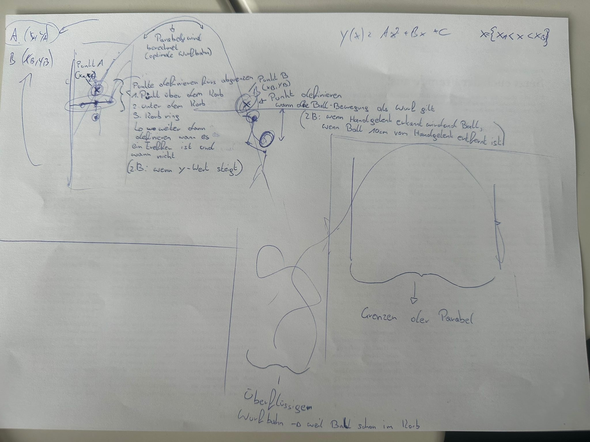
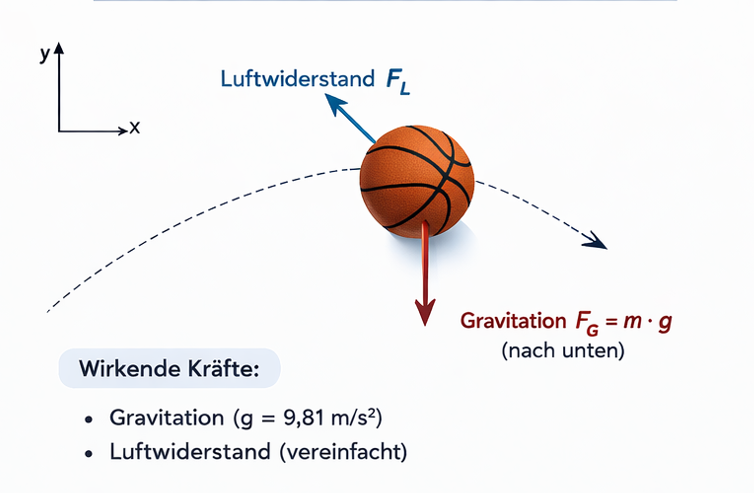
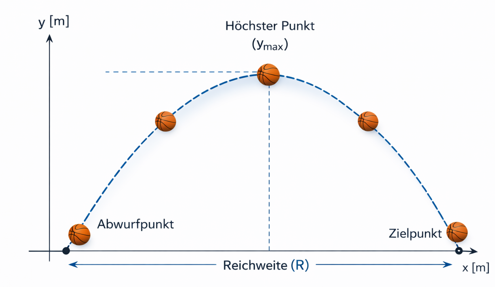

# Teilaufgabe Bacher Fabian
\textauthor{Bacher Fabian} 

### Aufgabenstellung Soll-Flugbahn
Im Alltag sowie in vielen Sportarten spielt das Werfen eines Körpers eine zentrale Rolle. Ob beim Werfen eines Balls, beim Korbwurf im Basketball oder beim gezielten Treffen eines Ziels – häufig gelingt ein Wurf nicht zufällig, sondern folgt bestimmten Gesetzmäßigkeiten. Für den Beobachter erscheint die Flugbahn zunächst schwer vorhersehbar, tatsächlich wird sie jedoch durch physikalische Zusammenhänge bestimmt.

In meinem Teil soll untersucht werden, wie sich ein geworfener Körper nach dem Abwurf bewegt und welche Faktoren seine Flugbahn beeinflussen. Dabei wird betrachtet, welche Rolle unter anderem Abwurfwinkel, Geschwindigkeit und Abwurfhöhe spielen und wie sich Veränderungen dieser Größen auf das Treffen eines Zielpunktes auswirken.

Aufbauend auf diesen Grundlagen wird anschließend versucht, eine optimale Flugbahn – eine sogenannte Sollflugbahn – zu bestimmen. Ziel ist es, jene Bedingungen zu ermitteln, unter denen ein vorgegebenes Ziel möglichst zuverlässig erreicht werden kann.

## Theorie

## Wurfbewegungen in Alltag und Sport

Wurfbewegungen treten in vielen Bereichen des täglichen Lebens auf. Besonders deutlich sind sie in zahlreichen Sportarten zu beobachten. Beispiele dafür sind der Korbwurf im Basketball, der Torwurf im Handball, ein Einwurf im Fußball oder das gezielte Werfen eines Gegenstandes auf ein bestimmtes Ziel. Auch außerhalb des Sports kommen vergleichbare Bewegungen vor, etwa beim Werfen eines Gegenstandes oder beim Abschießen eines Körpers durch technische Vorrichtungen.

Unabhängig von der jeweiligen Situation lässt sich beobachten, dass ein geworfener Körper nicht geradlinig fliegt, sondern stets eine gekrümmte Bahn beschreibt. Die Flugbahn hängt dabei davon ab, wie der Körper geworfen wird. Bereits kleine Änderungen in der Wurfbewegung können dazu führen, dass ein Ziel verfehlt wird.

Diese Beobachtung wirft die Frage auf, ob der Flug eines geworfenen Körpers zufällig erfolgt oder ob er bestimmten Gesetzmäßigkeiten folgt. Um diese Zusammenhänge zu verstehen, ist es notwendig, die Bewegung geworfener Körper physikalisch zu untersuchen.

## Bewegung geworfener Körper

### Was versteht man unter der Bewegung eines geworfenen Körpers?

Unter der Bewegung eines geworfenen Körpers versteht man den Bewegungsablauf eines Gegenstandes ab dem Zeitpunkt, an dem er die Hand des Werfers verlässt. Während des Abwurfs erhält der Körper eine Anfangsgeschwindigkeit. Nach dem Loslassen wirkt jedoch keine vom Werfer erzeugte Kraft mehr auf ihn.

Die weitere Bewegung erfolgt daher ausschließlich unter dem Einfluss äußerer Kräfte. Die wichtigste Kraft ist dabei die Erdanziehungskraft, welche den Körper ständig in Richtung Boden beschleunigt. Zusätzlich wirkt ein geringer Luftwiderstand, der die Bewegung leicht abbremst.

Da nach dem Abwurf keine Korrektur mehr möglich ist, wird der gesamte weitere Bewegungsverlauf bereits im Moment des Loslassens festgelegt. Die Art, wie ein Körper geworfen wird, bestimmt somit direkt seine spätere Flugbahn.

### Kräfte, die auf einen geworfenen Körper wirken

Nach dem Abwurf wirken auf den geworfenen Körper keine vom Werfer erzeugten Kräfte mehr. Seine weitere Bewegung wird ausschließlich durch äußere Einflüsse bestimmt. Die bedeutendste Kraft ist dabei die Erdanziehungskraft (Gravitation). Sie bewirkt, dass der Körper ständig in Richtung Boden beschleunigt wird.

Zusätzlich wirkt der Luftwiderstand. Dieser entsteht durch die Bewegung des Körpers durch die Luft und wirkt der Bewegungsrichtung entgegen. Im Vergleich zur Gravitation ist sein Einfluss bei üblichen Wurfgeschwindigkeiten jedoch deutlich geringer. Aus diesem Grund wird der Luftwiderstand in vielen physikalischen Betrachtungen vereinfacht vernachlässigt.

{ width=70% }

Durch die Wirkung der Gravitation wird der Körper während des Fluges kontinuierlich nach unten gezogen, während seine Vorwärtsbewegung zunächst erhalten bleibt. Die Kombination dieser beiden Effekte führt dazu, dass ein geworfener Körper keine geradlinige Bahn beschreibt, sondern eine gekrümmte Flugbahn entsteht.

## Flugkurve (Trajektorie)

### Was versteht man unter einer Flugkurve?

Die Flugkurve, auch als Trajektorie bezeichnet, beschreibt den räumlichen Bewegungsverlauf eines Körpers während seines Fluges. Sie stellt die Bahn dar, die ein geworfener Körper vom Zeitpunkt des Abwurfs bis zum Auftreffen auf dem Boden oder am Ziel zurücklegt.

Beobachtet man einen geworfenen Ball, so erkennt man, dass er keine geradlinige Bewegung ausführt, sondern eine gekrümmte Bahn beschreibt. Diese Krümmung entsteht durch die gleichzeitige Vorwärtsbewegung und die durch die Gravitation verursachte Beschleunigung in Richtung Boden.

Die Form der Flugkurve wird vollständig durch die Bedingungen im Moment des Abwurfs festgelegt. Dazu zählen insbesondere die Anfangsgeschwindigkeit, die Abwurfrichtung sowie die Abwurfhöhe. Nach dem Loslassen kann die Flugbahn nicht mehr beeinflusst werden.

### Warum ist die Flugkurve gekrümmt?

Die gekrümmte Form der Flugbahn ergibt sich aus der Überlagerung zweier Bewegungsanteile. Einerseits besitzt der geworfene Körper eine horizontale Geschwindigkeit, die ihn nach vorne bewegt. Andererseits wirkt gleichzeitig die Erdanziehungskraft, welche den Körper stetig nach unten beschleunigt.

Während die horizontale Bewegung annähernd gleichförmig bleibt, nimmt die vertikale Geschwindigkeit aufgrund der Gravitation kontinuierlich zu. Dadurch entsteht eine Bahn, die zunächst ansteigt, einen höchsten Punkt erreicht und anschließend wieder abfällt.

Diese Kombination aus gleichförmiger Bewegung in horizontaler Richtung und gleichmäßig beschleunigter Bewegung in vertikaler Richtung führt zu einer charakteristischen Bogenform der Flugkurve.

### Höchster Punkt der Flugbahn

Während des Fluges steigt der geworfene Körper zunächst an, bis er einen höchsten Punkt erreicht. In diesem Punkt ist die vertikale Geschwindigkeit des Körpers für einen kurzen Moment gleich null. Anschließend beginnt der Körper wieder zu fallen.

Der höchste Punkt entsteht dadurch, dass die anfängliche Aufwärtsbewegung durch die Erdanziehungskraft zunehmend abgebremst wird. Schließlich kommt die Aufwärtsbewegung vollständig zum Stillstand, bevor die Bewegung in eine Abwärtsbewegung übergeht.

Dieser Punkt besitzt eine besondere Bedeutung, da er die maximale Flughöhe des Körpers darstellt und maßgeblich von der Anfangsgeschwindigkeit sowie dem Abwurfwinkel abhängt. { width=28% }

### Einfluss des Abwurfs auf die Flugbahn

Die genaue Form der Flugkurve wird bereits im Moment des Abwurfs festgelegt. Entscheidend ist dabei, mit welcher Geschwindigkeit, in welcher Richtung und aus welcher Höhe der Körper geworfen wird.

Ein flacher Wurf führt zu einer niedrigen und langen Flugbahn, während ein steiler Wurf eine höhere, jedoch kürzere Flugbahn erzeugt. Ebenso beeinflusst eine größere Anfangsgeschwindigkeit die Reichweite des Wurfes. Auch die Höhe des Abwurfpunktes verändert den Verlauf der Flugbahn, da der Körper länger in der Luft bleibt.

Somit hängt das Treffen eines Zieles direkt von den Anfangsbedingungen des Wurfes ab. Bereits kleine Änderungen dieser Parameter können dazu führen, dass ein Ziel verfehlt wird.

## Der schiefe Wurf als physikalisches Modell

### Begriffserklärung

Die zuvor beschriebene Flugkurve eines geworfenen Körpers lässt sich physikalisch mit dem sogenannten schiefen Wurf beschreiben. Darunter versteht man die Bewegung eines Körpers, der mit einer Anfangsgeschwindigkeit unter einem bestimmten Winkel zur Horizontalen in die Luft geworfen wird.

Der Körper besitzt dabei sowohl eine horizontale als auch eine vertikale Bewegungsrichtung. Nach dem Abwurf wirken keine antreibenden Kräfte mehr, sondern ausschließlich die Gravitation. Diese beeinflusst jedoch nur die vertikale Bewegung, während die horizontale Bewegung – abgesehen vom geringen Luftwiderstand – gleichförmig bleibt.

Der schiefe Wurf stellt somit ein vereinfachtes physikalisches Modell dar, mit dem sich reale Wurfbewegungen näherungsweise beschreiben und berechnen lassen.

### Zerlegung der Bewegung in zwei Richtungen

Um die Bewegung eines geworfenen Körpers beschreiben zu können, wird sie in zwei voneinander unabhängige Bewegungen zerlegt. Dabei betrachtet man die Bewegung in horizontaler und in vertikaler Richtung getrennt.

In horizontaler Richtung bewegt sich der Körper gleichförmig weiter, da in dieser Richtung keine beschleunigende Kraft wirkt. Die Geschwindigkeit bleibt daher konstant.

In vertikaler Richtung hingegen wirkt die Erdanziehungskraft. Dadurch wird der Körper kontinuierlich nach unten beschleunigt. Zunächst steigt der Körper noch an, wird dabei jedoch immer langsamer, bis er seinen höchsten Punkt erreicht. Anschließend nimmt die Fallgeschwindigkeit wieder zu.

Durch die Überlagerung dieser beiden Bewegungen ergibt sich die typische gekrümmte Flugbahn eines geworfenen Körpers.

### Horizontale Bewegung
Da in horizontaler Richtung keine beschleunigende Kraft wirkt, bleibt die Geschwindigkeit konstant. Es handelt sich somit um eine gleichförmige Bewegung. Die in horizontaler Richtung zurückgelegte Strecke ergibt sich aus dem Produkt von Geschwindigkeit und Zeit.

Für die horizontale Bewegung gilt:

$x(t) = v_0 \cdot \cos(\alpha) \cdot t$

Dabei bezeichnet $x(t)$ die horizontale Entfernung vom Abwurfpunkt, $v_0$ die Anfangsgeschwindigkeit, $\alpha$ den Abwurfwinkel und $t$ die vergangene Zeit seit dem Abwurf.

### Vertikale Bewegung

In vertikaler Richtung wirkt die Erdanziehungskraft. Dadurch wird der Körper gleichmäßig nach unten beschleunigt. Neben der Anfangsgeschwindigkeit muss daher auch die Erdbeschleunigung g berücksichtigt werden.

Für die vertikale Bewegung gilt:

$y(t) = h_0 + v_0 \cdot \sin(\alpha) \cdot t - \frac{1}{2} \cdot g \cdot t^2$

Hierbei beschreibt $y(t)$ die Höhe des Körpers über dem Boden, $h_0$ die Abwurfhöhe und $g$ die Erdbeschleunigung ($g \approx 9{,}81\,\mathrm{m/s^2}$).

### Mathematische Beschreibung

Um den schiefen Wurf berechnen zu können, müssen zunächst die grundlegenden Größen beschrieben werden. Beim Abwurf erhält der Körper eine Anfangsgeschwindigkeit $v_0$. Diese Geschwindigkeit wirkt nicht nur in eine Richtung, sondern setzt sich aus einer horizontalen und einer vertikalen Komponente zusammen.

Der Winkel zwischen der Abwurfrichtung und der Horizontalen wird als Abwurfwinkel $\alpha$ bezeichnet. Abhängig von diesem Winkel wird die Anfangsgeschwindigkeit unterschiedlich stark auf die beiden Bewegungsrichtungen verteilt. Ein flacher Wurf besitzt einen kleinen Winkel, während ein steiler Wurf einen großen Winkel aufweist.

Die Anfangsgeschwindigkeit kann daher in zwei Teilgeschwindigkeiten zerlegt werden. Eine Komponente wirkt in horizontaler Richtung, die andere in vertikaler Richtung. Die horizontale Komponente bestimmt, wie schnell sich der Körper nach vorne bewegt, während die vertikale Komponente bestimmt, wie hoch der Körper steigt.

### Bahnkurve des schiefen Wurfs

Um die tatsächliche Form der Flugbahn zu bestimmen, muss die Zeit t aus den Gleichungen eliminiert werden. Ziel ist es, die Höhe y direkt in Abhängigkeit von der horizontalen Entfernung x zu beschreiben.

Aus der Gleichung der horizontalen Bewegung ergibt sich:

$t = \frac{x}{v_0 \cdot \cos(\alpha)}$

Setzt man diesen Ausdruck für $t$ in die Gleichung der vertikalen Bewegung ein, erhält man:

$y(x) = h_0 + x \cdot \tan(\alpha) - \frac{g \cdot x^2}{2 \cdot v_0^2 \cdot \cos^2(\alpha)}$

Diese Gleichung beschreibt die Flugbahn eines geworfenen Körpers in Abhängigkeit von der horizontalen Entfernung. Sie besitzt die mathematische Form einer quadratischen Funktion und stellt somit eine Parabel dar. Da die Gleichung ein Quadrat von $x$ enthält ($x^2$), handelt es sich um eine quadratische Funktion. Quadratische Funktionen werden grafisch als Parabel dargestellt. Damit ist mathematisch gezeigt, dass die Flugkurve eines geworfenen Körpers unter idealisierten Bedingungen parabelförmig verläuft.

## Einflussgrößen auf die Flugbahn

### Einfluss des Abwurfwinkels

Der Abwurfwinkel $\alpha$ beschreibt den Winkel zwischen der Abwurfrichtung und der Horizontalen. Er bestimmt maßgeblich die Form der Flugkurve. Bereits kleine Änderungen des Winkels können zu deutlichen Veränderungen der Reichweite und der maximalen Flughöhe führen.

Bei einem sehr kleinen Abwurfwinkel verläuft die Flugbahn relativ flach. Der Körper steigt nur geringfügig an und erreicht schnell wieder den Boden. Die maximale Höhe ist gering, jedoch kann die horizontale Reichweite bei ausreichender Geschwindigkeit dennoch groß sein.

Wird der Abwurfwinkel vergrößert, steigt der Körper steiler nach oben. Die maximale Flughöhe nimmt zu, während die horizontale Reichweite zunächst ebenfalls zunimmt. Bei einem Winkel von etwa 45° wird unter idealisierten Bedingungen (gleiche Abwurf- und Auftreffhöhe, Vernachlässigung des Luftwiderstands) die größte Reichweite erzielt.

Erhöht man den Winkel weiter in Richtung 90°, nimmt die horizontale Reichweite wieder ab. Der Körper bewegt sich zunehmend senkrecht nach oben und fällt nahezu an derselben Stelle wieder herunter. Die maximale Höhe ist in diesem Fall zwar groß, die horizontale Distanz jedoch gering.

Somit existiert für jede Wurfbedingung ein bestimmter Winkel, bei dem eine optimale Reichweite oder Treffgenauigkeit erreicht wird.

### Einfluss der Anfangsgeschwindigkeit

Die Anfangsgeschwindigkeit $v_0$ bestimmt, mit welcher Geschwindigkeit der Körper den Abwurfpunkt verlässt. Sie beeinflusst sowohl die maximale Flughöhe als auch die Reichweite des Wurfes.

Eine größere Anfangsgeschwindigkeit führt dazu, dass der Körper länger in der Luft bleibt. Dadurch vergrößert sich sowohl die maximale Höhe als auch die horizontale Entfernung. Mathematisch ist erkennbar, dass die Geschwindigkeit in der Parabelgleichung sowohl im linearen als auch im quadratischen Term enthalten ist. Eine Verdopplung der Geschwindigkeit führt daher zu einer deutlichen Veränderung der Flugbahn.

Ist die Anfangsgeschwindigkeit zu gering, erreicht der Körper das Ziel möglicherweise nicht, selbst wenn der Abwurfwinkel optimal gewählt wurde. Umgekehrt kann eine zu hohe Geschwindigkeit dazu führen, dass das Ziel überschossen wird.

Die Anfangsgeschwindigkeit ist daher eine entscheidende Größe für die Bestimmung einer Sollflugbahn.

### Einfluss der Abwurfhöhe

Die Abwurfhöhe $h_0$ beschreibt die vertikale Position des Körpers im Moment des Abwurfs. Sie beeinflusst die Flugdauer und damit indirekt die Reichweite des Wurfes.

Wird ein Körper aus einer größeren Höhe geworfen, bleibt er länger in der Luft, bevor er den Boden erreicht. Dadurch kann sich die horizontale Entfernung vergrößern. Gleichzeitig verändert sich jedoch auch die optimale Wahl des Abwurfwinkels.

In realen Situationen, beispielsweise bei sportlichen Würfen, ist die Abwurfhöhe von der Körpergröße und der Wurfhaltung abhängig. Sie stellt somit einen individuellen Einflussfaktor dar, der bei der Bestimmung einer optimalen Flugbahn berücksichtigt werden muss.

### Einfluss der Zielentfernung

Die Entfernung zwischen Abwurfpunkt und Ziel bestimmt, welche Kombination aus Abwurfwinkel und Anfangsgeschwindigkeit erforderlich ist, um das Ziel zu erreichen. Für jede bestimmte Distanz existieren unterschiedliche mögliche Flugbahnen.

Ein nahe gelegenes Ziel kann sowohl mit einem flachen als auch mit einem steileren Wurf erreicht werden. Bei größeren Distanzen ist jedoch eine höhere Anfangsgeschwindigkeit oder ein optimal gewählter Winkel notwendig.

Somit hängt die Sollflugbahn stets von der jeweiligen Zielentfernung ab. Eine universell gültige Flugbahn existiert nicht, sondern sie muss an die konkreten Bedingungen angepasst werden.

## Bestimmung der Sollflugbahn

### Definition der Sollflugbahn

Unter einer Sollflugbahn wird jene Flugkurve verstanden, die unter gegebenen Randbedingungen eine optimale Zielerreichung ermöglicht. Dabei bezeichnet der Begriff „optimal“ diejenige Kombination aus Abwurfwinkel, Anfangsgeschwindigkeit und Abwurfhöhe, bei der ein vorgegebener Zielpunkt mit möglichst hoher Sicherheit getroffen werden kann.

Da die Flugbahn eines geworfenen Körpers vollständig durch die Anfangsbedingungen bestimmt wird, kann eine Sollflugbahn nur in Bezug auf eine konkrete Situation definiert werden. Maßgeblich sind dabei insbesondere die horizontale Entfernung zum Ziel, die Höhe des Zielpunktes sowie die Abwurfhöhe. Eine allgemeingültige Sollflugbahn existiert daher nicht, sondern sie ist stets an die jeweiligen Bedingungen angepasst.

Ziel dieses Kapitels ist es, auf Grundlage der zuvor hergeleiteten Bahnkurve jene Abwurfparameter zu bestimmen, die das Treffen eines definierten Zielpunktes ermöglichen.

### Mathematische Bedingung für das Treffen eines Zielpunktes

Die Flugbahn eines geworfenen Körpers wird durch folgende Gleichung beschrieben:

Screenshot einfügem!!!!!!!!!!!!

Dabei bezeichnet
($h_0$) die Abwurfhöhe,
($v_0$) die Anfangsgeschwindigkeit,
($\alpha$) den Abwurfwinkel,
($g$) die Erdbeschleunigung ($\approx 9{,}81\,\mathrm{m/s^2}$),
($x$) die horizontale Entfernung vom Abwurfpunkt.

Ein Zielpunkt kann allgemein durch seine Koordinaten ($Z(x_Z, y_Z)$) beschrieben werden.
Damit der geworfene Körper das Ziel trifft, muss gelten:

Screenshot einfügen !!!!!!!!!!!!!!!!!!!!!!!!!!

Setzt man den Zielpunkt in die Bahnkurve ein, ergibt sich:

Screenshot einfügen !!!!!!!!!!!!!!!!!!!!!!!!!!

Diese Gleichung stellt die grundlegende Bedingung für das Treffen des Zielpunktes dar. Sie zeigt, dass zwischen Abwurfwinkel und Anfangsgeschwindigkeit ein direkter Zusammenhang besteht.

### Berechnung der erforderlichen Anfangsgeschwindigkeit

Zur Bestimmung der Sollflugbahn kann die Gleichung nach der Anfangsgeschwindigkeit ($v_0$) aufgelöst werden. Durch Umstellen erhält man:

Screenshot einfügen !!!!!!!!!!!!!!!!!!!!!!!!!!

Diese Gleichung ermöglicht es, für einen gewählten Abwurfwinkel die notwendige Anfangsgeschwindigkeit zu berechnen, um das Ziel zu erreichen.

Damit eine reale Lösung existiert, muss der Ausdruck im Nenner positiv sein:

Screenshot einfügen !!!!!!!!!!!!!!!!!!!!!!!!!!

Ist diese Bedingung nicht erfüllt, reicht der gewählte Winkel nicht aus, um die notwendige Höhe zu erreichen.

### Mehrdeutigkeit möglicher Lösungen 

Für viele Zielkonstellationen existieren grundsätzlich zwei mögliche Flugbahnen, die zum gleichen Ziel führen:

- eine flachere Flugbahn mit kleinerem Winkel und höherer Geschwindigkeit,

- eine steilere Flugbahn mit größerem Winkel.

Beide Varianten erfüllen mathematisch die Treffbedingung, unterscheiden sich jedoch hinsichtlich maximaler Höhe, Einfallswinkel und Empfindlichkeit gegenüber kleinen Abweichungen der Abwurfparameter.

In der Praxis wird häufig jene Flugbahn bevorzugt, die eine größere Toleranz gegenüber leichten Winkel- oder Geschwindigkeitsabweichungen aufweist. Eine solche Bahn kann als praktikablere Sollflugbahn angesehen werden.

### Interpretation und Bedeutung der Sollflugbahn

Die Berechnung zeigt, dass die Sollflugbahn nicht zufällig entsteht, sondern das Ergebnis klar definierter physikalischer Zusammenhänge ist. Für jede Kombination aus Zielentfernung, Zielhöhe und Abwurfhöhe kann eine passende Flugbahn bestimmt werden.

Dabei wird deutlich, dass:

- der Abwurfwinkel die Form der Bahn wesentlich beeinflusst,

- die Anfangsgeschwindigkeit maßgeblich die Reichweite bestimmt,

- und beide Größen gemeinsam optimiert werden müssen.

Die Sollflugbahn stellt somit die theoretisch ideale Lösung unter den getroffenen Modellannahmen dar. In realen Situationen können zusätzliche Einflüsse wie Luftwiderstand oder Rotationsbewegungen auftreten, die zu Abweichungen führen. Dennoch bietet das Modell des schiefen Wurfs eine fundierte Grundlage zur Beschreibung und Optimierung von Wurfbewegungen.

## Methodik und Projektumgebung

### Einführung in die technische Umsetzung

Im vorherigen Kapitel wurden die physikalischen Grundlagen des schiefen Wurfs sowie die mathematische Herleitung der Sollflugbahn dargestellt. Um diese theoretischen Erkenntnisse nicht nur abstrakt zu behandeln, sondern praktisch anzuwenden und nachvollziehbar zu überprüfen, wurde eine technische Umsetzung durchgeführt. Die Berechnung der Flugbahnen, die Auswertung der Parameter sowie die teilweise Visualisierung der Ergebnisse erfolgten mithilfe einer programmbasierten Arbeitsumgebung. Durch den Einsatz geeigneter Softwarewerkzeuge konnten mathematische Modelle implementiert, Berechnungen automatisiert und verschiedene Szenarien systematisch analysiert werden. Dieses Kapitel beschreibt die verwendeten Technologien sowie deren Rolle im Projekt. Dabei werden ausschließlich jene Werkzeuge erläutert, die für die mathematische Berechnung, Analyse und Visualisierung der Flugbahnen von zentraler Bedeutung waren. 

Die konkrete Implementierung und der praktische Entwicklungsablauf werden im anschließenden Kapitel 4.12 dargestellt.

## Programmiersprache Python

### Was ist Python?
Python ist eine interpretierte, objektorientierte Programmiersprache, die sich durch eine klare und gut lesbare Syntax auszeichnet. Aufgrund ihrer Einfachheit sowie ihrer großen Anzahl an verfügbaren Bibliotheken wird sie häufig im wissenschaftlichen Bereich, in der Datenanalyse sowie in technischen Anwendungen eingesetzt. Besonders im mathematischen und ingenieurtechnischen Umfeld bietet Python zahlreiche Werkzeuge zur numerischen Berechnung, grafischen Darstellung und automatisierten Auswertung von Daten.

### Warum wurde Python gewählt?

Für die Umsetzung der mathematischen Modelle wurde Python gewählt, da die Programmiersprache eine effiziente Durchführung umfangreicher Berechnungen ermöglicht. Insbesondere bei der wiederholten Berechnung von Flugbahnen mit variierenden Parametern bietet Python den Vorteil einer schnellen und reproduzierbaren Ausführung. Darüber hinaus erlaubt Python eine übersichtliche Strukturierung der Berechnungsschritte, wodurch die Nachvollziehbarkeit der mathematischen Herleitungen gewährleistet bleibt.

### Vorteile von Python im Projektkontext
Im Rahmen dieser Arbeit bot Python folgende Vorteile:

- Automatisierte Berechnung verschiedener Parameterkombinationen
- Einfache Umsetzung mathematischer Gleichungen
- Möglichkeit zur grafischen Darstellung der Flugbahnen
- Hohe Lesbarkeit und klare Strukturierung des Codes
- Große Auswahl an wissenschaftlichen Bibliotheken

Durch diese Eigenschaften stellte Python ein geeignetes Werkzeug zur praktischen Umsetzung der theoretischen Modelle dar.

## Entwicklungsumgebung Visual Studio Code

### Was ist Visual Studio Code?

Visual Studio Code (VS Code) ist ein plattformübergreifender Quellcode-Editor, der von Microsoft entwickelt wurde. Es handelt sich um eine leichtgewichtige, jedoch leistungsstarke Entwicklungsumgebung, die für verschiedene Programmiersprachen und Anwendungen eingesetzt werden kann.

VS Code bietet eine benutzerfreundliche Oberfläche und unterstützt durch zahlreiche Erweiterungen (Extensions) unterschiedliche Funktionen wie Syntaxhervorhebung, automatische Codevervollständigung, Fehleranalyse sowie Versionsverwaltung. Aufgrund seiner Flexibilität wird Visual Studio Code sowohl im professionellen Softwarebereich als auch im Bildungsbereich häufig verwendet.

Obwohl es sich nicht um eine vollständige integrierte Entwicklungsumgebung (IDE) im klassischen Sinne handelt, kann VS Code durch Erweiterungen nahezu IDE-Funktionalität erreichen.

### Warum wurde Visual Studio Code gewählt?

Für die Durchführung der mathematischen Berechnungen sowie zur strukturierten Dokumentation der Herleitungen wurde Visual Studio Code als Arbeitsumgebung gewählt.

Die Entscheidung fiel auf VS Code, da das Programm eine übersichtliche Strukturierung komplexer Inhalte ermöglicht. Insbesondere bei umfangreichen mathematischen Gleichungen und mehrstufigen Berechnungen ist eine klare Darstellung der einzelnen Schritte von großer Bedeutung.

Darüber hinaus bietet VS Code die Möglichkeit, verschiedene Dateiformate zu verwalten und Berechnungen nachvollziehbar zu dokumentieren. Durch die modulare Erweiterbarkeit konnte die Arbeitsumgebung an die individuellen Anforderungen der Diplomarbeit angepasst werden.

Ein weiterer Vorteil liegt in der klaren Trennung von Berechnung, Dokumentation und Strukturierung, wodurch die Übersichtlichkeit der Arbeit verbessert wurde.

### Vorteile von Visual Studio Code

Visual Studio Code bietet mehrere Vorteile, die für die Erstellung dieser Diplomarbeit relevant waren:

- Übersichtliche Strukturierung: Komplexe mathematische Inhalte können klar gegliedert und dokumentiert werden.
- Erweiterbarkeit: Durch Extensions kann der Funktionsumfang individuell angepasst werden.
- Plattformunabhängigkeit: VS Code ist auf verschiedenen Betriebssystemen einsetzbar.
- Fehlererkennung: Syntax- und Strukturfehler können schnell erkannt werden.
- Flexibilität: Der Editor eignet sich sowohl für einfache Textbearbeitung als auch für komplexere technische Dokumentationen.

## Zentrale Bibliotheken

Für die praktische Umsetzung der theoretischen Modelle wurden ausgewählte Python-Bibliotheken eingesetzt. Diese übernahmen unterschiedliche Aufgaben im Bereich der Datenerfassung, mathematischen Modellierung, Signalverarbeitung sowie Visualisierung. Im Folgenden werden jene Bibliotheken beschrieben, die im Projekt eine zentrale Rolle spielten.

### NumPy

NumPy ist eine Bibliothek zur numerischen Berechnung in Python. Sie ermöglicht die effiziente Durchführung mathematischer Operationen sowie die Verarbeitung von Vektoren und mehrdimensionalen Arrays.

Im Rahmen dieser Arbeit wurde NumPy zur Implementierung der hergeleiteten Flugbahngleichungen verwendet. Durch die vektorbasierte Berechnung konnten unterschiedliche Parameterkombinationen, beispielsweise verschiedene Abwurfwinkel oder Anfangsgeschwindigkeiten, effizient ausgewertet werden. NumPy bildete somit die mathematische Grundlage für die Berechnung der Sollflugbahn.

### OpenCV

OpenCV ist eine Bibliothek zur Verarbeitung von Bild- und Videodaten. Sie ermöglicht unter anderem das Einlesen von Videodateien, die Analyse einzelner Frames sowie die Weiterverarbeitung visueller Informationen. Im Projekt wurde OpenCV zur Verarbeitung der Videoaufnahmen eingesetzt. Die Bibliothek diente der Extraktion relevanter Bildinformationen und stellte damit die Grundlage für die Bestimmung der realen (Ist-)Trajektorie dar.

### YOLO

YOLO („You Only Look Once“) ist ein auf neuronalen Netzen basierendes Objekterkennungsmodell. Es ermöglicht die automatische Identifikation und Lokalisierung von Objekten innerhalb eines Bildes oder Videoframes.

Im Rahmen dieser Arbeit wurde YOLO zur Detektion des Balls innerhalb der Videoaufnahmen verwendet. Die automatische Erkennung bildete die Basis für die Bestimmung der Positionsdaten, welche anschließend zur Analyse der realen Flugbahn herangezogen wurden.

### SciPy

SciPy ist eine wissenschaftliche Python-Bibliothek, die unter anderem Funktionen zur Signalverarbeitung bereitstellt. Da reale Messdaten Schwankungen oder Störsignale enthalten können, wurde SciPy zur Glättung der erfassten Positionsdaten eingesetzt. Dadurch konnte eine realitätsnahe und kontinuierliche Trajektorie bestimmt werden.

### Matplotlib

Matplotlib ist eine Bibliothek zur grafischen Darstellung von Daten. Sie ermöglicht die Erstellung von Diagrammen und Kurvendarstellungen.Im Rahmen dieser Arbeit wurde Matplotlib verwendet, um sowohl die berechneten Sollflugbahnen als auch die aus den Videoaufnahmen extrahierten Ist-Trajektorien grafisch darzustellen. Durch die visuelle Gegenüberstellung konnten Unterschiede und Übereinstimmungen anschaulich analysiert werden.

Weitere unterstützende Bibliotheken wurden für organisatorische oder technische Nebentätigkeiten verwendet. Diese sind für die physikalische Modellierung und Analyse nicht von zentraler Bedeutung und werden daher nicht im Detail erläutert.

## Praktische Arbeit

### Beginn der Entwicklung 

Im Rahmen der Diplomarbeit „Basketball-Effizienzsteigerung durch Videoanalyse“ wurde ein eigenständiger Projektteil zur Berechnung und Visualisierung einer Soll-Flugbahn umgesetzt. Ziel dieses Teilprojekts war es, eine ideale Flugkurve für einen Basketballwurf zu bestimmen, unabhängig davon, wie der Ball tatsächlich geflogen ist. Der Fokus lag somit nicht auf der Analyse der Ist-Flugbahn, sondern auf der Ermittlung einer theoretisch optimalen Wurfparabel, die zu einem erfolgreichen Treffer führt.

Die Besonderheit des Projekts besteht darin, dass die verwendeten Videodaten von Spielern des österreichischen Rollstuhlbasketball-Nationalteams stammen. Dadurch unterscheiden sich Abwurfhöhe, Abwurfposition und Körperhaltung deutlich von herkömmlichen Basketballwürfen, was eine individuelle und flexible Lösung erforderlich machte.

Zu Beginn des Projekts wurde eine klare Projektstruktur erstellt, um eine saubere Trennung zwischen Rohdaten, Verarbeitungsskripten und Ergebnissen zu gewährleisten. Die Implementierung erfolgte hauptsächlich in der Programmiersprache Python, da diese umfangreiche Bibliotheken für Videoverarbeitung, numerische Berechnungen und Visualisierung bietet. Zur Isolation der Entwicklungsumgebung wurde eine virtuelle Python-Umgebung eingerichtet, wodurch eine reproduzierbare und stabile Ausführung des Projekts sichergestellt werden konnte.

Die Videoaufnahmen der Würfe wurden in einem eigenen Datenordner abgelegt und bildeten die Grundlage für alle weiteren Verarbeitungsschritte. Zusätzlich wurde ein separater Ordner für Kalibrierungsdaten eingerichtet, da diese eine zentrale Rolle bei der Umrechnung von Bildkoordinaten in reale physikalische Größen spielen.

### Kalibrierung des Basketballkorbs

Ein essenzieller Schritt für die Berechnung der Soll-Flugbahn war die Kalibrierung des Korbes. Dabei wurde aus einem Videoframe der Mittelpunkt des Korbes in Pixelkoordinaten bestimmt. Zusätzlich wurde ein Skalierungsfaktor berechnet, der angibt, wie viele Meter einem Pixel im Bild entsprechen. Diese Kalibrierung ermöglichte es, später Abwurfpositionen und Flugbahnen nicht nur im Bild, sondern auch in realen physikalischen Einheiten (Meter) zu berechnen.

Die Kalibrierungsdaten wurden in einer JSON-Datei gespeichert und von allen relevanten Programmen geladen, um konsistente Ergebnisse sicherzustellen.

### Grundkonzept der Soll-Flugbahn

Die Soll-Flugbahn basiert auf einem physikalischen Wurfmodell, das die Bewegung eines Basketballs als schrägen Wurf unter Einfluss der Erdgravitation beschreibt. Die Flugbahn wird durch eine Parabel dargestellt, deren Form von folgenden Parametern abhängt:
- Abwurfposition (horizontal und vertikal)
- Abwurfwinkel
- Anfangsgeschwindigkeit
- Erdbeschleunigung

Ziel der Berechnung ist es, jene Kombination aus Abwurfwinkel und Anfangsgeschwindigkeit zu finden, mit der der Ball den Korb erreicht und dabei eine möglichst geringe Anfangsgeschwindigkeit benötigt. Diese Annahme basiert auf dem Gedanken, dass ein effizienter Wurf weniger Kraftaufwand erfordert und somit reproduzierbarer ist.

### Interaktive Bestimmung des Abwurfpunkts

Da der exakte Abwurfpunkt nicht zuverlässig automatisch erkannt werden konnte, wurde eine interaktive Lösung implementiert. Das entwickelte Programm öffnet das jeweilige Wurfvideo und erlaubt dem Benutzer, frameweise durch das Video zu navigieren. Mithilfe der Pfeiltasten kann der genaue Zeitpunkt des Ballabwurfs ausgewählt werden.

Anschließend wird der Abwurfpunkt manuell per Mausklick festgelegt. Dieser Punkt repräsentiert entweder die Ballposition oder die Handposition im Moment des Abwurfs. Diese manuelle Auswahl stellte sich als besonders robust heraus, da die Videos direkt beim Abwurf beginnen und der Ball oft nur wenige Frames sichtbar ist.

### Berechnung und Visualisierung der Soll-Flugbahn

Nach Auswahl des Abwurfpunkts wird die Soll-Flugbahn berechnet. Dabei wird ein definierter Winkelbereich systematisch durchlaufen und für jeden Winkel die notwendige Anfangsgeschwindigkeit berechnet. Die physikalisch gültigen Lösungen werden geprüft, und jene Lösung mit der geringsten Anfangsgeschwindigkeit wird ausgewählt.

Besonderes Augenmerk lag darauf, dass die Berechnung unabhängig davon funktioniert, ob sich der Korb links oder rechts vom Abwurfpunkt befindet. Dafür wurde die Berechnung der horizontalen Flugrichtung entsprechend angepasst.

Die berechnete Soll-Flugbahn wird anschließend direkt auf einen Videoframe gezeichnet. Zusätzlich zum Overlay-Bild werden alle relevanten Berechnungsdaten in einer strukturierten JSON-Datei gespeichert.

### Batch-Verarbeitung mehrerer Würf
Um mehrere Würfe effizient auswerten zu können, wurde ein Batch-Skript entwickelt. Dieses öffnet automatisch alle vorhandenen Wurfvideos nacheinander. Für jeden Wurf muss lediglich der Abwurfpunkt ausgewählt werden, woraufhin das Programm selbstständig die Soll-Flugbahn berechnet und speichert. Dadurch konnte eine große Anzahl an Würfen mit geringem manuellem Aufwand verarbeitet werden.

### Statistische Auswertung und Ergebnisdarstellung

Die gespeicherten Ergebnisse aller Würfe wurden anschließend automatisiert gesammelt. Aus den einzelnen JSON-Dateien wurde eine zentrale CSV-Datei erzeugt, die unter anderem folgende Werte enthält:

- Abwurfwinkel
- Anfangsgeschwindigkeit
- verwendeter Frame
- zugehöriger Videoclip

Diese CSV-Datei ist direkt mit Tabellenkalkulationsprogrammen wie Microsoft Excel kompatibel und bildet die Grundlage für weitere Auswertungen.

Zusätzlich wurden verschiedene Diagramme erstellt, darunter Streudiagramme, Balkendiagramme und Histogramme. Abschließend wurde ein automatischer PDF-Report generiert, der alle Diagramme sowie statistische Kennzahlen übersichtlich auf einer Seite zusammenfasst. Dieser Report eignet sich sowohl für die Dokumentation der Diplomarbeit als auch für Präsentationen.

### Weiterentwicklung und Verfeinerung der Soll-Flugbahn

Im Vergleich zur ursprünglichen Implementierung der Soll-Flugbahn wurde das Modell im weiteren Projektverlauf wesentlich erweitert und präzisiert. Während zu Beginn eine idealisierte Wurfparabel berechnet wurde, die ausschließlich den Korb als Zielpunkt berücksichtigte, erfolgte später eine realitätsnahe Anpassung unter Einbeziehung zusätzlicher physikalischer und praktischer Randbedingungen.

Zunächst wurde die Zieldefinition der Soll-Flugbahn verändert. Anstatt die Parabel exakt auf die Korbmitte zu richten, wird nun das Ballzentrum so berechnet, dass der Ball den Korb mit einem Sicherheitsabstand passiert. Dabei wird der reale Ballradius sowie ein zusätzlicher Clearance-Abstand berücksichtigt, sodass sichergestellt ist, dass der Ball den Ring nicht berührt, sondern sauber durch den Korb fällt. Diese Anpassung orientiert sich an der sportwissenschaftlichen Theorie, wonach erfolgreiche Würfe den Korb in der hinteren Hälfte mit ausreichender Höhe passieren.

Darüber hinaus wurde der Einfallswinkel des Balls am Korb explizit in die Berechnung integriert. Basierend auf Literaturangaben zur optimalen Wurfparabel im Basketball wurde ein Mindest-Einfallswinkel definiert, da steilere Eintrittswinkel die Trefferwahrscheinlichkeit erhöhen. Die Soll-Flugbahn wird daher nur akzeptiert, wenn dieser Winkel einen vorgegebenen Mindestwert überschreitet. Falls unter diesen Bedingungen keine gültige Lösung gefunden wird, greift ein kontrollierter Fallback-Mechanismus, der die Einschränkungen schrittweise lockert, ohne die physikalische Plausibilität zu verlieren.

Eine wesentliche Erweiterung gegenüber der ursprünglichen Version stellt die Berücksichtigung des Auffangnetzes hinter dem Korb dar. In der realen Versuchsanordnung befindet sich hinter dem Korb ein Fangnetz, das in früheren Versionen der Soll-Flugbahn nicht berücksichtigt wurde. Dies führte dazu, dass berechnete Parabeln teilweise durch das Netz verliefen, was in der Praxis nicht realistisch ist. In der überarbeiteten Implementierung wird das Fangnetz als räumliche Begrenzung modelliert. Dabei wird die Oberkante des Netzes als horizontale Grenze definiert, die von der Balloberkante nach dem Passieren des Korbes nicht überschritten werden darf.

Um diese Bedingung umzusetzen, wird die Flugbahn hinter dem Korb abschnittsweise überprüft. Für jeden relevanten Punkt der Parabel wird kontrolliert, ob sich die Balloberkante unterhalb der angenommenen Netzoberkante befindet. Nur Soll-Flugbahnen, die diese Bedingung erfüllen, werden als gültig akzeptiert. Dadurch wird gewährleistet, dass die visualisierte Soll-Flugbahn sowohl den Korb korrekt trifft als auch das Fangnetz nicht schneidet.

Zusätzlich wurde die Visualisierung erweitert. Neben der Soll-Flugbahn und den Markierungen für Abwurfpunkt und Korb wird nun auch die angenommene Oberkante des Auffangnetzes im Video dargestellt. Dies ermöglicht eine intuitive visuelle Kontrolle der berechneten Flugbahn und verdeutlicht die Einhaltung der Randbedingungen unmittelbar im Bildmaterial.

Zusammenfassend stellt die überarbeitete Soll-Flugbahn eine deutlich realitätsnähere Modellierung dar als die ursprüngliche Version. Durch die Einbeziehung von Ballgeometrie, Einfallswinkel, Sicherheitsabständen und der realen Versuchsumgebung wurde aus einer idealisierten Wurfparabel ein praxisnahes Referenzmodell geschaffen, das als fundierte Vergleichsbasis für die Analyse der Ist-Flugbahn dient.

### Einbindung der theoretischen Grundlagen aus der Fachliteratur

Die Weiterentwicklung der Soll-Flugbahn erfolgte nicht ausschließlich auf Basis programmiertechnischer Überlegungen, sondern stützt sich gezielt auf sportwissenschaftliche und biomechanische Erkenntnisse aus der Fachliteratur. Insbesondere wurden dabei die vom Betreuer zur Verfügung gestellten PDF-Unterlagen zur idealen Wurfparabel im Basketball sowie zu positionsabhängigen Unterschieden von Würfen herangezogen.

In diesen Unterlagen wird beschrieben, dass erfolgreiche Basketballwürfe durch eine Kombination aus ausreichend hohem Abwurfwinkel, einem steilen Einfallswinkel am Korb sowie einer präzisen Zielzone charakterisiert sind. Die Literatur hebt hervor, dass Würfe mit einem größeren Einfallswinkel eine höhere Fehlertoleranz besitzen, da der Ball mit größerer Wahrscheinlichkeit durch den Korb fällt, selbst wenn die horizontale Zielgenauigkeit leicht abweicht. Diese Erkenntnisse bildeten die Grundlage für die Einführung eines Mindest-Einfallswinkels in der Berechnung der Soll-Flugbahn.

Darüber hinaus wird in der Fachliteratur erläutert, dass der Ball den Korb idealerweise nicht exakt in der geometrischen Mitte, sondern leicht in der hinteren Korbhälfte passieren sollte. Dieses Prinzip wurde in der Implementierung berücksichtigt, indem nicht die Ringmitte selbst als Zielpunkt für den Ballmittelpunkt verwendet wird, sondern ein leicht nach unten versetzter Zielpunkt, der den Ballradius sowie einen zusätzlichen Sicherheitsabstand einbezieht. Dadurch wird sichergestellt, dass die Balloberkante den Ring nicht berührt und der Wurf den theoretisch optimalen Eintrittspfad einhält.

Die PDF-Unterlagen dienten zudem als Referenz für die Wahl realistischer Winkelbereiche. Der Abwurfwinkel der Soll-Flugbahn wurde bewusst auf einen Bereich beschränkt, der in der Literatur als biomechanisch sinnvoll beschrieben wird. Gleichzeitig wurde ein mehrstufiges Suchverfahren implementiert, das zunächst strenge theoretische Vorgaben anwendet und diese nur dann schrittweise lockert, wenn unter realen Aufnahmebedingungen keine gültige Lösung gefunden werden kann.

Zusammenfassend lässt sich festhalten, dass die theoretischen Inhalte aus den bereitgestellten PDF-Dokumenten direkt in die mathematische Modellierung und algorithmische Umsetzung der Soll-Flugbahn eingeflossen sind. Die Literatur diente dabei nicht nur als Hintergrundinformation, sondern als konkrete Entscheidungsgrundlage für Parameterwahl, Randbedingungen und Validierung der berechneten Flugbahnen. Dadurch konnte eine enge Verbindung zwischen Theorie und praktischer Umsetzung im Rahmen der Videoanalyse hergestellt werden.

### Technologieentscheidungen

Im Rahmen der Diplomarbeit mussten zu Beginn mehrere grundlegende Technologieentscheidungen getroffen werden. Diese Entscheidungen betrafen insbesondere die Wahl der Entwicklungsumgebung, der Programmiersprache sowie der eingesetzten Bibliotheken. Ziel war es, eine Lösung zu entwickeln, die sowohl technisch leistungsfähig als auch für ein Schulprojekt realistisch umsetzbar ist.

### Entwicklungsumgebung (VS Code)

Als Entwicklungsumgebung wurde Visual Studio Code (VS Code) verwendet. VS Code ist ein plattformunabhängiger Quelltexteditor, der für Windows, macOS und Linux verfügbar ist und sich besonders für die Entwicklung mit Python eignet.

VS Code bietet eine übersichtliche Benutzeroberfläche, integrierte Terminalfunktionen sowie eine Vielzahl an Erweiterungen, die speziell für die Softwareentwicklung konzipiert sind. Durch diese Eigenschaften eignet sich VS Code sowohl für Einsteiger als auch für fortgeschrittene Entwickler.

### Programmiersprache

Als Programmiersprache wurde Python gewählt. Python ist eine weit verbreitete, interpretierte Programmiersprache, die besonders in den Bereichen Datenanalyse, maschinelles Lernen und Bildverarbeitung eingesetzt wird.

Die Entscheidung für Python basierte auf der hohen Verfügbarkeit leistungsfähiger Bibliotheken sowie auf der guten Lesbarkeit und Verständlichkeit des Codes. Gerade für ein Schulprojekt mit begrenzter Entwicklungszeit stellte Python eine sehr geeignete Wahl dar.

#### Vorteile von Python

- entscheidender Vorteil von Python ist die große Auswahl an Bibliotheken für Video- und Bildverarbeitung, mathematische Berechnungen sowie Datenvisualisierung. Dadurch konnte ein Großteil der benötigten Funktionalität ohne aufwendige Eigenimplementierungen umgesetzt werden.

- entscheidender Vorteil von Python ist die große Auswahl an Bibliotheken für Video- und Bildverarbeitung, mathematische Berechnungen sowie Datenvisualisierung. Dadurch konnte ein Großteil der benötigten Funktionalität ohne aufwendige Eigenimplementierungen umgesetzt werden.

#### Nachteile von Python 

- Im Vergleich zu kompilierten Sprachen wie C++ weist Python eine geringere Ausführungsgeschwindigkeit auf. Für zeitkritische Echtzeitanwendungen könnte dies ein Nachteil sein

### Verwendete Bibliotheken

#### OpenCV (Open Source Computer Vision Library)

Für die Video- und Bildverarbeitung wurde die Bibliothek OpenCV eingesetzt. OpenCV ermöglicht das Laden, Verarbeiten und Anzeigen von Videodateien sowie das Zeichnen von Overlays direkt auf Videoframes.

Ein großer Vorteil von OpenCV ist die hohe Performance bei gleichzeitiger einfacher Bedienbarkeit. Dadurch konnten sowohl interaktive Funktionen (z. B. Frame-Navigation und Mausklicks) als auch Visualisierungen effizient umgesetzt werden.

#### NumPy

Für mathematische Berechnungen und Vektoroperationen wurde NumPy verwendet. NumPy bietet leistungsfähige Datenstrukturen für numerische Berechnungen und ist besonders für physikalische Modelle geeignet.

Die Berechnung der Soll-Flugbahn basiert auf mathematischen Gleichungen, die mithilfe von NumPy effizient umgesetzt werden konnten.

#### Pandas und Matplotlib

Zur statistischen Auswertung der Ergebnisse kam die Bibliothek Pandas zum Einsatz. Pandas erleichtert das strukturierte Verarbeiten von Messdaten und ermöglicht den Export in Formate wie CSV, die mit Tabellenkalkulationsprogrammen kompatibel sind.

Für die grafische Darstellung der Ergebnisse wurde Matplotlib verwendet. Mit dieser Bibliothek konnten Diagramme wie Streudiagramme, Balkendiagramme und Histogramme erstellt werden, die für die Dokumentation und Präsentation der Ergebnisse genutzt wurden.

### Architektur

Das Projekt ist als Pipeline aufgebaut: Aus Rohvideos werden durch mehrere Verarbeitungsschritte strukturierte Ergebnisse erzeugt (Overlays, JSON-Summaries, CSV-Statistiken, Reports). Die Architektur trennt dabei klar zwischen Eingabedaten, Konfiguration/Kalibrierung, Verarbeitungsskripten und Ausgabeordnern.

Enthält die Rohdaten: Videoclips einzelner Würfe (z. B. wurf1.mov, wurf2.mov). Dieser Ordner ist die einzige Video-Eingabequelle.

Hier liegt die gesamte Logik. Die Scripts sind modular nach Aufgaben getrennt:

- Analyse eines Clips (Tracking, Overlays, Messwerte)
- Soll-Flugbahn (Abwurfpunkt wählen, Parabel berechnen, Overlay erzeugen)
- Batch-Verarbeitung (mehrere Clips automatisiert verarbeiten)
- Statistik/Reporting (CSV sammeln, Plots und PDF erzeugen)

