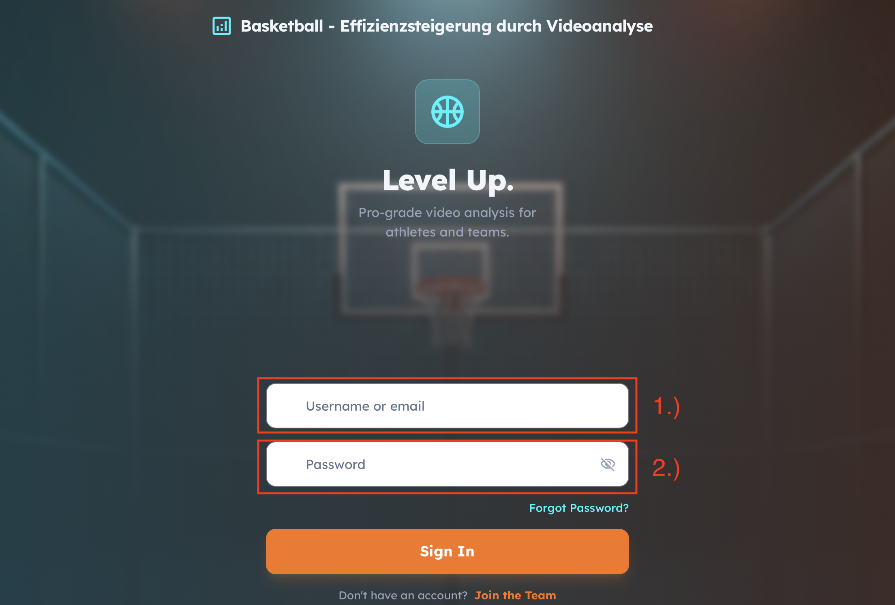
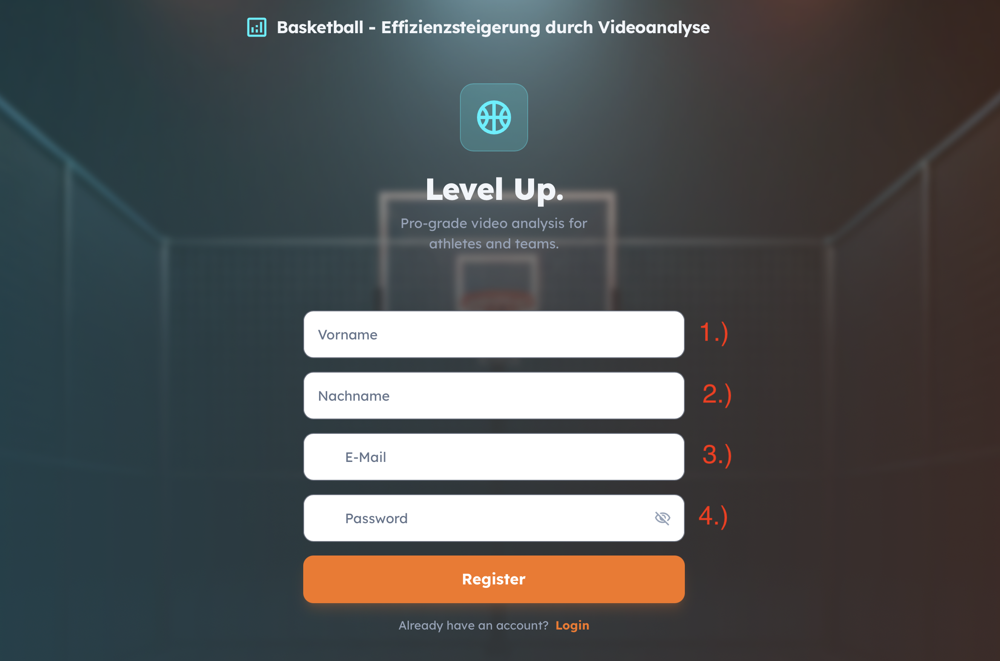
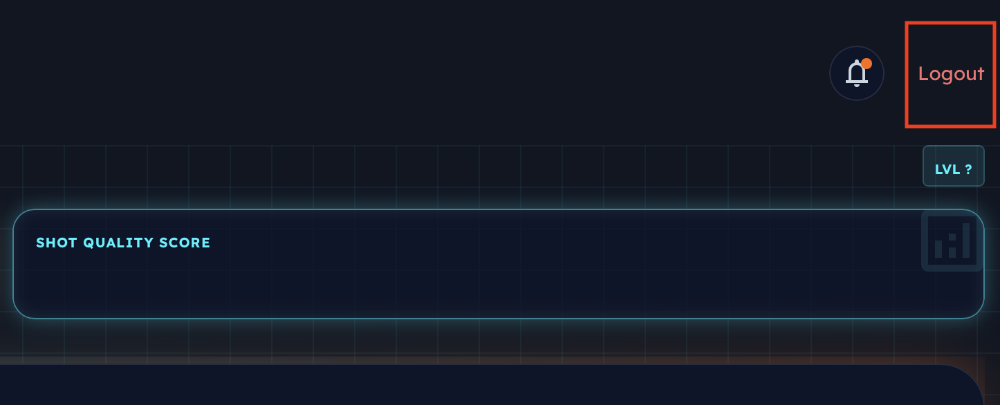
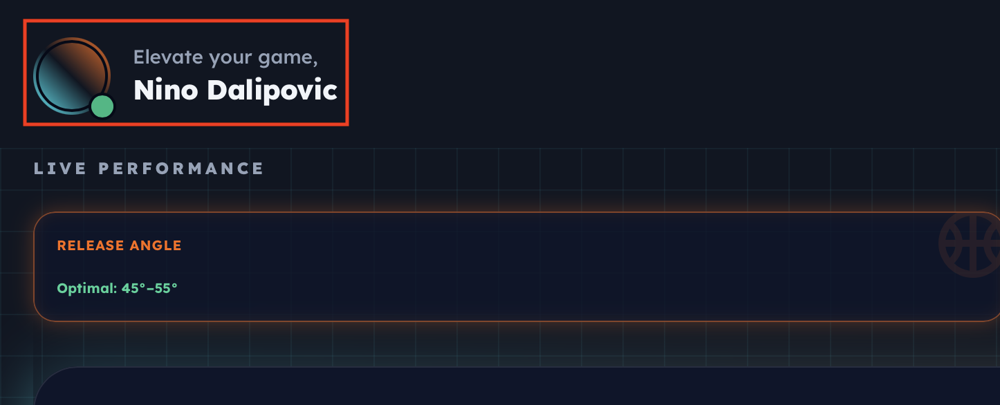
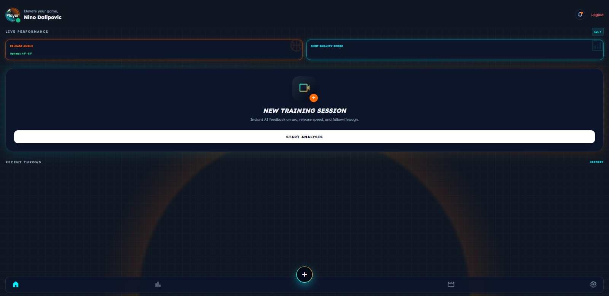
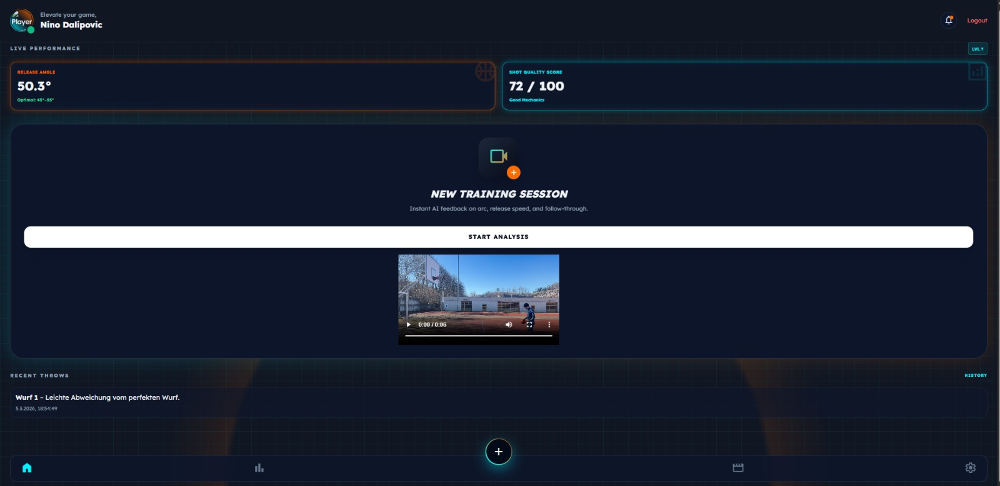
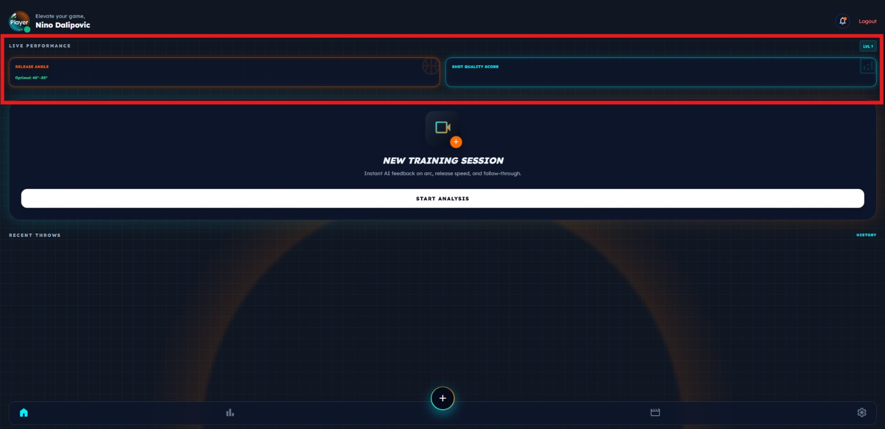
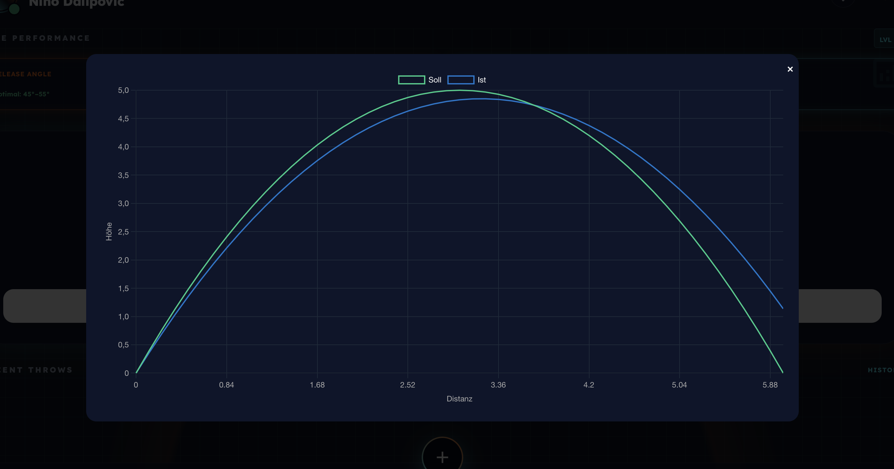
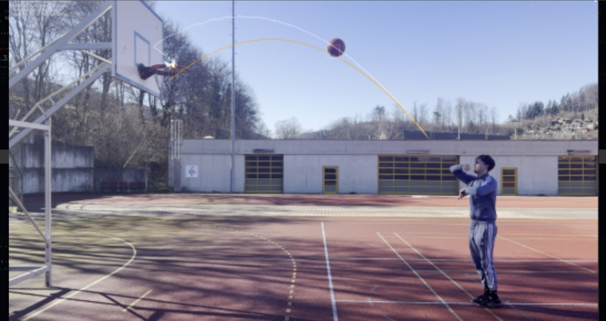

# Teilaufgabe Dalipovic Nino
\textauthor{Nino Dalipovic}

## Theorie

Diese Arbeit befasst sich mit der Konzeption und Umsetzung einer webbasierten Benutzeroberfläche im Kontext einer sportbezogenen Trainingsanwendung. Der Fokus liegt dabei ausschließlich auf der clientseitigen Anwendung, die im Webbrowser ausgeführt wird und als Interaktionsschnittstelle zwischen Benutzer und serverseitiger Systemlogik fungiert.

Moderne Webanwendungen bestehen typischerweise aus mehreren logisch getrennten Komponenten. Während die serverseitige Schicht für Datenverarbeitung, Persistenz und Geschäftslogik zuständig ist, übernimmt das Frontend die Präsentation von Informationen, die Verarbeitung von Benutzereingaben sowie die Kommunikation mit definierten Programmierschnittstellen (APIs). Das Frontend stellt somit die sichtbare und interaktive Ebene eines verteilten Systems dar [@tanenbaum2007].

Im vorliegenden Projekt dient das Frontend als zentrale Interaktionsschicht zwischen Benutzer und Backend-System. Es ermöglicht die strukturierte Darstellung von Trainingsdaten, die Eingabe und Verarbeitung benutzerspezifischer Informationen sowie die visuelle Aufbereitung von Analyseergebnissen. Die Kommunikation mit dem Backend erfolgt über standardisierte HTTP-basierte Schnittstellen, wobei strukturierte Datenformate zum Einsatz kommen [@rfc9110].

Die clientseitige Anwendung verarbeitet empfangene Daten, verwaltet Zustände innerhalb des Browsers und aktualisiert die Benutzeroberfläche dynamisch. Dadurch wird eine interaktive Nutzererfahrung ermöglicht, bei der Inhalte ohne vollständiges Neuladen der Seite angepasst werden können.

Um die Architektur, Funktionsweise und Bewertung dieser Frontend-Implementierung nachvollziehen zu können, ist ein fundiertes Verständnis der zugrunde liegenden Webtechnologien erforderlich. Dazu gehören insbesondere:

- das Client-Server-Modell und das HTTP-Kommunikationsprinzip
- die Strukturierungsmechanismen von HTML
- die Gestaltungsmöglichkeiten durch CSS
- die dynamische Interaktionslogik mittels JavaScript
- architektonische Konzepte moderner Frontend-Anwendungen
- sowie sicherheits- und qualitätsrelevante Anforderungen an Websysteme

Der folgende Theorieteil schafft die technische und architektonische Grundlage, um die spätere praktische Umsetzung des Frontends einordnen und bewerten zu können. Dabei werden keine konkreten Implementierungsdetails vorweggenommen. Vielmehr werden die verwendeten Technologien und Architekturprinzipien allgemein erläutert, um ein systematisches Verständnis moderner Frontend-Entwicklung zu vermitteln.

Durch diese strukturierte theoretische Fundierung wird gewährleistet, dass die praktische Umsetzung nicht isoliert betrachtet wird, sondern im Kontext etablierter Konzepte und Standards der Webarchitektur analysiert werden kann.

### Grundlagen von Webanwendungen

#### Das Client-Server-Modell und das HTTP-Protokoll

Webanwendungen basieren grundlegend auf dem Client-Server-Architekturmodell. Dieses beschreibt ein verteiltes System, bei dem Aufgaben zwischen mindestens zwei logisch getrennten Komponenten aufgeteilt sind: einem Client und einem Server [@tanenbaum2007].

Der Client ist für die Interaktion mit dem Benutzer verantwortlich. Im Webkontext übernimmt in der Regel der Webbrowser diese Rolle. Der Server stellt Dienste bereit, verarbeitet Anfragen, führt Geschäftslogik aus und speichert Daten dauerhaft. Zwischen beiden Komponenten besteht eine Netzwerkverbindung, über die strukturierte Nachrichten ausgetauscht werden.

Die Kommunikation im World Wide Web erfolgt standardisiert über das Hypertext Transfer Protocol (HTTP). HTTP ist ein zustandsloses, textbasiertes Protokoll, das nach dem Request-Response-Prinzip funktioniert [@rfc9110]. Der Client sendet eine Anfrage (Request), die folgende Bestandteile enthalten kann:

- eine HTTP-Methode (z. B. GET, POST, PUT, DELETE)
- eine Zieladresse (URI)
- Header-Informationen
- optional einen Nachrichtenkörper (Body)

Der Server verarbeitet diese Anfrage und sendet eine strukturierte Antwort (Response), die einen Statuscode, Header-Felder sowie gegebenenfalls einen Nachrichtenkörper enthält.

Ein zentrales Merkmal von HTTP ist seine Zustandslosigkeit (Statelessness). Jede Anfrage wird unabhängig von vorherigen Interaktionen behandelt. Der Server speichert keinen impliziten Sitzungszustand zwischen einzelnen Requests [@rfc7231]. Diese Eigenschaft erhöht die Skalierbarkeit von Websystemen, da Anfragen parallel und unabhängig verarbeitet werden können.

Gleichzeitig entsteht dadurch die Notwendigkeit zusätzlicher Mechanismen zur Verwaltung von Benutzersitzungen, etwa durch Cookies oder tokenbasierte Authentifizierungsverfahren.

Die klare Trennung von Client- und Serververantwortlichkeiten bildet die architektonische Grundlage moderner Webanwendungen und ermöglicht eine modulare Weiterentwicklung beider Systemseiten. Die folgende Abbildung zeigt diese Mehrschichtarchitektur am Beispiel einer typischen Webanwendung.

![Client-Server-Kommunikation als Mehrschichtprinzip. Quelle: [@algomaster-client-server]](img/threeTierArchitecture.jpg){ width=85% }

In der Abbildung ist links die Präsentationsschicht (Clients) dargestellt, die über verschiedene Endgeräte den Zugang zum System ermöglicht. In der Mitte befindet sich die Logikschicht (Server), die eingehende Anfragen verarbeitet und Geschäftslogik ausführt. Rechts ist die Datenschicht (Database) erkennbar, in der die persistente Datenhaltung erfolgt. Die bidirektionalen Pfeile zwischen den Schichten verdeutlichen den strukturierten Nachrichtenaustausch über das Netzwerk.

#### Strukturierung von Inhalten mit HTML

Die HyperText Markup Language (HTML) ist die standardisierte Auszeichnungssprache zur Strukturierung von Webdokumenten [@fielding2000]. Sie definiert die logische Gliederung von Inhalten und beschreibt, wie Informationen semantisch ausgezeichnet werden.

Ein HTML-Dokument besteht aus einer hierarchischen Baumstruktur von Elementen. Diese Struktur wird im Browser als sogenanntes Document Object Model (DOM) repräsentiert [@fowler2002]. Das DOM bildet das Dokument als Baum aus Knoten ab, wobei jedes HTML-Element einem Objekt im Speicher entspricht. Die folgende Abbildung verdeutlicht diese hierarchische Baumstruktur.

![DOM-Struktur eines HTML-Dokuments. Quelle: [@tutorialspoint-dom]](img/html_dom.jpg){ width=85% }

In der Abbildung ist erkennbar, wie das Document-Objekt als Wurzelknoten dient, aus dem sich die Elemente `<html>`, `<head>` und `<body>` hierarchisch verzweigen. Untergeordnete Knoten wie `<title>`, `<link>`, `` und `
` bilden die Blätter des Baums und repräsentieren die konkreten Inhalte des Dokuments.

Die semantische Strukturierung durch HTML-Elemente wie:

- Überschriften
- Absätze
- Listen
- Formulare
- Tabellen

ermöglicht nicht nur eine visuelle Darstellung, sondern auch eine maschinelle Interpretierbarkeit. Dies ist insbesondere für Barrierefreiheit, Suchmaschinenoptimierung und Interoperabilität zwischen Systemen von Bedeutung.

HTML selbst enthält keine Informationen über Layout oder visuelles Design. Es beschreibt ausschließlich die Struktur und Bedeutung der Inhalte. Diese bewusste Trennung von Struktur und Darstellung ist ein zentrales Prinzip moderner Webarchitektur.

#### Gestaltung und Layout mit CSS

Cascading Style Sheets (CSS) dienen der visuellen Gestaltung von HTML-Dokumenten. Während HTML die Struktur definiert, legt CSS fest, wie diese Struktur dargestellt wird.

Grundlage der CSS-Darstellung ist das sogenannte Box-Modell [@w3c-box-2018]. Jedes HTML-Element wird als rechteckige Box interpretiert. Die folgende Abbildung illustriert dieses Box-Modell mit seinen vier Schichten, bestehend aus:

![CSS Box Model mit Content, Padding, Border und Margin. Quelle: [@gfg-css-box]](img/cssBoxModel.png){ width=80% }

Die Abbildung zeigt die verschachtelte Struktur des Box-Modells: Im Zentrum liegt der Content-Bereich, der den eigentlichen Inhalt enthält. Dieser wird vom Padding (Innenabstand) umschlossen, gefolgt vom Border (Rahmen) und schließlich dem äußeren Margin (Außenabstand). Die vier Schichten sind im Einzelnen:

- Content (Inhaltsbereich)
- Padding (Innenabstand)
- Border (Rahmen)
- Margin (Außenabstand)

Dieses Modell bildet die Grundlage für Layout-Berechnungen und Abstandsdefinitionen.

Moderne Layout-Techniken wie Flexbox und CSS Grid erweitern das klassische Box-Modell erheblich [@w3c-flexbox-2017]. Flexbox ermöglicht eine flexible, eindimensionale Anordnung von Elementen entlang einer Hauptachse. CSS Grid hingegen erlaubt eine zweidimensionale Rasterstruktur, die komplexe Layouts mit klar definierten Zeilen- und Spaltenstrukturen ermöglicht.

Diese Mechanismen sind essenziell für responsive Webdesign-Konzepte, bei denen sich die Benutzeroberfläche an unterschiedliche Bildschirmgrößen und Gerätetypen anpasst.

Die konsequente Trennung von Struktur (HTML) und Gestaltung (CSS) verbessert Wartbarkeit und Erweiterbarkeit, da Layout-Anpassungen unabhängig von der Dokumentenstruktur vorgenommen werden können.

#### Dynamische Interaktion mit JavaScript

JavaScript ergänzt HTML und CSS um Interaktivität und dynamisches Verhalten. Es handelt sich um eine skriptbasierte Programmiersprache, die direkt im Browser ausgeführt wird.

JavaScript besitzt Zugriff auf das DOM und kann somit:

- Elemente erzeugen
- Inhalte verändern
- Attribute anpassen
- Ereignisse verarbeiten
- Elemente entfernen

Das Ausführungsmodell von JavaScript basiert auf einem ereignisgesteuerten Paradigma mit einer Event-Loop-Mechanik [@mdn-execution-model-2023]. Ereignisse wie Mausklicks, Tastatureingaben oder Netzwerkantworten werden in einer Warteschlange verarbeitet. Dadurch können asynchrone Operationen ausgeführt werden, ohne die Benutzeroberfläche zu blockieren. Die folgende Abbildung veranschaulicht dieses Ausführungsmodell mit seinen zentralen Komponenten: dem Call Stack, den Web APIs und der Event Loop.

![JavaScript-Ausführungsmodell mit Call Stack, Web APIs und Event Loop. Quelle: [@gfg-event-loop]](img/Event-Loop-in-JavaScript.jpg){ width=85% }

In der Abbildung ist links der Call Stack dargestellt, in dem Funktionsaufrufe wie `main()`, `logger("a")` und `console.log("a")` sequenziell abgearbeitet werden. Rechts befinden sich die Web APIs (setTimeout, DOM, fetch), die asynchrone Aufgaben entgegennehmen. Im mittleren Bereich sind zwei Warteschlangen erkennbar: die Callback Queue für Ereignisse niedrigerer Priorität und die Priority Queue für Promises mit höherer Priorität. Die zentrale Event Loop steuert den Transfer abgeschlossener Aufgaben zurück in den Call Stack.

Ein zentrales Konzept ist dabei die asynchrone Kommunikation mit Servern. Über HTTP-Anfragen können Daten abgerufen oder gesendet werden, ohne dass die gesamte Seite neu geladen werden muss. Diese Technik bildet die Grundlage moderner interaktiver Webanwendungen.

Die Kombination aus HTML (Struktur), CSS (Gestaltung) und JavaScript (Logik und Interaktion) bildet somit das fundamentale technologische Dreieck der Frontend-Entwicklung.

### Moderne Frontend-Entwicklung

#### Von statischen Webseiten zu dynamischen Anwendungen

Die Entwicklung von Webanwendungen hat sich im Laufe der Zeit grundlegend verändert. Während frühe Webseiten überwiegend aus statischen HTML-Dokumenten bestanden, die bei jeder Interaktion vollständig neu geladen wurden, verfolgen moderne Webanwendungen zunehmend dynamische, clientseitige Architekturen.

Im klassischen Multi-Page-Application-Modell (MPA) generiert der Server für jede Benutzerinteraktion ein vollständiges HTML-Dokument. Jede Navigation, Formularübermittlung oder Statusänderung führt zu einer neuen HTTP-Anfrage und einem vollständigen Rendering der Zielseite im Browser. Dieses Modell ist konzeptionell einfach und klar strukturiert, verursacht jedoch höhere Netzwerklast und führt zu sichtbaren Unterbrechungen im Nutzungserlebnis.

Mit steigenden Anforderungen an Interaktivität, Benutzerfreundlichkeit und Reaktionsgeschwindigkeit verlagerte sich ein zunehmender Anteil der Logik vom Server in den Client. Anstatt komplette HTML-Seiten auszutauschen, werden heute häufig nur noch strukturierte Daten übertragen, während die Darstellung im Browser dynamisch aktualisiert wird.

Diese Entwicklung führte zu einer stärkeren Rolle des Frontends innerhalb der Gesamtarchitektur. Der Client fungiert nicht mehr ausschließlich als Anzeigemedium, sondern als eigenständige Laufzeitumgebung mit komplexer Zustandsverwaltung und Interaktionslogik.

#### Single Page Applications (SPA)

Eine Single Page Application (SPA) ist eine Webanwendung, die innerhalb eines einzigen HTML-Dokuments betrieben wird. Im Gegensatz zu klassischen Multi-Page-Ansätzen wird bei Benutzerinteraktionen nicht die gesamte Seite neu geladen. Stattdessen wird der sichtbare Inhalt dynamisch im Browser aktualisiert.

SPAs verwenden asynchrone HTTP-Anfragen, um Daten vom Server abzurufen. Diese Daten werden anschließend in bestehende DOM-Strukturen eingebettet oder führen zu gezielten Benutzeroberflächen-Updates. Die wahrgenommene Performance verbessert sich, da vollständige Seitenneuladungen entfallen. Die folgende Abbildung zeigt das Grundprinzip einer SPA: Nach dem initialen Laden des HTML-Grundgerüsts erfolgen alle weiteren Aktualisierungen dynamisch über asynchrone Datenabrufe.

![Grundprinzip einer Single Page Application: initiales Laden und dynamische Aktualisierung. Quelle: [@gfg-spa]](img/spaArchitecture.jpeg){ width=100% }

Die Abbildung zeigt die SPA-Architektur im Überblick: Auf der Serverseite (links) stellen Data Services Daten im JSON- bzw. XML-Format bereit. Im Browser (rechts, Browser App/Client) befinden sich die Web UI aus HTML, CSS und JavaScript sowie ein Application Layer, der über Navigation APIs und Data Access Layer die Kommunikation mit dem Server steuert. Zusätzlich ist ein Offline Storage erkennbar, der eine lokale Datenhaltung im Browser ermöglicht.

Typische Merkmale einer SPA sind:

- ein initial geladenes HTML-Grundgerüst
- clientseitige Zustandsverwaltung
- dynamische DOM-Manipulation
- asynchrone Datenkommunikation mit dem Backend

Architektonisch verschiebt sich ein Teil der Anwendungslogik in den Client. Der Server stellt primär Daten und Schnittstellen bereit, während Präsentations- und Interaktionslogik im Browser ausgeführt werden.

Gleichzeitig entstehen neue Herausforderungen. Dazu gehören:

- erhöhte Komplexität der Zustandsverwaltung
- strukturierte Organisation von UI-Komponenten
- effizientes Rendering bei häufigen Zustandsänderungen
- erhöhte Verantwortung für Sicherheitsmechanismen auf Client-Seite

Trotz dieser Herausforderungen haben sich SPAs als dominierendes Architekturmodell für interaktive Webanwendungen etabliert.

#### Utility-First CSS und moderne Styling-Paradigmen

Mit wachsender Komplexität von Benutzeroberflächen entwickelten sich unterschiedliche Strategien zur Organisation von CSS. Klassische Ansätze verwenden häufig semantische Klassennamen, die größere Stildefinitionen kapseln. Mit zunehmender Projektgröße können dabei umfangreiche und schwer wartbare Stylesheets entstehen.

Utility-First CSS verfolgt einen anderen Ansatz. Statt semantische Klassen mit umfangreichen Stildefinitionen zu erstellen, werden atomare Klassen verwendet, die jeweils eine einzelne CSS-Eigenschaft repräsentieren. Layout-, Farb- oder Abstandsentscheidungen werden durch die Kombination dieser kleinen Klassen direkt im Markup umgesetzt.

Vorteile dieses Ansatzes sind:

- Reduktion redundanter CSS-Regeln
- höhere Konsistenz im Design
- geringere Notwendigkeit individueller Stildefinitionen
- vereinfachte Wartbarkeit durch standardisierte Stilbausteine

Demgegenüber kann die starke Nutzung von Utility-Klassen die Lesbarkeit des Markups beeinträchtigen, da viele Klassenkombinationen direkt im HTML sichtbar sind.

Die Wahl eines Styling-Paradigmas beeinflusst somit unmittelbar Wartbarkeit, Skalierbarkeit und Teamarbeit innerhalb eines Frontend-Projekts.

#### CDN-basierte Einbindung versus Build-Prozesse

Frontend-Abhängigkeiten können entweder direkt über Content Delivery Networks (CDNs) eingebunden oder über lokale Build-Prozesse verwaltet werden.

Bei einer CDN-basierten Integration werden Bibliotheken und Frameworks über externe Server geladen. Dies reduziert die lokale Projektkomplexität und ermöglicht einen schnellen Einstieg ohne umfangreiche Toolchain.

Vorteile einer CDN-basierten Integration:

- kein komplexer Build-Schritt erforderlich
- einfache Projektstruktur
- schnelle Entwicklungsumgebung
- potenziell optimiertes Caching durch globale Netzwerke

Demgegenüber bieten Build-Prozesse zusätzliche Möglichkeiten zur Optimierung:

- Code-Minimierung
- Modul-Bundling
- Dead-Code-Elimination
- strukturierte Abhängigkeitsverwaltung
- Produktionsoptimierung von Assets

Während CDN-basierte Ansätze insbesondere für kleinere Projekte oder Prototypen geeignet sind, gewinnen Build-Prozesse mit steigender Projektgröße und wachsender Komplexität an Bedeutung.

#### Browser-APIs und clientseitige Erweiterungsmechanismen

Moderne Webbrowser stellen eine Vielzahl zusätzlicher Programmierschnittstellen (APIs) bereit, die über die klassische DOM-Manipulation hinausgehen. Diese APIs erweitern die Funktionalität des Clients erheblich.

Zu den wichtigsten Kategorien zählen:

- Web Storage APIs zur persistenten Datenspeicherung im Browser
- File- und Media-APIs zur Verarbeitung lokaler Dateien
- Drag-and-Drop-Schnittstellen
- Multimedia- und Audio-APIs
- Sprach- und Interaktionsschnittstellen

Diese Mechanismen ermöglichen die Umsetzung komplexer Anwendungen direkt im Browser, ohne dass zusätzliche Plugins oder native Software erforderlich sind.

Mit der steigenden Funktionalität des Clients wächst jedoch auch die Verantwortung hinsichtlich Sicherheitskonzepten, Datenschutz und kontrollierter Zustandsverwaltung. Die Architektur moderner Frontend-Anwendungen muss diese Aspekte systematisch berücksichtigen.

### Client-Server-Architektur und REST-basierte Kommunikation

#### Verteilte Systeme und Mehrschichtarchitektur

Webanwendungen sind als verteilte Systeme konzipiert. Ein verteiltes System besteht aus mehreren unabhängigen Komponenten, die über ein Netzwerk miteinander kommunizieren und gemeinsam eine funktionale Einheit bilden [@tanenbaum2007]. Diese Komponenten sind logisch voneinander getrennt und übernehmen jeweils klar definierte Aufgaben.

In webbasierten Anwendungen wird häufig eine Mehrschichtarchitektur eingesetzt. Diese gliedert das System typischerweise in:

- Präsentationsschicht (Client)
- Anwendungsschicht (Business Logic)
- Persistenzschicht (Datenhaltung)

Die Präsentationsschicht ist für die Benutzerinteraktion verantwortlich. Sie stellt Informationen dar, verarbeitet Eingaben und kommuniziert mit der Anwendungsschicht. Die Anwendungsschicht enthält Geschäftslogik, Validierungsmechanismen und Koordinationsprozesse für Datenzugriffe. Die Persistenzschicht speichert strukturierte Daten dauerhaft in Datenbanksystemen oder vergleichbaren Speichermedien.

Dieses Architekturmodell folgt dem Prinzip der Separation of Concerns. Jede Schicht übernimmt eine klar definierte Verantwortung. Dadurch erhöhen sich Wartbarkeit, Erweiterbarkeit und Testbarkeit des Systems.

Die Trennung der Verantwortlichkeiten ist insbesondere bei größeren Anwendungen entscheidend, da sie parallele Weiterentwicklung sowie unabhängige Skalierung einzelner Systemkomponenten ermöglicht.

#### REST als Architekturstil

Representational State Transfer (REST) ist ein Architekturstil für verteilte hypermediale Systeme, der von Roy T. Fielding definiert wurde [@fielding2000]. REST beschreibt keine konkrete Implementierung, sondern eine Menge architektonischer Constraints, die ein System erfüllen muss.

Zu den zentralen REST-Constraints zählen:

- Client-Server-Trennung
- Zustandslosigkeit (Statelessness)
- Cachebarkeit
- Einheitliche Schnittstelle (Uniform Interface)
- Schichtenarchitektur (Layered System)

Die Einhaltung dieser Constraints führt zu Systemen mit hoher Skalierbarkeit, Modifizierbarkeit und Transparenz [@fielding2000].

Besonders relevant ist die Zustandslosigkeit. Jede Anfrage enthält alle notwendigen Informationen zur Verarbeitung. Der Server speichert keinen impliziten Sitzungszustand zwischen einzelnen Requests. Dadurch wird horizontale Skalierung erleichtert, da Anfragen unabhängig voneinander verarbeitet werden können.

Die einheitliche Schnittstelle sorgt dafür, dass Interaktionen standardisiert über HTTP-Methoden und klar definierte Ressourcen erfolgen. Dies erhöht die Interoperabilität zwischen Systemen. Die folgende Abbildung veranschaulicht dieses Kommunikationsmuster.

![REST-Kommunikation zwischen Client und Server über HTTP und JSON. Quelle: [@medium-rest-api]](img/restApiDiagram.jpeg){ width=100% }

In der Abbildung ist auf der linken Seite der Client dargestellt, der HTTP-Anfragen (Request) an den Server auf der rechten Seite sendet. Der Server antwortet mit einer strukturierten Response, typischerweise im JSON-Format. Die standardisierten HTTP-Methoden GET, POST, PUT und DELETE sind als Kommunikationswege zwischen den beiden Seiten erkennbar und verdeutlichen die ressourcenorientierte Interaktion.

#### Ressourcenorientierung und HTTP-Semantik

Im REST-Architekturstil werden Funktionalitäten als Ressourcen modelliert. Jede Ressource besitzt eine eindeutige Adresse (URI) und kann über standardisierte HTTP-Methoden manipuliert werden.

Die HTTP-Spezifikation definiert die Semantik der einzelnen Methoden [@rfc9110]:

- **GET** dient dem Abrufen von Ressourcen und gilt als sicher sowie idempotent.
- **POST** wird zur Erstellung neuer Ressourcen oder zur Ausführung nicht-idempotenter Operationen verwendet.
- **PUT** ersetzt eine bestehende Ressource vollständig und ist idempotent.
- **DELETE** entfernt eine Ressource und ist ebenfalls idempotent.

Idempotenz bedeutet, dass die wiederholte Ausführung derselben Anfrage zum gleichen Ergebnis führt wie eine einmalige Ausführung. Diese Eigenschaft ist für Fehlertoleranz und Wiederholungsmechanismen von großer Bedeutung.

HTTP unterscheidet Statuscodes in verschiedene Klassen:

- 2xx - erfolgreiche Verarbeitung
- 3xx - Weiterleitungen
- 4xx - Client-Fehler
- 5xx - Server-Fehler

Diese standardisierte Statuskommunikation ermöglicht eine strukturierte Fehlerbehandlung auf Client-Seite.

Die korrekte Nutzung von HTTP-Semantik ist wesentlich für Vorhersagbarkeit, Caching-Strategien und Interoperabilität verteilter Systeme.

#### Data Transfer Objects und API-Verträge

In mehrschichtigen Architekturen werden interne Domänenmodelle häufig nicht direkt an externe Clients übertragen. Stattdessen werden spezielle Übertragungsstrukturen verwendet, sogenannte Data Transfer Objects (DTOs) [@fowler2002].

DTOs erfüllen mehrere Funktionen:

- Bündelung relevanter Daten für Netzwerkübertragungen
- Reduktion unnötiger Attribute
- Schutz interner Geschäftslogik
- klare Definition externer Schnittstellen

Ein API-Vertrag beschreibt die erwarteten Eingabe- und Ausgabeformate einer Schnittstelle. Er definiert:

- Datenstruktur
- Datentypen
- Pflicht- und optionale Felder
- mögliche Antwortformate
- Fehlerstrukturen

Ein konsistenter API-Vertrag ist entscheidend für Wartbarkeit und Stabilität. Änderungen an Schnittstellen ohne Versionierung oder Dokumentation können zu Integrationsproblemen führen.

Die Gestaltung von API-Verträgen ist somit eine zentrale architektonische Entscheidung und beeinflusst die langfristige Erweiterbarkeit eines Systems.

#### Fehlerbehandlung und Robustheit in Web-APIs

Robustheit ist eine zentrale Eigenschaft verteilter Systeme. Fehler können auf unterschiedlichen Ebenen auftreten, beispielsweise durch:

- ungültige Eingaben
- fehlende Ressourcen
- Netzwerkprobleme
- serverseitige Ausfälle

REST-basierte Systeme kommunizieren Fehler primär über HTTP-Statuscodes. Ergänzend werden häufig strukturierte Fehlerobjekte im Nachrichtenkörper übertragen, um maschinenlesbare Fehlermeldungen bereitzustellen.

Eine konsistente Fehlerstruktur ermöglicht:

- automatisierte Reaktionen im Client
- präzise Benutzerfeedback-Mechanismen
- vereinfachtes Debugging
- höhere Integrationsstabilität

Uneinheitliche oder unstrukturierte Fehlermeldungen erhöhen hingegen die Komplexität auf Client-Seite und erschweren Wartung sowie Weiterentwicklung.

Fehlermanagement ist daher kein Nebenaspekt, sondern ein integraler Bestandteil der API-Architektur.

### Architekturprinzipien im Frontend

#### Monolithische Frontend-Architekturen

In kleineren oder frühen Webanwendungen wird die gesamte clientseitige Logik häufig innerhalb einer zentralen Struktur organisiert. Eine solche Architektur wird als monolithisches Frontend bezeichnet. Charakteristisch ist, dass Präsentationslogik, Zustandsverwaltung, Ereignisbehandlung und Netzwerkkommunikation innerhalb weniger oder sogar einer einzigen zentralen Codebasis gebündelt sind.

Der Vorteil eines monolithischen Ansatzes liegt in seiner Einfachheit. Die Einstiegshürde ist gering, da keine komplexe Projektstruktur oder zusätzliche Abstraktionsebenen erforderlich sind. Für kleinere Anwendungen oder Prototypen kann diese Struktur effizient und ausreichend sein.

Mit steigender Anwendungsgröße entstehen jedoch strukturelle Herausforderungen. Dazu gehören:

- zunehmende Kopplung zwischen Logik und Darstellung
- erschwerte Wartbarkeit bei Funktionserweiterungen
- steigende Komplexität bei paralleler Weiterentwicklung
- geringere Testbarkeit einzelner Funktionseinheiten

Monolithische Frontend-Architekturen können somit kurzfristig effizient sein, stoßen jedoch bei wachsender Funktionsvielfalt und steigender Projektkomplexität an ihre Grenzen.

#### Komponentenbasierte Architekturen

Als Reaktion auf die Skalierungsprobleme monolithischer Ansätze etablierten sich komponentenbasierte Architekturen. In diesem Modell wird die Benutzeroberfläche in eigenständige, wiederverwendbare Bausteine unterteilt. Jede Komponente kapselt Struktur, Darstellung und häufig auch einen Teil der Logik. Die folgende Abbildung verdeutlicht dieses Prinzip: Backend, Frontend und Mobile App werden jeweils aus eigenständigen Komponenten zusammengesetzt.

![Komponentenbasierte Architektur: UI als modulare, wiederverwendbare Bausteine. Quelle: [@sam-component-architecture]](img/componentArchitecture.png){ width=100% }

Die Abbildung veranschaulicht, wie Backend, Frontend und Mobile App jeweils aus eigenständigen, klar abgegrenzten Komponenten zusammengesetzt werden. Jede Komponente kapselt dabei einen definierten Funktionsbereich und kann unabhängig von den übrigen Bausteinen entwickelt und gewartet werden. Die modulare Struktur wird durch die farblich getrennten Blöcke innerhalb der jeweiligen Anwendungsschichten sichtbar.

Die Vorteile dieses Ansatzes sind:

- klare Verantwortlichkeitsverteilung
- Wiederverwendbarkeit von UI-Elementen
- verbesserte Wartbarkeit
- bessere Skalierbarkeit bei wachsender Funktionalität

Komponenten können isoliert entwickelt, getestet und bei Bedarf ersetzt werden. Dadurch reduziert sich die Gefahr unbeabsichtigter Seiteneffekte bei Änderungen.

Allerdings erfordert eine komponentenbasierte Architektur eine klare Strategie zur Verwaltung von Zuständen und zur Kommunikation zwischen Komponenten. Ohne definierte Konventionen kann auch hier Komplexität entstehen.

#### Separation of Concerns im Frontend

Das Prinzip der Separation of Concerns beschreibt die klare Trennung unterschiedlicher Verantwortlichkeiten innerhalb eines Systems. Im Frontend-Kontext betrifft dies insbesondere:

- Struktur (HTML)
- Gestaltung (CSS)
- Interaktionslogik (JavaScript)
- Netzwerkkommunikation
- Zustandsverwaltung

Eine saubere Trennung dieser Bereiche reduziert implizite Abhängigkeiten und erleichtert langfristige Wartbarkeit. Werden beispielsweise Netzwerklogik und UI-Darstellung stark vermischt, erhöht sich der Änderungsaufwand bei Anpassungen erheblich.

Architektonisch betrachtet ist die konsequente Umsetzung dieses Prinzips entscheidend für Skalierbarkeit und Teamarbeit. Je klarer Verantwortlichkeiten abgegrenzt sind, desto leichter lassen sich einzelne Teile unabhängig weiterentwickeln.

#### Zustandsverwaltung in Webanwendungen

Der Zustand (State) einer Anwendung beschreibt alle Informationen, die den aktuellen Kontext der Benutzerinteraktion definieren. Dazu gehören unter anderem:

- Benutzereingaben
- geladene Daten
- Sichtbarkeitszustände von UI-Elementen
- temporäre Zwischenergebnisse

In einfachen Anwendungen wird der Zustand häufig direkt im DOM oder in globalen Variablen gespeichert. Mit wachsender Komplexität können jedoch Inkonsistenzen entstehen, wenn mehrere Teile der Anwendung denselben Zustand verändern.

Architektonische Konzepte zur Zustandsverwaltung umfassen:

- lokale Zustände innerhalb einzelner Komponenten
- zentrale Zustandscontainer
- unidirektionalen Datenfluss

Ein unidirektionales Datenflussmodell erhöht Transparenz und Nachvollziehbarkeit von Zustandsänderungen. Änderungen erfolgen kontrolliert über definierte Mechanismen, wodurch unbeabsichtigte Seiteneffekte reduziert werden.

Die Wahl einer Zustandsstrategie beeinflusst maßgeblich Wartbarkeit, Testbarkeit und Erweiterbarkeit einer Frontend-Anwendung.

#### Rendering-Strategien: Imperativ versus Deklarativ

Rendering beschreibt den Prozess, bei dem Daten in visuelle Elemente übersetzt werden. In klassischen, imperativen Ansätzen wird das DOM direkt manipuliert. Entwickler definieren explizit, welche Elemente erstellt, verändert oder entfernt werden.

Deklarative oder reaktive Ansätze hingegen beschreiben, wie die Benutzeroberfläche in Abhängigkeit vom aktuellen Zustand aussehen soll. Das Rendering-System berechnet selbstständig die notwendigen Änderungen und aktualisiert das DOM entsprechend.

Imperative Modelle bieten direkte Kontrolle, erfordern jedoch sorgfältige Verwaltung von Zustandsänderungen. Deklarative Modelle abstrahieren diese Komplexität, bringen jedoch zusätzliche Architektur- und Frameworkabhängigkeiten mit sich.

Die Wahl einer Rendering-Strategie ist somit eine grundlegende Architekturentscheidung, die Auswirkungen auf Performance, Wartbarkeit und Entwicklungsaufwand hat.

### Nichtfunktionale Anforderungen und Sicherheitsaspekte

Neben funktionalen Anforderungen - also den konkret umgesetzten Fähigkeiten einer Anwendung - spielen nichtfunktionale Anforderungen eine zentrale Rolle in der Architektur moderner Softwaresysteme. Nichtfunktionale Anforderungen beschreiben Qualitätsmerkmale, die das Verhalten und die Eigenschaften eines Systems betreffen [@bass2012].

Im Kontext von Webanwendungen sind insbesondere Wartbarkeit, Erweiterbarkeit, Skalierbarkeit, Performance und Sicherheit von Bedeutung.

#### Wartbarkeit

Wartbarkeit beschreibt die Fähigkeit eines Systems, effizient angepasst, erweitert oder korrigiert werden zu können. Eine hohe Wartbarkeit reduziert langfristige Entwicklungskosten und erleichtert die Weiterentwicklung über den ursprünglichen Projektumfang hinaus.

Im Frontend-Kontext hängt Wartbarkeit maßgeblich von folgenden Faktoren ab:

- klare Strukturierung der Codebasis
- konsistente Trennung von Verantwortlichkeiten
- verständliche Zustandsverwaltung
- dokumentierte Schnittstellen
- modularer Aufbau

Eine stark gekoppelte Architektur erschwert Änderungen erheblich. Werden beispielsweise Präsentationslogik und Netzwerkkommunikation eng miteinander vermischt, führt jede Anpassung potenziell zu unerwarteten Nebeneffekten.

Architektonische Prinzipien wie Modularisierung und Separation of Concerns erhöhen die Wartbarkeit signifikant. Durch klar definierte Verantwortlichkeiten können einzelne Komponenten isoliert analysiert und angepasst werden.

#### Erweiterbarkeit

Erweiterbarkeit beschreibt die Fähigkeit eines Systems, neue Funktionen zu integrieren, ohne bestehende Komponenten grundlegend verändern zu müssen.

Webanwendungen unterliegen häufig evolutiven Anforderungen. Neue Features, zusätzliche Datenmodelle oder veränderte Benutzerinteraktionen sind typische Weiterentwicklungen.

Eine erweiterbare Architektur zeichnet sich aus durch:

- lose Kopplung zwischen Modulen
- klar definierte Schnittstellen
- konsistente API-Verträge
- strukturierte Zustandsverwaltung

Fehlt diese strukturelle Vorbereitung, steigt mit jeder Erweiterung die Komplexität des Systems. Änderungen werden zunehmend riskanter und fehleranfälliger.

Erweiterbarkeit ist daher nicht nur eine Implementierungsfrage, sondern eine architektonische Grundentscheidung.

#### Skalierbarkeit

Skalierbarkeit kann sowohl technisch als auch organisatorisch verstanden werden.

Technische Skalierbarkeit beschreibt die Fähigkeit eines Systems, mit steigender Benutzerzahl oder wachsendem Datenvolumen umzugehen. Im Frontend betrifft dies unter anderem:

- effiziente Rendering-Strategien
- reduzierte DOM-Manipulation
- optimierte Netzwerkanfragen
- Caching-Mechanismen

Die folgende Abbildung zeigt eine skalierbare Webarchitektur, in der Komponenten wie Load Balancer, Caching-Dienste, Datenbanken und CDN zusammenwirken, um hohe Nutzerzahlen zu bewältigen.

![Skalierbare Webarchitektur mit Load Balancer, Services, Caching und Datenhaltung. Quelle: [@litslink-web-architecture]](img/Web_Application_Architecture_Diagram__diagram_.png){ width=95% }

Die Abbildung zeigt eine typische skalierbare Webarchitektur: Benutzeranfragen gelangen zunächst über ein CDN (Content Delivery Network) und einen Load Balancer, der die Last auf mehrere Service-Instanzen verteilt. Im mittleren Bereich sind die Anwendungsserver dargestellt, die über Caching-Dienste die Antwortzeiten optimieren. Auf der rechten Seite befinden sich die Datenbanksysteme für die persistente Speicherung.

Organisatorische Skalierbarkeit hingegen beschreibt die Fähigkeit eines Projekts, parallele Entwicklung durch mehrere Entwickler zu ermöglichen. Hier spielen klare Architekturprinzipien und modulare Strukturen eine zentrale Rolle.

Ein schlecht strukturiertes Frontend kann bei wachsender Teamgröße schnell zu Integrationsproblemen führen. Eine klare Komponentenstruktur erleichtert hingegen parallele Entwicklung.

#### Performance

Performance beschreibt die Effizienz, mit der eine Anwendung auf Benutzerinteraktionen reagiert. Wahrgenommene Performance beeinflusst unmittelbar die Benutzerzufriedenheit.

Im Frontend-Kontext umfasst Performance insbesondere:

- Initiale Ladezeit
- Rendering-Geschwindigkeit
- Reaktionszeit auf Interaktionen
- Effizienz von Netzwerkkommunikation
- Speicherverbrauch im Browser

Strategien zur Performance-Optimierung umfassen:

- Minimierung unnötiger DOM-Manipulationen
- effiziente Nutzung asynchroner HTTP-Anfragen
- Caching statischer Ressourcen
- Reduktion externer Abhängigkeiten
- strukturierte Zustandsverwaltung zur Vermeidung redundanter Updates

Die Wahl der Architektur beeinflusst Performance erheblich. Komplexe Rendering-Mechanismen oder ineffiziente Zustandsänderungen können zu spürbaren Verzögerungen führen.

#### Sicherheit in Webanwendungen

Sicherheit ist eine zentrale nichtfunktionale Anforderung moderner Websysteme. Webanwendungen sind öffentlich zugänglich und potenziellen Angriffen ausgesetzt.

##### Passwortspeicherung und Hashing

Passwörter dürfen niemals im Klartext gespeichert werden. Stattdessen werden kryptographische Hashfunktionen eingesetzt, um das Passwort in eine nicht rückrechenbare Form zu überführen.

Empfohlene Verfahren umfassen adaptive, speicherintensive Algorithmen wie bcrypt, scrypt oder Argon2 [@owasp-password-storage]. Diese Algorithmen erhöhen den Rechenaufwand für Angreifer und erschweren Brute-Force-Angriffe erheblich.

Zusätzlich wird empfohlen, für jedes Passwort einen individuellen Salt-Wert zu verwenden. Dadurch werden sogenannte Rainbow-Table-Angriffe verhindert.

Die sichere Passwortverarbeitung ist ein fundamentaler Bestandteil jeder Webanwendung mit Benutzerverwaltung.

##### Token-basierte Authentifizierung

In zustandslosen Architekturen wird Authentifizierung häufig über Token realisiert. JSON Web Tokens (JWT) sind ein verbreiteter Standard für tokenbasierte Authentifizierungsmechanismen [@rfc7519].

Ein JWT enthält strukturierte Claims über die Identität eines Benutzers und wird kryptographisch signiert. Der Client sendet dieses Token bei jeder Anfrage mit, wodurch der Server die Identität überprüfen kann, ohne einen Sitzungszustand speichern zu müssen. Die folgende Abbildung veranschaulicht diesen Ablauf: Der Client fordert ein Token vom Authorization Server an und übermittelt es bei jeder nachfolgenden Anfrage an den Resource Server.

![Token-basierte Authentifizierung: JWT-Ausstellung und Übermittlung bei Folge-Requests. Quelle: [@ringcentral-jwt]](img/JwtAuthenticationFlow.png){ width=95% }

Die Abbildung zeigt den Ablauf der tokenbasierten Authentifizierung: Der Client sendet zunächst seine Anmeldedaten an den Authorization Server (links), der bei erfolgreicher Prüfung ein signiertes JWT zurückgibt. Bei jeder nachfolgenden Anfrage an den Resource Server (rechts) wird dieses Token im HTTP-Header mitgesendet. Der Resource Server validiert die Signatur des Tokens und gewährt bei Gültigkeit den Zugriff auf die angeforderte Ressource.

Vorteile tokenbasierter Authentifizierung:

- Unterstützung zustandsloser Architekturen
- horizontale Skalierbarkeit
- reduzierte serverseitige Sitzungsverwaltung

Gleichzeitig müssen Ablaufzeiten, Signaturvalidierung und sichere Speicherung im Client sorgfältig umgesetzt werden.

##### Same-Origin-Policy und CORS

Die Same-Origin-Policy ist ein grundlegender Sicherheitsmechanismus von Webbrowsern. Sie verhindert, dass Skripte einer Herkunft (Origin) unkontrolliert auf Ressourcen einer anderen Herkunft zugreifen [@whatwg-fetch].

Cross-Origin Resource Sharing (CORS) erweitert dieses Modell kontrolliert. Server können explizit festlegen, welche Ursprünge auf bestimmte Ressourcen zugreifen dürfen.

Fehlkonfigurationen von CORS können Sicherheitsrisiken darstellen. Zu weit gefasste Freigaben ermöglichen potenziell unautorisierten Zugriff auf sensible Daten.

##### Clientseitige Speicherung sensibler Daten

Moderne Browser bieten mit localStorage und sessionStorage persistente Speichermechanismen. Diese APIs sind komfortabel, bergen jedoch Sicherheitsrisiken.

Insbesondere bei Cross-Site-Scripting-Angriffen (XSS) können gespeicherte Tokens oder sensible Informationen ausgelesen werden [@owasp-password-storage].

Daher sollten sicherheitsrelevante Daten nur mit Vorsicht im Browser gespeichert werden. Alternative Konzepte wie HttpOnly-Cookies reduzieren das Risiko clientseitiger Token-Exfiltration.

#### Datenschutz und Privacy by Design

Neben technischer Sicherheit gewinnt Datenschutz zunehmend an Bedeutung. Konzepte wie „Privacy by Design“ fordern, Datenschutz bereits auf Architekturebene zu berücksichtigen [@enisa-privacy].

Technische Prinzipien umfassen:

- Datenminimierung
- Zugriffsbeschränkungen
- transparente Datenflüsse
- definierte Speicher- und Löschstrategien

Webanwendungen, die personenbezogene Daten verarbeiten, müssen diese Prinzipien frühzeitig in Architekturentscheidungen integrieren, um rechtliche und ethische Anforderungen zu erfüllen.

## Praktische Arbeit

Im Praxisteil wird die konkrete Implementierung der clientseitigen Anwendung beschrieben. Das Frontend wurde als browserbasierte Single Page Application (SPA) umgesetzt und bildet die zentrale Interaktionsschicht zwischen Benutzer und Backend. Im Kontext der Gesamtarchitektur stellt dieses Frontend die Präsentationsschicht dar, die über REST-Schnittstellen mit dem Backend kommuniziert. In Bezug auf die definierten Projektziele übernimmt das Frontend primär die Bewertung und Anzeige für den Spieler, die persistente Speicherung von Spielerdaten sowie die Verarbeitung eines fertigen Videos als Eingabe.

**Ziel der Anwendung:** Das Frontend soll Trainierenden ermöglichen, Wurfvideos hochzuladen, eine Analyse zu starten und die Ergebnisse — insbesondere den Vergleich zwischen der idealen Soll-Flugbahn und der tatsächlich erfassten Ist-Flugbahn — übersichtlich dargestellt zu bekommen.

**Visuelles Erscheinungsbild:** Die Benutzeroberfläche orientiert sich an einem modernen Dark-Mode-Design mit klar strukturierten Bereichen. Sie gliedert sich in einen Authentifizierungsbereich (Login/Registrierung) und eine Hauptansicht (Dashboard). Die Darstellung erfolgt responsiv auf Basis von Tailwind CSS.

**Funktionsumfang:** Die Anwendung soll folgende Kernfunktionen bereitstellen:

- Benutzeranmeldung und Registrierung 
- Dashboard mit Analysewerten und Verlaufsübersicht 
- Auswahl und lokale Vorschau von Trainingsvideos 
- Visualisierung von Soll-Ist-Kurven via Chart.js 
- Sprachbasiertes Analysefeedback via SpeechSynthesis API
- Abmeldung (Logout) mit Bereinigung des lokalen Zustands

Die Kommunikation mit dem Backend (Kapitel 6) erfolgt über HTTP-basierte REST-Schnittstellen, wobei Login und Registrierung bereits vollständig angebunden sind.

#### Struktur der Frontend-Anwendung

Die Frontend-Anwendung befindet sich im Projektordner `Source/frontend`. Die Struktur folgt einer Trennung von Struktur (HTML), Darstellung (CSS/Tailwind) und Logik (JavaScript).

Wichtige Dateien und Ordner:

- `index.html` - Struktur der Benutzeroberfläche (Auth + Dashboard)
- `app.js` - zentrale Interaktionslogik und View-Steuerung
- `charts.html` - Darstellungskomponenten für Diagramme
- `src/api/` - Funktionen für HTTP-Kommunikation (API-Module)
- `src/styles/` - Layout und Styling (ergänzend zu Tailwind)
- `src/utils/` - Hilfsfunktionen

Diese Aufteilung sorgt dafür, dass UI, Logik und Netzwerkkommunikation klar getrennt bleiben.

#### Gestaltung der Benutzeroberfläche (Tailwind CSS)

Für das Design wird **Tailwind CSS** verwendet (Utility-First). Die Einbindung erfolgt direkt über ein CDN im HTML, wodurch kein zusätzlicher Build-Schritt nötig ist.

Die folgende Konfiguration zeigt die Integration und Anpassung von Tailwind CSS innerhalb der Datei `index.html`. Dabei werden projektspezifische Farben, Schriftarten und Designparameter definiert, die im gesamten Frontend verwendet werden:

~~~~~~~~~~~~~~~~~~~~~~~~~~~~~~~~~~~~~~~~~~~~~~~{caption="Tailwind Konfiguration im HTML" .html}

~~~~~~~~~~~~~~~~~~~~~~~~~~~~~~~~~~~~~~~~~~~~~~~

In der Konfiguration werden unter anderem folgende Aspekte festgelegt: In den Zeilen 6–13 des Listings sind die projektspezifischen Farbdefinitionen erkennbar — darunter `primary` (#00f2ff) als Hauptakzentfarbe, `secondary` (#ff6b00) als Sekundärfarbe sowie verschiedene Hintergrundtöne für das Dark-Mode-Design (`navy-deep`, `navy-card`, `background-dark`). Zeile 3 aktiviert den Dark Mode über die Klasse `"class"`, sodass das dunkle Farbschema anwendungsweit gesteuert werden kann. Die Schriftart „Lexend" wird in Zeile 16 als Display-Font definiert, und die Zeilen 18–22 legen abgestufte Rahmenradien fest, die für ein einheitliches Erscheinungsbild der UI-Komponenten sorgen.

Dadurch entsteht ein konsistentes Erscheinungsbild über alle UI-Komponenten hinweg.

### Authentifizierung im Frontend

#### Login-Oberfläche

Beim Start der Anwendung wird dem Benutzer zunächst die Login-Oberfläche angezeigt. Diese ermöglicht registrierten Benutzern den Zugriff auf das System. Die folgende Abbildung zeigt den Login-Bildschirm mit den Eingabefeldern für Benutzername und Passwort sowie der Möglichkeit zur Registrierung.

{ width=95% }

In der Abbildung ist der Login-Bildschirm der Anwendung dargestellt. Im oberen Bereich befindet sich die Kopfzeile mit dem Projekttitel „Basketball – Effizienzsteigerung durch Videoanalyse" sowie ein Basketball-Symbol. Darunter ist der Slogan „Level Up. — Pro-grade video analysis for athletes and teams." erkennbar. Zentral im Bild ist das Anmeldeformular sichtbar, bestehend aus zwei orange umrandeten Eingabefeldern: Das Feld mit der Markierung **1.)** dient zur Eingabe des Benutzernamens oder der E-Mail-Adresse („Username or email"), das Feld mit der Markierung **2.)** zur Eingabe des Passworts („Password") — inklusive eines Sichtbarkeitsschalters rechts im Feld. Unterhalb der Felder befindet sich ein „Forgot Password?"-Link sowie ein orangefarbener „Sign In"-Button. Am unteren Rand des Formulars ist der Hinweis „Don't have an account? Join the Team" erkennbar, über den zur Registrierungsseite gewechselt werden kann. Der Hintergrund zeigt ein abgedunkeltes Bild eines Basketballkorbs, das dem Dark-Mode-Design der Anwendung entspricht.

Die Eingaben werden im Browser verarbeitet und anschließend über eine HTTP-Anfrage an den Login-Endpunkt (`/api/users/login`) des Backends übermittelt. Dieser Endpunkt ist im Backend implementiert und in Kapitel 6 beschrieben.
\newpage

#### Registrierungsoberfläche

Neben der Anmeldung bietet die Anwendung auch eine Möglichkeit zur Registrierung neuer Benutzer. Die folgende Abbildung zeigt die Registrierungsoberfläche mit den Eingabefeldern für Vorname, Nachname, E-Mail-Adresse und Passwort.

{ width=95% }

Die Abbildung zeigt die Registrierungsoberfläche der Anwendung. Im oberen Bereich sind erneut der Projekttitel und das „Level Up."-Logo erkennbar. Zentral im Bild sind vier Eingabefelder untereinander angeordnet, jeweils mit einer nummerierten Markierung versehen: **1.)** „Vorname", **2.)** „Nachname", **3.)** „E-Mail" und **4.)** „Password" — wobei das Passwortfeld rechts einen Sichtbarkeitsschalter enthält. Darunter befindet sich ein orangefarbener „Register"-Button zum Absenden der Registrierung. Am unteren Rand des Formulars ist der Hinweis „Already have an account? Login" erkennbar, über den zur Login-Ansicht gewechselt werden kann. Der Hintergrund entspricht dem durchgängigen Dark-Mode-Design mit dem abgedunkelten Basketballkorb-Motiv.

Nach Eingabe dieser Daten wird eine Anfrage an den Registrierungsendpunkt des Backends gesendet. Anschließend kann der Benutzer zur Login-Seite wechseln und sich mit den neu erstellten Zugangsdaten anmelden.

#### HTML-Struktur der Authentifizierungsformulare

Die Struktur der Authentifizierungsoberfläche ist im HTML-Dokument der Anwendung definiert. Sowohl Login- als auch Registrierungsformular befinden sich innerhalb desselben Dokuments und werden dynamisch ein- bzw. ausgeblendet.

Der folgende HTML-Code zeigt die Struktur der Authentifizierungsformulare im Frontend. Dabei werden Eingabefelder für Benutzername bzw. E-Mail sowie Passwort bereitgestellt:

~~~~~~~~~~~~~~~~~~~~~~~~~~~~~~~~~~~~~~~~~~~~~~~{caption="HTML-Struktur der Auth-Formulare" .html}

  

    <label class="sr-only">Username or Email</label>
    <input id="loginEmail"
      class="glass-panel w-full rounded-xl h-14 pl-4 pr-4">
  

  

    <label class="sr-only">Password</label>
    <input id="loginPassword"
      type="password"
      class="glass-panel w-full rounded-xl h-14 pl-4 pr-4">
  

~~~~~~~~~~~~~~~~~~~~~~~~~~~~~~~~~~~~~~~~~~~~~~~

Das Listing zeigt die HTML-Struktur des Login-Formulars, das in der Login-Oberfläche (vgl. vorherige Abbildung) dargestellt wird. In Zeile 1 wird der Container `loginForm` definiert, der alle Formularelemente umschließt. Die Zeilen 3–7 enthalten das erste Eingabefeld mit der ID `loginEmail`, das dem Eingabefeld für Benutzername oder E-Mail im oberen Bereich des Formulars entspricht. Die Zeilen 9–14 definieren das Passwortfeld mit der ID `loginPassword` und dem Attribut `type="password"`, wodurch die Eingabe verdeckt dargestellt wird. Über die CSS-Klassen `glass-panel`, `rounded-xl` und `h-14` erhalten beide Felder das einheitliche Erscheinungsbild mit abgerundeten Ecken und transparentem Hintergrund, das im Dark-Mode-Design der Anwendung sichtbar ist. Die Element-IDs ermöglichen es, die Eingabewerte im JavaScript-Code der Datei `app.js` auszulesen und für den Login-Prozess weiterzuverarbeiten.

#### Steuerung der sichtbaren Ansichten

Da die Anwendung als **Single Page Application (SPA)** umgesetzt wurde, erfolgt der Wechsel zwischen verschiedenen Ansichten ohne Seitenneuladung. Stattdessen werden einzelne Bereiche der Benutzeroberfläche dynamisch ein- oder ausgeblendet.

Die Steuerung erfolgt über JavaScript-Funktionen innerhalb von `app.js`.

Die folgenden JavaScript-Funktionen übernehmen die Steuerung der sichtbaren Benutzeroberflächenbereiche und ermöglichen den Wechsel zwischen Authentifizierungsbereich und Hauptanwendung:

~~~~~~~~~~~~~~~~~~~~~~~~~~~~~~~~~~~~~~~~~~~~~~~{caption="View-Steuerung im Frontend" .javascript}
function showAuth() {
document.getElementById("auth").classList.remove("hidden");
document.getElementById("app").classList.add("hidden");
}

function showApp() {
document.getElementById("auth").classList.add("hidden");
document.getElementById("app").classList.remove("hidden");
}

function logoutHandler() {
localStorage.removeItem("currentUser");
showAuth();
}
~~~~~~~~~~~~~~~~~~~~~~~~~~~~~~~~~~~~~~~~~~~~~~~

Im Listing sind drei Funktionen definiert, die die Sichtbarkeit der beiden Hauptbereiche steuern. Die Funktion `showAuth()` (Zeilen 1–4) blendet den Authentifizierungsbereich (`#auth`) ein und verbirgt die Hauptanwendung (`#app`), indem die CSS-Klasse `hidden` gesetzt bzw. entfernt wird. Die Funktion `showApp()` (Zeilen 6–9) führt den umgekehrten Vorgang aus — sie wird nach erfolgreicher Anmeldung aufgerufen und zeigt das Dashboard an. Die Funktion `logoutHandler()` (Zeilen 11–14) entfernt zunächst den gespeicherten Benutzerzustand aus dem `localStorage` und ruft anschließend `showAuth()` auf, um zur Anmeldeansicht zurückzukehren. Die Anwendung besitzt damit zwei zentrale Zustände der Benutzeroberfläche:

- **Authentifizierungsansicht** (Login und Registrierung)
- **Hauptansicht der Anwendung** (Dashboard)

Beim Start der Anwendung ist nur der Authentifizierungsbereich sichtbar. Nach erfolgreicher Anmeldung wird dieser ausgeblendet und das Dashboard angezeigt.

Durch diese Technik kann der Benutzer zwischen verschiedenen Bereichen wechseln, ohne dass eine neue Seite geladen werden muss.

Die Steuerung der sichtbaren Bereiche wird dabei direkt in `index.html` definiert — die Elemente `#auth` und `#app` sind permanent im DOM vorhanden, aber jeweils per CSS-Klasse `hidden` aus- oder eingeblendet. Die Steuerlogik befindet sich in `app.js`.

**Vorteile dieses Ansatzes:**

- Kein vollständiges Neuladen der Seite — schnelle Reaktionszeit für den Benutzer
- Zustandsvariablen (z. B. `currentUser`) bleiben während der gesamten Sitzung erhalten
- Einfache Implementierung ohne zusätzliche Routing-Bibliothek
- Direkter DOM-Zugriff über bekannte Element-IDs

**Nachteile dieses Ansatzes:**

- Alle Bereiche der Oberfläche sind gleichzeitig im DOM geladen, was bei wachsender Komplexität den Speicherverbrauch erhöht
- Kein echter URL-Wechsel — der Browser-Verlauf wird nicht aktualisiert, was Deep Linking und die Nutzung der Zurück-Taste erschwert
- Bei vielen Ansichten wird dieses Muster unübersichtlich; für größere Anwendungen wäre ein dediziertes Client-Side-Routing sinnvoller

#### Verarbeitung des Login-Vorgangs

Der Login-Prozess wird vollständig im Frontend gestartet. Sobald der Benutzer den Login-Button betätigt, wird ein Event-Handler ausgeführt.

Der folgende Codeausschnitt zeigt die Implementierung des Login-Handlers, der die Eingaben des Benutzers verarbeitet und eine Authentifizierungsanfrage an das Backend sendet:

~~~~~~~~~~~~~~~~~~~~~~~~~~~~~~~~~~~~~~~~~~~~~~~{caption="Login Handler im JavaScript" .javascript}
async function loginHandler() {

const email = document.getElementById("loginEmail").value;
const password = document.getElementById("loginPassword").value;

const response = await fetch("/api/login", {
method: "POST",
headers: {
"Content-Type": "application/json"
},
body: JSON.stringify({
email: email,
password: password
})
});

const data = await response.json();

if (data.success) {
saveUser(data.user);
showApp();
}

}
~~~~~~~~~~~~~~~~~~~~~~~~~~~~~~~~~~~~~~~~~~~~~~~

Das Listing zeigt den vollständigen Ablauf des Login-Prozesses. In den Zeilen 3–4 werden zunächst die Werte der Eingabefelder `loginEmail` und `loginPassword` aus dem DOM ausgelesen. Anschließend wird in den Zeilen 6–15 eine asynchrone HTTP-POST-Anfrage an den Endpunkt `/api/login` gesendet, wobei E-Mail und Passwort als JSON-Objekt im Request-Body übermittelt werden. Die Zeile 17 wandelt die Serverantwort in ein JSON-Objekt um. Ist die Anmeldung erfolgreich (`data.success` in Zeile 19), wird das Benutzerobjekt über `saveUser()` gespeichert (Zeile 20) und die Hauptansicht über `showApp()` angezeigt (Zeile 21).

Erfolgt eine erfolgreiche Authentifizierung, wird der Benutzerzustand gespeichert und anschließend die Hauptansicht der Anwendung geladen.

#### Speicherung des Benutzerzustands im Browser

Nach erfolgreicher Authentifizierung wird der Zustand des aktuell angemeldeten Benutzers im Frontend gespeichert. Dadurch kann die Anwendung erkennen, welcher Benutzer aktiv ist und welche Daten für die Hauptansicht geladen werden müssen.

Für diese Speicherung wird die **Web Storage API** des Browsers verwendet. Konkret kommt der sogenannte `localStorage` zum Einsatz. Dieser ermöglicht es, Daten dauerhaft im Browser zu speichern. Die gespeicherten Daten bleiben auch nach einem Neuladen der Seite erhalten.

Der folgende Code zeigt die Implementierung zur Speicherung und Wiederherstellung des Benutzerzustands im Browser mithilfe des `localStorage`:

~~~~~~~~~~~~~~~~~~~~~~~~~~~~~~~~~~~~~~~~~~~~~~~{caption="Speicherung des Benutzerzustands" .javascript}
let history = [];
let currentUser = null;

// chart instance will be created lazily when user opens the overlay
let chart;

const userName = document.getElementById('userName');
const logoutBtn = document.getElementById('logoutBtn');

if (logoutBtn) logoutBtn.addEventListener('click', logoutHandler);

function saveUser(user) {
localStorage.setItem('currentUser', JSON.stringify(user));
}

function loadUser() {

const raw = localStorage.getItem('currentUser');

if (raw) {
try {
currentUser = JSON.parse(raw);
} catch {}
}

}
~~~~~~~~~~~~~~~~~~~~~~~~~~~~~~~~~~~~~~~~~~~~~~~

Das Listing zeigt die Verwaltung des Benutzerzustands im Frontend. In den Zeilen 1–2 werden die globalen Variablen `history` (ein leeres Array für die Wurfhistorie) und `currentUser` (initial `null`) deklariert. Zeile 5 reserviert die Variable `chart` für die spätere Chart.js-Instanz, die erst beim Öffnen des Overlay-Fensters erzeugt wird. Die Zeilen 7–8 referenzieren die DOM-Elemente `userName` und `logoutBtn` über ihre IDs, und Zeile 10 registriert den `logoutHandler` als Click-Listener auf dem Logout-Button. Die Funktion `saveUser()` (Zeilen 12–14) serialisiert das übergebene Benutzerobjekt mit `JSON.stringify()` und speichert es unter dem Schlüssel `'currentUser'` im `localStorage`. Die Funktion `loadUser()` (Zeilen 16–26) liest den gespeicherten Wert aus dem `localStorage` aus (Zeile 18), prüft ob ein Eintrag vorhanden ist (Zeile 20) und deserialisiert ihn innerhalb eines `try-catch`-Blocks (Zeilen 21–23), um bei fehlerhaften Daten keine Ausnahme auszulösen.

Durch diese Vorgehensweise bleibt der Benutzer auch nach einem erneuten Laden der Seite angemeldet, solange der gespeicherte Zustand im Browser vorhanden ist.

#### Abmelden des Benutzers

Neben der Anmeldung muss eine Anwendung auch die Möglichkeit bieten, eine bestehende Sitzung zu beenden. Diese Funktion wird durch den Logout-Mechanismus bereitgestellt.

Beim Logout werden alle gespeicherten Sitzungsinformationen aus dem Browser entfernt. Die folgende Abbildung zeigt den Logout-Button im oberen Bereich des Dashboards.

{ width=95% }

Die Abbildung zeigt einen zugeschnittenen Ausschnitt des Dashboards, der den für die Abmeldung relevanten Bereich hervorhebt. In der oberen rechten Ecke ist der „Logout"-Button als rot umrandete Schaltfläche erkennbar. Links daneben befindet sich ein Benachrichtigungssymbol (Glocke). Unterhalb der Kopfzeile ist rechts die Bezeichnung „LVL ?" sichtbar, und im mittleren Bereich befindet sich die KPI-Karte „SHOT QUALITY SCORE" mit einem Diagramm-Symbol rechts daneben. Der Ausschnitt zeigt bewusst nur den oberen Bereich des Dashboards, da für die Logout-Funktion ausschließlich die Position der Schaltfläche in der Kopfzeile relevant ist.

Der Logout-Prozess umfasst mehrere Schritte:

- Entfernen der gespeicherten Benutzerinformationen
- Zurücksetzen interner Zustandsvariablen
- Wechsel der Benutzeroberfläche zur Authentifizierungsansicht

Durch das Entfernen der gespeicherten Daten wird sichergestellt, dass kein vorheriger Sitzungszustand erhalten bleibt.

#### Anzeige des Benutzerprofils im Dashboard

Nach erfolgreicher Anmeldung wird innerhalb der Hauptansicht der aktuell angemeldete Benutzer angezeigt. Diese Anzeige dient als visuelles Feedback und zeigt dem Benutzer, unter welchem Account die Anwendung aktuell verwendet wird. Die folgende Abbildung zeigt diese Profilanzeige im oberen Dashboard-Bereich.

{ width=95% }

Die Abbildung zeigt einen zugeschnittenen Ausschnitt des Dashboards, der den Profilbereich hervorhebt. Im oberen linken Bereich ist die rot umrandete Profilanzeige erkennbar: Links befindet sich ein rundes Avatar-Symbol mit einem grünen Online-Indikator, daneben steht der Begrüßungstext „Elevate your game," gefolgt vom fett gedruckten Namen des angemeldeten Benutzers — **Nino Dalipovic**. Unterhalb der Profilanzeige ist die Überschrift „LIVE PERFORMANCE" sichtbar, darunter eine KPI-Karte mit der Bezeichnung „RELEASE ANGLE" und dem Hinweis „Optimal: 45°–55°". Der Ausschnitt konzentriert sich bewusst auf den oberen linken Bereich, da für die Profilanzeige ausschließlich die Darstellung des Benutzernamens und des Avatars relevant ist.

Die Daten werden dynamisch aus dem im Frontend gespeicherten Benutzerzustand geladen und anschließend im Dashboard dargestellt. Durch diese dynamische Einbindung kann das Dashboard automatisch personalisiert werden, ohne dass zusätzliche Serveranfragen notwendig sind.

### Dashboard und Hauptansicht der Anwendung

Nach erfolgreicher Authentifizierung wird der Benutzer in die Hauptansicht der Anwendung weitergeleitet. Diese Ansicht bildet das zentrale Dashboard und dient als Ausgangspunkt für die Interaktion mit dem System. Die folgende Abbildung gibt einen Überblick über das Dashboard nach erfolgreicher Anmeldung.

{ width=120% }

In der Abbildung ist das Dashboard nach erfolgreicher Anmeldung dargestellt. Im oberen linken Bereich befindet sich die Profilanzeige mit dem Namen des Benutzers und einem Avatar-Symbol. Direkt darunter sind im Kopfbereich zwei farbig hinterlegte Schaltflächen erkennbar — „Live Performance" (links, blau) und „New Analyst Score" (rechts, orange) — über die der Zugriff auf zusätzliche Analysefunktionen erfolgt. Im zentralen Bildschirmbereich ist der Abschnitt „New Training Session" mit einem Video-Symbol und dem „Start Analysis"-Button sichtbar, über den eine neue Trainingsanalyse gestartet werden kann. Am unteren Rand des Dashboards befindet sich der Bereich „Recent Throws", der für die Auflistung vergangener Würfe vorgesehen ist. Die Navigationsleiste am unteren Bildschirmrand enthält Symbole für die verschiedenen Anwendungsbereiche.

Das Dashboard fasst somit mehrere Funktionen zusammen und stellt aktuelle Trainingsinformationen sowie Analysefunktionen bereit. Es repräsentiert die Umsetzung von der Bewertung & Anzeige für den Spieler: Die Oberfläche ist strukturell vorbereitet, um Analyseergebnisse aus dem Backend darzustellen, jedoch werden die Kennzahlen im aktuellen Stand noch als Platzhalterwerte generiert, da die vollständige Anbindung an die Backend-Analysepipeline noch aussteht.

Die Oberfläche ist bewusst übersichtlich gestaltet, damit wichtige Informationen schnell erkannt werden können.

#### Start einer Trainingsanalyse

Eine zentrale Funktion der Anwendung ist die Möglichkeit, eine Trainingsanalyse zu starten. Diese Funktion ist direkt über das Dashboard erreichbar.

Der Benutzer kann über eine entsprechende Schaltfläche den Analyseprozess initiieren. Dadurch wird der nächste Schritt im Interaktionsfluss ausgelöst, bei dem ein Trainingsvideo ausgewählt werden kann.

Nach Abschluss einer Analyse werden zusätzliche Informationen im Dashboard angezeigt, wie die folgende Abbildung zeigt.

{ width=120% }

In der Abbildung ist das Dashboard nach Abschluss einer Analyse dargestellt. Im oberen linken Bereich sind nun die KPI-Karten mit konkreten Analysewerten sichtbar — darunter ein Winkelwert von „50.3°" sowie eine Gesamtbewertung von „72 / 100". Diese Werte erscheinen in den zuvor leeren Karten oberhalb des zentralen Bereichs. Im mittleren Bildschirmbereich ist weiterhin der „New Training Session"-Abschnitt mit dem „Start Analysis"-Button erkennbar. Unterhalb davon zeigt der Bereich „Recent Throws" nun eine Videovorschau des analysierten Wurfs als Thumbnail sowie eine textuelle Bewertung des Wurfs (z. B. „Leichte Abweichung vom perfekten Wurf"). Durch diese Darstellung erhält der Benutzer eine schnelle Übersicht über die Ergebnisse der zuletzt durchgeführten Analyse.

#### Live Performance Fenster

Neben der normalen Dashboard-Anzeige kann zusätzlich ein spezielles Fenster zur Darstellung von Leistungsinformationen geöffnet werden. Dieses Fenster wird als sogenanntes Overlay dargestellt und erscheint über der bestehenden Benutzeroberfläche. Die folgende Abbildung zeigt dieses Live-Performance-Fenster mit den dargestellten Analysekennzahlen.

{ width=120% }

In der Abbildung ist das Live-Performance-Fenster als Overlay über dem Dashboard dargestellt. Im oberen Bereich des Overlays ist die Überschrift „Live Performance" erkennbar. Darunter befinden sich zwei farbig hinterlegte Schaltflächen — „Analyzed Shots" (links, blau) und „New Analyst Score" (rechts, orange). Im mittleren Bereich des Overlays sind die Analysekennzahlen angeordnet: Links wird die Effizienz des Wurfs als Prozentwert dargestellt, daneben die Konsistenz der Flugbahn, der Winkelwert der Bewegung sowie eine qualitative Gesamtbewertung des Wurfs. Das Dashboard bleibt im Hintergrund sichtbar, wodurch der Benutzer die aktuelle Ansicht nicht verlassen muss.

Durch diese kompakte Darstellung erhält der Benutzer eine schnelle Übersicht über die wichtigsten Analysewerte.

#### HTML-Struktur des Dashboards

Die zentrale Benutzeroberfläche der Anwendung wird im Dokument `index.html` definiert. Neben dem Authentifizierungsbereich enthält dieses Dokument auch die Struktur des Dashboards, das nach erfolgreicher Anmeldung angezeigt wird.

Der folgende HTML-Code zeigt die grundlegende Struktur des Dashboards innerhalb der Hauptanwendung:

~~~~~~~~~~~~~~~~~~~~~~~~~~~~~~~~~~~~~~~~~~~~~~~{caption="HTML Dashboard Layout" .html}

<header class="flex justify-between items-center mb-6">

<h1 class="text-3xl font-display">
Dashboard
</h1>

<button id="logoutBtn"
class="bg-accent-orange text-white px-4 py-2 rounded-lg">
Logout
</button>

</header>

~~~~~~~~~~~~~~~~~~~~~~~~~~~~~~~~~~~~~~~~~~~~~~~

Das Listing zeigt die grundlegende HTML-Struktur des Dashboards. Der äußere Container `#dashboard` (Zeile 1) umschließt die gesamte Hauptansicht mit einem Innenabstand von `p-6`. Die Zeilen 3–13 definieren den Headerbereich als Flexbox-Layout (`flex justify-between items-center`), in dem links die Überschrift „Dashboard" (Zeile 5–7) und rechts der orangefarbene Logout-Button (Zeilen 9–12) positioniert sind — dieser Button ist in der Dashboard-Abbildung in der oberen rechten Ecke erkennbar. Zeile 16 definiert den `kpiContainer` als dreispaltiges Grid-Layout (`grid grid-cols-3 gap-6`), in dem die KPI-Karten mit den Analysewerten dargestellt werden. Der Container `recentShots` in Zeile 18 bildet den Bereich für die Liste der zuletzt analysierten Würfe, der im unteren Teil des Dashboards sichtbar ist.

Durch diese klare Struktur können einzelne Komponenten der Benutzeroberfläche unabhängig voneinander aktualisiert werden.

#### KPI-Karten zur Darstellung von Analysewerten

Im oberen Bereich des Dashboards werden zentrale Analysewerte in sogenannten **KPI-Karten** dargestellt. KPI steht für *Key Performance Indicator* und bezeichnet wichtige Kennzahlen einer Analyse.

Der folgende Code zeigt die Darstellung zentraler Analysewerte in Form von KPI-Karten innerhalb des Dashboards:

~~~~~~~~~~~~~~~~~~~~~~~~~~~~~~~~~~~~~~~~~~~~~~~{caption="KPI Cards im Dashboard" .html}

<h3 class="text-sm text-slate-400">Trefferquote</h3>

78%

<h3 class="text-sm text-slate-400">Analysierte Würfe</h3>

124

<h3 class="text-sm text-slate-400">Durchschnittswinkel</h3>

46 deg

~~~~~~~~~~~~~~~~~~~~~~~~~~~~~~~~~~~~~~~~~~~~~~~

Das Listing zeigt drei nebeneinander angeordnete KPI-Karten, die im dreispaltigen Grid-Layout des `kpiContainer` dargestellt werden. Jede Karte verwendet die CSS-Klasse `glass-panel`, die einen halbtransparenten, leicht abgedunkelten Hintergrund mit abgerundeten Ecken (`rounded-xl`) erzeugt. Innerhalb jeder Karte befindet sich oben eine Bezeichnung in kleiner, grauer Schrift (`text-sm text-slate-400`) — beispielsweise „Trefferquote", „Analysierte Würfe" oder „Durchschnittswinkel" — und darunter der zugehörige Wert in großer, fetter Schrift mit der Akzentfarbe Cyan (`text-3xl font-bold text-primary`). In der Dashboard-Abbildung nach der Analyse sind diese Karten im oberen linken Bereich des Bildschirms als farblich abgesetzte Bereiche mit den konkreten Analysewerten erkennbar.

Die visuelle Darstellung über Karten erleichtert es dem Benutzer, wichtige Analysewerte schnell zu erkennen.

#### Liste der letzten Würfe

Zusätzlich zu den KPI-Werten enthält das Dashboard eine Liste der zuletzt analysierten Würfe. Diese Liste ermöglicht es dem Benutzer, vergangene Analysen nachzuvollziehen.

Im HTML-Dokument wird dafür ein leerer Container bereitgestellt, der als Ziel für die dynamische Befüllung dient:

~~~~~~~~~~~~~~~~~~~~~~~~~~~~~~~~~~~~~~~~~~~~~~~{caption="HTML-Container für die Wurfliste" .html}

~~~~~~~~~~~~~~~~~~~~~~~~~~~~~~~~~~~~~~~~~~~~~~~

Dieses `
`-Element mit der ID `historyList` wird beim Laden der Seite zunächst leer dargestellt. Die tatsächlichen Einträge werden zur Laufzeit über die folgende JavaScript-Funktion dynamisch erzeugt und eingefügt:

~~~~~~~~~~~~~~~~~~~~~~~~~~~~~~~~~~~~~~~~~~~~~~~{caption="Dynamische Darstellung der Wurfhistorie" .javascript}
function renderHistory() {
  historyList.innerHTML = '';
  history.forEach((h, i) => {
    const entry = document.createElement('div');
    entry.className =
      'bg-navy-card/50 border border-white/5 rounded-2xl p-3';
    entry.innerHTML =
      `<strong>Wurf ${i + 1}</strong> - ${h.feedback} ` +
      `<small class="text-xs text-slate-400">${h.date}</small>`;
    historyList.appendChild(entry);
  });
}
~~~~~~~~~~~~~~~~~~~~~~~~~~~~~~~~~~~~~~~~~~~~~~~

In der Funktion `renderHistory()` wird zunächst der Inhalt des Containers geleert (`innerHTML = ''`), bevor in einer Schleife für jeden Eintrag im `history`-Array ein neues `
`-Element erzeugt wird. Jeder Eintrag erhält die CSS-Klasse `bg-navy-card/50` für den halbtransparenten Hintergrund sowie `border border-white/5` für einen dezenten Rahmen und `rounded-2xl` für abgerundete Ecken. Innerhalb jedes Eintrags wird der Wurfindex fett dargestellt (`<strong>Wurf ${i + 1}</strong>`), gefolgt vom Feedback-Text des jeweiligen Wurfs. Darunter wird in kleiner, grauer Schrift (`text-xs text-slate-400`) das Datum der Analyse angezeigt. Durch diese dynamische Erzeugung wird die Wurfliste bei jeder neuen Analyse automatisch aktualisiert, ohne dass die HTML-Struktur manuell angepasst werden muss.

Durch diese Übersicht kann der Benutzer seinen Trainingsfortschritt über mehrere Würfe hinweg beobachten.

### Videoauswahl und Vorschau im Frontend

Ein zentraler Bestandteil der Anwendung ist die Verarbeitung von Trainingsvideos. Damit eine Analyse durchgeführt werden kann, muss der Benutzer zunächst ein Video auswählen.

Das Frontend stellt dafür ein Datei-Eingabeelement bereit, über das eine Videodatei aus dem lokalen Dateisystem ausgewählt werden kann.

Nach Auswahl eines Videos wird dieses zunächst lokal im Browser verarbeitet. Das Video wird nicht sofort an das Backend übertragen, sondern zuerst als Vorschau angezeigt.

#### Video-Upload im Dashboard

Damit eine Analyse durchgeführt werden kann, muss zunächst ein Trainingsvideo ausgewählt werden. Diese Funktion wird über ein Datei-Eingabeelement im HTML-Dokument bereitgestellt.

Der folgende HTML-Code zeigt die Implementierung eines Datei-Inputs zum Hochladen von Trainingsvideos für die Analyse:

~~~~~~~~~~~~~~~~~~~~~~~~~~~~~~~~~~~~~~~~~~~~~~~{caption="Video Upload Input" .html}

<label class="block text-sm font-medium text-slate-300 mb-2">
Trainingsvideo auswählen
</label>

<input
type="file"
id="videoUpload"
accept="video/*"
class="glass-panel w-full p-4 rounded-xl">

~~~~~~~~~~~~~~~~~~~~~~~~~~~~~~~~~~~~~~~~~~~~~~~

Das Eingabefeld erlaubt es dem Benutzer, eine Videodatei aus seinem lokalen Dateisystem auszuwählen. Nach Auswahl der Datei wird das Video im Frontend verarbeitet und als Vorschau dargestellt.

Diese Funktion bildet den ersten Schritt im Analyseprozess der Anwendung.

#### Darstellung der Video-Vorschau

Nachdem ein Video ausgewählt wurde, erzeugt das Frontend automatisch eine Vorschau. Diese Vorschau ermöglicht es dem Benutzer, das ausgewählte Trainingsvideo direkt innerhalb der Anwendung abzuspielen.

Die Vorschau wird mithilfe der Browserfunktion `URL.createObjectURL()` erstellt. Diese Funktion generiert eine temporäre URL für eine lokale Datei.

Der folgende Code zeigt die Erstellung einer lokalen Videovorschau im Browser:

~~~~~~~~~~~~~~~~~~~~~~~~~~~~~~~~~~~~~~~~~~~~~~~{caption="Erstellung der Video-Vorschau im Browser" .javascript}
const file = videoFileInput.files[0];
const url = URL.createObjectURL(file);

videoPreview.classList.remove('hidden');
videoPreview.innerHTML = '<video controls src="' + url + '"></video>';
~~~~~~~~~~~~~~~~~~~~~~~~~~~~~~~~~~~~~~~~~~~~~~~

Dieser Mechanismus bietet mehrere Vorteile:

- das Video muss nicht sofort hochgeladen werden  
- die Vorschau funktioniert ohne Netzwerkverbindung  
- der Benutzer kann die Aufnahme vor der Analyse überprüfen  

Durch diese Vorgehensweise wird der Analyseprozess für den Benutzer transparenter und kontrollierbarer.

### Visualisierung von Analysewerten

Neben der Darstellung des Trainingsvideos spielt auch die grafische Darstellung von Analysewerten eine wichtige Rolle. Um Bewegungsdaten verständlich darzustellen, werden Diagramme verwendet.

Für diese Visualisierung wird die JavaScript-Bibliothek **Chart.js** eingesetzt. Diese ermöglicht die Darstellung von Diagrammen direkt im Browser. Die folgende Abbildung zeigt die umgesetzte Diagrammansicht in der Anwendung.

{ width=95% }

In der Abbildung ist die Diagrammansicht der Analyse dargestellt. Im oberen linken Bereich ist der Benutzername erkennbar, darunter befinden sich Navigationsschaltflächen. Im zentralen Bereich des Bildschirms ist ein Liniendiagramm als Overlay-Fenster geöffnet, in dem zwei Kurven übereinandergelegt sind: Die Soll-Kurve (grün, „Soll" in der Legende) zeigt die berechnete ideale Flugbahn, während die Ist-Kurve (blau, „Ist" in der Legende) die tatsächlich gemessene Flugbahn des Wurfs repräsentiert. Die Legende am oberen Rand des Diagramms macht die beiden Datensätze farblich unterscheidbar. Die horizontale Achse („Distanz") stellt die Entfernung dar, die vertikale Achse die Höhenwerte. Im oberen rechten Bereich des Diagrammfensters befindet sich ein Schließen-Button („X"). Durch die Überlagerung beider Kurven werden Abweichungen zwischen idealem und tatsächlichem Wurfverlauf unmittelbar sichtbar.

Das Diagramm basiert auf einem Liniendiagramm, das mehrere Datensätze darstellen kann. In der Anwendung werden die beiden folgenden Kurven visualisiert:

- eine Referenzkurve (Soll-Wert)
- eine gemessene Kurve (Ist-Wert)

Diese Darstellung entspricht dem Konzept des Soll-Ist-Vergleichs. Im aktuellen Entwicklungsstand werden die Kurven noch mit Platzhaltern befüllt; sobald das Backend die extrahierte Flugbahn und die berechnete Soll-Kurve liefert, können diese Werte direkt in das Diagramm übernommen werden.  

Der folgende Codeausschnitt zeigt die Erstellung eines Diagramms mit Chart.js:

~~~~~~~~~~~~~~~~~~~~~~~~~~~~~~~~~~~~~~~~~~~~~~~{caption="Erstellung eines Analyse-Diagramms mit Chart.js" .javascript}
chart = new Chart(ctx, {
  type: 'line',
  data: {
    labels: [0,1,2,3,4,5,6],
    datasets: [
      { label: 'Soll', data: [0,2,4,5,4,2,0] },
      { label: 'Ist', data: [0,1.8,3.5,4.9,4.2,1.7,0] }
    ]
  }
});
~~~~~~~~~~~~~~~~~~~~~~~~~~~~~~~~~~~~~~~~~~~~~~~

Durch diese visuelle Darstellung kann der Benutzer Unterschiede zwischen idealer und tatsächlicher Wurfbewegung leichter erkennen.

#### Konzeptdarstellung der Analyseoberfläche

Neben der tatsächlichen Implementierung enthält die Anwendung auch eine Beispielansicht, die zeigt, wie eine vollständige Analyseoberfläche aussehen kann. Diese Darstellung dient als Konzept und verdeutlicht mögliche Erweiterungen der Benutzeroberfläche. Die folgende Abbildung zeigt diese Konzeptansicht, in der Videovorschau, Diagramme und numerische Analysewerte kombiniert dargestellt werden.

{ width=120% }

In der Abbildung ist die Konzeptansicht einer vollständigen Analyseoberfläche dargestellt. Im linken Bereich des Bildschirms befindet sich eine Videovorschau des analysierten Wurfs, die das aufgenommene Trainingsvideo zeigt. Rechts daneben sind Diagramme zur grafischen Darstellung der Flugbahn erkennbar, in denen Soll- und Ist-Kurven übereinandergelegt werden. Im unteren Bereich der Ansicht werden numerische Analysewerte wie Winkel, Geschwindigkeit und Bewertung als Kennzahlen angezeigt. Zusätzlich sind visuelle Hinweise zur Qualität des Wurfs integriert, die dem Benutzer eine sofortige Einschätzung ermöglichen. Diese Konzeptdarstellung verdeutlicht, wie verschiedene Informationsquellen innerhalb einer einzigen Oberfläche zusammengeführt werden können.

#### Generierung von Analysewerten im Prototyp

Im aktuellen Entwicklungsstand der Anwendung werden einige Analysewerte im Frontend als Demonstration generiert. Dies dient dazu, die Funktionsweise der Benutzeroberfläche zu testen, bevor eine vollständige Backend-Analyse integriert wird.

Der folgende Codeausschnitt zeigt die Generierung von Analysewerten im Prototyp. Dabei werden zufällige Werte erzeugt, um die Darstellung der Analysemetriken im Dashboard sowie das Feedback-System zu testen:

~~~~~~~~~~~~~~~~~~~~~~~~~~~~~~~~~~~~~~~~~~~~~~~{caption="Generierung von Analysemetriken im Prototyp" .javascript}
analyseVideoBtn.addEventListener('click', async () => {

  const efficiency = Math.floor(Math.random() * 100);
  const arc = Math.floor(Math.random() * 100);
  const angleVal = (45 + Math.random() * 11).toFixed(1);

  const score = Math.floor(70 + Math.random() * 21);
  const statusText =
    score > 85 ? 'Excellent Mechanics' :
    score > 70 ? 'Good Mechanics' :
    'Needs Work';

  document.getElementById('angle').textContent = angleVal + ' deg';
  document.getElementById('shotScore').textContent = `${score} / 100`;
  document.getElementById('shotStatus').textContent = statusText;

});
~~~~~~~~~~~~~~~~~~~~~~~~~~~~~~~~~~~~~~~~~~~~~~~

Dabei werden zufällige Werte für verschiedene Kennzahlen erzeugt, beispielsweise:

- Effizienz des Wurfs  
- Konsistenz der Flugbahn  
- Winkelwerte  
- qualitative Bewertung der Wurfmechanik  

Auf Basis dieser Werte wird anschließend eine Bewertung erzeugt und im Dashboard dargestellt. Zusätzlich kann ein sprachbasiertes Feedback ausgegeben werden.

#### Audio-Feedback der Analyse

Neben der visuellen Darstellung von Analysewerten bietet die Anwendung auch eine Funktion zur Ausgabe von Audiofeedback. Dabei wird eine kurze Bewertung der Wurfqualität automatisch vom Browser vorgelesen.

Diese Funktion basiert auf der **SpeechSynthesis API**, die in modernen Webbrowsern integriert ist.

Der folgende Code zeigt die Ausgabe eines textbasierten Feedbacks als Sprachausgabe im Browser:

~~~~~~~~~~~~~~~~~~~~~~~~~~~~~~~~~~~~~~~~~~~~~~~{caption="Audio-Feedback mit der SpeechSynthesis API" .javascript}
const utter = new SpeechSynthesisUtterance(feedback);
utter.lang = 'en-US';
utter.rate = 1.1;
utter.pitch = 1.2;

speechSynthesis.speak(utter);
~~~~~~~~~~~~~~~~~~~~~~~~~~~~~~~~~~~~~~~~~~~~~~~

Der Ablauf dieser Funktion ist wie folgt:

1. Die Analyse erzeugt ein textliches Feedback  
2. Dieses Feedback wird in ein SpeechSynthesis-Objekt umgewandelt  
3. Der Browser gibt den Text als gesprochene Rückmeldung aus  

Diese zusätzliche Rückmeldung verbessert die Benutzerinteraktion und ermöglicht eine direktere Bewertung der Trainingsleistung.

### Kommunikation mit dem Backend

Neben der Darstellung der Benutzeroberfläche spielt auch die Kommunikation mit dem Backend eine wichtige Rolle. Das Frontend sendet HTTP-Anfragen an definierte API-Endpunkte, um Benutzerdaten zu übermitteln oder Analyseinformationen abzurufen.

Diese Kommunikation erfolgt über sogenannte **REST-Schnittstellen** gemäß dem in Kapitel 6 definierten Backend-API-Design. Dabei werden standardisierte HTTP-Methoden verwendet, zum Beispiel:

- `GET` - zum Abrufen von Daten  
- `POST` - zum Senden neuer Daten  
- `PUT` - zum Aktualisieren bestehender Daten  
- `DELETE` - zum Löschen von Daten  

Im Frontend wird hierfür die JavaScript-Funktion `fetch()` verwendet. Diese ermöglicht es, HTTP-Anfragen direkt aus dem Browser heraus auszuführen.

Der folgende Code zeigt eine generische Funktion zur Ausführung von API-Anfragen im Frontend:

~~~~~~~~~~~~~~~~~~~~~~~~~~~~~~~~~~~~~~~~~~~~~~~{caption="API-Anfragefunktion im Frontend" .javascript}
async function request(path, options = {}) {
  const response = await fetch('/api' + path, options);

  if (!response.ok) {
    throw new Error('Request failed: ' + response.status);
  }

  return response.json();
}
~~~~~~~~~~~~~~~~~~~~~~~~~~~~~~~~~~~~~~~~~~~~~~~

Diese Funktion kapselt die grundlegende Logik für API-Anfragen und kann von verschiedenen Teilen des Frontends verwendet werden.

#### Login- und Registrierungsanfragen

Für Login und Registrierung existieren im Frontend eigene Funktionen, die die Kommunikation mit dem Backend übernehmen. Diese Funktionen senden die eingegebenen Benutzerdaten als JSON-Objekt an die entsprechenden Endpunkte.

Der folgende Code zeigt eine typische Login-Anfrage an das Backend:

~~~~~~~~~~~~~~~~~~~~~~~~~~~~~~~~~~~~~~~~~~~~~~~{caption="Login-Anfrage an das Backend" .javascript}
async function login(email, password) {
  return request('/users/login', {
    method: 'POST',
    body: JSON.stringify({ email, password }),
    headers: {
      'Content-Type': 'application/json'
    }
  });
}
~~~~~~~~~~~~~~~~~~~~~~~~~~~~~~~~~~~~~~~~~~~~~~~

Für die Registrierung wird ein ähnlicher Ablauf verwendet:

~~~~~~~~~~~~~~~~~~~~~~~~~~~~~~~~~~~~~~~~~~~~~~~{caption="Registrierungsanfrage an das Backend" .javascript}
async function register(firstName, lastName, email, password) {
  return request('/users/register', {
    method: 'POST',
    body: JSON.stringify({ firstName, lastName, email, password }),
    headers: {
      'Content-Type': 'application/json'
    }
  });
}
~~~~~~~~~~~~~~~~~~~~~~~~~~~~~~~~~~~~~~~~~~~~~~~

Durch diese Trennung zwischen Benutzeroberfläche und API-Kommunikation bleibt der Code übersichtlich und leichter wartbar.

### Abschließende Bewertung der Frontend-Implementierung

Die entwickelte Frontend-Anwendung stellt eine funktionsfähige Benutzeroberfläche für die Trainingsanalyseplattform dar. Sie ermöglicht dem Benutzer die grundlegende Interaktion mit dem System sowie die Darstellung verschiedener Analyse- und Trainingsinformationen.

Die Anwendung umfasst mehrere zentrale Funktionen:

- Benutzerverwaltung (Login und Registrierung)  
- Dashboard zur Anzeige von Analyseinformationen  
- Videoauswahl und Vorschaufunktion  
- grafische Darstellung möglicher Analysewerte  
- Feedbackdarstellung innerhalb der Benutzeroberfläche  

Das Frontend wurde mit modernen Webtechnologien wie **HTML**, **CSS (Tailwind)** und **JavaScript** umgesetzt. Dadurch konnte eine strukturierte und gut bedienbare Oberfläche erstellt werden.

Zu beachten ist jedoch, dass die vollständige Analysepipeline im Rahmen dieser Arbeit nicht vollständig integriert werden konnte. Die Verbindung zwischen Videoanalyse , Backend-Verarbeitung (vgl. Kapitel 6) und Frontend-Darstellung ist derzeit nur teilweise vorbereitet. Einige Analysewerte werden daher aktuell als Demonstrationswerte generiert, um die Funktionsweise der Benutzeroberfläche zu veranschaulichen. 

Das Frontend ist somit **anbindungsbereit für eine vollständige Analyseintegration**, stellt jedoch im aktuellen Entwicklungsstand hauptsächlich eine funktionale Oberfläche zur Steuerung und Darstellung zukünftiger Analyseprozesse dar.

Damit bildet die Anwendung eine Grundlage für die weitere Entwicklung der Trainingsanalyseplattform, insbesondere für die spätere Integration einer automatisierten Videoanalyse.

### Erweiterungsmöglichkeiten des Frontends

Die aktuelle Implementierung des Frontends stellt in erster Linie eine Benutzeroberfläche dar, die für eine spätere Erweiterung vorbereitet ist. Die grundlegenden Funktionen zur Benutzerinteraktion, Darstellung von Analysewerten und Auswahl von Trainingsvideos sind vorhanden, jedoch ist die vollständige Analysepipeline im aktuellen Entwicklungsstand noch nicht vollständig integriert.

Eine wesentliche Erweiterung betrifft daher die **vollständige Anbindung an die Backend-Analyse**. Derzeit werden einige Analysewerte im Frontend zu Demonstrationszwecken generiert, um die Funktionsweise der Benutzeroberfläche zu zeigen. In einer weiterentwickelten Version könnten diese Werte direkt aus einer automatisierten Videoanalyse des Backends stammen und anschließend im Dashboard dargestellt werden.

Weitere mögliche Erweiterungen betreffen vor allem die funktionale Erweiterung der Benutzeroberfläche. Dazu gehören beispielsweise:

- vollständige Integration der Analyseergebnisse aus dem Backend  
- Erweiterung der Darstellung von Analysewerten und Diagrammen  
- Speicherung und Darstellung mehrerer Trainingsanalysen pro Benutzer  
- Verbesserung der mobilen Darstellung der Anwendung  
- Erweiterung der Benutzeroberfläche um zusätzliche Statistik- oder Analyseansichten  
- Live Kamera Erweiterung

Diese Erweiterungen würden es ermöglichen, das Frontend von einer vorbereiteten Benutzeroberfläche zu einer vollständig integrierten Analyseplattform weiterzuentwickeln.

## Zusammenfassung

Das vorliegende Kapitel beschreibt die Entwicklung des Frontends für die Basketball-Trainingsanalyseplattform. Ziel war es, eine benutzerfreundliche Oberfläche zu schaffen, über die Trainer und Spieler Trainingsvideos auswählen, Analyseergebnisse einsehen und Feedback erhalten können. Die Umsetzung erfolgte als Single Page Application mit HTML, CSS (Tailwind) und JavaScript, wobei die Kommunikation mit dem Backend über eine REST-API realisiert wurde. Die Authentifizierung wurde mittels JSON Web Tokens (JWT) umgesetzt.

### Nicht umgesetzte Funktionen

Im Rahmen dieser Diplomarbeit konnten nicht alle ursprünglich geplanten Funktionen vollständig umgesetzt werden. Die wesentlichen nicht realisierten Bereiche sind:

- **Vollständige Integration der Backend-Analysepipeline:** Die Verbindung zwischen der automatisierten Videoanalyse im Backend (vgl. Kapitel 6) und der Darstellung im Frontend ist derzeit nur teilweise vorbereitet. Einige Analysewerte werden im aktuellen Entwicklungsstand als Demonstrationswerte generiert, da die Backend-Analyse zum Zeitpunkt der Frontend-Entwicklung noch nicht vollständig abgeschlossen war. Die Abhängigkeit zwischen Frontend und Backend machte eine parallele Fertigstellung innerhalb des vorgegebenen Zeitrahmens nicht möglich.

- **Echtzeitverarbeitung von Videoanalysen:** Eine automatisierte Verarbeitung, bei der ein hochgeladenes Video unmittelbar analysiert und die Ergebnisse im Frontend dargestellt werden, konnte im Rahmen der Arbeit nicht umgesetzt werden. Dies hätte eine vollständig funktionsfähige Analysepipeline im Backend vorausgesetzt, die innerhalb des Projektzeitraums nicht realisierbar war.

- **Live-Kamera-Streaming:** Die Möglichkeit, eine Live-Kamera direkt über die Webanwendung einzubinden und das Videomaterial in Echtzeit zu analysieren, wurde als Erweiterungsmöglichkeit identifiziert, konnte jedoch aufgrund des zeitlichen Rahmens und der dafür notwendigen technischen Infrastruktur nicht implementiert werden.

Der Hauptgrund für die Einschränkungen liegt im zeitlichen Rahmen der Diplomarbeit sowie in der Abhängigkeit von der parallelen Entwicklung der Backend-Komponenten durch andere Teammitglieder. Das Frontend wurde daher bewusst so konzipiert, dass es für eine spätere vollständige Integration vorbereitet ist.

### Ausblick: Echtzeitfähigkeit und Live-Streaming

Ein besonders vielversprechender Erweiterungsbereich für die Trainingsanalyseplattform ist die Echtzeitfähigkeit. Derzeit werden Trainingsvideos zunächst aufgezeichnet, anschließend hochgeladen und erst dann analysiert. Eine Weiterentwicklung in Richtung Echtzeitanalyse würde es ermöglichen, Trainingseinheiten direkt während der Durchführung auszuwerten.

Dafür wäre im Frontend die Integration eines Live-Video-Streams notwendig, beispielsweise über die WebRTC-Technologie, die eine direkte Übertragung von Kamerabildern im Browser ermöglicht. In Kombination mit einer leistungsfähigen Backend-Analyse könnten Trainer so unmittelbar während des Trainings Rückmeldungen zu Bewegungsabläufen und Spielsituationen erhalten.

Darüber hinaus könnte eine solche Echtzeitlösung um zusätzliche Funktionen erweitert werden, beispielsweise die automatische Erkennung von Spielsituationen, die sofortige Darstellung von Statistiken während des Trainings oder die Möglichkeit, bestimmte Spielszenen in Echtzeit zu markieren und später gezielt auszuwerten.

Die technische Grundlage für eine solche Erweiterung ist durch die modulare Architektur des Frontends bereits gegeben. Die bestehende REST-API-Anbindung könnte durch eine WebSocket-Verbindung ergänzt werden, um eine bidirektionale Echtzeitkommunikation zwischen Frontend und Backend zu ermöglichen.