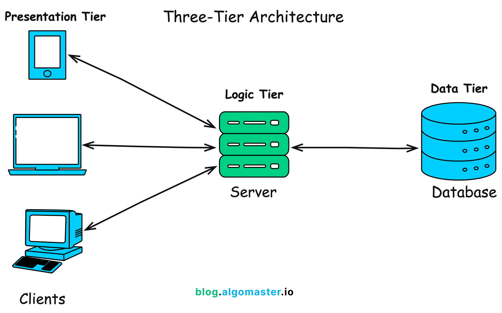
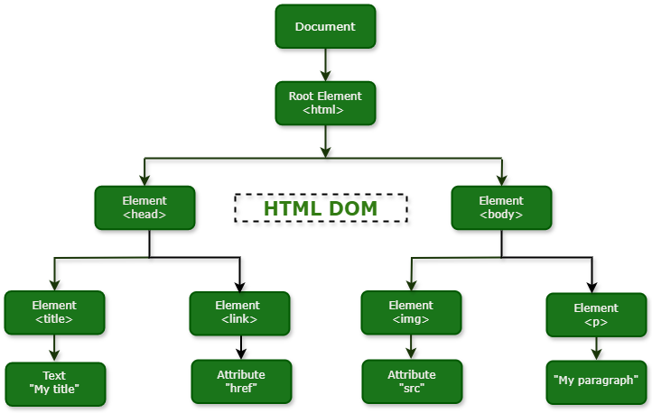

# Teilaufgabe Dalipovic Nino
\textauthor{Nino Dalipovic}

## Theorieteil – Frontend

### Technischer Kontext und Zielsetzung des Frontend-Teils

Diese Arbeit befasst sich mit der Konzeption und Umsetzung einer webbasierten Benutzeroberfläche im Kontext einer sportbezogenen Trainingsanwendung. Der Fokus liegt dabei ausschließlich auf der clientseitigen Anwendung, die im Webbrowser ausgeführt wird und als Interaktionsschnittstelle zwischen Benutzer und serverseitiger Systemlogik fungiert.

Moderne Webanwendungen bestehen typischerweise aus mehreren logisch getrennten Komponenten. Während die serverseitige Schicht für Datenverarbeitung, Persistenz und Geschäftslogik zuständig ist, übernimmt das Frontend die Präsentation von Informationen, die Verarbeitung von Benutzereingaben sowie die Kommunikation mit definierten Programmierschnittstellen (APIs). Das Frontend stellt somit die sichtbare und interaktive Ebene eines verteilten Systems dar [@tanenbaum2007].

Im vorliegenden Projekt dient das Frontend als zentrale Interaktionsschicht zwischen Benutzer und Backend-System. Es ermöglicht die strukturierte Darstellung von Trainingsdaten, die Eingabe und Verarbeitung benutzerspezifischer Informationen sowie die visuelle Aufbereitung von Analyseergebnissen. Die Kommunikation mit dem Backend erfolgt über standardisierte HTTP-basierte Schnittstellen, wobei strukturierte Datenformate zum Einsatz kommen [@rfc9110].

Die clientseitige Anwendung verarbeitet empfangene Daten, verwaltet Zustände innerhalb des Browsers und aktualisiert die Benutzeroberfläche dynamisch. Dadurch wird eine interaktive Nutzererfahrung ermöglicht, bei der Inhalte ohne vollständiges Neuladen der Seite angepasst werden können.

Um die Architektur, Funktionsweise und Bewertung dieser Frontend-Implementierung nachvollziehen zu können, ist ein fundiertes Verständnis der zugrunde liegenden Webtechnologien erforderlich. Dazu gehören insbesondere:

- das Client-Server-Modell und das HTTP-Kommunikationsprinzip
- die Strukturierungsmechanismen von HTML
- die Gestaltungsmöglichkeiten durch CSS
- die dynamische Interaktionslogik mittels JavaScript
- architektonische Konzepte moderner Frontend-Anwendungen
- sowie sicherheits- und qualitätsrelevante Anforderungen an Websysteme

Der folgende Theorieteil schafft die technische und architektonische Grundlage, um die spätere praktische Umsetzung des Frontends einordnen und bewerten zu können. Dabei werden keine konkreten Implementierungsdetails vorweggenommen. Vielmehr werden die verwendeten Technologien und Architekturprinzipien allgemein erläutert, um ein systematisches Verständnis moderner Frontend-Entwicklung zu vermitteln.

Durch diese strukturierte theoretische Fundierung wird gewährleistet, dass die praktische Umsetzung nicht isoliert betrachtet wird, sondern im Kontext etablierter Konzepte und Standards der Webarchitektur analysiert werden kann.

\newpage

## Grundlagen von Webanwendungen

### Das Client-Server-Modell und das HTTP-Protokoll

Webanwendungen basieren grundlegend auf dem Client-Server-Architekturmodell. Dieses beschreibt ein verteiltes System, bei dem Aufgaben zwischen mindestens zwei logisch getrennten Komponenten aufgeteilt sind: einem Client und einem Server [@tanenbaum2007].

Der Client ist für die Interaktion mit dem Benutzer verantwortlich. Im Webkontext übernimmt in der Regel der Webbrowser diese Rolle. Der Server stellt Dienste bereit, verarbeitet Anfragen, führt Geschäftslogik aus und speichert Daten dauerhaft. Zwischen beiden Komponenten besteht eine Netzwerkverbindung, über die strukturierte Nachrichten ausgetauscht werden.

Die Kommunikation im World Wide Web erfolgt standardisiert über das Hypertext Transfer Protocol (HTTP). HTTP ist ein zustandsloses, textbasiertes Protokoll, das nach dem Request-Response-Prinzip funktioniert [@rfc9110]. Der Client sendet eine Anfrage (Request), die folgende Bestandteile enthalten kann:

- eine HTTP-Methode (z. B. GET, POST, PUT, DELETE)
- eine Zieladresse (URI)
- Header-Informationen
- optional einen Nachrichtenkörper (Body)

Der Server verarbeitet diese Anfrage und sendet eine strukturierte Antwort (Response), die einen Statuscode, Header-Felder sowie gegebenenfalls einen Nachrichtenkörper enthält.

Ein zentrales Merkmal von HTTP ist seine Zustandslosigkeit (Statelessness). Jede Anfrage wird unabhängig von vorherigen Interaktionen behandelt. Der Server speichert keinen impliziten Sitzungszustand zwischen einzelnen Requests [@rfc7231]. Diese Eigenschaft erhöht die Skalierbarkeit von Websystemen, da Anfragen parallel und unabhängig verarbeitet werden können.

Gleichzeitig entsteht dadurch die Notwendigkeit zusätzlicher Mechanismen zur Verwaltung von Benutzersitzungen, etwa durch Cookies oder tokenbasierte Authentifizierungsverfahren.

Die klare Trennung von Client- und Serververantwortlichkeiten bildet die architektonische Grundlage moderner Webanwendungen und ermöglicht eine modulare Weiterentwicklung beider Systemseiten.

{ width=75% }

Abbildung: Vereinfachte Darstellung einer Webanwendung mit Präsentationsschicht (Client), Logikschicht (Server) und Datenhaltung (Datenbank).

### Strukturierung von Inhalten mit HTML

Die HyperText Markup Language (HTML) ist die standardisierte Auszeichnungssprache zur Strukturierung von Webdokumenten [@fielding2000]. Sie definiert die logische Gliederung von Inhalten und beschreibt, wie Informationen semantisch ausgezeichnet werden.

Ein HTML-Dokument besteht aus einer hierarchischen Baumstruktur von Elementen. Diese Struktur wird im Browser als sogenanntes Document Object Model (DOM) repräsentiert [@fowler2002]. Das DOM bildet das Dokument als Baum aus Knoten ab, wobei jedes HTML-Element einem Objekt im Speicher entspricht.

{ width=70% }

Abbildung: Baumstruktur des Document Object Models (DOM) als interne Repräsentation eines HTML-Dokuments im Browser.

Die semantische Strukturierung durch HTML-Elemente wie:

- Überschriften
- Absätze
- Listen
- Formulare
- Tabellen

ermöglicht nicht nur eine visuelle Darstellung, sondern auch eine maschinelle Interpretierbarkeit. Dies ist insbesondere für Barrierefreiheit, Suchmaschinenoptimierung und Interoperabilität zwischen Systemen von Bedeutung.

HTML selbst enthält keine Informationen über Layout oder visuelles Design. Es beschreibt ausschließlich die Struktur und Bedeutung der Inhalte. Diese bewusste Trennung von Struktur und Darstellung ist ein zentrales Prinzip moderner Webarchitektur.

### Gestaltung und Layout mit CSS

Cascading Style Sheets (CSS) dienen der visuellen Gestaltung von HTML-Dokumenten. Während HTML die Struktur definiert, legt CSS fest, wie diese Struktur dargestellt wird.

Grundlage der CSS-Darstellung ist das sogenannte Box-Modell [@w3c-box-2018]. Jedes HTML-Element wird als rechteckige Box interpretiert, bestehend aus:

- Content (Inhaltsbereich)
- Padding (Innenabstand)
- Border (Rahmen)
- Margin (Außenabstand)

Dieses Modell bildet die Grundlage für Layout-Berechnungen und Abstandsdefinitionen.

Moderne Layout-Techniken wie Flexbox und CSS Grid erweitern das klassische Box-Modell erheblich [@w3c-flexbox-2017]. Flexbox ermöglicht eine flexible, eindimensionale Anordnung von Elementen entlang einer Hauptachse. CSS Grid hingegen erlaubt eine zweidimensionale Rasterstruktur, die komplexe Layouts mit klar definierten Zeilen- und Spaltenstrukturen ermöglicht.

Diese Mechanismen sind essenziell für responsive Webdesign-Konzepte, bei denen sich die Benutzeroberfläche an unterschiedliche Bildschirmgrößen und Gerätetypen anpasst.

Die konsequente Trennung von Struktur (HTML) und Gestaltung (CSS) verbessert Wartbarkeit und Erweiterbarkeit, da Layout-Anpassungen unabhängig von der Dokumentenstruktur vorgenommen werden können.

### Dynamische Interaktion mit JavaScript

JavaScript ergänzt HTML und CSS um Interaktivität und dynamisches Verhalten. Es handelt sich um eine skriptbasierte Programmiersprache, die direkt im Browser ausgeführt wird.

JavaScript besitzt Zugriff auf das DOM und kann somit:

- Elemente erzeugen
- Inhalte verändern
- Attribute anpassen
- Ereignisse verarbeiten
- Elemente entfernen

Das Ausführungsmodell von JavaScript basiert auf einem ereignisgesteuerten Paradigma mit einer Event-Loop-Mechanik [@mdn-execution-model-2023]. Ereignisse wie Mausklicks, Tastatureingaben oder Netzwerkantworten werden in einer Warteschlange verarbeitet. Dadurch können asynchrone Operationen ausgeführt werden, ohne die Benutzeroberfläche zu blockieren.

Ein zentrales Konzept ist dabei die asynchrone Kommunikation mit Servern. Über HTTP-Anfragen können Daten abgerufen oder gesendet werden, ohne dass die gesamte Seite neu geladen werden muss. Diese Technik bildet die Grundlage moderner interaktiver Webanwendungen.

Die Kombination aus HTML (Struktur), CSS (Gestaltung) und JavaScript (Logik und Interaktion) bildet somit das fundamentale technologische Dreieck der Frontend-Entwicklung.

\newpage

## Moderne Frontend-Entwicklung

### Von statischen Webseiten zu dynamischen Anwendungen

Die Entwicklung von Webanwendungen hat sich im Laufe der Zeit grundlegend verändert. Während frühe Webseiten überwiegend aus statischen HTML-Dokumenten bestanden, die bei jeder Interaktion vollständig neu geladen wurden, verfolgen moderne Webanwendungen zunehmend dynamische, clientseitige Architekturen.

Im klassischen Multi-Page-Application-Modell (MPA) generiert der Server für jede Benutzerinteraktion ein vollständiges HTML-Dokument. Jede Navigation, Formularübermittlung oder Statusänderung führt zu einer neuen HTTP-Anfrage und einem vollständigen Rendering der Zielseite im Browser. Dieses Modell ist konzeptionell einfach und klar strukturiert, verursacht jedoch höhere Netzwerklast und führt zu sichtbaren Unterbrechungen im Nutzungserlebnis.

Mit steigenden Anforderungen an Interaktivität, Benutzerfreundlichkeit und Reaktionsgeschwindigkeit verlagerte sich ein zunehmender Anteil der Logik vom Server in den Client. Anstatt komplette HTML-Seiten auszutauschen, werden heute häufig nur noch strukturierte Daten übertragen, während die Darstellung im Browser dynamisch aktualisiert wird.

Diese Entwicklung führte zu einer stärkeren Rolle des Frontends innerhalb der Gesamtarchitektur. Der Client fungiert nicht mehr ausschließlich als Anzeigemedium, sondern als eigenständige Laufzeitumgebung mit komplexer Zustandsverwaltung und Interaktionslogik.

### Single Page Applications (SPA)

Eine Single Page Application (SPA) ist eine Webanwendung, die innerhalb eines einzigen HTML-Dokuments betrieben wird. Im Gegensatz zu klassischen Multi-Page-Ansätzen wird bei Benutzerinteraktionen nicht die gesamte Seite neu geladen. Stattdessen wird der sichtbare Inhalt dynamisch im Browser aktualisiert.

SPAs verwenden asynchrone HTTP-Anfragen, um Daten vom Server abzurufen. Diese Daten werden anschließend in bestehende DOM-Strukturen eingebettet oder führen zu gezielten Benutzeroberflächen-Updates. Die wahrgenommene Performance verbessert sich, da vollständige Seitenneuladungen entfallen.

Typische Merkmale einer SPA sind:

- ein initial geladenes HTML-Grundgerüst
- clientseitige Zustandsverwaltung
- dynamische DOM-Manipulation
- asynchrone Datenkommunikation mit dem Backend

Architektonisch verschiebt sich ein Teil der Anwendungslogik in den Client. Der Server stellt primär Daten und Schnittstellen bereit, während Präsentations- und Interaktionslogik im Browser ausgeführt werden.

Gleichzeitig entstehen neue Herausforderungen. Dazu gehören:

- erhöhte Komplexität der Zustandsverwaltung
- strukturierte Organisation von UI-Komponenten
- effizientes Rendering bei häufigen Zustandsänderungen
- erhöhte Verantwortung für Sicherheitsmechanismen auf Client-Seite

Trotz dieser Herausforderungen haben sich SPAs als dominierendes Architekturmodell für interaktive Webanwendungen etabliert.

### Utility-First CSS und moderne Styling-Paradigmen

Mit wachsender Komplexität von Benutzeroberflächen entwickelten sich unterschiedliche Strategien zur Organisation von CSS. Klassische Ansätze verwenden häufig semantische Klassennamen, die größere Stildefinitionen kapseln. Mit zunehmender Projektgröße können dabei umfangreiche und schwer wartbare Stylesheets entstehen.

Utility-First CSS verfolgt einen anderen Ansatz. Statt semantische Klassen mit umfangreichen Stildefinitionen zu erstellen, werden atomare Klassen verwendet, die jeweils eine einzelne CSS-Eigenschaft repräsentieren. Layout-, Farb- oder Abstandsentscheidungen werden durch die Kombination dieser kleinen Klassen direkt im Markup umgesetzt.

Vorteile dieses Ansatzes sind:

- Reduktion redundanter CSS-Regeln
- höhere Konsistenz im Design
- geringere Notwendigkeit individueller Stildefinitionen
- vereinfachte Wartbarkeit durch standardisierte Stilbausteine

Demgegenüber kann die starke Nutzung von Utility-Klassen die Lesbarkeit des Markups beeinträchtigen, da viele Klassenkombinationen direkt im HTML sichtbar sind.

Die Wahl eines Styling-Paradigmas beeinflusst somit unmittelbar Wartbarkeit, Skalierbarkeit und Teamarbeit innerhalb eines Frontend-Projekts.

### CDN-basierte Einbindung versus Build-Prozesse

Frontend-Abhängigkeiten können entweder direkt über Content Delivery Networks (CDNs) eingebunden oder über lokale Build-Prozesse verwaltet werden.

Bei einer CDN-basierten Integration werden Bibliotheken und Frameworks über externe Server geladen. Dies reduziert die lokale Projektkomplexität und ermöglicht einen schnellen Einstieg ohne umfangreiche Toolchain.

Vorteile einer CDN-basierten Integration:

- kein komplexer Build-Schritt erforderlich
- einfache Projektstruktur
- schnelle Entwicklungsumgebung
- potenziell optimiertes Caching durch globale Netzwerke

Demgegenüber bieten Build-Prozesse zusätzliche Möglichkeiten zur Optimierung:

- Code-Minimierung
- Modul-Bundling
- Dead-Code-Elimination
- strukturierte Abhängigkeitsverwaltung
- Produktionsoptimierung von Assets

Während CDN-basierte Ansätze insbesondere für kleinere Projekte oder Prototypen geeignet sind, gewinnen Build-Prozesse mit steigender Projektgröße und wachsender Komplexität an Bedeutung.

### Browser-APIs und clientseitige Erweiterungsmechanismen

Moderne Webbrowser stellen eine Vielzahl zusätzlicher Programmierschnittstellen (APIs) bereit, die über die klassische DOM-Manipulation hinausgehen. Diese APIs erweitern die Funktionalität des Clients erheblich.

Zu den wichtigsten Kategorien zählen:

- Web Storage APIs zur persistenten Datenspeicherung im Browser
- File- und Media-APIs zur Verarbeitung lokaler Dateien
- Drag-and-Drop-Schnittstellen
- Multimedia- und Audio-APIs
- Sprach- und Interaktionsschnittstellen

Diese Mechanismen ermöglichen die Umsetzung komplexer Anwendungen direkt im Browser, ohne dass zusätzliche Plugins oder native Software erforderlich sind.

Mit der steigenden Funktionalität des Clients wächst jedoch auch die Verantwortung hinsichtlich Sicherheitskonzepten, Datenschutz und kontrollierter Zustandsverwaltung. Die Architektur moderner Frontend-Anwendungen muss diese Aspekte systematisch berücksichtigen.

\newpage

## Client-Server-Architektur und REST-basierte Kommunikation

### Verteilte Systeme und Mehrschichtarchitektur

Webanwendungen sind als verteilte Systeme konzipiert. Ein verteiltes System besteht aus mehreren unabhängigen Komponenten, die über ein Netzwerk miteinander kommunizieren und gemeinsam eine funktionale Einheit bilden [@tanenbaum2007]. Diese Komponenten sind logisch voneinander getrennt und übernehmen jeweils klar definierte Aufgaben.

In webbasierten Anwendungen wird häufig eine Mehrschichtarchitektur eingesetzt. Diese gliedert das System typischerweise in:

- Präsentationsschicht (Client)
- Anwendungsschicht (Business Logic)
- Persistenzschicht (Datenhaltung)

Die Präsentationsschicht ist für die Benutzerinteraktion verantwortlich. Sie stellt Informationen dar, verarbeitet Eingaben und kommuniziert mit der Anwendungsschicht. Die Anwendungsschicht enthält Geschäftslogik, Validierungsmechanismen und Koordinationsprozesse für Datenzugriffe. Die Persistenzschicht speichert strukturierte Daten dauerhaft in Datenbanksystemen oder vergleichbaren Speichermedien.

Dieses Architekturmodell folgt dem Prinzip der Separation of Concerns. Jede Schicht übernimmt eine klar definierte Verantwortung. Dadurch erhöhen sich Wartbarkeit, Erweiterbarkeit und Testbarkeit des Systems.

Die Trennung der Verantwortlichkeiten ist insbesondere bei größeren Anwendungen entscheidend, da sie parallele Weiterentwicklung sowie unabhängige Skalierung einzelner Systemkomponenten ermöglicht.

### REST als Architekturstil

Representational State Transfer (REST) ist ein Architekturstil für verteilte hypermediale Systeme, der von Roy T. Fielding definiert wurde [@fielding2000]. REST beschreibt keine konkrete Implementierung, sondern eine Menge architektonischer Constraints, die ein System erfüllen muss.

Zu den zentralen REST-Constraints zählen:

- Client-Server-Trennung
- Zustandslosigkeit (Statelessness)
- Cachebarkeit
- Einheitliche Schnittstelle (Uniform Interface)
- Schichtenarchitektur (Layered System)

Die Einhaltung dieser Constraints führt zu Systemen mit hoher Skalierbarkeit, Modifizierbarkeit und Transparenz [@fielding2000].

Besonders relevant ist die Zustandslosigkeit. Jede Anfrage enthält alle notwendigen Informationen zur Verarbeitung. Der Server speichert keinen impliziten Sitzungszustand zwischen einzelnen Requests. Dadurch wird horizontale Skalierung erleichtert, da Anfragen unabhängig voneinander verarbeitet werden können.

Die einheitliche Schnittstelle sorgt dafür, dass Interaktionen standardisiert über HTTP-Methoden und klar definierte Ressourcen erfolgen. Dies erhöht die Interoperabilität zwischen Systemen.

### Ressourcenorientierung und HTTP-Semantik

Im REST-Architekturstil werden Funktionalitäten als Ressourcen modelliert. Jede Ressource besitzt eine eindeutige Adresse (URI) und kann über standardisierte HTTP-Methoden manipuliert werden.

Die HTTP-Spezifikation definiert die Semantik der einzelnen Methoden [@rfc9110]:

- **GET** dient dem Abrufen von Ressourcen und gilt als sicher sowie idempotent.
- **POST** wird zur Erstellung neuer Ressourcen oder zur Ausführung nicht-idempotenter Operationen verwendet.
- **PUT** ersetzt eine bestehende Ressource vollständig und ist idempotent.
- **DELETE** entfernt eine Ressource und ist ebenfalls idempotent.

Idempotenz bedeutet, dass die wiederholte Ausführung derselben Anfrage zum gleichen Ergebnis führt wie eine einmalige Ausführung. Diese Eigenschaft ist für Fehlertoleranz und Wiederholungsmechanismen von großer Bedeutung.

HTTP unterscheidet Statuscodes in verschiedene Klassen:

- 2xx – erfolgreiche Verarbeitung
- 3xx – Weiterleitungen
- 4xx – Client-Fehler
- 5xx – Server-Fehler

Diese standardisierte Statuskommunikation ermöglicht eine strukturierte Fehlerbehandlung auf Client-Seite.

Die korrekte Nutzung von HTTP-Semantik ist wesentlich für Vorhersagbarkeit, Caching-Strategien und Interoperabilität verteilter Systeme.

### Data Transfer Objects und API-Verträge

In mehrschichtigen Architekturen werden interne Domänenmodelle häufig nicht direkt an externe Clients übertragen. Stattdessen werden spezielle Übertragungsstrukturen verwendet, sogenannte Data Transfer Objects (DTOs) [@fowler2002].

DTOs erfüllen mehrere Funktionen:

- Bündelung relevanter Daten für Netzwerkübertragungen
- Reduktion unnötiger Attribute
- Schutz interner Geschäftslogik
- klare Definition externer Schnittstellen

Ein API-Vertrag beschreibt die erwarteten Eingabe- und Ausgabeformate einer Schnittstelle. Er definiert:

- Datenstruktur
- Datentypen
- Pflicht- und optionale Felder
- mögliche Antwortformate
- Fehlerstrukturen

Ein konsistenter API-Vertrag ist entscheidend für Wartbarkeit und Stabilität. Änderungen an Schnittstellen ohne Versionierung oder Dokumentation können zu Integrationsproblemen führen.

Die Gestaltung von API-Verträgen ist somit eine zentrale architektonische Entscheidung und beeinflusst die langfristige Erweiterbarkeit eines Systems.

### Fehlerbehandlung und Robustheit in Web-APIs

Robustheit ist eine zentrale Eigenschaft verteilter Systeme. Fehler können auf unterschiedlichen Ebenen auftreten, beispielsweise durch:

- ungültige Eingaben
- fehlende Ressourcen
- Netzwerkprobleme
- serverseitige Ausfälle

REST-basierte Systeme kommunizieren Fehler primär über HTTP-Statuscodes. Ergänzend werden häufig strukturierte Fehlerobjekte im Nachrichtenkörper übertragen, um maschinenlesbare Fehlermeldungen bereitzustellen.

Eine konsistente Fehlerstruktur ermöglicht:

- automatisierte Reaktionen im Client
- präzise Benutzerfeedback-Mechanismen
- vereinfachtes Debugging
- höhere Integrationsstabilität

Uneinheitliche oder unstrukturierte Fehlermeldungen erhöhen hingegen die Komplexität auf Client-Seite und erschweren Wartung sowie Weiterentwicklung.

Fehlermanagement ist daher kein Nebenaspekt, sondern ein integraler Bestandteil der API-Architektur.

\newpage

## Architekturprinzipien im Frontend

### Monolithische Frontend-Architekturen

In kleineren oder frühen Webanwendungen wird die gesamte clientseitige Logik häufig innerhalb einer zentralen Struktur organisiert. Eine solche Architektur wird als monolithisches Frontend bezeichnet. Charakteristisch ist, dass Präsentationslogik, Zustandsverwaltung, Ereignisbehandlung und Netzwerkkommunikation innerhalb weniger oder sogar einer einzigen zentralen Codebasis gebündelt sind.

Der Vorteil eines monolithischen Ansatzes liegt in seiner Einfachheit. Die Einstiegshürde ist gering, da keine komplexe Projektstruktur oder zusätzliche Abstraktionsebenen erforderlich sind. Für kleinere Anwendungen oder Prototypen kann diese Struktur effizient und ausreichend sein.

Mit steigender Anwendungsgröße entstehen jedoch strukturelle Herausforderungen. Dazu gehören:

- zunehmende Kopplung zwischen Logik und Darstellung
- erschwerte Wartbarkeit bei Funktionserweiterungen
- steigende Komplexität bei paralleler Weiterentwicklung
- geringere Testbarkeit einzelner Funktionseinheiten

Monolithische Frontend-Architekturen können somit kurzfristig effizient sein, stoßen jedoch bei wachsender Funktionsvielfalt und steigender Projektkomplexität an ihre Grenzen.

### Komponentenbasierte Architekturen

Als Reaktion auf die Skalierungsprobleme monolithischer Ansätze etablierten sich komponentenbasierte Architekturen. In diesem Modell wird die Benutzeroberfläche in eigenständige, wiederverwendbare Bausteine unterteilt. Jede Komponente kapselt Struktur, Darstellung und häufig auch einen Teil der Logik.

Die Vorteile dieses Ansatzes sind:

- klare Verantwortlichkeitsverteilung
- Wiederverwendbarkeit von UI-Elementen
- verbesserte Wartbarkeit
- bessere Skalierbarkeit bei wachsender Funktionalität

Komponenten können isoliert entwickelt, getestet und bei Bedarf ersetzt werden. Dadurch reduziert sich die Gefahr unbeabsichtigter Seiteneffekte bei Änderungen.

Allerdings erfordert eine komponentenbasierte Architektur eine klare Strategie zur Verwaltung von Zuständen und zur Kommunikation zwischen Komponenten. Ohne definierte Konventionen kann auch hier Komplexität entstehen.

### Separation of Concerns im Frontend

Das Prinzip der Separation of Concerns beschreibt die klare Trennung unterschiedlicher Verantwortlichkeiten innerhalb eines Systems. Im Frontend-Kontext betrifft dies insbesondere:

- Struktur (HTML)
- Gestaltung (CSS)
- Interaktionslogik (JavaScript)
- Netzwerkkommunikation
- Zustandsverwaltung

Eine saubere Trennung dieser Bereiche reduziert implizite Abhängigkeiten und erleichtert langfristige Wartbarkeit. Werden beispielsweise Netzwerklogik und UI-Darstellung stark vermischt, erhöht sich der Änderungsaufwand bei Anpassungen erheblich.

Architektonisch betrachtet ist die konsequente Umsetzung dieses Prinzips entscheidend für Skalierbarkeit und Teamarbeit. Je klarer Verantwortlichkeiten abgegrenzt sind, desto leichter lassen sich einzelne Teile unabhängig weiterentwickeln.

### Zustandsverwaltung in Webanwendungen

Der Zustand (State) einer Anwendung beschreibt alle Informationen, die den aktuellen Kontext der Benutzerinteraktion definieren. Dazu gehören unter anderem:

- Benutzereingaben
- geladene Daten
- Sichtbarkeitszustände von UI-Elementen
- temporäre Zwischenergebnisse

In einfachen Anwendungen wird der Zustand häufig direkt im DOM oder in globalen Variablen gespeichert. Mit wachsender Komplexität können jedoch Inkonsistenzen entstehen, wenn mehrere Teile der Anwendung denselben Zustand verändern.

Architektonische Konzepte zur Zustandsverwaltung umfassen:

- lokale Zustände innerhalb einzelner Komponenten
- zentrale Zustandscontainer
- unidirektionalen Datenfluss

Ein unidirektionales Datenflussmodell erhöht Transparenz und Nachvollziehbarkeit von Zustandsänderungen. Änderungen erfolgen kontrolliert über definierte Mechanismen, wodurch unbeabsichtigte Seiteneffekte reduziert werden.

Die Wahl einer Zustandsstrategie beeinflusst maßgeblich Wartbarkeit, Testbarkeit und Erweiterbarkeit einer Frontend-Anwendung.

### Rendering-Strategien: Imperativ versus Deklarativ

Rendering beschreibt den Prozess, bei dem Daten in visuelle Elemente übersetzt werden. In klassischen, imperativen Ansätzen wird das DOM direkt manipuliert. Entwickler definieren explizit, welche Elemente erstellt, verändert oder entfernt werden.

Deklarative oder reaktive Ansätze hingegen beschreiben, wie die Benutzeroberfläche in Abhängigkeit vom aktuellen Zustand aussehen soll. Das Rendering-System berechnet selbstständig die notwendigen Änderungen und aktualisiert das DOM entsprechend.

Imperative Modelle bieten direkte Kontrolle, erfordern jedoch sorgfältige Verwaltung von Zustandsänderungen. Deklarative Modelle abstrahieren diese Komplexität, bringen jedoch zusätzliche Architektur- und Frameworkabhängigkeiten mit sich.

Die Wahl einer Rendering-Strategie ist somit eine grundlegende Architekturentscheidung, die Auswirkungen auf Performance, Wartbarkeit und Entwicklungsaufwand hat.

\newpage

## Nichtfunktionale Anforderungen und Sicherheitsaspekte

Neben funktionalen Anforderungen – also den konkret umgesetzten Fähigkeiten einer Anwendung – spielen nichtfunktionale Anforderungen eine zentrale Rolle in der Architektur moderner Softwaresysteme. Nichtfunktionale Anforderungen beschreiben Qualitätsmerkmale, die das Verhalten und die Eigenschaften eines Systems betreffen [@bass2012].

Im Kontext von Webanwendungen sind insbesondere Wartbarkeit, Erweiterbarkeit, Skalierbarkeit, Performance und Sicherheit von Bedeutung.

### Wartbarkeit

Wartbarkeit beschreibt die Fähigkeit eines Systems, effizient angepasst, erweitert oder korrigiert werden zu können. Eine hohe Wartbarkeit reduziert langfristige Entwicklungskosten und erleichtert die Weiterentwicklung über den ursprünglichen Projektumfang hinaus.

Im Frontend-Kontext hängt Wartbarkeit maßgeblich von folgenden Faktoren ab:

- klare Strukturierung der Codebasis
- konsistente Trennung von Verantwortlichkeiten
- verständliche Zustandsverwaltung
- dokumentierte Schnittstellen
- modularer Aufbau

Eine stark gekoppelte Architektur erschwert Änderungen erheblich. Werden beispielsweise Präsentationslogik und Netzwerkkommunikation eng miteinander vermischt, führt jede Anpassung potenziell zu unerwarteten Nebeneffekten.

Architektonische Prinzipien wie Modularisierung und Separation of Concerns erhöhen die Wartbarkeit signifikant. Durch klar definierte Verantwortlichkeiten können einzelne Komponenten isoliert analysiert und angepasst werden.

### Erweiterbarkeit

Erweiterbarkeit beschreibt die Fähigkeit eines Systems, neue Funktionen zu integrieren, ohne bestehende Komponenten grundlegend verändern zu müssen.

Webanwendungen unterliegen häufig evolutiven Anforderungen. Neue Features, zusätzliche Datenmodelle oder veränderte Benutzerinteraktionen sind typische Weiterentwicklungen.

Eine erweiterbare Architektur zeichnet sich aus durch:

- lose Kopplung zwischen Modulen
- klar definierte Schnittstellen
- konsistente API-Verträge
- strukturierte Zustandsverwaltung

Fehlt diese strukturelle Vorbereitung, steigt mit jeder Erweiterung die Komplexität des Systems. Änderungen werden zunehmend riskanter und fehleranfälliger.

Erweiterbarkeit ist daher nicht nur eine Implementierungsfrage, sondern eine architektonische Grundentscheidung.

### Skalierbarkeit

Skalierbarkeit kann sowohl technisch als auch organisatorisch verstanden werden.

Technische Skalierbarkeit beschreibt die Fähigkeit eines Systems, mit steigender Benutzerzahl oder wachsendem Datenvolumen umzugehen. Im Frontend betrifft dies unter anderem:

- effiziente Rendering-Strategien
- reduzierte DOM-Manipulation
- optimierte Netzwerkanfragen
- Caching-Mechanismen

Organisatorische Skalierbarkeit hingegen beschreibt die Fähigkeit eines Projekts, parallele Entwicklung durch mehrere Entwickler zu ermöglichen. Hier spielen klare Architekturprinzipien und modulare Strukturen eine zentrale Rolle.

Ein schlecht strukturiertes Frontend kann bei wachsender Teamgröße schnell zu Integrationsproblemen führen. Eine klare Komponentenstruktur erleichtert hingegen parallele Entwicklung.

### Performance

Performance beschreibt die Effizienz, mit der eine Anwendung auf Benutzerinteraktionen reagiert. Wahrgenommene Performance beeinflusst unmittelbar die Benutzerzufriedenheit.

Im Frontend-Kontext umfasst Performance insbesondere:

- Initiale Ladezeit
- Rendering-Geschwindigkeit
- Reaktionszeit auf Interaktionen
- Effizienz von Netzwerkkommunikation
- Speicherverbrauch im Browser

Strategien zur Performance-Optimierung umfassen:

- Minimierung unnötiger DOM-Manipulationen
- effiziente Nutzung asynchroner HTTP-Anfragen
- Caching statischer Ressourcen
- Reduktion externer Abhängigkeiten
- strukturierte Zustandsverwaltung zur Vermeidung redundanter Updates

Die Wahl der Architektur beeinflusst Performance erheblich. Komplexe Rendering-Mechanismen oder ineffiziente Zustandsänderungen können zu spürbaren Verzögerungen führen.

### Sicherheit in Webanwendungen

Sicherheit ist eine zentrale nichtfunktionale Anforderung moderner Websysteme. Webanwendungen sind öffentlich zugänglich und potenziellen Angriffen ausgesetzt.

#### Passwortspeicherung und Hashing

Passwörter dürfen niemals im Klartext gespeichert werden. Stattdessen werden kryptographische Hashfunktionen eingesetzt, um das Passwort in eine nicht rückrechenbare Form zu überführen.

Empfohlene Verfahren umfassen adaptive, speicherintensive Algorithmen wie bcrypt, scrypt oder Argon2 [@owasp-password-storage]. Diese Algorithmen erhöhen den Rechenaufwand für Angreifer und erschweren Brute-Force-Angriffe erheblich.

Zusätzlich wird empfohlen, für jedes Passwort einen individuellen Salt-Wert zu verwenden. Dadurch werden sogenannte Rainbow-Table-Angriffe verhindert.

Die sichere Passwortverarbeitung ist ein fundamentaler Bestandteil jeder Webanwendung mit Benutzerverwaltung.

#### Token-basierte Authentifizierung

In zustandslosen Architekturen wird Authentifizierung häufig über Token realisiert. JSON Web Tokens (JWT) sind ein verbreiteter Standard für tokenbasierte Authentifizierungsmechanismen [@rfc7519].

Ein JWT enthält strukturierte Claims über die Identität eines Benutzers und wird kryptographisch signiert. Der Client sendet dieses Token bei jeder Anfrage mit, wodurch der Server die Identität überprüfen kann, ohne einen Sitzungszustand speichern zu müssen.

Vorteile tokenbasierter Authentifizierung:

- Unterstützung zustandsloser Architekturen
- horizontale Skalierbarkeit
- reduzierte serverseitige Sitzungsverwaltung

Gleichzeitig müssen Ablaufzeiten, Signaturvalidierung und sichere Speicherung im Client sorgfältig umgesetzt werden.

#### Same-Origin-Policy und CORS

Die Same-Origin-Policy ist ein grundlegender Sicherheitsmechanismus von Webbrowsern. Sie verhindert, dass Skripte einer Herkunft (Origin) unkontrolliert auf Ressourcen einer anderen Herkunft zugreifen [@whatwg-fetch].

Cross-Origin Resource Sharing (CORS) erweitert dieses Modell kontrolliert. Server können explizit festlegen, welche Ursprünge auf bestimmte Ressourcen zugreifen dürfen.

Fehlkonfigurationen von CORS können Sicherheitsrisiken darstellen. Zu weit gefasste Freigaben ermöglichen potenziell unautorisierten Zugriff auf sensible Daten.

#### Clientseitige Speicherung sensibler Daten

Moderne Browser bieten mit localStorage und sessionStorage persistente Speichermechanismen. Diese APIs sind komfortabel, bergen jedoch Sicherheitsrisiken.

Insbesondere bei Cross-Site-Scripting-Angriffen (XSS) können gespeicherte Tokens oder sensible Informationen ausgelesen werden [@owasp-password-storage].

Daher sollten sicherheitsrelevante Daten nur mit Vorsicht im Browser gespeichert werden. Alternative Konzepte wie HttpOnly-Cookies reduzieren das Risiko clientseitiger Token-Exfiltration.

### Datenschutz und Privacy by Design

Neben technischer Sicherheit gewinnt Datenschutz zunehmend an Bedeutung. Konzepte wie „Privacy by Design“ fordern, Datenschutz bereits auf Architekturebene zu berücksichtigen [@enisa-privacy].

Technische Prinzipien umfassen:

- Datenminimierung
- Zugriffsbeschränkungen
- transparente Datenflüsse
- definierte Speicher- und Löschstrategien

Webanwendungen, die personenbezogene Daten verarbeiten, müssen diese Prinzipien frühzeitig in Architekturentscheidungen integrieren, um rechtliche und ethische Anforderungen zu erfüllen.

\newpage
