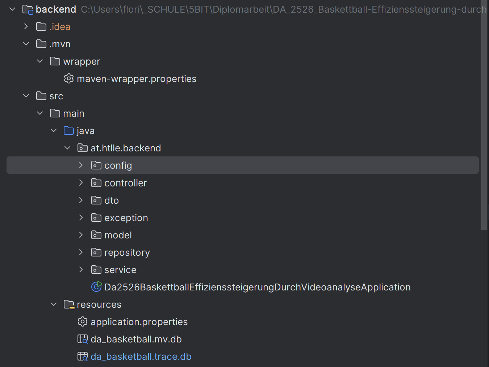
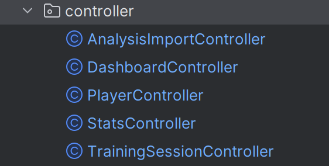
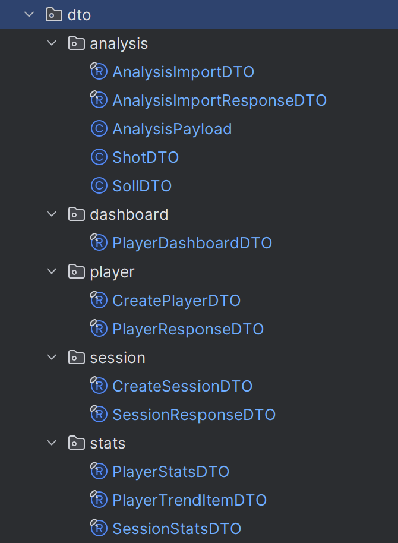
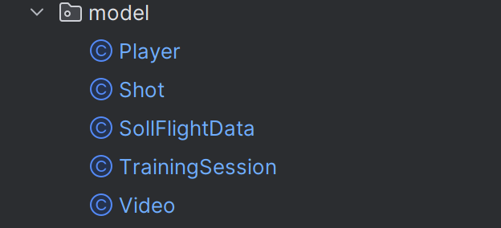
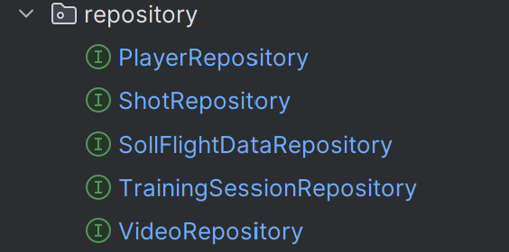
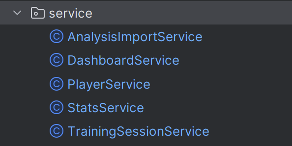

# Teilaufgabe Schüler Gutmann  
\textauthor{Gutmann Florian}

## Einführung in den Backend-Teil

Das Backend bildet die technische Grundlage für die Speicherung, Verarbeitung und Bereitstellung der im Projekt erhobenen Daten. Im Rahmen dieser Diplomarbeit entsteht ein System zur **Effizienzsteigerung von Basketballwürfen durch Videoanalyse**. Die Videoanalyse liefert dabei Messwerte und Parameter zu einzelnen Würfen (z. B. Abwurfpunkt, Korbposition, Geschwindigkeit, Winkel sowie Flugbahndaten). Damit diese Daten langfristig gespeichert, ausgewertet und für das Frontend nutzbar gemacht werden können, wird ein eigenständiges Backend entwickelt.

Die zentrale Aufgabe des Backends besteht darin, die Daten aus den Analyseprozessen **strukturiert zu persistieren** und über definierte Schnittstellen bereitzustellen. Zusätzlich übernimmt das Backend die Berechnung statistischer Kennzahlen, die Trainingsfortschritte messbar machen. Dadurch entsteht eine objektive Grundlage, um Würfe nicht nur einzeln zu betrachten, sondern auch über längere Zeiträume zu vergleichen und Entwicklungen sichtbar zu machen.

Technisch wird das Backend als Webservice umgesetzt, der über eine **REST-Schnittstelle** mit dem Frontend kommuniziert. Das Frontend kann dadurch Spieler*innen anlegen, Trainingseinheiten verwalten, Wurfdaten anzeigen und Statistik-Ergebnisse abrufen. Die Persistenz erfolgt in einer **relationalen Datenbank**, wobei in der Entwicklungsphase eine **H2-Datenbank** verwendet wird. Der Zugriff auf die Datenbank wird über **Object-Relational Mapping** realisiert, um Datenbanktabellen als Java-Objekte (Entities) abzubilden. Dafür werden **Java Persistence API (JPA)** sowie **Hibernate** als ORM-Framework eingesetzt.

Durch diese Architektur entsteht eine klare Aufgabenteilung: Die Videoanalyse erzeugt Messdaten, das Backend speichert und verarbeitet diese Daten und stellt sie dem Frontend in einer einheitlichen Form zur Verfügung. Diese Trennung erhöht die Wartbarkeit und Erweiterbarkeit des Gesamtsystems, da einzelne Komponenten unabhängig voneinander weiterentwickelt oder ausgetauscht werden können.

## Praktische Arbeit

### Beginn der Backend-Entwicklung und Anforderungsanalyse

Bevor mit der eigentlichen Implementierung des Backends begonnen wurde, fand eine gemeinsame Planungs- und Analysephase mit allen Teammitgliedern statt. Ziel dieser Phase war es, die Schnittstellen zwischen den einzelnen Projektteilen klar zu definieren und ein gemeinsames Verständnis über die benötigten Daten und Funktionen zu schaffen.

Im Rahmen dieser Abstimmung wurden insbesondere die Ergebnisse der Videoanalyse betrachtet. Dabei wurde festgelegt, welche Parameter aus der Analyse einzelner Würfe erzeugt werden und in welcher Form diese Daten dem Backend zur Verfügung gestellt werden. Zu diesen Daten zählen unter anderem Informationen zum Abwurfpunkt, zur Korbposition, zum Abwurfwinkel, zur Anfangsgeschwindigkeit des Balls sowie weitere Werte zur Beschreibung der Flugbahn. Diese Parameter bilden die Grundlage für alle weiteren Auswertungen und mussten daher frühzeitig eindeutig definiert werden.

Parallel dazu wurden die Anforderungen des Frontends analysiert. Das Frontend benötigt strukturierte und konsistente Daten, um Spieler*innen, Trainingseinheiten und statistische Auswertungen übersichtlich darstellen zu können. In gemeinsamen Besprechungen wurde daher festgelegt, welche Informationen vom Backend bereitgestellt werden müssen, beispielsweise Spielerstatistiken, Session-Zusammenfassungen oder zeitliche Leistungsentwicklungen. Diese Abstimmung stellte sicher, dass das Backend nicht isoliert entwickelt wird, sondern optimal auf die Bedürfnisse der Benutzeroberfläche abgestimmt ist.

Auf Basis dieser gemeinsamen Analyse wurden die Verantwortlichkeiten innerhalb des Backends festgelegt. Der Fokus lag dabei auf der Entwicklung einer Datenbankstruktur, der Definition geeigneter Datenmodelle sowie der Bereitstellung von Schnittstellen zur Kommunikation mit dem Frontend. Durch dieses strukturierte Vorgehen konnte eine solide Grundlage geschaffen werden, auf der die weitere Backend-Entwicklung systematisch aufbauen konnte.

#### Ergebnis der Planungsphase

Als Ergebnis der gemeinsamen Planungsphase konnten die grundlegenden Anforderungen an das Backend eindeutig festgelegt werden. Ziel war es, einen klaren Datenfluss zwischen Videoanalyse, Backend und Frontend zu definieren und Überschneidungen oder spätere Anpassungen möglichst zu vermeiden.

Ein zentrales Ergebnis des Meetings war die Festlegung der Daten, die aus der Videoanalyse an das Backend übergeben werden. Für jeden analysierten Basketballwurf werden strukturierte Datensätze erzeugt, welche sowohl geometrische als auch zeitliche Informationen enthalten. Dazu zählen unter anderem der Abwurfpunkt des Balls, die Position des Korbes, der Abwurfwinkel, die Anfangsgeschwindigkeit sowie zusätzliche Parameter zur Beschreibung der berechneten Soll- und der erkannten Ist-Flugbahn. Diese Daten werden automatisiert in Form von **JSON-Dateien** erzeugt und dienen als Eingabe für das Backend.

Ein weiterer wesentlicher Punkt war die Definition der Datenstruktur innerhalb des Backends. Es wurde festgelegt, dass die Daten in einer **relationalen Datenbank** gespeichert werden, um eine klare Strukturierung und langfristige Persistenz zu gewährleisten. Dabei wurden zentrale Entitäten identifiziert, darunter Spieler*innen, Trainingseinheiten, einzelne Würfe sowie zugehörige Analyse- und Flugdaten. Diese Entitäten stehen in klar definierten Beziehungen zueinander und bilden die Grundlage für das spätere Entity-Relationship-Modell.

Zusätzlich wurden die Anforderungen des Frontends konkretisiert. Das Frontend benötigt nicht nur Rohdaten einzelner Würfe, sondern vor allem aggregierte Informationen in Form von statistischen Auswertungen. Daher wurde beschlossen, dass die Berechnung dieser Statistiken vollständig im Backend erfolgt. Das Backend stellt dem Frontend ausschließlich bereits aufbereitete Ergebnisse zur Verfügung, beispielsweise Trefferquoten, Durchschnittswerte oder zeitliche Leistungsentwicklungen. Dadurch wird die Komplexität im Frontend reduziert und eine konsistente Auswertung sichergestellt.

Abschließend wurde festgelegt, dass das Backend über eine REST-Schnittstelle mit dem Frontend kommuniziert. Die Datenübertragung erfolgt im JSON-Format, wodurch eine plattformunabhängige und leicht erweiterbare Kommunikation ermöglicht wird. Diese Entscheidungen bilden die Grundlage für alle weiteren technischen Umsetzungen im Backend und stellen sicher, dass die einzelnen Projektteile nahtlos ineinandergreifen.

## Datenbank

### Relationale Datenbanken

Relationale Datenbanken speichern Informationen in tabellarischer Form. Jede Tabelle besteht aus Datensätzen (Zeilen) und Attributen (Spalten). Ein Datensatz beschreibt dabei ein konkretes Objekt, beispielsweise einen Spieler oder einen einzelnen Basketballwurf, während die Attribute die Eigenschaften dieses Objekts definieren.

Zur eindeutigen Identifikation eines Datensatzes wird ein **Primärschlüssel** verwendet. Beziehungen zwischen verschiedenen Tabellen werden mithilfe von **Fremdschlüsseln** realisiert. Dadurch können Daten logisch miteinander verknüpft werden, ohne Informationen mehrfach speichern zu müssen. Diese Struktur erhöht die Datenkonsistenz und erleichtert spätere statistische Auswertungen.

Aufgrund dieser Eigenschaften eignet sich das relationale Datenbankmodell besonders gut für das vorliegende Projekt, da die erfassten Daten aus der Videoanalyse langfristig gespeichert, miteinander verknüpft und ausgewertet werden müssen.

### Entity-Relationship-Modell

Zur Planung der Datenbankstruktur wird das **Entity-Relationship-Modell (ER-Modell)** verwendet. Es dient dazu, die zentralen Datenobjekte eines Systems sowie deren Beziehungen übersichtlich darzustellen und bildet die konzeptionelle Grundlage für die spätere Implementierung der Datenbank.

#### Zentrale Begriffe des ER-Modells

- **Entität**  
  Eine Entität beschreibt ein eindeutig identifizierbares Objekt aus dem Anwendungsbereich. Im Projekt sind dies beispielsweise Spieler*innen, Trainingseinheiten oder einzelne Würfe. Entitäten werden später als Tabellen in der Datenbank umgesetzt.

- **Attribut**  
  Attribute beschreiben die Eigenschaften einer Entität und entsprechen den Spalten einer Tabelle. Beispiele hierfür sind der Name eines Spielers, der Zeitpunkt einer Trainingseinheit oder der Abwurfwinkel eines Wurfes.

- **Beziehung**  
  Beziehungen stellen die Verknüpfungen zwischen Entitäten dar. Sie definieren, wie Objekte zueinander in Beziehung stehen, etwa dass eine Spielerin mehrere Trainingseinheiten absolvieren kann oder dass eine Trainingseinheit aus mehreren Würfen besteht.

#### ER-Diagramm des Projekts

Das ER-Diagramm stellt die im Projekt verwendete Datenbankstruktur grafisch dar und zeigt die zentralen Entitäten sowie deren Beziehungen untereinander. Es bildet den realen Trainingsablauf ab und dient als Grundlage für die Implementierung der Datenbank im Backend.

Im Zentrum des Modells steht die Entität **Spieler**, welche die grundlegenden Informationen zu den einzelnen Spieler*innen enthält. Eine Spielerin kann mehrere Trainingseinheiten absolvieren, wodurch eine **Eins-zu-viele-Beziehung** zwischen Spieler und Trainingseinheit entsteht. Jede Trainingseinheit wiederum besteht aus mehreren Würfen, die während des Trainings durchgeführt werden.

Jedem Wurf sind spezifische Analyse- und Flugdaten zugeordnet, welche aus der Videoanalyse stammen. Diese Daten beschreiben sowohl die erkannte Ist-Flugbahn als auch die berechnete Soll-Flugbahn des Basketballs. Durch diese Struktur ist es möglich, einzelne Würfe detailliert zu analysieren sowie statistische Auswertungen über mehrere Trainingseinheiten hinweg durchzuführen.

Das dargestellte ER-Diagramm bildet somit die fachliche Grundlage für die Datenhaltung im Backend und stellt sicher, dass alle relevanten Informationen konsistent und nachvollziehbar gespeichert werden können.

## Technologieentscheidungen

Zu Beginn der Backend-Entwicklung wurde eine ausführliche Recherche zu möglichen Technologien durchgeführt. Ziel war es, eine stabile, erweiterbare und für den Anwendungsfall der Videoanalyse geeignete technische Basis zu schaffen. Dabei wurden insbesondere Programmiersprachen, Datenbanksysteme sowie Frameworks für die Umsetzung eines webbasierten Backends verglichen.

Die Auswahl der eingesetzten Technologien erfolgte anhand mehrerer Kriterien, darunter Wartbarkeit, Performance, Erweiterbarkeit, Dokumentation sowie die Eignung für den Einsatz in einer Diplomarbeit mit langfristiger Perspektive und basierend auf Erfahrungen aus dem Unterricht.

### Entwicklungsumgebung (IntelliJ IDEA)

Für die Entwicklung des Backend-Systems wurde die integrierte Entwicklungsumgebung **IntelliJ IDEA** verwendet. Diese IDE wird auch im Unterricht regelmäßig eingesetzt und war daher den Projektmitgliedern bereits gut vertraut. IntelliJ IDEA bietet umfassende Unterstützung für Java- und Spring-Boot-Projekte, darunter automatische Codevervollständigung, integrierte Build- und Testwerkzeuge (Maven), Debugging sowie eine enge Integration mit Versionsverwaltungssystemen. Durch den Einsatz einer bekannten Entwicklungsumgebung konnte die Entwicklungszeit reduziert und der Fokus auf die fachliche Umsetzung des Backends gelegt werden.

### Programmiersprache (Java)

Als Programmiersprache für das Backend wurde **Java** ausgewählt. Ein wesentlicher Grund dafür ist, dass Java die Hauptprogrammiersprache im Unterricht darstellt und daher die meiste praktische Erfahrung in diesem Umfeld vorhanden ist. Java ist eine weit verbreitete, objektorientierte Programmiersprache, die besonders im Bereich serverseitiger Anwendungen und Unternehmenssoftware eingesetzt wird. Durch die starke Typisierung und die klare Struktur eignet sich Java gut für größere Projekte mit mehreren Modulen und klaren Verantwortlichkeiten.

Ein weiterer Vorteil von Java ist die große Anzahl an verfügbaren Bibliotheken sowie die ausgezeichnete Integration mit etablierten Frameworks. Zudem bietet Java eine hohe Plattformunabhängigkeit, da Programme auf verschiedenen Betriebssystemen ausgeführt werden können, sofern eine Java Virtual Machine vorhanden ist.

### Datenbanksysteme

Für die Speicherung und Verwaltung der anfallenden Daten wurde ein relationales Datenbanksystem eingesetzt. Die Wahl fiel bewusst auf zwei unterschiedliche Datenbanksysteme, die in verschiedenen Phasen des Projekts verwendet werden: **H2** für die lokale Entwicklungsphase und **MySQL** für den späteren produktiven Einsatz.

Diese Vorgehensweise ermöglicht eine effiziente Entwicklung, ohne auf eine realistische Zielumgebung verzichten zu müssen.

#### H2-Datenbank (lokale Entwicklungsphase)

In der frühen Entwicklungsphase wurde die **H2-Datenbank** eingesetzt. H2 ist eine leichtgewichtige, in Java geschriebene relationale Datenbank, die besonders für Entwicklungs- und Testzwecke geeignet ist.

**Vorteile:**
- Keine separate Installation eines Datenbankservers notwendig  
- Sehr schneller Start und geringe Systemanforderungen  
- Gute Integration in Spring Boot  
- Ideal für lokale Entwicklung und automatisierte Tests  
- Datenbank kann direkt im Projekt eingebettet betrieben werden  

**Nachteile:**
- Nicht für produktive Umgebungen mit vielen Nutzern ausgelegt  
- Unterschiede im SQL-Dialekt im Vergleich zu produktiven Datenbanken  
- Begrenzte Performance und Skalierbarkeit  
- Nicht repräsentativ für reale Serverumgebungen  

**Begründung der Auswahl:**  
Die H2-Datenbank wurde bewusst gewählt, um in der Entwicklungsphase schnell arbeiten zu können, ohne zusätzlichen Konfigurationsaufwand. Änderungen an der Datenbankstruktur konnten dadurch effizient getestet und angepasst werden.

#### MySQL (produktive Zielumgebung)

Für den späteren Einsatz des Systems wurde **MySQL** als produktives Datenbanksystem vorgesehen. MySQL ist ein weit verbreitetes relationales Datenbanksystem, das häufig in webbasierten Anwendungen eingesetzt wird.

**Vorteile:**
- Hohe Stabilität und Zuverlässigkeit  
- Gute Performance auch bei größeren Datenmengen  
- Mehrbenutzerfähig und für Serverbetrieb ausgelegt  
- Weit verbreitet und gut dokumentiert  
- Geeignet für produktive und reale Anwendungsszenarien  

**Nachteile:**
- Erfordert Installation und Konfiguration eines Datenbankservers  
- Höherer administrativer Aufwand im Vergleich zu H2  
- Für lokale Entwicklung teilweise langsamer im Setup  

**Begründung der Auswahl:**  
MySQL wurde gewählt, da es sich für den produktiven Einsatz in einer realen Anwendung eignet und den Anforderungen an Datenintegrität, Performance und Mehrbenutzerbetrieb gerecht wird.

#### Begründung der zweistufigen Datenbankstrategie

Die Kombination aus H2 und MySQL ermöglicht eine klare Trennung zwischen Entwicklungs- und Produktivphase. Während H2 eine schnelle und flexible Entwicklung erlaubt, stellt MySQL sicher, dass das System später unter realistischen Bedingungen betrieben werden kann.

Durch den Einsatz von **JPA** und **Hibernate** bleibt das Datenmodell weitgehend unabhängig vom verwendeten Datenbanksystem. Dadurch ist ein Wechsel von H2 zu MySQL mit minimalem Anpassungsaufwand möglich. Diese zweistufige Datenbankstrategie unterstützt somit sowohl eine effiziente Entwicklung als auch eine realitätsnahe Umsetzung des finalen Systems.

### Spring Boot Framework

Für die Umsetzung des Backends wurde das Framework **Spring Boot** eingesetzt. Spring Boot baut auf dem Spring-Framework auf und vereinfacht die Entwicklung von Webanwendungen erheblich, indem viele Konfigurationsschritte automatisiert werden.

Ein zentraler Vorteil von Spring Boot ist die klare Trennung der einzelnen Schichten (Controller, Service und Datenzugriff). Dadurch bleibt der Code übersichtlich und gut wartbar. Zudem ermöglicht Spring Boot die einfache Erstellung von REST-Schnittstellen, welche für die Kommunikation mit dem Frontend erforderlich sind.

Durch integrierte Funktionen wie Dependency Injection, Konfigurationsmanagement und Serverunterstützung eignet sich Spring Boot besonders gut für die Entwicklung moderner Backend-Systeme.

### Objekt-relationales Mapping mit JPA und Hibernate

Um die relationale Datenbank effizient mit der objektorientierten Java-Struktur zu verbinden, wurde **JPA (Java Persistence API)** in Kombination mit **Hibernate** verwendet. Diese Technologien ermöglichen ein objekt-relationales Mapping, bei dem Datenbanktabellen direkt als Java-Klassen abgebildet werden.

Dadurch kann im Code mit Objekten gearbeitet werden, ohne SQL-Abfragen manuell schreiben zu müssen. Dies reduziert Fehlerquellen, erhöht die Lesbarkeit des Codes und erleichtert spätere Erweiterungen des Datenmodells. Besonders im Zusammenspiel mit Spring Boot ist die Integration von JPA und Hibernate sehr effizient.

### Verwendung von Postman zur Schnittstellentestung

Zur Testung der entwickelten REST-Schnittstellen wurde das Tool **Postman** verwendet. Postman ermöglicht das manuelle Erstellen und Ausführen von HTTP-Anfragen und eignet sich besonders gut zur Überprüfung von `GET`-, `POST`-, `PUT`- und `DELETE`-Requests.

Während der Entwicklung des Backends wurde Postman eingesetzt, um die korrekte Funktionalität der API-Endpunkte zu testen, Daten im JSON-Format zu senden sowie Serverantworten zu analysieren. Dadurch konnten Fehler frühzeitig erkannt und die Schnittstellen unabhängig vom Frontend validiert werden. Der Einsatz von Postman unterstützte somit eine strukturierte und effiziente Entwicklung sowie die Qualitätssicherung der REST-API.

## Backend-Architektur

### Aufbau

Das Backend des Projekts ist klar strukturiert und folgt einer **schichtenbasierten Architektur**. Die einzelnen Pakete übernehmen jeweils klar definierte Aufgaben und tragen dadurch zu einer guten Wartbarkeit und Erweiterbarkeit des Systems bei.

#### Hauptklasse

Die Klasse `Da2526BaskettballEffizienssteigerungDurchVideoanalyseApplication` stellt den Einstiegspunkt der Spring-Boot-Anwendung dar. Sie startet das Backend, initialisiert alle Komponenten und konfiguriert den eingebetteten Webserver.

#### Paketübersicht

- **`config`**: Konfigurationsklassen (z. B. Datenbank, CORS, projektspezifische Einstellungen)  
- **`controller`**: REST-Endpunkte als Schnittstelle zum Frontend  
- **`dto`**: sichere Datenübertragung zwischen Backend und Frontend  
- **`exception`**: zentrale Fehlerbehandlung und einheitliche Fehlermeldungen  
- **`model`**: Entitäten (JPA) als Abbildung der Datenbanktabellen  
- **`repository`**: Datenzugriff (CRUD) und Abfragen auf Datenbankebene  
- **`service`**: Geschäftslogik und Berechnung statistischer Auswertungen  
- **`resources`**: Konfigurationsdateien und (lokal) Datenbankdateien  

## Packages

### Package `config`

- **`CorsConfig`**  
  Konfiguriert Cross-Origin Resource Sharing (CORS), damit das Frontend auf einem anderen Port oder einer anderen Domain auf das Backend zugreifen darf.

- **`WebConfig`**  
  Enthält allgemeine Web-Konfigurationen für die Spring-Boot-Anwendung, z. B. globale Einstellungen des Request-Handlings.

### Package `controller`

- **`AnalysisImportController`**  
  Stellt Endpunkte zum Importieren und Verarbeiten von Analyse- bzw. Videodaten bereit.

- **`DashboardController`**  
  Liefert zusammengefasste Daten für das Dashboard, z. B. Übersichten und aggregierte Statistiken.

- **`PlayerController`**  
  Verwaltet REST-Endpunkte zur Erstellung, Abfrage und Verwaltung von Spielern.

- **`StatsController`**  
  Stellt statistische Auswertungen und Leistungsdaten der Spieler bereit.

- **`TrainingSessionController`**  
  Verwalten Trainings- bzw. Session-Daten und ermöglichen deren Abfrage und Speicherung.

### Package `dto`

#### `analysis`
- **`AnalysisImportDTO`**: Eingabedaten für den Import einer Video- bzw. Analyseauswertung  
- **`AnalysisImportResponseDTO`**: Ergebnis eines Analyseimports (z. B. Status, Anzahl verarbeiteter Datensätze)  
- **`AnalysisPayload`**: eigentliche Analysedaten aus der Videoanalyse  
- **`ShotDTO`**: Beschreibung eines einzelnen Wurfes (z. B. Treffer/Fehlwurf)  
- **`SollDTO`**: Soll- bzw. Referenzwerte für Auswertung und Leistungsvergleich  

#### `dashboard`
- **`PlayerDashboardDTO`**: zusammengefasste Spielerinformationen für die Dashboard-Anzeige  

#### `player`
- **`CreatePlayerDTO`**: Daten zum Anlegen eines neuen Spielers  
- **`PlayerResponseDTO`**: Rückgabe von Spielerinformationen an das Frontend  

#### `session`
- **`CreateSessionDTO`**: Eingabedaten zum Erstellen einer neuen Trainingseinheit  
- **`SessionResponseDTO`**: gespeicherte Informationen einer Trainingseinheit  

#### `stats`
- **`PlayerStatsDTO`**: statistische Kennzahlen zur Spielerleistung  
- **`PlayerTrendItemDTO`**: Trend-/Zeitreihenwerte zur Leistungsentwicklung  
- **`SessionStatsDTO`**: statistische Auswertungen einer Trainingseinheit  

### Package `exception`

- **`GlobalExceptionHandler`**  
  Fängt zentral auftretende Exceptions ab und wandelt sie in einheitliche, verständliche HTTP-Fehlermeldungen für das Frontend um.

- **`NotFoundException`**  
  Wird ausgelöst, wenn eine angeforderte Ressource (z. B. Spieler oder Session) nicht gefunden wird.

### Package `model`

- **`Player`**: Repräsentiert einen Spieler und enthält Stammdaten für Sessions, Würfe und Statistiken.  
- **`Shot`**: Speichert Informationen zu einem einzelnen Wurf (z. B. Ergebnis, Zeitpunkt, Zuordnung).  
- **`SollFlightData`**: Enthält berechnete Soll-Flugbahndaten (z. B. Winkel, Geschwindigkeit, Abwurfpunkt).  
- **`TrainingSession`**: Beschreibt eine Trainingseinheit als zeitliche Klammer für Würfe, Videos und Statistiken.  
- **`Video`**: Repräsentiert ein analysiertes Video und verbindet Session, Würfe und Analyseergebnisse.  

### Package `repository`

- **`PlayerRepository`**: CRUD-Operationen für Spieler.  
- **`ShotRepository`**: Speichern, Laden und Abfragen von Würfen.  
- **`SollFlightDataRepository`**: Zugriff auf Soll-Flugbahndaten und Persistierung.  
- **`TrainingSessionRepository`**: Datenbankzugriff für Trainingseinheiten inkl. Abfragen.  
- **`VideoRepository`**: Zugriff auf Video-Metadaten und Verknüpfung mit Sessions und Analysen.  

### Package `service`

- **`AnalysisImportService`**: Verarbeitet importierte Analyse-/JSON-Daten und speichert erzeugte Entitäten.  
- **`DashboardService`**: Bereitet aggregierte Daten für das Dashboard auf.  
- **`PlayerService`**: Geschäftslogik rund um Spieler (Erstellen, Laden, Validieren).  
- **`StatsService`**: Berechnet Statistiken und Trends auf Basis von Sessions, Würfen und Analyseergebnissen.  
- **`TrainingSessionService`**: Logik für Trainingseinheiten (Erstellen, Zuordnung von Spielern und Videos).  