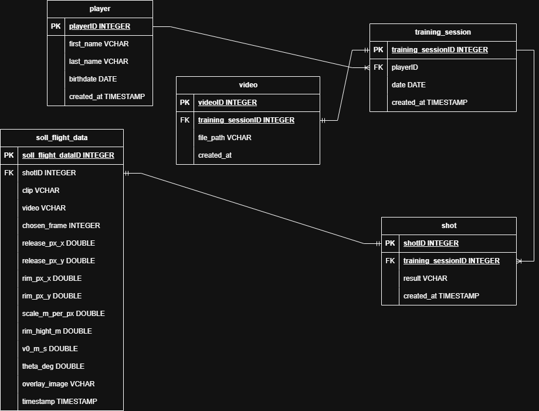
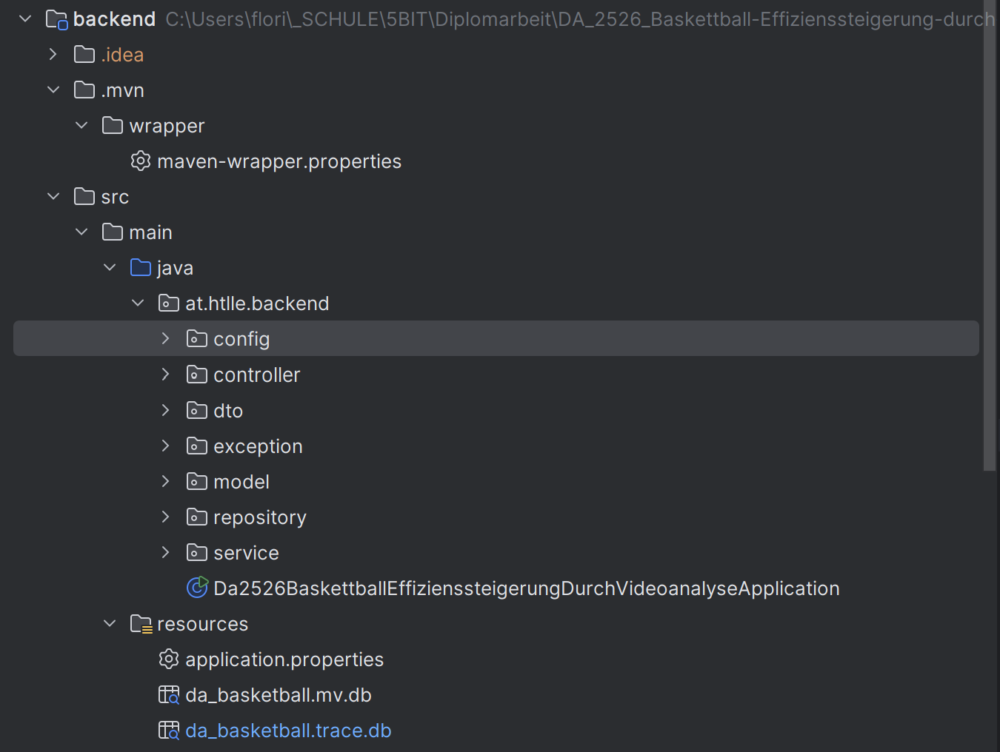
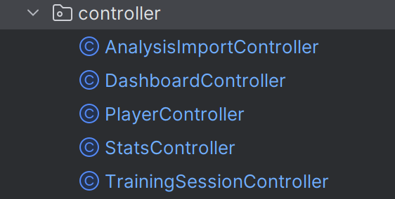
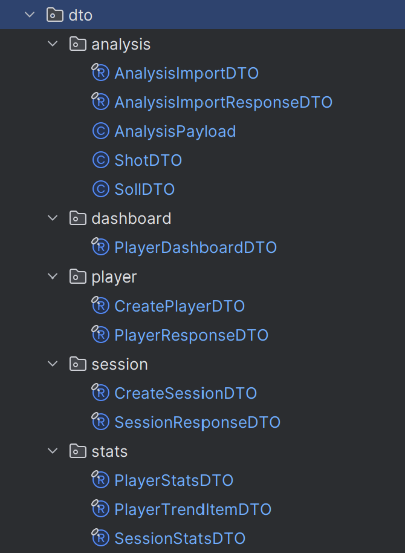
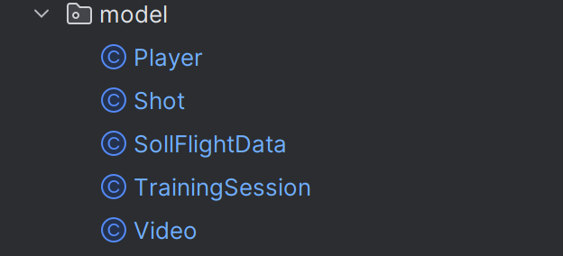
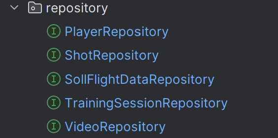
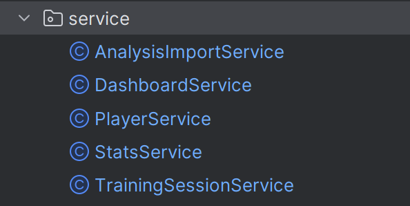

# Teilaufgabe Gutmann Florian
\textauthor{Gutmann Florian}

## Theorie

### Einführung in den Backend-Teil

Das Backend bildet die technische Grundlage für die Speicherung, Verarbeitung und Bereitstellung der im Projekt erhobenen Daten. Im Rahmen dieser Diplomarbeit entsteht ein System zur **Effizienzsteigerung von Basketballwürfen durch Videoanalyse**. Die Videoanalyse liefert dabei Messwerte und Parameter zu einzelnen Würfen (z. B. Abwurfpunkt, Korbposition, Geschwindigkeit, Winkel sowie Flugbahndaten). Damit diese Daten langfristig gespeichert, ausgewertet und für das Frontend nutzbar gemacht werden können, wird ein eigenständiges Backend entwickelt.

Die zentrale Aufgabe des Backends besteht darin, die Daten aus den Analyseprozessen **strukturiert zu persistieren** und über definierte Schnittstellen bereitzustellen. Zusätzlich übernimmt das Backend die Berechnung statistischer Kennzahlen, die Trainingsfortschritte messbar machen. Dadurch entsteht eine objektive Grundlage, um Würfe nicht nur einzeln zu betrachten, sondern auch über längere Zeiträume zu vergleichen und Entwicklungen sichtbar zu machen.

Technisch wird das Backend als Webservice umgesetzt, der über eine **REST-Schnittstelle** mit dem Frontend kommuniziert. Das Frontend kann dadurch Spieler*innen anlegen, Trainingseinheiten verwalten, Wurfdaten anzeigen und Statistik-Ergebnisse abrufen. Die Persistenz erfolgt in einer **relationalen Datenbank**, wobei in der Entwicklungsphase eine **H2-Datenbank** verwendet wird. Der Zugriff auf die Datenbank wird über **Object-Relational Mapping** realisiert, um Datenbanktabellen als Java-Objekte (Entities) abzubilden. Dafür werden **Java Persistence API (JPA)** sowie **Hibernate** als ORM-Framework eingesetzt.

Durch diese Architektur entsteht eine klare Aufgabenteilung: Die Videoanalyse erzeugt Messdaten, das Backend speichert und verarbeitet diese Daten und stellt sie dem Frontend in einer einheitlichen Form zur Verfügung. Diese Trennung erhöht die Wartbarkeit und Erweiterbarkeit des Gesamtsystems, da einzelne Komponenten unabhängig voneinander weiterentwickelt oder ausgetauscht werden können.

### Vorbereitung

Bevor mit der eigentlichen Implementierung des Backends begonnen wurde, fand eine gemeinsame Planungs- und Analysephase mit allen Teammitgliedern statt. Ziel dieser Phase war es, die Schnittstellen zwischen den einzelnen Projektteilen klar zu definieren und ein gemeinsames Verständnis über die benötigten Daten und Funktionen zu schaffen.

Im Rahmen dieser Abstimmung wurden insbesondere die Ergebnisse der Videoanalyse betrachtet. Dabei wurde festgelegt, welche Parameter aus der Analyse einzelner Würfe erzeugt werden und in welcher Form diese Daten dem Backend zur Verfügung gestellt werden. Zu diesen Daten zählen unter anderem Informationen zum Abwurfpunkt, zur Korbposition, zum Abwurfwinkel, zur Anfangsgeschwindigkeit des Balls sowie weitere Werte zur Beschreibung der Flugbahn. Diese Parameter bilden die Grundlage für alle weiteren Auswertungen und mussten daher frühzeitig eindeutig definiert werden.

Parallel dazu wurden die Anforderungen des Frontends analysiert. Das Frontend benötigt strukturierte und konsistente Daten, um Spieler*innen, Trainingseinheiten und statistische Auswertungen übersichtlich darstellen zu können. In gemeinsamen Besprechungen wurde daher festgelegt, welche Informationen vom Backend bereitgestellt werden müssen, beispielsweise Spielerstatistiken, Session-Zusammenfassungen oder zeitliche Leistungsentwicklungen. Diese Abstimmung stellte sicher, dass das Backend nicht isoliert entwickelt wird, sondern optimal auf die Bedürfnisse der Benutzeroberfläche abgestimmt ist.

Auf Basis dieser gemeinsamen Analyse wurden die Verantwortlichkeiten innerhalb des Backends festgelegt. Der Fokus lag dabei auf der Entwicklung einer Datenbankstruktur, der Definition geeigneter Datenmodelle sowie der Bereitstellung von Schnittstellen zur Kommunikation mit dem Frontend. Durch dieses strukturierte Vorgehen konnte eine solide Grundlage geschaffen werden, auf der die weitere Backend-Entwicklung systematisch aufbauen konnte.

### Ergebnis der Planungsphase

Als Ergebnis der gemeinsamen Planungsphase konnten die grundlegenden Anforderungen an das Backend eindeutig festgelegt werden. Ziel war es, einen klaren Datenfluss zwischen Videoanalyse, Backend und Frontend zu definieren und Überschneidungen oder spätere Anpassungen möglichst zu vermeiden.

Ein zentrales Ergebnis des Meetings war die Festlegung der Daten, die aus der Videoanalyse an das Backend übergeben werden. Für jeden analysierten Basketballwurf werden strukturierte Datensätze erzeugt, welche sowohl geometrische als auch zeitliche Informationen enthalten. Dazu zählen unter anderem der Abwurfpunkt des Balls, die Position des Korbes, der Abwurfwinkel, die Anfangsgeschwindigkeit sowie zusätzliche Parameter zur Beschreibung der berechneten Soll- und der erkannten Ist-Flugbahn. Diese Daten werden automatisiert in Form von **JSON-Dateien** erzeugt und dienen als Eingabe für das Backend.

Ein weiterer wesentlicher Punkt war die Definition der Datenstruktur innerhalb des Backends. Es wurde festgelegt, dass die Daten in einer **relationalen Datenbank** gespeichert werden, um eine klare Strukturierung und langfristige Persistenz zu gewährleisten. Dabei wurden zentrale Entitäten identifiziert, darunter Spieler*innen, Trainingseinheiten, einzelne Würfe sowie zugehörige Analyse- und Flugdaten. Diese Entitäten stehen in klar definierten Beziehungen zueinander und bilden die Grundlage für das spätere Entity-Relationship-Modell.

Zusätzlich wurden die Anforderungen des Frontends konkretisiert. Das Frontend benötigt nicht nur Rohdaten einzelner Würfe, sondern vor allem aggregierte Informationen in Form von statistischen Auswertungen. Daher wurde beschlossen, dass die Berechnung dieser Statistiken vollständig im Backend erfolgt. Das Backend stellt dem Frontend ausschließlich bereits aufbereitete Ergebnisse zur Verfügung, beispielsweise Trefferquoten, Durchschnittswerte oder zeitliche Leistungsentwicklungen. Dadurch wird die Komplexität im Frontend reduziert und eine konsistente Auswertung sichergestellt.

Abschließend wurde festgelegt, dass das Backend über eine REST-Schnittstelle mit dem Frontend kommuniziert. Die Datenübertragung erfolgt im JSON-Format, wodurch eine plattformunabhängige und leicht erweiterbare Kommunikation ermöglicht wird. Diese Entscheidungen bilden die Grundlage für alle weiteren technischen Umsetzungen im Backend und stellen sicher, dass die einzelnen Projektteile nahtlos ineinandergreifen.
## Backend
### Was ist überhaupt das Backend
Unter dem Backend versteht man den serverseitigen Teil einer Softwareanwendung. Es ist jener Bereich, der für Nutzerinnen und Nutzer meist nicht direkt sichtbar ist, jedoch die zentrale technische Grundlage eines Systems bildet. Während das Frontend die grafische Oberfläche und Interaktionen bereitstellt, übernimmt das Backend die Verarbeitung von Daten und die Ausführung der eigentlichen Anwendungslogik.

Im Allgemeinen erfüllt ein Backend folgende Kernaufgaben:

- **Anfragen verarbeiten:** 
Das Backend nimmt Anfragen von Clients (z. B. einer Webanwendung) entgegen, prüft diese und verarbeitet sie nach definierten Regeln.

- **Geschäftslogik umsetzen:** Fachliche Abläufe und Regeln (z. B. Zuordnung von Daten zu einer Trainingseinheit) werden zentral im Backend implementiert.

- **Daten speichern und verwalten:** Das Backend stellt die Verbindung zur Datenbank her und sorgt dafür, dass Daten strukturiert, konsistent und dauerhaft gespeichert werden.

- **Daten bereitstellen:** Über definierte Schnittstellen (typischerweise eine API) gibt das Backend Daten in strukturierter Form (z. B. JSON) an das Frontend zurück.

- **Sicherheit und Qualität im Betrieb:** Je nach System gehören auch Authentifizierung/Autorisierung, Fehlerbehandlung, Logging und Monitoring zu den Aufgaben des Backends.

Im Kontext dieser Diplomarbeit ist das Backend besonders wichtig, da es die Analyseergebnisse aus der Videoverarbeitung entgegennimmt, in einer relationalen Datenbank speichert, statistisch auswertet und die daraus entstehenden Kennzahlen über eine REST-Schnittstelle dem Frontend zur Visualisierung zur Verfügung stellt. Dadurch fungiert das Backend als zentrale Logik- und Datenebene des gesamten Systems.

## Spring Boot
### Was ist Spring Boot
Spring Boot ist ein Java-basiertes Framework zur Entwicklung von serverseitigen Anwendungen. Es baut auf dem Spring Framework auf und erweitert dieses um Funktionen, die den Projektstart und die Konfiguration deutlich vereinfachen. Ziel ist es, schnell lauffähige und produktionsnahe Anwendungen zu erstellen, ohne dass umfangreiche manuelle Konfiguration notwendig ist.

Ein zentrales Konzept ist dabei „Convention over Configuration“. Das bedeutet, dass Spring Boot für viele Standardfälle sinnvolle Voreinstellungen mitliefert. Zusätzlich enthält Spring Boot einen eingebetteten Webserver (z. B. Tomcat), wodurch Anwendungen direkt als eigenständiges Programm gestartet werden können, ohne einen externen Application-Server installieren zu müssen. Häufig verwendete Komponenten werden über sogenannte Starter-Abhängigkeiten (z. B. für Web, Datenbank oder Security) gebündelt eingebunden, was die Entwicklung weiter beschleunigt.

### Wann soll man Spring Boot verwenden
Spring Boot eignet sich besonders dann, wenn eine Anwendung als Backend-System oder Webservice entwickelt werden soll und dabei eine klare Struktur, Wartbarkeit und schnelle Umsetzung wichtig sind. Typische Einsatzbereiche sind:

- REST-Backends für Web- oder Mobile-Anwendungen

- Anwendungen, die Datenbanken nutzen und Daten persistieren (z. B. über JPA/Hibernate)

- Projekte, bei denen eine klare Schichtenarchitektur (Controller–Service–Repository) umgesetzt werden soll

- Systeme, die schnell startbar und einfach deploybar sein sollen (durch eingebetteten Server)

- Anwendungen, die später erweiterbar sein müssen, z. B. um zusätzliche Endpunkte, Logik oder Sicherheitsfunktionen

In vielen Projekten ist Spring Boot eine gute Wahl, weil es die technische Basis bereitstellt, die Entwicklung beschleunigt und gleichzeitig professionelle Standards für größere Anwendungen unterstützt.

### Was ist eine REST-API
Eine REST-API (Representational State Transfer Application Programming Interface) ist eine Programmierschnittstelle, über die Systeme über das HTTP-Protokoll miteinander kommunizieren. Eine REST-API stellt Funktionen und Daten so bereit, dass Clients (z. B. ein Frontend) auf definierte Ressourcen zugreifen können.

Die Datenübertragung erfolgt meist im JSON-Format. Ein Client kann beispielsweise Spieler-, Trainings- oder Statistikdaten anfordern oder neue Daten an das Backend senden. Dadurch dient eine REST-API als verbindendes Element zwischen Frontend und Backend.

### Wie ist die Funktionsweise von REST-API
Die Funktionsweise einer REST-API basiert auf dem Prinzip, dass Daten als Ressourcen betrachtet werden, die über eindeutige URLs (Endpunkte) erreichbar sind. Jede Ressource wird über HTTP-Methoden angesprochen, wobei jede Methode eine bestimmte Bedeutung hat:

- GET: Daten abrufen (z. B. alle Spieler anzeigen)

- POST: neue Daten anlegen (z. B. neuen Spieler erstellen)

- PUT / PATCH: bestehende Daten ändern (z. B. Trainingseinheit aktualisieren)

- DELETE: Daten löschen (z. B. Spieler entfernen)

Zusätzlich verwendet eine REST-API HTTP-Statuscodes, um das Ergebnis einer Anfrage zu beschreiben. Beispiele sind:

- 200 (OK): Anfrage erfolgreich

- 201 (Created): Ressource erfolgreich erstellt

- 400 (Bad Request): ungültige Anfrage

- 404 (Not Found): Ressource nicht gefunden

Ein wesentliches Merkmal von REST ist außerdem Statelessness: Jede Anfrage enthält alle notwendigen Informationen, sodass der Server keinen Zustand zwischen zwei Anfragen speichern muss. Das macht Systeme oft besser skalierbar und einfacher wartbar.

### Was versteht man unter CRUD?
CRUD ist ein Grundkonzept der Datenverarbeitung und beschreibt die vier grundlegenden Operationen, die in fast jedem datenbasierten System vorkommen. CRUD steht für:

- Create: Daten erstellen (z. B. neuen Spieler anlegen)

- Read: Daten lesen/abrufen (z. B. Spielerinformationen anzeigen)

- Update: Daten verändern (z. B. Trainingssession bearbeiten)

- Delete: Daten löschen (z. B. Wurfdatensatz entfernen)

Diese vier Operationen bilden die Basis für die Verwaltung von Daten in Datenbanken und werden in REST-APIs meist direkt durch HTTP-Methoden abgebildet: Create -> POST, Read -> GET, Update -> PUT/PATCH, Delete -> DELETE.

## Spring Initializer
Der Spring Initializr ist ein webbasiertes Tool, das die Erstellung eines neuen Spring-Boot-Projekts stark vereinfacht. Anstatt ein Projekt manuell aufzusetzen und alle benötigten Bibliotheken selbst zu konfigurieren, kann über den Spring Initializr in wenigen Schritten eine fertige Projektstruktur generiert werden.

Dabei wählt man unter anderem:

- Programmiersprache (meist Java)

- Build-Tool (Maven oder Gradle)

- Spring-Boot-Version

- sowie die benötigten Dependencies (z. B. Spring Web, Spring Data JPA, H2 Database)

Auf Basis dieser Auswahl erstellt der Spring Initializr automatisch ein Projekt mit:

- einer passenden Ordnerstruktur,

- einer Startklasse (Main Application),

- einer vorkonfigurierten Build-Datei (pom.xml bei Maven),

- und den notwendigen Grundeinstellungen für Spring Boot.

Der Vorteil besteht darin, dass die grundlegende Projektkonfiguration schnell, standardisiert und fehlerarm erfolgt. Dadurch kann direkt mit der eigentlichen Entwicklung begonnen werden, ohne Zeit in manuelles Setup zu investieren.

## Java / JavaScript
### Was ist Java?
Java ist eine objektorientierte Programmiersprache, die ursprünglich mit dem Ziel entwickelt wurde, plattformunabhängige Anwendungen zu ermöglichen. Ein zentrales Prinzip von Java lautet „Write once, run anywhere“. Java-Programme werden dabei in Bytecode übersetzt und anschließend von der Java Virtual Machine (JVM) ausgeführt, wodurch dieselbe Anwendung auf unterschiedlichen Betriebssystemen laufen kann.

Java wird häufig für größere, strukturierte Softwareprojekte eingesetzt, da die Sprache stark typisiert ist, viele Bibliotheken bietet und sich gut für wartbare und skalierbare Anwendungen eignet.

### Was ist JavaScript
JavaScript ist eine Skriptsprache, die hauptsächlich für die Entwicklung von interaktiven Webanwendungen verwendet wird. Ursprünglich wurde JavaScript dafür entwickelt, Webseiten im Browser dynamisch zu machen, z. B. durch Formvalidierung, Animationen oder das Nachladen von Inhalten ohne Seitenreload.

Heute wird JavaScript nicht nur im Browser, sondern auch serverseitig eingesetzt (z. B. mit Node.js). Dadurch kann JavaScript sowohl im Frontend als auch im Backend verwendet werden, je nach Technologie-Stack.

### Wofür wird Java verwendet
Java wird in vielen Bereichen eingesetzt, besonders dort, wo Stabilität, Struktur und Performance wichtig sind. Typische Anwendungsbereiche sind:

- Backend-Entwicklung (z. B. REST-APIs mit Spring Boot)

- Unternehmenssoftware (z. B. ERP-Systeme, Verwaltungssoftware)

- Android-App-Entwicklung (klassisch mit Java, heute oft Kotlin)

- Server- und Cloud-Anwendungen, bei denen Skalierbarkeit entscheidend ist

In diesem Projekt ist Java vor allem relevant, weil damit das Backend umgesetzt wird und Spring Boot als Java-Framework darauf aufbaut.

### Wofür wird JavaScript verwendet
JavaScript wird vor allem für Webentwicklung genutzt, insbesondere für alles, was im Browser interaktiv sein soll. Typische Einsatzbereiche sind:

- Frontend-Entwicklung (Benutzeroberflächen, dynamische Inhalte)

- Web-Frameworks wie React, Vue oder Angular

- Kommunikation mit Backends über APIs (z. B. REST-Aufrufe)

- Backend-Entwicklung mit Node.js, wenn JavaScript auch serverseitig genutzt wird

In vielen Projekten wird JavaScript eingesetzt, um das Frontend zu bauen, das dann über eine API mit dem Backend kommuniziert.

### Unterschied zwischen Java und JavaScript
Obwohl die Namen ähnlich klingen, sind Java und JavaScript zwei unterschiedliche Programmiersprachen mit unterschiedlichen Zielen und Eigenschaften:

- **Syntax und Konzept:** Java ist objektorientiert und stark typisiert, während JavaScript dynamisch typisiert ist und flexibler verwendet werden kann.

- **Laufzeitumgebung:** Java läuft auf der JVM, JavaScript läuft primär im Browser oder serverseitig über Node.js.

- **Einsatzgebiet:** Java wird häufig für Backend-Systeme, Unternehmenssoftware und große Anwendungen verwendet. JavaScript ist die Standardsprache für interaktive Webseiten und moderne Web-Frontends.

- **Struktur:** Java ist in der Regel strenger strukturiert (Klassen, Typen, Compile-Time Checks), während JavaScript mehr Freiheit bietet, aber dadurch auch fehleranfälliger sein kann, wenn kein klarer Stil eingehalten wird.

Java ist eine klassische Sprache für strukturierte, größere Anwendungen (z. B. Backends), während JavaScript vor allem für Webentwicklung und Interaktivität im Browser eingesetzt wird.

## Postman
Postman ist ein Tool zur Entwicklung und zum Testen von REST-APIs. Es ermöglicht, HTTP-Anfragen wie GET, POST, PUT/PATCH und DELETE direkt an ein Backend zu senden, ohne dass dafür bereits ein fertiges Frontend notwendig ist. Dabei können Request-Details wie Header, Parameter und ein JSON-Body einfach eingestellt werden. Postman zeigt anschließend die Antwort des Servers übersichtlich an, inklusive Statuscode und Rückgabedaten. Dadurch eignet sich das Tool besonders gut, um API-Endpunkte während der Backend-Entwicklung zu prüfen, Fehler zu analysieren und die Funktionalität der Schnittstelle schrittweise zu verifizieren.

## Datenbank
## Was ist eine Datenbank?
Eine Datenbank ist ein System zur strukturierten Speicherung, Organisation und Verwaltung von Daten. Im Gegensatz zu einfachen Dateien werden Informationen in einer Datenbank nach klaren Regeln abgelegt, sodass sie gezielt durchsucht und verarbeitet werden können. Verwaltet wird eine Datenbank in der Regel durch ein Datenbankmanagementsystem (DBMS), das den Zugriff regelt und Funktionen für das Speichern, Abrufen und Bearbeiten von Daten bereitstellt. Dadurch können Daten nicht nur dauerhaft gespeichert, sondern auch konsistent und nachvollziehbar verwaltet werden.

### Wofür werden Datenbanken verwendet?
Datenbanken werden verwendet, um Daten dauerhaft, sicher und effizient verfügbar zu machen. Sie ermöglichen es, Informationen schnell abzufragen, zu filtern, zu sortieren und zu ändern, auch wenn sehr große Datenmengen vorhanden sind. Zudem helfen Datenbanken dabei, Daten logisch zu strukturieren und Beziehungen zwischen verschiedenen Objekten abzubilden (z. B. ein Spieler mit mehreren Trainingseinheiten oder Würfen). In Backend-Systemen sind Datenbanken besonders wichtig, weil sie die Grundlage dafür bilden, dass Anwendungsdaten wie Benutzer, Trainingsdaten oder Analyseergebnisse gespeichert und später für Auswertungen oder zur Anzeige im Frontend wieder abgerufen werden können.

### Was sind Relationale Datenbanken

Relationale Datenbanken speichern Informationen in tabellarischer Form. Die Daten sind in Tabellen (Relationen) organisiert, die aus Datensätzen (Zeilen/Tupeln) und Attributen (Spalten) bestehen. Ein Datensatz beschreibt dabei ein konkretes Objekt, beispielsweise einen Spieler oder einen einzelnen Basketballwurf, während die Attribute die jeweiligen Eigenschaften dieses Objekts (z. B. Name, Zeitpunkt, Winkel oder Treffer) definieren.

Zur eindeutigen Identifikation eines Datensatzes wird in jeder Tabelle ein Primärschlüssel verwendet. Beziehungen zwischen verschiedenen Tabellen werden über Fremdschlüssel umgesetzt, indem ein Attribut einer Tabelle auf den Primärschlüssel einer anderen Tabelle verweist. Auf diese Weise lassen sich Daten logisch miteinander verknüpfen, ohne Informationen mehrfach speichern zu müssen. Dies reduziert Redundanzen, erhöht die Datenkonsistenz und erleichtert die Durchführung von Abfragen und statistischen Auswertungen, da Zusammenhänge zwischen Objekten (z. B. Spieler und Trainingseinheit und Würfe) klar modelliert werden können.

Aufgrund dieser Eigenschaften eignet sich das relationale Datenbankmodell besonders gut für das vorliegende Projekt: Die aus der Videoanalyse entstehenden Daten müssen langfristig gespeichert, eindeutig einer Trainingseinheit bzw. einem Spieler zugeordnet und anschließend für Kennzahlen wie Trefferquoten, Durchschnittswerte oder Abweichungen zwischen Soll- und Ist-Flugbahn ausgewertet werden. Relationale Datenbanken bieten dafür eine stabile und strukturierte Grundlage.

## Java Persistand API (JPA)
### Was ist JPA
JPA (Java Persistence API) ist eine Java-Standard-Spezifikation für die objekt-relationalen Persistierung. Sie beschreibt, wie Java-Objekte (z. B. Player, TrainingSession) in einer relationalen Datenbank gespeichert, gelesen und verwaltet werden können. JPA legt dabei nur fest, wie diese Persistenz grundsätzlich funktionieren soll (z. B. über Annotationen wie @Entity, @Id, @OneToMany), stellt aber selbst keine konkrete Implementierung bereit.

Durch JPA kann die Datenbankarbeit auf einer höheren Ebene erfolgen: Statt SQL direkt zu schreiben, werden Objekte gespeichert und abgefragt, wodurch der Code meist übersichtlicher und besser wartbar wird.

### Was sind Annotationen
Annotationen sind spezielle Markierungen im Quellcode (in Java erkennbar am @-Symbol), mit denen zusätzliche Informationen über Klassen, Methoden oder Variablen angegeben werden. Sie verändern nicht direkt den Programmablauf, sondern dienen Frameworks und Tools als „Metadaten“, um bestimmtes Verhalten automatisch umzusetzen.

Im Backend mit Spring Boot und JPA werden Annotationen z. B. verwendet, um eine Klasse als Datenbank-Entität zu kennzeichnen (@Entity), Primärschlüssel festzulegen (@Id) oder REST-Endpunkte zu definieren (@RestController, @GetMapping). Dadurch wird Konfiguration in den Code verlagert, was die Struktur klarer macht und die Entwicklung vereinfacht.
## Entity-Relationship-Modell

Relationale Datenbanken speichern Informationen in tabellarischer Form. Die Daten sind in Tabellen (Relationen) organisiert, die aus Datensätzen (Zeilen/Tupeln) und Attributen (Spalten) bestehen. Ein Datensatz beschreibt dabei ein konkretes Objekt, beispielsweise einen Spieler oder einen einzelnen Basketballwurf, während die Attribute die jeweiligen Eigenschaften dieses Objekts (z. B. Name, Zeitpunkt, Winkel oder Treffer) definieren.

Zur eindeutigen Identifikation eines Datensatzes wird in jeder Tabelle ein Primärschlüssel verwendet. Ein Primärschlüssel ist ein Attribut (oder eine Kombination mehrerer Attribute), dessen Wert in der Tabelle eindeutig ist und somit jeden Datensatz klar identifiziert, z. B. eine automatisch vergebene ID. Beziehungen zwischen verschiedenen Tabellen werden über Fremdschlüssel umgesetzt. Ein Fremdschlüssel ist ein Attribut in einer Tabelle, das auf den Primärschlüssel einer anderen Tabelle verweist. Dadurch kann beispielsweise ein Wurf einem bestimmten Spieler oder einer konkreten Trainingseinheit zugeordnet werden, ohne die Spielerdaten im Wurf-Datensatz erneut speichern zu müssen.

Durch diese Verknüpfungen lassen sich Daten logisch miteinander verbinden, ohne Informationen mehrfach abzulegen. Mehrfach gespeicherte Informationen bezeichnet man als Redundanzen (z. B. wenn der Name eines Spielers in vielen Wurf-Datensätzen wiederholt gespeichert wird). Redundanzen erhöhen das Risiko von Fehlern, da Änderungen dann an mehreren Stellen durchgeführt werden müssten. Die Vermeidung solcher Redundanzen verbessert die Datenkonsistenz, also die Eigenschaft, dass Daten innerhalb der Datenbank widerspruchsfrei und korrekt bleiben (z. B. ein Spielername ist überall gleich und nicht in unterschiedlichen Varianten gespeichert). Zusätzlich erleichtert diese Struktur die Durchführung von Abfragen und statistischen Auswertungen, da Zusammenhänge zwischen Objekten (z. B. Spieler und Trainingseinheit und Würfe) klar modelliert und gezielt ausgewertet werden können.

### Zentrale Begriffe des ER-Modells

- **Entität**  
  Eine Entität beschreibt ein eindeutig identifizierbares Objekt aus dem Anwendungsbereich. Im Projekt sind dies beispielsweise Spieler*innen, Trainingseinheiten oder einzelne Würfe. Entitäten werden später als Tabellen in der Datenbank umgesetzt.

- **Attribut**  
  Attribute beschreiben die Eigenschaften einer Entität und entsprechen den Spalten einer Tabelle. Beispiele hierfür sind der Name eines Spielers, der Zeitpunkt einer Trainingseinheit oder der Abwurfwinkel eines Wurfes.

- **Beziehung**  
  Beziehungen stellen die Verknüpfungen zwischen Entitäten dar. Sie definieren, wie Objekte zueinander in Beziehung stehen, etwa dass eine Spielerin mehrere Trainingseinheiten absolvieren kann oder dass eine Trainingseinheit aus mehreren Würfen besteht.

### Unterschied zwischen Beziehungen und Kardinalitäten

- **Beziehungen** beschreiben, dass zwei Entitäten miteinander verknüpft sind (z. B. Spieler hat Trainingseinheiten).
- **Kardinalitäten** beschreiben, wie viele Objekte an dieser Beziehung beteiligt sein können (z. B. 1:n = ein Spieler kann viele Trainingseinheiten haben).

### Was sind Kardinalitäten
Neben Entitäten, Attributen und Beziehungen sind Kardinalitäten ein zentrales Element des ER-Modells. Sie beschreiben, wie viele Objekte einer Entität mit Objekten einer anderen Entität in Beziehung stehen können. Kardinalitäten helfen dabei, die Struktur einer Datenbank korrekt zu planen und später sauber in Tabellen und Fremdschlüssel-Beziehungen umzusetzen.

- **1:1-Beziehung (One-to-One)**

  Bei einer 1:1-Beziehung ist jedes Objekt der ersten Entität genau einem Objekt der zweiten Entität zugeordnet – und umgekehrt.
  Beispiel: Ein Personalausweis gehört genau zu einer Person und eine Person hat genau einen Personalausweis.
  In relationalen Datenbanken wird dies meist über einen Fremdschlüssel realisiert, der eindeutig sein muss (Unique-Constraint).

- **1:n-Beziehung (One-to-Many)**

  Eine 1:n-Beziehung bedeutet, dass ein Objekt der ersten Entität mit mehreren Objekten der zweiten Entität verbunden sein kann, während ein Objekt der zweiten Entität nur einem Objekt der ersten Entität zugeordnet ist.
  Beispiel: Ein Spieler kann mehrere Trainingseinheiten absolvieren, aber eine Trainingseinheit gehört zu genau einem Spieler.
  In der Datenbank wird dies typischerweise dadurch umgesetzt, dass die „n-Seite“ (z. B. Trainingseinheit) einen Fremdschlüssel auf die „1-Seite“ (z. B. Spieler) enthält.

- **n:m-Beziehung (Many-to-Many)**

  Bei einer n:m-Beziehung können mehrere Objekte der ersten Entität mit mehreren Objekten der zweiten Entität verbunden sein.
  Beispiel: Studierende können mehrere Kurse besuchen und jeder Kurs hat mehrere Studierende.
  In relationalen Datenbanken wird eine n:m-Beziehung üblicherweise über eine Zwischentabelle (Join-Tabelle) umgesetzt, die die Primärschlüssel beider Entitäten als Fremdschlüssel enthält.

## ER Diagramme
### Was ist ein ER Diagramm
Ein ER-Diagramm ist eine grafische Darstellung des Entity-Relationship-Modells und wird verwendet, um die Struktur einer Datenbank übersichtlich zu planen. Es zeigt, welche Entitäten im System vorkommen, welche Attribute diese besitzen und wie die Entitäten miteinander in Beziehung stehen. Dadurch eignet sich ein ER-Diagramm besonders gut, um komplexe Datenmodelle verständlich zu visualisieren, bevor diese in einer relationalen Datenbank umgesetzt werden.

### Verschiedene Notationsformen
- **Chen-Notation**

  Eine klassische Darstellung des ER-Modells: Entitäten werden als Rechtecke, Beziehungen als Rauten und Attribute als Ovale dargestellt. Kardinalitäten werden an den Beziehungslinien angegeben. Diese Notation ist sehr anschaulich, wird aber in der Praxis bei großen Modellen schnell unübersichtlich.

- **Crow’s-Foot-Notation (Krähenfuß)**

  Eine sehr verbreitete Notation in der Datenbankpraxis. Entitäten werden als Tabellen-/Boxen dargestellt, Beziehungen als Linien. Die Kardinalitäten werden mit Symbolen wie dem „Krähenfuß“ (für „viele“) visualisiert. Dadurch lassen sich 1:1-, 1:n- und n:m-Beziehungen sehr schnell erkennen.

- **IDEF1X-Notation**

  Eine stärker technisch orientierte Notation, die häufig in professionellen Datenbankdesigns eingesetzt wird. Sie unterscheidet klar zwischen identifizierenden und nicht-identifizierenden Beziehungen und legt großen Fokus auf Schlüsselstrukturen. Dadurch ist sie präzise, aber für Einsteiger oft komplexer.

- **UML-Klassendiagramm (als alternative Darstellung)**

  Zwar kein klassisches ER-Notation-System, aber häufig in objektorientierten Projekten genutzt. Klassen entsprechen dabei oft Entitäten, Attribute werden innerhalb der Klasse dargestellt, und Beziehungen werden als Assoziationen mit Multiplizitäten (z. B. 1..*, 0..1) angegeben. UML ist besonders praktisch, wenn Datenmodell und Code-Design eng zusammenhängen.

## H2 Datenbank
Die H2-Datenbank ist ein leichtgewichtiges, relationales Datenbankmanagementsystem (DBMS), das in Java geschrieben wurde und besonders häufig für Entwicklung, Tests und Prototyping eingesetzt wird. Ein großer Vorteil von H2 ist, dass sie ohne aufwendige Installation verwendet werden kann und sich sehr einfach in Java- und Spring-Boot-Projekte integrieren lässt.

H2 kann in zwei typischen Betriebsarten genutzt werden:

- In-Memory-Modus: Die Datenbank läuft nur im Arbeitsspeicher und ist nach dem Beenden der Anwendung wieder leer. Das ist ideal für schnelle Tests, da keine Dateien verwaltet werden müssen.

- File-Modus: Die Daten werden in einer Datei gespeichert und bleiben auch nach einem Neustart erhalten.

In Spring Boot wird H2 oft als Entwicklungsdatenbank verwendet, weil sie schnell startbar ist und gut mit Spring Data JPA/Hibernate zusammenarbeitet. Zusätzlich bietet H2 eine integrierte Web-Konsole, über die Tabellen, Inhalte und SQL-Abfragen bequem im Browser angesehen werden können. Für produktive Systeme wird häufig später auf leistungsfähigere Datenbanken (z. B. PostgreSQL oder MySQL) umgestellt, während H2 weiterhin für Tests und lokale Entwicklung genutzt werden kann.

## MySQL
MySQL ist ein weit verbreitetes relationales Datenbankmanagementsystem (RDBMS), das zur dauerhaften Speicherung und Verwaltung strukturierter Daten eingesetzt wird. Die Daten werden in Tabellen organisiert und können mithilfe von SQL (Structured Query Language) effizient abgefragt und bearbeitet werden. MySQL wird häufig in Web- und Backend-Anwendungen verwendet, weil es stabil, performant und für den produktiven Dauerbetrieb geeignet ist. Typische Einsatzbereiche sind Anwendungen mit Nutzer- und Trainingsdaten, Content-Systeme oder allgemeine Geschäftsanwendungen, bei denen Daten langfristig gespeichert und zuverlässig verwaltet werden müssen. In Spring-Boot-Projekten lässt sich MySQL über einen JDBC-Treiber anbinden und wird oft gemeinsam mit Spring Data JPA/Hibernate verwendet, um Datenbankzugriffe strukturiert über das Objektmodell umzusetzen.

### Was ist der Unterschied zwischen H2 Datenbank und MySql
Die H2-Datenbank und MySQL sind beide relationale Datenbanken, unterscheiden sich jedoch vor allem in ihrem Einsatzgebiet und ihrer Betriebsart:

- **Einsatzbereich:** H2 wird meist für Entwicklung und Tests genutzt, während MySQL typischerweise in produktiven Systemen eingesetzt wird.

- **Installation und Betrieb:** H2 ist sehr leichtgewichtig und kann ohne große Einrichtung direkt im Projekt laufen (z. B. In-Memory). MySQL benötigt in der Regel eine separate Installation und läuft als eigener Datenbankserver.

- **Persistenz:** H2 kann im In-Memory-Modus betrieben werden (Daten gehen nach dem Beenden verloren) oder als Datei gespeichert werden. MySQL speichert Daten standardmäßig dauerhaft auf dem Server.

- **Skalierbarkeit und Leistung:** MySQL ist für größere Datenmengen, mehrere Benutzer und dauerhafte Nutzung optimiert. H2 ist eher für kleinere lokale Umgebungen gedacht.

## IntelJ IDA
IntelliJ IDEA ist eine integrierte Entwicklungsumgebung (IDE) von JetBrains, die vor allem für die Entwicklung mit Java (und weiteren Sprachen) verwendet wird. Sie bietet eine zentrale Arbeitsumgebung, in der Quellcode geschrieben, strukturiert, getestet und ausgeführt werden kann. Durch Funktionen wie Code-Vervollständigung, Fehlererkennung in Echtzeit, Refactoring-Werkzeuge und Debugging unterstützt IntelliJ IDEA eine effiziente und saubere Softwareentwicklung.

Im Backend-Kontext wird IntelliJ IDEA typischerweise genutzt, um Spring-Boot-Projekte zu erstellen und zu verwalten, Abhängigkeiten (z. B. über Maven) einzubinden, REST-Controller und Datenbankklassen zu entwickeln sowie die Anwendung lokal zu starten und zu testen. Dadurch erleichtert die IDE sowohl die Umsetzung als auch die Wartung des Backends erheblich.

## Visual Studio Code
Visual Studio Code (VS Code) ist ein leichter, plattformübergreifender Code-Editor von Microsoft, der sich durch hohe Erweiterbarkeit auszeichnet. Er unterstützt viele Programmiersprachen wie JavaScript, TypeScript, HTML/CSS, Python und auch Java über Erweiterungen. VS Code bietet Funktionen wie Syntax-Highlighting, Code-Vervollständigung, integriertes Terminal, Debugging sowie eine starke Git-Integration, wodurch die Entwicklung übersichtlich und effizient wird.

VS Code wird häufig für die Frontend-Entwicklung eingesetzt, z. B. zum Erstellen von Weboberflächen mit JavaScript-Frameworks, und eignet sich durch Extensions auch für Backend-Aufgaben. Besonders praktisch ist die flexible Anpassbarkeit: Durch Plugins können zusätzliche Tools, Linter, Formatter oder Framework-Unterstützung eingebunden werden, sodass sich VS Code gut für moderne Webprojekte und die Arbeit im Team eignet.

## Praktische Arbeit

### Erstellung des ER-Diagramm

Das ER-Diagramm stellt die im Projekt verwendete Datenbankstruktur grafisch dar und zeigt die zentralen Entitäten sowie deren Beziehungen untereinander. Es bildet den realen Trainingsablauf ab und dient als Grundlage für die Implementierung der Datenbank im Backend.

Im Zentrum des Modells steht die Entität **Spieler**, welche die grundlegenden Informationen zu den einzelnen Spieler*innen enthält. Eine Spielerin kann mehrere Trainingseinheiten absolvieren, wodurch eine **Eins-zu-viele-Beziehung** zwischen Spieler und Trainingseinheit entsteht. Jede Trainingseinheit wiederum besteht aus mehreren Würfen, die während des Trainings durchgeführt werden.

Jedem Wurf sind spezifische Analyse- und Flugdaten zugeordnet, welche aus der Videoanalyse stammen. Diese Daten beschreiben sowohl die erkannte Ist-Flugbahn als auch die berechnete Soll-Flugbahn des Basketballs. Durch diese Struktur ist es möglich, einzelne Würfe detailliert zu analysieren sowie statistische Auswertungen über mehrere Trainingseinheiten hinweg durchzuführen.

Das dargestellte ER-Diagramm bildet somit die fachliche Grundlage für die Datenhaltung im Backend und stellt sicher, dass alle relevanten Informationen konsistent und nachvollziehbar gespeichert werden können.

### Technologieentscheidungen

Zu Beginn der Backend-Entwicklung wurde eine ausführliche Recherche zu möglichen Technologien durchgeführt. Ziel war es, eine stabile, erweiterbare und für den Anwendungsfall der Videoanalyse geeignete technische Basis zu schaffen. Dabei wurden insbesondere Programmiersprachen, Datenbanksysteme sowie Frameworks für die Umsetzung eines webbasierten Backends verglichen.

Die Auswahl der eingesetzten Technologien erfolgte anhand mehrerer Kriterien, darunter Wartbarkeit, Performance, Erweiterbarkeit, Dokumentation sowie die Eignung für den Einsatz in einer Diplomarbeit mit langfristiger Perspektive und basierend auf Erfahrungen aus dem Unterricht.

### Entwicklungsumgebung (IntelliJ IDEA)

Für die Entwicklung des Backend-Systems wurde die integrierte Entwicklungsumgebung **IntelliJ IDEA** verwendet. Diese IDE wird auch im Unterricht regelmäßig eingesetzt und war daher den Projektmitgliedern bereits gut vertraut. IntelliJ IDEA bietet umfassende Unterstützung für Java- und Spring-Boot-Projekte, darunter automatische Codevervollständigung, integrierte Build- und Testwerkzeuge (Maven), Debugging sowie eine enge Integration mit Versionsverwaltungssystemen. Durch den Einsatz einer bekannten Entwicklungsumgebung konnte die Entwicklungszeit reduziert und der Fokus auf die fachliche Umsetzung des Backends gelegt werden.

### Programmiersprache (Java)

Als Programmiersprache für das Backend wurde **Java** ausgewählt. Ein wesentlicher Grund dafür ist, dass Java die Hauptprogrammiersprache im Unterricht darstellt und daher die meiste praktische Erfahrung in diesem Umfeld vorhanden ist. Java ist eine weit verbreitete, objektorientierte Programmiersprache, die besonders im Bereich serverseitiger Anwendungen und Unternehmenssoftware eingesetzt wird. Durch die starke Typisierung und die klare Struktur eignet sich Java gut für größere Projekte mit mehreren Modulen und klaren Verantwortlichkeiten.

Ein weiterer Vorteil von Java ist die große Anzahl an verfügbaren Bibliotheken sowie die ausgezeichnete Integration mit etablierten Frameworks. Zudem bietet Java eine hohe Plattformunabhängigkeit, da Programme auf verschiedenen Betriebssystemen ausgeführt werden können, sofern eine Java Virtual Machine vorhanden ist.

### Datenbanksysteme

Für die Speicherung und Verwaltung der anfallenden Daten wurde ein relationales Datenbanksystem eingesetzt. Die Wahl fiel bewusst auf zwei unterschiedliche Datenbanksysteme, die in verschiedenen Phasen des Projekts verwendet werden: **H2** für die lokale Entwicklungsphase und **MySQL** für den späteren produktiven Einsatz.

Diese Vorgehensweise ermöglicht eine effiziente Entwicklung, ohne auf eine realistische Zielumgebung verzichten zu müssen.

#### H2-Datenbank (lokale Entwicklungsphase)

In der frühen Entwicklungsphase wurde die **H2-Datenbank** eingesetzt. H2 ist eine leichtgewichtige, in Java geschriebene relationale Datenbank, die besonders für Entwicklungs- und Testzwecke geeignet ist.

**Vorteile:**
- Keine separate Installation eines Datenbankservers notwendig  
- Sehr schneller Start und geringe Systemanforderungen  
- Gute Integration in Spring Boot  
- Ideal für lokale Entwicklung und automatisierte Tests  
- Datenbank kann direkt im Projekt eingebettet betrieben werden  

**Nachteile:**
- Nicht für produktive Umgebungen mit vielen Nutzern ausgelegt  
- Unterschiede im SQL-Dialekt im Vergleich zu produktiven Datenbanken  
- Begrenzte Performance und Skalierbarkeit  
- Nicht repräsentativ für reale Serverumgebungen  

**Begründung der Auswahl:**  
Die H2-Datenbank wurde bewusst gewählt, um in der Entwicklungsphase schnell arbeiten zu können, ohne zusätzlichen Konfigurationsaufwand. Änderungen an der Datenbankstruktur konnten dadurch effizient getestet und angepasst werden.

#### MySQL (produktive Zielumgebung)

Für den späteren Einsatz des Systems wurde **MySQL** als produktives Datenbanksystem vorgesehen. MySQL ist ein weit verbreitetes relationales Datenbanksystem, das häufig in webbasierten Anwendungen eingesetzt wird.

**Vorteile:**
- Hohe Stabilität und Zuverlässigkeit  
- Gute Performance auch bei größeren Datenmengen  
- Mehrbenutzerfähig und für Serverbetrieb ausgelegt  
- Weit verbreitet und gut dokumentiert  
- Geeignet für produktive und reale Anwendungsszenarien  

**Nachteile:**
- Erfordert Installation und Konfiguration eines Datenbankservers  
- Höherer administrativer Aufwand im Vergleich zu H2  
- Für lokale Entwicklung teilweise langsamer im Setup  

**Begründung der Auswahl:**  
MySQL wurde gewählt, da es sich für den produktiven Einsatz in einer realen Anwendung eignet und den Anforderungen an Datenintegrität, Performance und Mehrbenutzerbetrieb gerecht wird.

#### Begründung der zweistufigen Datenbankstrategie

Die Kombination aus H2 und MySQL ermöglicht eine klare Trennung zwischen Entwicklungs- und Produktivphase. Während H2 eine schnelle und flexible Entwicklung erlaubt, stellt MySQL sicher, dass das System später unter realistischen Bedingungen betrieben werden kann.

Durch den Einsatz von **JPA** und **Hibernate** bleibt das Datenmodell weitgehend unabhängig vom verwendeten Datenbanksystem. Dadurch ist ein Wechsel von H2 zu MySQL mit minimalem Anpassungsaufwand möglich. Diese zweistufige Datenbankstrategie unterstützt somit sowohl eine effiziente Entwicklung als auch eine realitätsnahe Umsetzung des finalen Systems.

### Spring Boot Framework

Für die Umsetzung des Backends wurde das Framework **Spring Boot** eingesetzt. Spring Boot baut auf dem Spring-Framework auf und vereinfacht die Entwicklung von Webanwendungen erheblich, indem viele Konfigurationsschritte automatisiert werden.

Ein zentraler Vorteil von Spring Boot ist die klare Trennung der einzelnen Schichten (Controller, Service und Datenzugriff). Dadurch bleibt der Code übersichtlich und gut wartbar. Zudem ermöglicht Spring Boot die einfache Erstellung von REST-Schnittstellen, welche für die Kommunikation mit dem Frontend erforderlich sind.

Durch integrierte Funktionen wie Dependency Injection, Konfigurationsmanagement und Serverunterstützung eignet sich Spring Boot besonders gut für die Entwicklung moderner Backend-Systeme.

### Objekt-relationales Mapping mit JPA und Hibernate

Um die relationale Datenbank effizient mit der objektorientierten Java-Struktur zu verbinden, wurde **JPA (Java Persistence API)** in Kombination mit **Hibernate** verwendet. Diese Technologien ermöglichen ein objekt-relationales Mapping, bei dem Datenbanktabellen direkt als Java-Klassen abgebildet werden.

Dadurch kann im Code mit Objekten gearbeitet werden, ohne SQL-Abfragen manuell schreiben zu müssen. Dies reduziert Fehlerquellen, erhöht die Lesbarkeit des Codes und erleichtert spätere Erweiterungen des Datenmodells. Besonders im Zusammenspiel mit Spring Boot ist die Integration von JPA und Hibernate sehr effizient.

### Verwendung von Postman zur Schnittstellentestung

Zur Testung der entwickelten REST-Schnittstellen wurde das Tool **Postman** verwendet. Postman ermöglicht das manuelle Erstellen und Ausführen von HTTP-Anfragen und eignet sich besonders gut zur Überprüfung von `GET`-, `POST`-, `PUT`- und `DELETE`-Requests.

Während der Entwicklung des Backends wurde Postman eingesetzt, um die korrekte Funktionalität der API-Endpunkte zu testen, Daten im JSON-Format zu senden sowie Serverantworten zu analysieren. Dadurch konnten Fehler frühzeitig erkannt und die Schnittstellen unabhängig vom Frontend validiert werden. Der Einsatz von Postman unterstützte somit eine strukturierte und effiziente Entwicklung sowie die Qualitätssicherung der REST-API.

### Backend-Architektur

#### Aufbau

Das Backend des Projekts ist klar strukturiert und folgt einer **schichtenbasierten Architektur**. Die einzelnen Pakete übernehmen jeweils klar definierte Aufgaben und tragen dadurch zu einer guten Wartbarkeit und Erweiterbarkeit des Systems bei.

##### Hauptklasse

Die Klasse `Da2526BaskettballEffizienssteigerungDurchVideoanalyseApplication` stellt den Einstiegspunkt der Spring-Boot-Anwendung dar. Sie startet das Backend, initialisiert alle Komponenten und konfiguriert den eingebetteten Webserver.

##### Paketübersicht

- **`config`**: Konfigurationsklassen (z. B. Datenbank, CORS, projektspezifische Einstellungen)  
- **`controller`**: REST-Endpunkte als Schnittstelle zum Frontend  
- **`dto`**: sichere Datenübertragung zwischen Backend und Frontend  
- **`exception`**: zentrale Fehlerbehandlung und einheitliche Fehlermeldungen  
- **`model`**: Entitäten (JPA) als Abbildung der Datenbanktabellen  
- **`repository`**: Datenzugriff (CRUD) und Abfragen auf Datenbankebene  
- **`service`**: Geschäftslogik und Berechnung statistischer Auswertungen  
- **`resources`**: Konfigurationsdateien und (lokal) Datenbankdateien  

##### Packages

###### Package `config`

- **`CorsConfig`**  
  Konfiguriert Cross-Origin Resource Sharing (CORS), damit das Frontend auf einem anderen Port oder einer anderen Domain auf das Backend zugreifen darf.

- **`WebConfig`**  
  Enthält allgemeine Web-Konfigurationen für die Spring-Boot-Anwendung, z. B. globale Einstellungen des Request-Handlings.

###### Package `controller`

- **`AnalysisImportController`**  
  Stellt Endpunkte zum Importieren und Verarbeiten von Analyse- bzw. Videodaten bereit.

- **`DashboardController`**  
  Liefert zusammengefasste Daten für das Dashboard, z. B. Übersichten und aggregierte Statistiken.

- **`PlayerController`**  
  Verwaltet REST-Endpunkte zur Erstellung, Abfrage und Verwaltung von Spielern.

- **`StatsController`**  
  Stellt statistische Auswertungen und Leistungsdaten der Spieler bereit.

- **`TrainingSessionController`**  
  Verwalten Trainings- bzw. Session-Daten und ermöglichen deren Abfrage und Speicherung.

###### Package `dto`

#### `analysis`
- **`AnalysisImportDTO`**: Eingabedaten für den Import einer Video- bzw. Analyseauswertung  
- **`AnalysisImportResponseDTO`**: Ergebnis eines Analyseimports (z. B. Status, Anzahl verarbeiteter Datensätze)  
- **`AnalysisPayload`**: eigentliche Analysedaten aus der Videoanalyse  
- **`ShotDTO`**: Beschreibung eines einzelnen Wurfes (z. B. Treffer/Fehlwurf)  
- **`SollDTO`**: Soll- bzw. Referenzwerte für Auswertung und Leistungsvergleich  

#### `dashboard`
- **`PlayerDashboardDTO`**: zusammengefasste Spielerinformationen für die Dashboard-Anzeige  

#### `player`
- **`CreatePlayerDTO`**: Daten zum Anlegen eines neuen Spielers  
- **`PlayerResponseDTO`**: Rückgabe von Spielerinformationen an das Frontend  

#### `session`
- **`CreateSessionDTO`**: Eingabedaten zum Erstellen einer neuen Trainingseinheit  
- **`SessionResponseDTO`**: gespeicherte Informationen einer Trainingseinheit  

#### `stats`
- **`PlayerStatsDTO`**: statistische Kennzahlen zur Spielerleistung  
- **`PlayerTrendItemDTO`**: Trend-/Zeitreihenwerte zur Leistungsentwicklung  
- **`SessionStatsDTO`**: statistische Auswertungen einer Trainingseinheit  

###### Package `exception`

- **`GlobalExceptionHandler`**  
  Fängt zentral auftretende Exceptions ab und wandelt sie in einheitliche, verständliche HTTP-Fehlermeldungen für das Frontend um.

- **`NotFoundException`**  
  Wird ausgelöst, wenn eine angeforderte Ressource (z. B. Spieler oder Session) nicht gefunden wird.

###### Package `model`

- **`Player`**: Repräsentiert einen Spieler und enthält Stammdaten für Sessions, Würfe und Statistiken.  
- **`Shot`**: Speichert Informationen zu einem einzelnen Wurf (z. B. Ergebnis, Zeitpunkt, Zuordnung).  
- **`SollFlightData`**: Enthält berechnete Soll-Flugbahndaten (z. B. Winkel, Geschwindigkeit, Abwurfpunkt).  
- **`TrainingSession`**: Beschreibt eine Trainingseinheit als zeitliche Klammer für Würfe, Videos und Statistiken.  
- **`Video`**: Repräsentiert ein analysiertes Video und verbindet Session, Würfe und Analyseergebnisse.  

###### Package `repository`

- **`PlayerRepository`**: CRUD-Operationen für Spieler.  
- **`ShotRepository`**: Speichern, Laden und Abfragen von Würfen.  
- **`SollFlightDataRepository`**: Zugriff auf Soll-Flugbahndaten und Persistierung.  
- **`TrainingSessionRepository`**: Datenbankzugriff für Trainingseinheiten inkl. Abfragen.  
- **`VideoRepository`**: Zugriff auf Video-Metadaten und Verknüpfung mit Sessions und Analysen.  

###### Package `service`

- **`AnalysisImportService`**: Verarbeitet importierte Analyse-/JSON-Daten und speichert erzeugte Entitäten.  
- **`DashboardService`**: Bereitet aggregierte Daten für das Dashboard auf.  
- **`PlayerService`**: Geschäftslogik rund um Spieler (Erstellen, Laden, Validieren).  
- **`StatsService`**: Berechnet Statistiken und Trends auf Basis von Sessions, Würfen und Analyseergebnissen.  
- **`TrainingSessionService`**: Logik für Trainingseinheiten (Erstellen, Zuordnung von Spielern und Videos).  