# Teilaufgabe Gutmann Florian
\textauthor{Gutmann Florian}

## Theorie

Das Backend bildet die technische Grundlage für die Speicherung, Verarbeitung und Bereitstellung der im Projekt erhobenen Daten. Im Rahmen dieser Diplomarbeit entsteht ein System zur Effizienzsteigerung von Basketballwürfen durch Videoanalyse. Die Videoanalyse liefert dabei Messwerte und Parameter zu einzelnen Würfen (z. B. Abwurfpunkt, Korbposition, Geschwindigkeit, Winkel sowie Flugbahndaten). Damit diese Daten langfristig gespeichert, ausgewertet und für das Frontend nutzbar gemacht werden können, wird ein eigenständiges Backend entwickelt.

Die zentrale Aufgabe des Backends besteht darin, die Daten aus den Analyseprozessen strukturiert zu persistieren und über definierte Schnittstellen bereitzustellen. Zusätzlich übernimmt das Backend die Berechnung statistischer Kennzahlen, die Trainingsfortschritte messbar machen. Dadurch entsteht eine objektive Grundlage, um Würfe nicht nur einzeln zu betrachten, sondern auch über längere Zeiträume zu vergleichen und Entwicklungen sichtbar zu machen.

## Backend

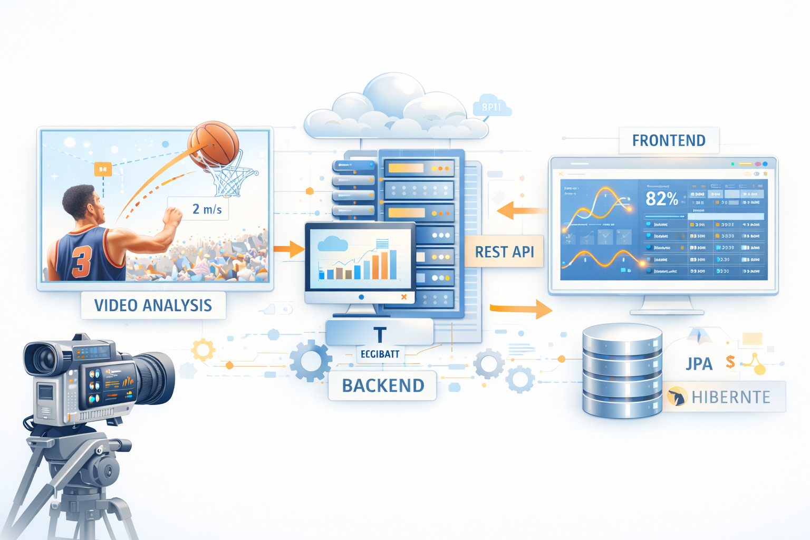

Unter dem Backend versteht man den serverseitigen Teil einer Softwareanwendung. Es ist jener Bereich, der für Nutzerinnen und Nutzer meist nicht direkt sichtbar ist, jedoch die zentrale technische Grundlage eines Systems bildet. Während das Frontend die grafische Oberfläche und Interaktionen bereitstellt, übernimmt das Backend die Verarbeitung von Daten und die Ausführung der eigentlichen Anwendungslogik.

Im Allgemeinen erfüllt ein Backend folgende Kernaufgaben:

- **Anfragen verarbeiten:** 
Das Backend nimmt Anfragen von Clients (z. B. einer Webanwendung) entgegen, prüft diese und verarbeitet sie nach definierten Regeln.

- **Geschäftslogik umsetzen:** Fachliche Abläufe und Regeln (z. B. Zuordnung von Daten zu einer Trainingseinheit) werden zentral im Backend implementiert.

- **Daten speichern und verwalten:** Das Backend stellt die Verbindung zur Datenbank her und sorgt dafür, dass Daten strukturiert, konsistent und dauerhaft gespeichert werden.

- **Daten bereitstellen:** Über definierte Schnittstellen (typischerweise eine API) gibt das Backend Daten in strukturierter Form (z. B. JSON) an das Frontend zurück.

- **Sicherheit und Qualität im Betrieb:** Je nach System gehören auch Authentifizierung/Autorisierung, Fehlerbehandlung, Logging und Monitoring zu den Aufgaben des Backends.

Im Kontext dieser Diplomarbeit ist das Backend besonders wichtig, da es die Analyseergebnisse aus der Videoverarbeitung entgegennimmt, in einer relationalen Datenbank speichert, statistisch auswertet und die daraus entstehenden Kennzahlen über eine REST-Schnittstelle dem Frontend zur Visualisierung zur Verfügung stellt. Dadurch fungiert das Backend als zentrale Logik- und Datenebene des gesamten Systems.[@MainagenturBackend]

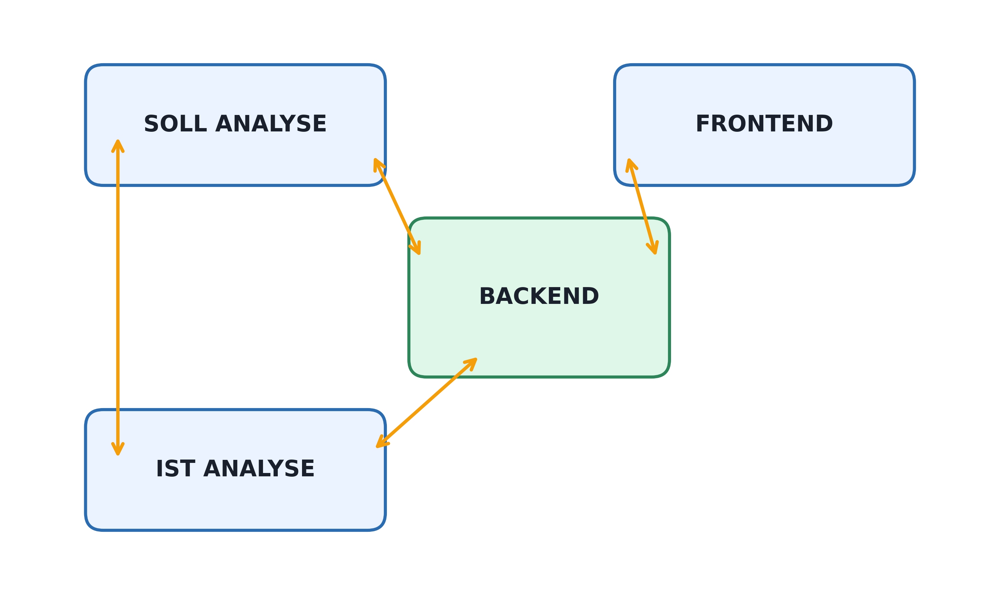

## Spring Boot

### Was ist Spring Boot
Spring Boot ist ein Java-basiertes Framework zur Entwicklung von serverseitigen Anwendungen. Es baut auf dem Spring Framework auf und erweitert dieses um Funktionen, die den Projektstart und die Konfiguration deutlich vereinfachen. Ziel ist es, schnell lauffähige und produktionsnahe Anwendungen zu erstellen, ohne dass umfangreiche manuelle Konfiguration notwendig ist.

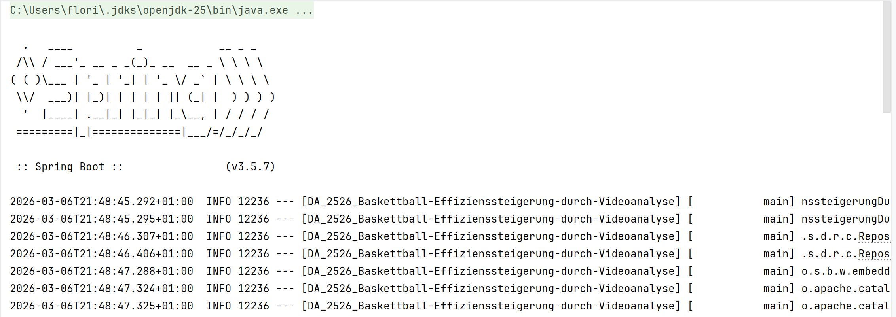

Ein zentrales Konzept ist dabei „Convention over Configuration“. Das bedeutet, dass Spring Boot für viele Standardfälle sinnvolle Voreinstellungen mitliefert. Zusätzlich enthält Spring Boot einen eingebetteten Webserver (z. B. Tomcat), wodurch Anwendungen direkt als eigenständiges Programm gestartet werden können, ohne einen externen Application-Server installieren zu müssen. Häufig verwendete Komponenten werden über sogenannte Starter-Abhängigkeiten (z. B. für Web, Datenbank oder Security) gebündelt eingebunden, was die Entwicklung weiter beschleunigt.[@SpringBootOverview]

### Wann soll man Spring Boot verwenden
Spring Boot eignet sich besonders dann, wenn eine Anwendung als Backend-System oder Webservice entwickelt werden soll und dabei eine klare Struktur, Wartbarkeit und schnelle Umsetzung wichtig sind. Typische Einsatzbereiche sind:

  - REST-Backends für Web- oder Mobile-Anwendungen

  - Anwendungen, die Datenbanken nutzen und Daten persistieren (z. B. über JPA/Hibernate)

  - Projekte, bei denen eine klare Schichtenarchitektur (Controller–Service–Repository) umgesetzt werden soll

  - Systeme, die schnell startbar und einfach deploybar sein sollen (durch eingebetteten Server)

  - Anwendungen, die später erweiterbar sein müssen, z. B. um zusätzliche Endpunkte, Logik oder Sicherheitsfunktionen

In vielen Projekten ist Spring Boot eine gute Wahl, weil es die technische Basis bereitstellt, die Entwicklung beschleunigt und gleichzeitig professionelle Standards für größere Anwendungen unterstützt.[@SpringBootUseCases]

### Was ist eine REST-API
Eine REST-API (Representational State Transfer Application Programming Interface) ist eine Programmierschnittstelle, die die Kommunikation zwischen unterschiedlichen Softwaresystemen über das HTTP-Protokoll ermöglicht. Dabei werden Daten und Funktionen in Form von Ressourcen bereitgestellt, auf die Clients gezielt zugreifen können.

Die Datenübertragung erfolgt häufig im JSON-Format. Ein Client kann beispielsweise Spieler-, Trainings- oder Statistikdaten abrufen sowie neue Daten an das Backend senden. REST beschreibt dabei ein allgemeines Konzept zur Gestaltung von Webschnittstellen und ist nicht an ein bestimmtes Framework gebunden. Die konkrete Umsetzung kann beispielsweise mit Technologien wie Spring Boot erfolgen.[@RedHatRESTAPI]

### Wie ist die Funktionsweise von REST-API
Die Funktionsweise einer REST-API basiert auf dem Prinzip, dass Daten als Ressourcen betrachtet werden, die über eindeutige URLs (Endpunkte) erreichbar sind. Jede Ressource wird über HTTP-Methoden angesprochen, wobei jede Methode eine bestimmte Bedeutung hat:

  - GET: Daten abrufen (z. B. alle Spieler anzeigen)

  - POST: neue Daten anlegen (z. B. neuen Spieler erstellen)

  - PUT / PATCH: bestehende Daten ändern (z. B. Trainingseinheit aktualisieren)

  - DELETE: Daten löschen (z. B. Spieler entfernen)

Zusätzlich verwendet eine REST-API HTTP-Statuscodes, um das Ergebnis einer Anfrage zu beschreiben. Beispiele sind:

  - 200 (OK): Anfrage erfolgreich

  - 201 (Created): Ressource erfolgreich erstellt

  - 400 (Bad Request): ungültige Anfrage

  - 404 (Not Found): Ressource nicht gefunden

Ein wesentliches Merkmal von REST ist außerdem Statelessness: Jede Anfrage enthält alle notwendigen Informationen, sodass der Server keinen Zustand zwischen zwei Anfragen speichern muss. Das macht Systeme oft besser skalierbar und einfacher wartbar.[@RedHatRESTPrinciples]

### Was versteht man unter CRUD?
CRUD ist ein Grundkonzept der Datenverarbeitung und beschreibt die vier grundlegenden Operationen, die in fast jedem datenbasierten System vorkommen. CRUD steht für:

  - Create: Daten erstellen (z. B. neuen Spieler anlegen)

  - Read: Daten lesen/abrufen (z. B. Spielerinformationen anzeigen)

  - Update: Daten verändern (z. B. Trainingssession bearbeiten)

  - Delete: Daten löschen (z. B. Wurfdatensatz entfernen)

Diese vier Operationen bilden die Basis für die Verwaltung von Daten in Datenbanken und werden in REST-APIs meist direkt durch HTTP-Methoden abgebildet: Create -> POST, Read -> GET, Update -> PUT/PATCH, Delete -> DELETE.[@IBMCRUD]

## Spring Initializer
Der Spring Initializr ist ein webbasiertes Tool, das die Erstellung eines neuen Spring-Boot-Projekts stark vereinfacht. Anstatt ein Projekt manuell aufzusetzen und alle benötigten Bibliotheken selbst zu konfigurieren, kann über den Spring Initializr in wenigen Schritten eine fertige Projektstruktur generiert werden.

Dabei wählt man unter anderem:

  - Programmiersprache (meist Java)

  - Build-Tool (Maven oder Gradle)

  - Spring-Boot-Version

  - sowie die benötigten Dependencies (z. B. Spring Web, Spring Data JPA, H2 Database)

Auf Basis dieser Auswahl erstellt der Spring Initializr automatisch ein Projekt mit:

  - einer passenden Ordnerstruktur,

  - einer Startklasse (Main Application),

  - einer vorkonfigurierten Build-Datei (pom.xml bei Maven),

  - und den notwendigen Grundeinstellungen für Spring Boot.

Der Vorteil besteht darin, dass die grundlegende Projektkonfiguration schnell, standardisiert und fehlerarm erfolgt. Dadurch kann direkt mit der eigentlichen Entwicklung begonnen werden, ohne Zeit in manuelles Setup zu investieren.[@SpringInitializrDocs]

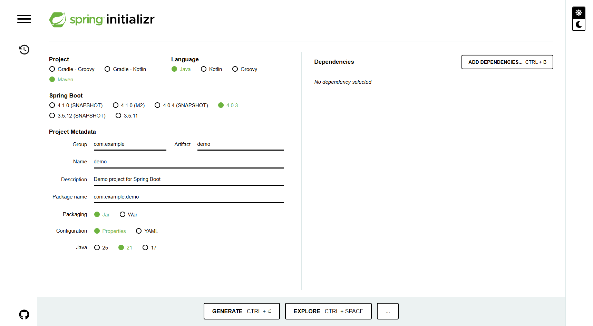

## Java / JavaScript

### Was ist Java?
Java ist eine objektorientierte Programmiersprache, die ursprünglich mit dem Ziel entwickelt wurde, plattformunabhängige Anwendungen zu ermöglichen. Ein zentrales Prinzip von Java lautet „Write once, run anywhere“. Java-Programme werden dabei in Bytecode übersetzt und anschließend von der Java Virtual Machine (JVM) ausgeführt, wodurch dieselbe Anwendung auf unterschiedlichen Betriebssystemen laufen kann.

Java wird häufig für größere, strukturierte Softwareprojekte eingesetzt, da die Sprache stark typisiert ist, viele Bibliotheken bietet und sich gut für wartbare und skalierbare Anwendungen eignet.[@OracleJavaOverview]

### Was ist JavaScript
JavaScript ist eine Skriptsprache, die hauptsächlich für die Entwicklung von interaktiven Webanwendungen verwendet wird. Ursprünglich wurde JavaScript dafür entwickelt, Webseiten im Browser dynamisch zu machen, z. B. durch Formvalidierung, Animationen oder das Nachladen von Inhalten ohne Seitenreload.

Heute wird JavaScript nicht nur im Browser, sondern auch serverseitig eingesetzt (z. B. mit Node.js). Dadurch kann JavaScript sowohl im Frontend als auch im Backend verwendet werden, je nach Technologie-Stack.[@MDNJavaScriptIntroduction]

### Wofür wird Java verwendet
Java wird in vielen Bereichen eingesetzt, besonders dort, wo Stabilität, Struktur und Performance wichtig sind. Typische Anwendungsbereiche sind:

  - Backend-Entwicklung (z. B. REST-APIs mit Spring Boot)

  - Unternehmenssoftware (z. B. ERP-Systeme, Verwaltungssoftware)

  - Android-App-Entwicklung (klassisch mit Java, heute oft Kotlin)

  - Server- und Cloud-Anwendungen, bei denen Skalierbarkeit entscheidend ist

In diesem Projekt ist Java vor allem relevant, weil damit das Backend umgesetzt wird und Spring Boot als Java-Framework darauf aufbaut.[@OracleJavaApplications]

### Wofür wird JavaScript verwendet
JavaScript wird vor allem für Webentwicklung genutzt, insbesondere für alles, was im Browser interaktiv sein soll. Typische Einsatzbereiche sind:

  - Frontend-Entwicklung (Benutzeroberflächen, dynamische Inhalte)

  - Web-Frameworks wie React, Vue oder Angular

  - Kommunikation mit Backends über APIs (z. B. REST-Aufrufe)

  - Backend-Entwicklung mit Node.js, wenn JavaScript auch serverseitig genutzt wird

In vielen Projekten wird JavaScript eingesetzt, um das Frontend zu bauen, das dann über eine API mit dem Backend kommuniziert.[@MDNJavaScriptOverview]

### Unterschied zwischen Java und JavaScript
Obwohl die Namen ähnlich klingen, sind Java und JavaScript zwei unterschiedliche Programmiersprachen mit unterschiedlichen Zielen und Eigenschaften:

  - **Syntax und Konzept:** Java ist objektorientiert und stark typisiert, während JavaScript dynamisch typisiert ist und flexibler verwendet werden kann.

  - **Laufzeitumgebung:** Java läuft auf der JVM, JavaScript läuft primär im Browser oder serverseitig über Node.js.

  - **Einsatzgebiet:** Java wird häufig für Backend-Systeme, Unternehmenssoftware und große Anwendungen verwendet. JavaScript ist die Standardsprache für interaktive Webseiten und moderne Web-Frontends.

  - **Struktur:** Java ist in der Regel strenger strukturiert (Klassen, Typen, Compile-Time Checks), während JavaScript mehr Freiheit bietet, aber dadurch auch fehleranfälliger sein kann, wenn kein klarer Stil eingehalten wird.

Java ist eine klassische Sprache für strukturierte, größere Anwendungen (z. B. Backends), während JavaScript vor allem für Webentwicklung und Interaktivität im Browser eingesetzt wird.[@MDNJavaScriptVsJava]

## Postman
Postman ist ein Tool zur Entwicklung und zum Testen von REST-APIs. Es ermöglicht, HTTP-Anfragen wie GET, POST, PUT/PATCH und DELETE direkt an ein Backend zu senden, ohne dass dafür bereits ein fertiges Frontend notwendig ist. Dabei können Request-Details wie Header, Parameter und ein JSON-Body einfach eingestellt werden. Postman zeigt anschließend die Antwort des Servers übersichtlich an, inklusive Statuscode und Rückgabedaten. Dadurch eignet sich das Tool besonders gut, um API-Endpunkte während der Backend-Entwicklung zu prüfen, Fehler zu analysieren und die Funktionalität der Schnittstelle schrittweise zu verifizieren.[@PostmanOverview]

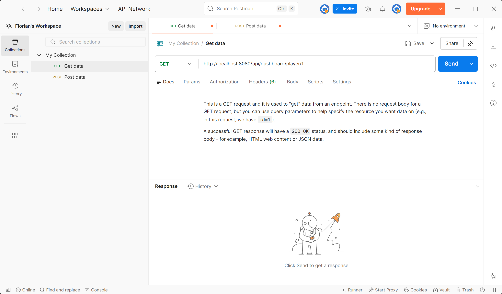

## Datenbank
### Was ist eine Datenbank?
Eine Datenbank ist ein System zur strukturierten Speicherung, Organisation und Verwaltung von Daten. Im Gegensatz zu einfachen Dateien werden Informationen in einer Datenbank nach klaren Regeln abgelegt, sodass sie gezielt durchsucht und verarbeitet werden können. Verwaltet wird eine Datenbank in der Regel durch ein Datenbankmanagementsystem (DBMS), das den Zugriff regelt und Funktionen für das Speichern, Abrufen und Bearbeiten von Daten bereitstellt. Dadurch können Daten nicht nur dauerhaft gespeichert, sondern auch konsistent und nachvollziehbar verwaltet werden.[@OracleDatabaseOverview]

### Wofür werden Datenbanken verwendet?
Datenbanken werden verwendet, um Daten dauerhaft, sicher und effizient verfügbar zu machen. Sie ermöglichen es, Informationen schnell abzufragen, zu filtern, zu sortieren und zu ändern, auch wenn sehr große Datenmengen vorhanden sind. Zudem helfen Datenbanken dabei, Daten logisch zu strukturieren und Beziehungen zwischen verschiedenen Objekten abzubilden (z. B. ein Spieler mit mehreren Trainingseinheiten oder Würfen). In Backend-Systemen sind Datenbanken besonders wichtig, weil sie die Grundlage dafür bilden, dass Anwendungsdaten wie Benutzer, Trainingsdaten oder Analyseergebnisse gespeichert und später für Auswertungen oder zur Anzeige im Frontend wieder abgerufen werden können.[@IBMDatabaseDefinition]

### Was sind Relationale Datenbanken

Relationale Datenbanken speichern Informationen in tabellarischer Form. Die Daten sind in Tabellen (Relationen) organisiert, die aus Datensätzen (Zeilen/Tupeln) und Attributen (Spalten) bestehen. Ein Datensatz beschreibt dabei ein konkretes Objekt, beispielsweise einen Spieler oder einen einzelnen Basketballwurf, während die Attribute die jeweiligen Eigenschaften dieses Objekts (z. B. Name, Zeitpunkt, Winkel oder Treffer) definieren.

Zur eindeutigen Identifikation eines Datensatzes wird in jeder Tabelle ein Primärschlüssel verwendet. Beziehungen zwischen verschiedenen Tabellen werden über Fremdschlüssel umgesetzt, indem ein Attribut einer Tabelle auf den Primärschlüssel einer anderen Tabelle verweist. Auf diese Weise lassen sich Daten logisch miteinander verknüpfen, ohne Informationen mehrfach speichern zu müssen. Dies reduziert Redundanzen, erhöht die Datenkonsistenz und erleichtert die Durchführung von Abfragen und statistischen Auswertungen, da Zusammenhänge zwischen Objekten (z. B. Spieler und Trainingseinheit und Würfe) klar modelliert werden können.

Aufgrund dieser Eigenschaften eignet sich das relationale Datenbankmodell besonders gut für das vorliegende Projekt: Die aus der Videoanalyse entstehenden Daten müssen langfristig gespeichert, eindeutig einer Trainingseinheit bzw. einem Spieler zugeordnet und anschließend für Kennzahlen wie Trefferquoten, Durchschnittswerte oder Abweichungen zwischen Soll- und Ist-Flugbahn ausgewertet werden. Relationale Datenbanken bieten dafür eine stabile und strukturierte Grundlage.[@OracleRelationalDatabase]

## H2 Datenbank
Die H2-Datenbank ist ein leichtgewichtiges, relationales Datenbankmanagementsystem (DBMS), das in Java geschrieben wurde und besonders häufig für Entwicklung, Tests und Prototyping eingesetzt wird. Ein großer Vorteil von H2 ist, dass sie ohne aufwendige Installation verwendet werden kann und sich sehr einfach in Java- und Spring-Boot-Projekte integrieren lässt.

H2 kann in zwei typischen Betriebsarten genutzt werden:

  - In-Memory-Modus: Die Datenbank läuft nur im Arbeitsspeicher und ist nach dem Beenden der Anwendung wieder leer. Das ist ideal für schnelle Tests, da keine Dateien verwaltet werden müssen.

  - File-Modus: Die Daten werden in einer Datei gespeichert und bleiben auch nach einem Neustart erhalten.

In Spring Boot wird H2 oft als Entwicklungsdatenbank verwendet, weil sie schnell startbar ist und gut mit Spring Data JPA/Hibernate zusammenarbeitet. Zusätzlich bietet H2 eine integrierte Web-Konsole, über die Tabellen, Inhalte und SQL-Abfragen bequem im Browser angesehen werden können. Für produktive Systeme wird häufig später auf leistungsfähigere Datenbanken (z. B. PostgreSQL oder MySQL) umgestellt, während H2 weiterhin für Tests und lokale Entwicklung genutzt werden kann.[@H2DatabaseOverview]

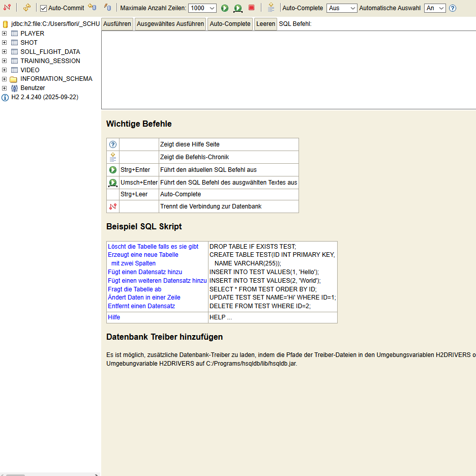

## MySQL
MySQL ist ein weit verbreitetes relationales Datenbankmanagementsystem (RDBMS), das zur dauerhaften Speicherung und Verwaltung strukturierter Daten eingesetzt wird. Die Daten werden in Tabellen organisiert und können mithilfe von SQL (Structured Query Language) effizient abgefragt und bearbeitet werden. MySQL wird häufig in Web- und Backend-Anwendungen verwendet, weil es stabil, performant und für den produktiven Dauerbetrieb geeignet ist. Typische Einsatzbereiche sind Anwendungen mit Nutzer- und Trainingsdaten, Content-Systeme oder allgemeine Geschäftsanwendungen, bei denen Daten langfristig gespeichert und zuverlässig verwaltet werden müssen. In Spring-Boot-Projekten lässt sich MySQL über einen JDBC-Treiber anbinden und wird oft gemeinsam mit Spring Data JPA/Hibernate verwendet, um Datenbankzugriffe strukturiert über das Objektmodell umzusetzen.[@MySQLOverview]

### Was ist der Unterschied zwischen H2 Datenbank und MySql
Die H2-Datenbank und MySQL sind beide relationale Datenbanken, unterscheiden sich jedoch vor allem in ihrem Einsatzgebiet und ihrer Betriebsart:

- **Einsatzbereich:** H2 wird meist für Entwicklung und Tests genutzt, während MySQL typischerweise in produktiven Systemen eingesetzt wird.

- **Installation und Betrieb:** H2 ist sehr leichtgewichtig und kann ohne große Einrichtung direkt im Projekt laufen (z. B. In-Memory). MySQL benötigt in der Regel eine separate Installation und läuft als eigener Datenbankserver.

- **Persistenz:** H2 kann im In-Memory-Modus betrieben werden (Daten gehen nach dem Beenden verloren) oder als Datei gespeichert werden. MySQL speichert Daten standardmäßig dauerhaft auf dem Server.

- **Skalierbarkeit und Leistung:** MySQL ist für größere Datenmengen, mehrere Benutzer und dauerhafte Nutzung optimiert. H2 ist eher für kleinere lokale Umgebungen gedacht.[@BaeldungH2vsMySQL]


## Entity-Relationship-Modell

Relationale Datenbanken speichern Informationen in tabellarischer Form. Die Daten sind in Tabellen (Relationen) organisiert, die aus Datensätzen (Zeilen/Tupeln) und Attributen (Spalten) bestehen. Ein Datensatz beschreibt dabei ein konkretes Objekt, beispielsweise einen Spieler oder einen einzelnen Basketballwurf, während die Attribute die jeweiligen Eigenschaften dieses Objekts (z. B. Name, Zeitpunkt, Winkel oder Treffer) definieren.

Zur eindeutigen Identifikation eines Datensatzes wird in jeder Tabelle ein Primärschlüssel verwendet. Ein Primärschlüssel ist ein Attribut (oder eine Kombination mehrerer Attribute), dessen Wert in der Tabelle eindeutig ist und somit jeden Datensatz klar identifiziert, z. B. eine automatisch vergebene ID. Beziehungen zwischen verschiedenen Tabellen werden über Fremdschlüssel umgesetzt. Ein Fremdschlüssel ist ein Attribut in einer Tabelle, das auf den Primärschlüssel einer anderen Tabelle verweist. Dadurch kann beispielsweise ein Wurf einem bestimmten Spieler oder einer konkreten Trainingseinheit zugeordnet werden, ohne die Spielerdaten im Wurf-Datensatz erneut speichern zu müssen.

Durch diese Verknüpfungen lassen sich Daten logisch miteinander verbinden, ohne Informationen mehrfach abzulegen. Mehrfach gespeicherte Informationen bezeichnet man als Redundanzen (z. B. wenn der Name eines Spielers in vielen Wurf-Datensätzen wiederholt gespeichert wird). Redundanzen erhöhen das Risiko von Fehlern, da Änderungen dann an mehreren Stellen durchgeführt werden müssten. Die Vermeidung solcher Redundanzen verbessert die Datenkonsistenz, also die Eigenschaft, dass Daten innerhalb der Datenbank widerspruchsfrei und korrekt bleiben (z. B. ein Spielername ist überall gleich und nicht in unterschiedlichen Varianten gespeichert). Zusätzlich erleichtert diese Struktur die Durchführung von Abfragen und statistischen Auswertungen, da Zusammenhänge zwischen Objekten (z. B. Spieler und Trainingseinheit und Würfe) klar modelliert und gezielt ausgewertet werden können.[@IBMRelationalDatabase]

### Zentrale Begriffe des ER-Modells

- **Entität**  
  Eine Entität beschreibt ein eindeutig identifizierbares Objekt aus dem Anwendungsbereich. Im Projekt sind dies beispielsweise Spieler*innen, Trainingseinheiten oder einzelne Würfe. Entitäten werden später als Tabellen in der Datenbank umgesetzt.

- **Attribut**  
  Attribute beschreiben die Eigenschaften einer Entität und entsprechen den Spalten einer Tabelle. Beispiele hierfür sind der Name eines Spielers, der Zeitpunkt einer Trainingseinheit oder der Abwurfwinkel eines Wurfes.

- **Beziehung**  
  Beziehungen stellen die Verknüpfungen zwischen Entitäten dar. Sie definieren, wie Objekte zueinander in Beziehung stehen, etwa dass eine Spielerin mehrere Trainingseinheiten absolvieren kann oder dass eine Trainingseinheit aus mehreren Würfen besteht.[@LucidchartERModel]

### Unterschied zwischen Beziehungen und Kardinalitäten

- **Beziehungen** beschreiben, dass zwei Entitäten miteinander verknüpft sind (z. B. Spieler hat Trainingseinheiten).
- **Kardinalitäten** beschreiben, wie viele Objekte an dieser Beziehung beteiligt sein können (z. B. 1:n = ein Spieler kann viele Trainingseinheiten haben).[@LucidchartERRelationships]

### Was sind Kardinalitäten
Neben Entitäten, Attributen und Beziehungen sind Kardinalitäten ein zentrales Element des ER-Modells. Sie beschreiben, wie viele Objekte einer Entität mit Objekten einer anderen Entität in Beziehung stehen können. Kardinalitäten helfen dabei, die Struktur einer Datenbank korrekt zu planen und später sauber in Tabellen und Fremdschlüssel-Beziehungen umzusetzen.

- **1:1-Beziehung (One-to-One)**

  Bei einer 1:1-Beziehung ist jedes Objekt der ersten Entität genau einem Objekt der zweiten Entität zugeordnet – und umgekehrt.
  Beispiel: Ein Personalausweis gehört genau zu einer Person und eine Person hat genau einen Personalausweis.
  In relationalen Datenbanken wird dies meist über einen Fremdschlüssel realisiert, der eindeutig sein muss (Unique-Constraint).

- **1:n-Beziehung (One-to-Many)**

  Eine 1:n-Beziehung bedeutet, dass ein Objekt der ersten Entität mit mehreren Objekten der zweiten Entität verbunden sein kann, während ein Objekt der zweiten Entität nur einem Objekt der ersten Entität zugeordnet ist.
  Beispiel: Ein Spieler kann mehrere Trainingseinheiten absolvieren, aber eine Trainingseinheit gehört zu genau einem Spieler.
  In der Datenbank wird dies typischerweise dadurch umgesetzt, dass die „n-Seite“ (z. B. Trainingseinheit) einen Fremdschlüssel auf die „1-Seite“ (z. B. Spieler) enthält.

- **n:m-Beziehung (Many-to-Many)**

  Bei einer n:m-Beziehung können mehrere Objekte der ersten Entität mit mehreren Objekten der zweiten Entität verbunden sein.
  Beispiel: Studierende können mehrere Kurse besuchen und jeder Kurs hat mehrere Studierende.
  In relationalen Datenbanken wird eine n:m-Beziehung üblicherweise über eine Zwischentabelle (Join-Tabelle) umgesetzt, die die Primärschlüssel beider Entitäten als Fremdschlüssel enthält.[@LucidchartCardinality]

## ER Diagramme
### Was ist ein ER Diagramm
Ein ER-Diagramm ist eine grafische Darstellung des Entity-Relationship-Modells und wird verwendet, um die Struktur einer Datenbank übersichtlich zu planen. Es zeigt, welche Entitäten im System vorkommen, welche Attribute diese besitzen und wie die Entitäten miteinander in Beziehung stehen. Dadurch eignet sich ein ER-Diagramm besonders gut, um komplexe Datenmodelle verständlich zu visualisieren, bevor diese in einer relationalen Datenbank umgesetzt werden.

### Verschiedene Notationsformen
- **Chen-Notation**

  Eine klassische Darstellung des ER-Modells: Entitäten werden als Rechtecke, Beziehungen als Rauten und Attribute als Ovale dargestellt. Kardinalitäten werden an den Beziehungslinien angegeben. Diese Notation ist sehr anschaulich, wird aber in der Praxis bei großen Modellen schnell unübersichtlich.

- **Crow’s-Foot-Notation (Krähenfuß)**

  Eine sehr verbreitete Notation in der Datenbankpraxis. Entitäten werden als Tabellen-/Boxen dargestellt, Beziehungen als Linien. Die Kardinalitäten werden mit Symbolen wie dem „Krähenfuß“ (für „viele“) visualisiert. Dadurch lassen sich 1:1-, 1:n- und n:m-Beziehungen sehr schnell erkennen.

- **IDEF1X-Notation**

  Eine stärker technisch orientierte Notation, die häufig in professionellen Datenbankdesigns eingesetzt wird. Sie unterscheidet klar zwischen identifizierenden und nicht-identifizierenden Beziehungen und legt großen Fokus auf Schlüsselstrukturen. Dadurch ist sie präzise, aber für Einsteiger oft komplexer.

- **UML-Klassendiagramm (als alternative Darstellung)**

  Zwar kein klassisches ER-Notation-System, aber häufig in objektorientierten Projekten genutzt. Klassen entsprechen dabei oft Entitäten, Attribute werden innerhalb der Klasse dargestellt, und Beziehungen werden als Assoziationen mit Multiplizitäten (z. B. 1..*, 0..1) angegeben. UML ist besonders praktisch, wenn Datenmodell und Code-Design eng zusammenhängen.[@LucidchartERDiagramNotation]

## Java Persistand API (JPA)

### Was ist JPA
JPA (Java Persistence API) ist eine Java-Standard-Spezifikation für die objekt-relationalen Persistierung. Sie beschreibt, wie Java-Objekte (z. B. Player, TrainingSession) in einer relationalen Datenbank gespeichert, gelesen und verwaltet werden können. JPA legt dabei nur fest, wie diese Persistenz grundsätzlich funktionieren soll (z. B. über Annotationen wie ```@Entity```, ```@Id```, ```@OneToMany```), stellt aber selbst keine konkrete Implementierung bereit.

Durch JPA kann die Datenbankarbeit auf einer höheren Ebene erfolgen: Statt SQL direkt zu schreiben, werden Objekte gespeichert und abgefragt, wodurch der Code meist übersichtlicher und besser wartbar wird.[@OracleJPAOverview]

### Was sind Annotationen
Annotationen sind spezielle Markierungen im Quellcode (in Java erkennbar am @-Symbol), mit denen zusätzliche Informationen über Klassen, Methoden oder Variablen angegeben werden. Sie verändern nicht direkt den Programmablauf, sondern dienen Frameworks und Tools als „Metadaten“, um bestimmtes Verhalten automatisch umzusetzen.

Im Backend mit Spring Boot und JPA werden Annotationen z. B. verwendet, um eine Klasse als Datenbank-Entität zu kennzeichnen (```@Entity```), Primärschlüssel festzulegen (```@Id```) oder REST-Endpunkte zu definieren (```@RestController```, ```@GetMapping```). Dadurch wird Konfiguration in den Code verlagert, was die Struktur klarer macht und die Entwicklung vereinfacht.[@OracleJavaAnnotations]


## IntelJ IDA
IntelliJ IDEA ist eine integrierte Entwicklungsumgebung (IDE) von JetBrains, die vor allem für die Entwicklung mit Java (und weiteren Sprachen) verwendet wird. Sie bietet eine zentrale Arbeitsumgebung, in der Quellcode geschrieben, strukturiert, getestet und ausgeführt werden kann. Durch Funktionen wie Code-Vervollständigung, Fehlererkennung in Echtzeit, Refactoring-Werkzeuge und Debugging unterstützt IntelliJ IDEA eine effiziente und saubere Softwareentwicklung.

Im Backend-Kontext wird IntelliJ IDEA typischerweise genutzt, um Spring-Boot-Projekte zu erstellen und zu verwalten, Abhängigkeiten (z. B. über Maven) einzubinden, REST-Controller und Datenbankklassen zu entwickeln sowie die Anwendung lokal zu starten und zu testen. Dadurch erleichtert die IDE sowohl die Umsetzung als auch die Wartung des Backends erheblich.[JetBrainsIntelliJIDEA]


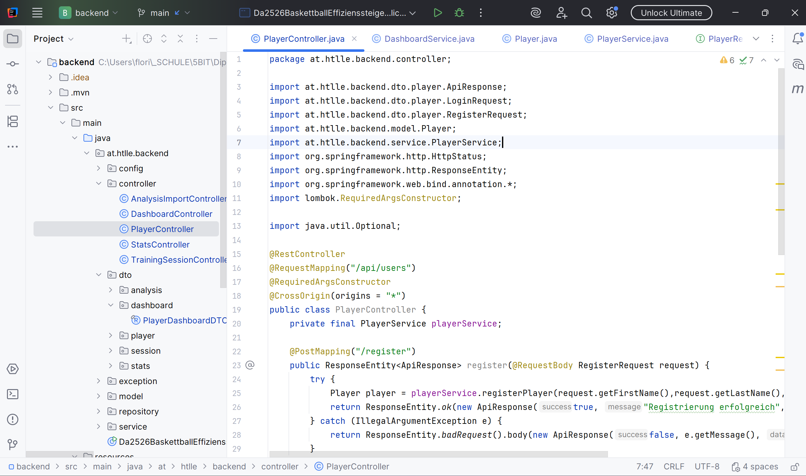


## Visual Studio Code
Visual Studio Code (VS Code) ist ein leichter, plattformübergreifender Code-Editor von Microsoft, der sich durch hohe Erweiterbarkeit auszeichnet. Er unterstützt viele Programmiersprachen wie JavaScript, TypeScript, HTML/CSS, Python und auch Java über Erweiterungen. VS Code bietet Funktionen wie Syntax-Highlighting, Code-Vervollständigung, integriertes Terminal, Debugging sowie eine starke Git-Integration, wodurch die Entwicklung übersichtlich und effizient wird.

VS Code wird häufig für die Frontend-Entwicklung eingesetzt, z. B. zum Erstellen von Weboberflächen mit JavaScript-Frameworks, und eignet sich durch Extensions auch für Backend-Aufgaben. Besonders praktisch ist die flexible Anpassbarkeit: Durch Plugins können zusätzliche Tools, Linter, Formatter oder Framework-Unterstützung eingebunden werden, sodass sich VS Code gut für moderne Webprojekte und die Arbeit im Team eignet.[@MicrosoftVSCodeOverview]

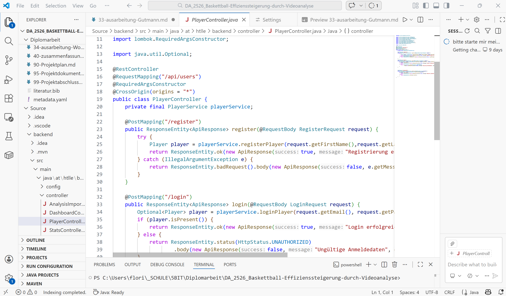


## Praktische Arbeit

### Vorbereitung

Bevor mit der eigentlichen Implementierung des Backends begonnen wurde, fand eine gemeinsame Planungs- und Analysephase mit allen Teammitgliedern statt. Ziel dieser Phase war es, die Schnittstellen zwischen den einzelnen Projektteilen frühzeitig zu definieren und ein gemeinsames Verständnis über benötigte Daten, Formate und Funktionalitäten zu schaffen.

Im Rahmen dieser Abstimmung wurden insbesondere die Ergebnisse der Videoanalyse betrachtet. Dabei wurde festgelegt, welche Parameter bei der Analyse einzelner Würfe entstehen und in welcher Form diese Daten dem Backend bereitgestellt werden. Zu den relevanten Parametern zählen unter anderem Informationen zum Abwurfpunkt, zur Korbposition, zum Abwurfwinkel, zur Anfangsgeschwindigkeit des Balls sowie zusätzliche Werte zur Beschreibung der Flugbahn. Da diese Daten die Grundlage für alle späteren Auswertungen darstellen, war eine eindeutige Definition bereits zu Beginn wesentlich.

Parallel dazu wurden die Anforderungen des Frontends analysiert. Das Frontend benötigt strukturierte und konsistente Daten, um Spieler*innen, Trainingseinheiten sowie statistische Auswertungen übersichtlich darstellen zu können. In gemeinsamen Besprechungen wurde daher festgelegt, welche Informationen vom Backend bereitgestellt werden müssen, beispielsweise Spielerstatistiken, Session-Zusammenfassungen und zeitliche Leistungsentwicklungen. Diese Abstimmung stellte sicher, dass das Backend nicht isoliert entwickelt wird, sondern technisch und fachlich auf die Anforderungen der Benutzeroberfläche abgestimmt ist.

Auf Basis der Analyse wurden die zentralen Aufgaben des Backends konkretisiert. Der Fokus lag dabei auf dem Entwurf einer geeigneten Datenbankstruktur, der Modellierung der benötigten Datenobjekte sowie der Bereitstellung von Schnittstellen zur Kommunikation mit dem Frontend. Durch dieses strukturierte Vorgehen konnte eine belastbare Grundlage geschaffen werden, auf der die weitere Backend-Entwicklung systematisch aufbauen konnte.

### Ergebnis der Planungsphase

Als Ergebnis der gemeinsamen Planungsphase konnten die grundlegenden Anforderungen an das Backend eindeutig festgelegt werden. Ziel war es, einen klaren und nachvollziehbaren Datenfluss zwischen Videoanalyse, Backend und Frontend zu definieren und spätere Schnittstellenänderungen möglichst zu vermeiden.

Ein zentrales Ergebnis war die Festlegung der Daten, die aus der Videoanalyse an das Backend übergeben werden. Für jeden analysierten Basketballwurf werden strukturierte Datensätze erzeugt, die sowohl geometrische als auch zeitliche Informationen enthalten. Dazu zählen unter anderem der Abwurfpunkt des Balls, die Position des Korbes, der Abwurfwinkel, die Anfangsgeschwindigkeit sowie zusätzliche Parameter zur Beschreibung der berechneten Soll-Flugbahn und der erkannten Ist-Flugbahn. Diese Daten werden automatisiert in Form von JSON-Dateien erzeugt und dienen als Eingabe für den Importprozess im Backend.

Ein weiterer wesentlicher Punkt war die Definition der internen Datenhaltung. Es wurde festgelegt, dass die Daten in einer relationalen Datenbank gespeichert werden, um eine klare Strukturierung, konsistente Verknüpfungen sowie langfristige Persistenz zu gewährleisten. Dabei wurden zentrale Entitäten identifiziert, darunter Spieler*innen, Trainingseinheiten, einzelne Würfe sowie zugehörige Analyse- und Flugdaten. Diese Entitäten stehen in definierten Beziehungen zueinander und bilden die Grundlage für das spätere Entity-Relationship-Modell.

Zusätzlich wurden die Anforderungen des Frontends konkretisiert. Das Frontend benötigt nicht nur Rohdaten einzelner Würfe, sondern insbesondere aggregierte Informationen in Form statistischer Auswertungen. Daher wurde beschlossen, dass die Berechnung dieser Statistiken vollständig im Backend erfolgt. Das Backend stellt dem Frontend somit aufbereitete Ergebnisse zur Verfügung, beispielsweise Trefferquoten, Durchschnittswerte und zeitliche Leistungsentwicklungen. Dadurch wird die Komplexität im Frontend reduziert und eine konsistente Berechnungslogik sichergestellt.

Abschließend wurde festgelegt, dass die Kommunikation zwischen Frontend und Backend über eine REST-Schnittstelle erfolgt. Die Datenübertragung findet im JSON-Format statt, wodurch eine plattformunabhängige und erweiterbare Kommunikation ermöglicht wird. Diese Entscheidungen bilden die Grundlage für die nachfolgenden technischen Umsetzungen im Backend und stellen sicher, dass die einzelnen Projektteile nahtlos ineinandergreifen.

## Technische Umsetzung
Nach Abschluss der Planungsphase wurde das Backend technisch umgesetzt. Ziel war es, eine stabile Basis zu schaffen, auf der Daten aus der Videoanalyse importiert, dauerhaft gespeichert und über eine REST-Schnittstelle für das Frontend bereitgestellt werden können. Für die Implementierung wurde ein Java-basierter Technologie-Stack gewählt, da dieser insbesondere in Kombination mit Spring Boot eine strukturierte Entwicklung von Webservices ermöglicht.

### Projektanlage und Entwicklungsumgebung 

Die Erstellung des Projekts erfolgte über den Spring Initializr, wodurch eine standardisierte Grundstruktur für ein Spring-Boot-Projekt erzeugt werden konnte.
 Als Build-Tool wurde Maven verwendet, um Abhängigkeiten einheitlich zu verwalten und den Build-Prozess nachvollziehbar zu gestalten. 
 
 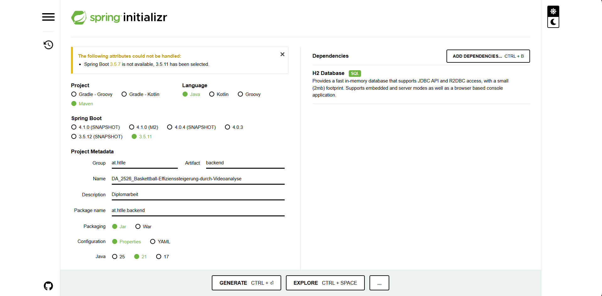

Erklärung der einzelnen Komponenten

  - Project: Maven
  Du hast Maven als Build- und Dependency-Management-Tool gewählt. Dadurch werden Bibliotheken (Dependencies) über die pom.xml verwaltet und das Projekt kann standardisiert gebaut/gestartet werden.

  - Language: Java
  Die Programmiersprache des Backends ist Java.

  -  Spring Boot Version (z. B. 3.5.11)
  Hier legst du fest, welche Spring-Boot-Version verwendet wird. Im Hinweis oben sieht man, dass eine ursprünglich gewünschte Version nicht verfügbar war und daher automatisch eine verfügbare Version ausgewählt wurde.

  - Project Metadata

  Diese Angaben bestimmen Identität und Struktur des Projekts:
  - Group (z. B. at.htlle): „Namensraum“/Organisation, wird später Teil des     Package-Namens.
  - Artifact (z. B. backend): Name des erzeugten Artefakts (Projekt-/Jar-Name).
  - Name: Anzeigename des Projekts.
  - Description: Kurze Beschreibung (wird z. B. in der pom.xml geführt).
  -  Package name (z. B. at.htlle.backend): Basis-Package, unter dem deine    Java-Klassen liegen (wichtig für saubere Struktur).

  - Packaging: Jar
  Das Projekt wird als JAR gebaut, also als eigenständig ausführbare Anwendung (typisch für Spring Boot).

  - Configuration: Properties
  Konfiguration wird primär in application.properties vorgenommen (alternativ wäre YAML möglich).

  - Java Version: 21
  Das Projekt nutzt Java 21 als Zielversion.

  - Dependencies: H2 Database
  Für das Projekt H2-Datenbank als Abhängigkeit ausgewählt. Dadurch kann das Backend in der Entwicklungsphase eine integrierte, leichtgewichtige relationale Datenbank nutzen (inkl. optionaler H2-Console), ohne einen externen Datenbankserver installieren zu müssen.[@SpringBootMavenSetup]

Nachdem alle gewünschten Angaben im Spring Initializr korrekt eingetragen und die benötigten Dependencies ausgewählt wurden, kann das Projekt über „Generate“ erstellt werden. Dabei wird ein fertiges Spring-Boot-Startprojekt als ZIP-Datei heruntergeladen, das bereits die grundlegende Ordnerstruktur, eine Startklasse sowie die Build-Konfiguration (bei Maven die pom.xml) enthält. Dieses Projekt wird anschließend entpackt und in der Entwicklungsumgebung (z. B. IntelliJ IDEA) importiert, sodass direkt mit der Implementierung des Backends begonnen werden kann.

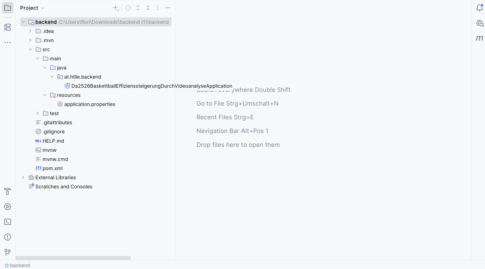

## Erstellung eines ER-Diagrammsa

Bevor die Datenbank technisch angebunden und im Backend umgesetzt wurde, wurde das Datenmodell zunächst in Form eines ER-Diagramms grafisch dargestellt. Dafür wurde das Tool Draw.io verwendet, da es eine einfache und übersichtliche Modellierung von Entitäten, Attributen und Beziehungen ermöglicht.

Im ER-Diagramm wurden die zentralen Entitäten des Projekts definiert, darunter Player, TrainingSession, Shot, SollFlightData und Video. Zusätzlich wurden die wichtigsten Attribute (z. B. Identifikations-IDs, Zeitpunkte, Winkel, Geschwindigkeiten) sowie die Beziehungen zwischen den Entitäten festgelegt. Besonders relevant war dabei die korrekte Abbildung der Kardinalitäten, beispielsweise dass ein Spieler mehrere Trainingseinheiten haben kann und eine Trainingseinheit aus mehreren Würfen besteht.

Durch diese grafische Modellierung konnte das Datenbankschema bereits vor der Implementierung logisch überprüft werden. Das ER-Diagramm diente anschließend als Grundlage für die Umsetzung der Datenbankstruktur im Backend mit JPA/Hibernate und half dabei, die spätere Implementierung konsistent und nachvollziehbar durchzuführen.

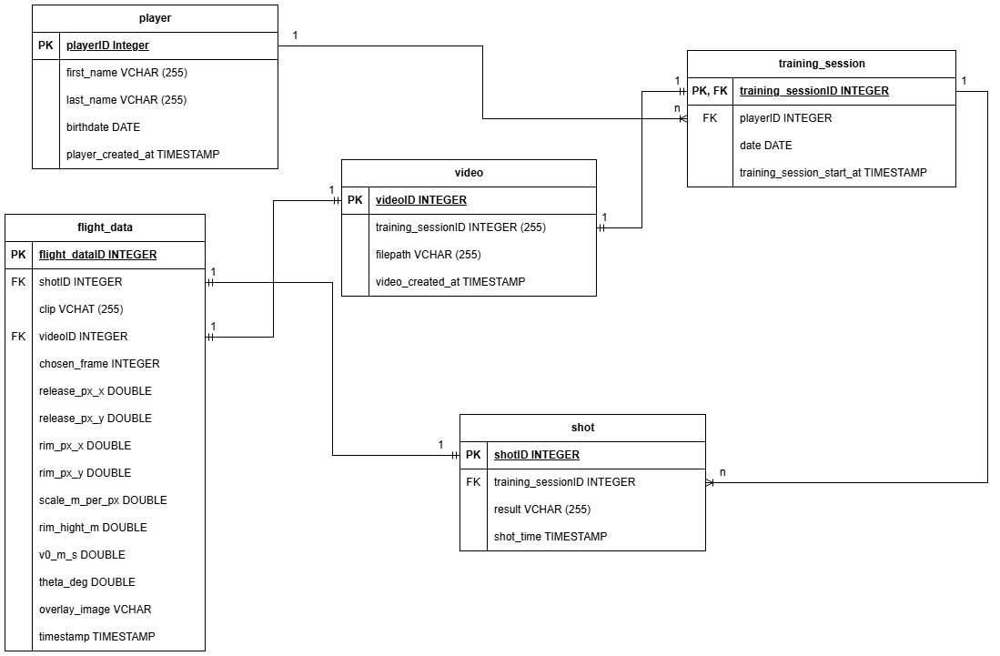

## Datenbankanbindung
Nach der Erstellung des ER-Diagramms wurde im nächsten Schritt die Datenbankanbindung im Backend umgesetzt. Ziel war es, eine funktionierende Persistenzschicht bereitzustellen, damit die aus der Videoanalyse importierten Daten dauerhaft gespeichert und für Abfragen sowie statistische Auswertungen verwendet werden können. Für die Entwicklungsphase wurde eine H2-Datenbank eingesetzt, da sie leichtgewichtig ist und ohne zusätzliche Installation direkt mit Spring Boot betrieben werden kann.

### Test der Datenbankverbindung mit einer lokalen H2-Datenbank

Um die korrekte Datenbankanbindung frühzeitig zu überprüfen, wurde zunächst eine H2-Dateidatenbank manuell angelegt. Dafür wurde im Ordner

```C:Users\flori\_SCHULE\5BIT\Diplomarbeit\DA_2526_Baskettball-Effizienssteigerung-durch-Videoanalyse\Source\backend\src\main\resources```

eine Datenbankdatei mit dem Namen da_basketball.mv.db erstellt. Diese Vorgehensweise diente dazu, die Verbindung zu einer persistenten, dateibasierten H2-Datenbank zu testen (im Gegensatz zum reinen In-Memory-Betrieb).

Anschließend wurde über die H2-Console eine Verbindung mit dem H2-Treiber (org.h2.Driver) und der entsprechenden JDBC-URL hergestellt. Über die Funktionen „Verbindung testen“ und „Verbinden“ konnte überprüft werden, ob das Backend bzw. die Console korrekt auf die Datenbankdatei zugreifen kann. Damit war sichergestellt, dass die Datenbankkonfiguration grundsätzlich funktioniert und Daten persistent in einer lokalen Datei gespeichert werden können.

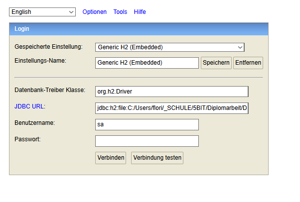

### Datenbankverbindung im Projekt (Springboot + H2)

Nachdem die Funktion der H2-Dateidatenbank über die Console erfolgreich getestet wurde, wurde im nächsten Schritt die Datenbankverbindung direkt im Spring-Boot-Projekt eingerichtet. Ziel war es, dass das Backend beim Start automatisch eine Verbindung zur H2-Datenbank herstellt und alle Persistenzoperationen (Speichern, Lesen, Auswerten) über diese Verbindung durchführen kann.

#### Schritt 1 : Einbindung der benötigten Bibiotheken (Dependencies) über Maven
Im ersten Schritt wurde das Spring-Boot-Projekt um die notwendigen Bibliotheken zur Datenpersistenz erweitert. In einem Maven-Projekt werden diese Abhängigkeiten zentral in der Datei pom.xml definiert, wodurch Maven die benötigten Libraries automatisiert verwaltet und in den Build-Prozess integriert. Für den Zugriff auf relationale Datenbanken wurde spring-boot-starter-data-jpa eingebunden, welches die Persistenz über JPA ermöglicht und standardmäßig Hibernate als ORM-Implementierung verwendet. Als Entwicklungsdatenbank wurde die H2-Datenbank über die Dependency h2 integriert, wodurch lokale Tests ohne zusätzlichen Datenbankserver möglich sind. Zusätzlich wurde spring-boot-starter-web verwendet, um das Backend als Webservice mit REST-Endpunkten zu betreiben. Zur Reduktion von Boilerplate-Code kam Lombok zum Einsatz, wodurch insbesondere Daten- und Entity-Klassen übersichtlicher umgesetzt werden konnten.[@SpringDataJPAReference] [@SpringDataJPAProject] [@ProjectLombokData]

~~~~~~~~~~~~~~~~~~~~~~~~~~~~~~~~~~~~~~~~~~~~~~~{caption="pom" .xml}
<dependencies>
    <!-- Web / REST API -->
    <dependency>
        <groupId>org.springframework.boot</groupId>
        <artifactId>spring-boot-starter-web</artifactId>
    </dependency>

    <!-- Validation -->
    <dependency>
        <groupId>org.springframework.boot</groupId>
        <artifactId>spring-boot-starter-validation</artifactId>
    </dependency>

    <!-- JPA / Hibernate -->
    <dependency>
        <groupId>org.springframework.boot</groupId>
        <artifactId>spring-boot-starter-data-jpa</artifactId>
    </dependency>

    <!-- H2 Datenbank -->
    <dependency>
        <groupId>com.h2database</groupId>
        <artifactId>h2</artifactId>
        <scope>runtime</scope>
    </dependency>

    <!-- Lombok -->
    <dependency>
        <groupId>org.projectlombok</groupId>
        <artifactId>lombok</artifactId>
        <optional>true</optional>
    </dependency>

    <!-- Tests -->
    <dependency>
        <groupId>org.springframework.boot</groupId>
        <artifactId>spring-boot-starter-test</artifactId>
        <scope>test</scope>
    </dependency>
</dependencies>
~~~~~~~~~~~~~~~~~~~~~~~~~~~~~~~~~~~~~~~~~~~~~~~

#### Schritt 2: Konfiguration der Datenbankverbindung in Springboot
Nach der Einbindung der benötigten Bibliotheken (Dependencies) wurde im nächsten Schritt die Datenbankverbindung in Spring Boot eingerichtet. Die Konfiguration erfolgt zentral in der Datei src/main/resources/application.properties. Dort wird festgelegt, welche Datenbank verwendet wird und wie das Backend beim Start eine Verbindung zu dieser Datenbank herstellt.

Für die Entwicklungsphase wurde eine H2-Datenbank im In-Memory-Modus konfiguriert. Dadurch wird die Datenbank beim Start der Anwendung automatisch im Arbeitsspeicher erstellt, was schnelle lokale Tests ermöglicht und keine zusätzliche Installation eines Datenbankservers erfordert. Die Verbindung wird über eine JDBC-URL (z. B. jdbc:h2:mem:da_basketball) sowie den H2-Treiber org.h2.Driver hergestellt. Als Standardzugang wird der Benutzer sa verwendet.

Zusätzlich wurde JPA/Hibernate so eingestellt, dass das Datenbankschema anhand der im Projekt definierten Entities automatisch erstellt bzw. aktualisiert werden kann (spring.jpa.hibernate.ddl-auto=update). Dadurch musste das Schema nicht manuell per SQL gepflegt werden, sondern bleibt direkt mit dem Java-Datenmodell synchron. Um die Datenbank während der Entwicklung kontrollieren zu können, wurde außerdem die H2-Console aktiviert. Über den Pfad /h2-console können Tabellen und gespeicherte Daten im Browser eingesehen und geprüft werden.[@SpringBootDatabaseConfiguration] [@SpringBootDataAccessHowTo] [@H2Features]

~~~~~~~~~~~~~~~~~~~~~~~~~~~~~~~~~~~~~~~~~~~~~~~{caption="application" .properties}
      springapplicationname=DA_2526_Baskettball-Effizienssteigerung-durch-Videoanalyse

      Use an in-memory H2 database for local development to avoid file permission issues
      spring.datasource.url=jdbc:h2:mem:da_basketball;DB_CLOSE_DELAY=-1;DB_CLOSE_ON_EXIT=FALSE
      spring.datasource.driverClassName=org.h2.Driver
      spring.datasource.username=sa
      spring.datasource.password=

      JPA Configuration
      spring.jpa.database-platform=org.hibernate.dialect.H2Dialect
      spring.jpa.hibernate.ddl-auto=update
      spring.jpa.show-sql=true

      H2 Console (fuer Entwicklung)
      spring.h2.console.enabled=true
      spring.h2.console.path=/h2-console
~~~~~~~~~~~~~~~~~~~~~~~~~~~~~~~~~~~~~~~~~~~~~~~
Jetzt funktioniert einmal die Verbindung der Datenbank mit dem Projekt.

## Start der Implementierung
Bevor mit der eigentlichen Programmierung (z. B. dem Erstellen der Entity-Klassen) begonnen wurde, wurde zunächst die grundlegende Architektur des Backends festgelegt. Ziel war es, von Beginn an eine klare Struktur zu schaffen, damit der Code übersichtlich, wartbar und langfristig erweiterbar bleibt. Aus diesem Grund wurde eine klassische Schichtenarchitektur (Layered Architecture) verwendet.

Die Schichtenarchitektur teilt ein Backend in logisch getrennte Bereiche, wobei jede Schicht eine klar definierte Aufgabe übernimmt. Dadurch wird verhindert, dass beispielsweise Datenbankzugriffe direkt in REST-Endpunkten implementiert werden oder Geschäftslogik unkontrolliert im Projekt verteilt ist. Zusätzlich erleichtert diese Trennung das Testen einzelner Komponenten sowie spätere Erweiterungen, da Änderungen in einer Schicht weniger Auswirkungen auf andere Bereiche haben.

Im Backend wurden dabei folgende Schichten vorgesehen:

  - Controller-Schicht: Bereitstellung der REST-Endpunkte, Annahme von HTTP-Anfragen und Rückgabe von  JSON-Responses.

  - Service-Schicht: Umsetzung der Geschäftslogik, z. B. Import von Analyse-Daten, Validierungen und statistische Berechnungen.

  - Repository-Schicht: Datenzugriff über Spring Data JPA Repositories (CRUD und Abfragen).

  - Entity-/Model-Schicht: Abbildung der Datenbanktabellen als Java-Entities inklusive Beziehungen.

Um diese Architektur auch im Projekt klar sichtbar zu machen, wurde eine entsprechende Package-Struktur angelegt (z. B. controller, service, repository, entity/model). Durch diese vorbereitende Festlegung konnte die weitere Implementierung systematisch erfolgen und das Backend von Anfang an nach einem einheitlichen und professionellen Aufbau entwickelt werden.[@MicrosoftLayeredArchitecture]

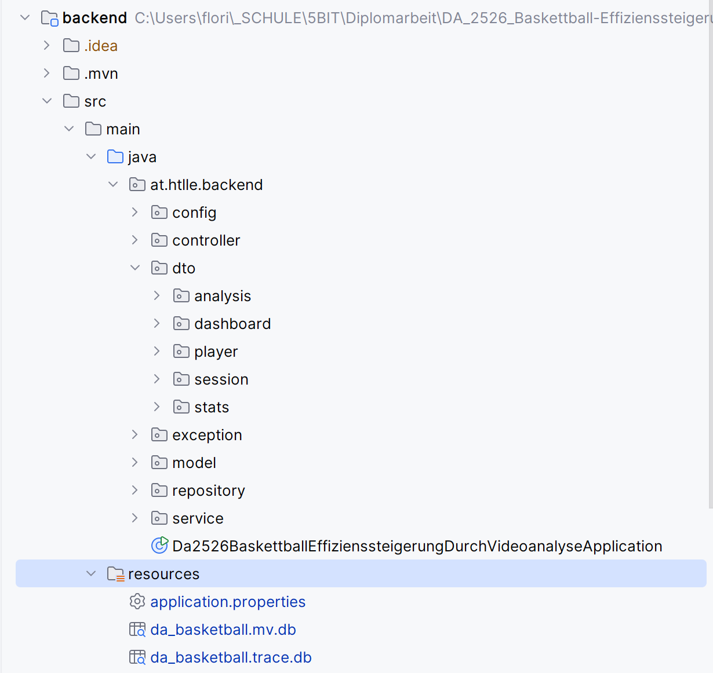

## Projektstruktur 
~~~~~~~~~~~~~~~~~~~~~~~~~~~~~~~~~~~~~~~~~~~~~~~{caption="Projektstruktur" .txt}
Source/backend/src/main/java/at/htlle/backend/
|-- config/
|   |-- CorsConfig.java
|   `-- WebConfig.java
|-- controller/
|   |-- AnalysisImportController.java
|   |-- DashboardController.java
|   |-- PlayerController.java
|   |-- StatsController.java
|   `-- TrainingSessionController.java
|-- Da2526BaskettballEffizienssteigerungDurchVideoanalyseApplication.java
|-- dto/
|   |-- analysis/
|   |   |-- AnalysisImportDTO.java
|   |   |-- AnalysisImportResponseDTO.java
|   |   |-- AnalysisPayload.java
|   |   |-- ShotDTO.java
|   |   `-- SollDTO.java
|   |-- dashboard/
|   |   `-- PlayerDashboardDTO.java
|   |-- player/
|   |   |-- ApiResponse.java
|   |   |-- CreatePlayerDTO.java
|   |   |-- LoginRequest.java
|   |   |-- PlayerResponseDTO.java
|   |   `-- RegisterRequest.java
|   |-- session/
|   |   |-- CreateSessionDTO.java
|   |   `-- SessionResponseDTO.java
|   `-- stats/
|       |-- PlayerStatsDTO.java
|       |-- PlayerTrendItemDTO.java
|       `-- SessionStatsDTO.java
|-- exception/
|   |-- GlobalExceptionHandler.java
|   `-- NotFoundException.java
|-- model/
|   |-- Player.java
|   |-- Shot.java
|   |-- SollFlightData.java
|   |-- TrainingSession.java
|   `-- Video.java
|-- repository/
|   |-- PlayerRepository.java
|   |-- ShotRepository.java
|   |-- SollFlightDataRepository.java
|   |-- TrainingSessionRepository.java
|   `-- VideoRepository.java
|-- service/
|   |-- AnalysisImportService.java
|   |-- DashboardService.java
|   |-- PlayerService.java
|   |-- StatsService.java
|   `-- TrainingSessionService.java
`-- Source/
    `-- backend/
        `-- src/
            `-- main/
                `-- java/
                    `-- at/
                        `-- htlle/
                            `-- backend/
~~~~~~~~~~~~~~~~~~~~~~~~~~~~~~~~~~~~~~~~~~~~~~~

### Implementirung des entity-Packages

Nach der Festlegung der Projektstruktur wurden die im ER-Diagramm definierten Tabellen als JPA-Entities in Java umgesetzt. Jede Entity entspricht dabei einer Datenbanktabelle, Attribute werden als Klassenfelder abgebildet und Beziehungen über JPA-Annotationen (z. B. ```@ManyToOne```, ```@OneToMany```, ```@OneToOne```) modelliert. Dadurch kann Hibernate das Schema anhand der Entities automatisch erstellen bzw. aktualisieren.


  - Entity: Player

  Die Entity Player speichert die Stammdaten einer Spieler*in (z. B. Vorname, Nachname, Geburtsdatum, Erstellungszeitpunkt). Ein Player kann mehrere Trainingseinheiten besitzen (1:n zu TrainingSession).
~~~~~~~~~~~~~~~~~~~~~~~~~~~~~~~~~~~~~~~~~~~~~~~{caption="Player" .java}
      package at.htlle.backend.model;

      import jakarta.persistence.*;
      import java.time.LocalDate;
      import java.time.LocalDateTime;

      @Entity
      @Table(name = "player")
      public class Player {

      @Id
      @GeneratedValue(strategy = GenerationType.IDENTITY)
      private Long id;

      @Column(nullable = false)
      private String firstName;

      @Column(nullable = false)
      private String lastName;

      @Column(nullable = false, unique = true)
      private String email;

      @Column(nullable = false)
      private String password;

      private String schoolClass;   // z.B. 4BHWIN
      private LocalDate birthdate;  // optional

      @Column(nullable = false)
      private LocalDateTime createdAt = LocalDateTime.now();

      public Player() {}

      public void setId(Long id) {
          this.id = id;
      }

      public String getEmail() {
          return email;
      }

      public void setEmail(String email) {
          this.email = email;
      }

      public String getPassword() {
          return password;
      }

      public void setPassword(String password) {
          this.password = password;
      }

      // Getter/Setter
      public Long getId() { return id; }

      public String getFirstName() { return firstName; }
      public void setFirstName(String firstName) { this.firstName = firstName; }

      public String getLastName() { return lastName; }
      public void setLastName(String lastName) { this.lastName = lastName; }

      public String getSchoolClass() { return schoolClass; }
      public void setSchoolClass(String schoolClass) { this.schoolClass = schoolClass; }

      public LocalDate getBirthdate() { return birthdate; }
      public void setBirthdate(LocalDate birthdate) { this.birthdate = birthdate; }

      public LocalDateTime getCreatedAt() { return createdAt; }
      public void setCreatedAt(LocalDateTime createdAt) { this.createdAt = createdAt; }


      }
~~~~~~~~~~~~~~~~~~~~~~~~~~~~~~~~~~~~~~~~~~~~~~~
  - Entity: TrainingSession

  Die Entity TrainingSession repräsentiert eine Trainingseinheit und enthält u. a. Datum und Startzeitpunkt. Jede Trainingseinheit ist genau einem Player zugeordnet (n:1) und enthält mehrere Würfe (1:n zu Shot). Zusätzlich ist eine Trainingseinheit mit einem Video verknüpft (1:1 zu Video).

  - Entity: Shot

  Die Entity Shot beschreibt einen einzelnen Wurf innerhalb einer Trainingseinheit. Gespeichert werden z. B. Ergebnis und Zeitpunkt. Jeder Shot gehört zu genau einer Trainingseinheit (n:1) und besitzt zugehörige Analyse-/Flugdaten (1:1 zu FlightData).

  - Entity: Video

  Die Entity Video verwaltet die zur Trainingseinheit gehörige Videodatei (Dateipfad, Erstellungszeitpunkt). Das Video ist einer Trainingseinheit zugeordnet (1:1) und kann zusätzlich über FlightData referenziert werden.

  - Entity: FlightData

  Die Entity FlightData enthält die Analysewerte aus der Videoverarbeitung (z. B. Abwurfpunkt, Korbposition, Winkel, Geschwindigkeit und weitere Parameter). Die Daten sind eindeutig einem Shot zugeordnet (1:1) und zusätzlich mit einem Video verknüpft (Fremdschlüssel auf Video).

### Implementierung des repository-Packages
Nach der Modellierung der Entities im Package model wurde die Repository-Schicht umgesetzt. Ziel dieser Schicht ist es, alle Datenbankzugriffe zentral zu kapseln, damit Controller und Services nicht direkt mit SQL oder EntityManager arbeiten müssen. Spring Data JPA stellt dafür Repository-Interfaces bereit, die bereits Standardfunktionen für CRUD-Operationen enthalten.

Repositories in dem Projekt: 

  - PlayerRepository

    Für den Datenzugriff auf die Spieler*innen wurde das Interface PlayerRepository implementiert. Es erweitert JpaRepository<Player, Long> und erhält dadurch automatisch grundlegende CRUD-Funktionen wie save(), findById(), findAll() und deleteById(), ohne dass dafür eigener SQL-Code geschrieben werden muss.

    Zusätzlich wurden zwei projektspezifische Methoden ergänzt: findByEmail(String email) liefert optional einen Player anhand der E-Mail-Adresse zurück, während existsByEmail(String email) prüft, ob bereits ein Datensatz mit dieser E-Mail existiert. Diese Methoden werden von Spring Data JPA automatisch anhand des Methodennamens in passende Datenbankabfragen übersetzt. Die Annotation @Repository kennzeichnet die Klasse als Bestandteil der Persistenzschicht und ermöglicht die automatische Einbindung (Dependency Injection) in Services.

~~~~~~~~~~~~~~~~~~~~~~~~~~~~~~~~~~~~~~~~~~~~~~~{caption="PlayerRepository" .java}
      package at.htlle.backend.repository;

      import at.htlle.backend.model.Player;
      import org.springframework.data.jpa.repository.JpaRepository;
      import org.springframework.stereotype.Repository;

      import java.util.Optional;

      @Repository
      public interface PlayerRepository extends JpaRepository<Player, Long> {
          Optional<Player> findByEmail(String email);
          boolean existsByEmail(String email);
      }
~~~~~~~~~~~~~~~~~~~~~~~~~~~~~~~~~~~~~~~~~~~~~~~
  - TrainingSessionRepository

  - ShotRepository

  - SollFlightDataRepository

  - VideoRepository

Damit ist die Grundlage geschaffen, damit die Service-Schicht später sauber und wiederverwendbar auf Daten zugreifen kann.

### Implementireung des service-Packages
Als nächstes folgt das Package service, das die Geschäftslogik des Backends kapselt. Während Controller lediglich HTTP-Anfragen annehmen und Responses zurückgeben, übernimmt die Service-Schicht die eigentliche Verarbeitung: z. B. das Validieren von Eingaben, das Speichern und Verknüpfen von Entities über Repositories, sowie die Berechnung von Statistiken oder das Importieren von Analyse-Daten. Dadurch bleibt die Logik zentral gebündelt, wiederverwendbar und leichter testbar.

Für dein Projekt sind im Service-Package u. a. folgende Klassen vorhanden:

  - PlayerService

    Die Klasse PlayerService bildet die Service-Schicht für Spieler*innen-Funktionen und kapselt die zugehörige Geschäftslogik. Sie ist mit @Service als Spring-Komponente gekennzeichnet und wird über @RequiredArgsConstructor (Lombok) automatisch mit dem benötigten PlayerRepository via Dependency Injection initialisiert.

    Ein zentraler Bestandteil ist die Methode registerPlayer(...). Dabei wird die übergebene E-Mail-Adresse zunächst normalisiert (Trimmen und Umwandlung in Kleinbuchstaben), anschließend auf Leerwert und Format geprüft. Für die Formatprüfung wird ein vordefiniertes Regex-Muster (EMAIL_PATTERN) verwendet. Zusätzlich wird über das Repository geprüft, ob die E-Mail bereits existiert, um doppelte Accounts zu verhindern. Erst danach wird ein Player-Objekt erstellt und über playerRepository.save(player) in der Datenbank gespeichert.

    Die Methode loginPlayer(...) implementiert eine einfache Login-Logik, indem ein Player über die E-Mail gesucht und das gespeicherte Passwort mit dem eingegebenen Passwort verglichen wird. Als Rückgabewert wird Optional<Player> verwendet, um sauber zwischen „gefunden“ und „nicht gefunden/ungültig“ zu unterscheiden. Ergänzend stellt getUserById(...) eine Zugriffsfunktion bereit, um Spieler*innen anhand der ID abzurufen.[@SpringFrameworkService] [@LombokRequiredArgsConstructor]

~~~~~~~~~~~~~~~~~~~~~~~~~~~~~~~~~~~~~~~~~~~~~~~{caption="PlayerService" .java}
package at.htlle.backend.service;

import at.htlle.backend.model.Player;
import at.htlle.backend.repository.PlayerRepository;
import lombok.RequiredArgsConstructor;
import org.springframework.stereotype.Service;

import java.util.Optional;
import java.util.regex.Pattern;

@Service
@RequiredArgsConstructor
public class PlayerService {
    private final PlayerRepository playerRepository;

    private static final Pattern EMAIL_PATTERN = Pattern.compile(
            "^[A-Za-z0-9.%+-]+@[A-Za-z0-9.-]+\\.[A-Za-z]{2,}$"
    );

    public Player registerPlayer(String firstName,String lastName, String email, String password) {

        String normalizedEmail = email == null ? "" : email.trim().toLowerCase();

        if (normalizedEmail.isEmpty()) {
            throw new IllegalArgumentException("Email darf nicht leer sein");
        }

        if (!EMAIL_PATTERN.matcher(normalizedEmail).matches()) {
            throw new IllegalArgumentException("Ungültiges Email-Format");
        }

        if (playerRepository.findByEmail(normalizedEmail).isPresent()) {
            throw new IllegalArgumentException("Email bereits registriert");
        }

        Player player = new Player();
        player.setFirstName(firstName);
        player.setLastName(lastName);
        player.setEmail(normalizedEmail);
        player.setPassword(password);

        return playerRepository.save(player);
    }

    public Optional<Player> loginPlayer(String email, String password) {
        Optional<Player> player = playerRepository.findByEmail(email);
        if (player.isPresent() && player.get().getPassword().equals(password)) {
            return player;
        }
        return Optional.empty();
    }

    public Optional<Player> getUserById(Long id) {
        return playerRepository.findById(id);
    }

}
~~~~~~~~~~~~~~~~~~~~~~~~~~~~~~~~~~~~~~~~~~~~~~~
  - TrainingSessionService
   Enthält die Logik zur Verwaltung von Trainingseinheiten. Dazu gehören typischerweise das Anlegen neuer Sessions, das Abrufen vorhandener Sessions sowie das Verknüpfen einer Session mit einem bestimmten Player. Die Datenbankzugriffe erfolgen dabei über das TrainingSessionRepository.

  - AnalysisImportService
    Diese Klasse übernimmt den Import der Analyse-Daten aus der Videoverarbeitung. Sie verarbeitet die eingehenden JSON-Daten, validiert sie und überführt sie in die entsprechenden Entities (z. B. Shots und Soll-/Flugdaten). Anschließend werden die Daten korrekt mit der passenden Trainingseinheit verknüpft und in der Datenbank gespeichert.

  - StatsService
    Zuständig für die Berechnung und Bereitstellung statistischer Kennzahlen. Dazu zählen z. B. Trefferquoten, Durchschnittswerte von Winkel und Geschwindigkeit sowie weitere aggregierte Auswertungen pro Spieler oder pro Trainingseinheit. Die Ergebnisse werden in DTOs verpackt und an die Controller-Schicht weitergegeben.

  - DashboardService
    Bündelt Daten für eine kompakte Übersicht im Frontend (Dashboard). Typischerweise werden hierfür verschiedene Informationen kombiniert, z. B. aktuelle Session-Zusammenfassungen, Trenddaten oder die wichtigsten Kennzahlen eines Spielers, um sie in einer einzigen Antwort bereitstellen zu können.

### Implementierung des contoller-Packages
Im Package controller wurden die REST-Endpunkte des Backends umgesetzt. Controller bilden die Schnittstelle zwischen Frontend und Backend: Sie nehmen HTTP-Anfragen entgegen (z. B. GET/POST), lesen Parameter oder JSON-Request-Bodies aus, rufen die passende Geschäftslogik in der Service-Schicht auf und geben das Ergebnis als JSON-Response zurück. Dadurch bleibt die Controller-Schicht schlank, während die eigentliche Logik in Services gekapselt ist.

In deinem Projekt gibt es unter anderem:

  - PlayerController

    Der PlayerController stellt die REST-Schnittstelle für Benutzerfunktionen bereit und ist über @RestController als Controller in Spring Boot registriert. Mit @RequestMapping("/api/users") wird ein gemeinsamer Basispfad für alle Endpunkte definiert. Über @RequiredArgsConstructor (Lombok) wird der PlayerService automatisch per Dependency Injection eingebunden. Die Annotation @CrossOrigin(origins = "*") erlaubt während der Entwicklung Cross-Origin-Anfragen vom Frontend.

    Der Controller implementiert drei zentrale Endpunkte:

    - POST /api/users/register
    Nimmt Registrierungsdaten als JSON (RegisterRequest) entgegen und ruft playerService.registerPlayer(...) auf. Bei Erfolg wird eine strukturierte Antwort über ApiResponse zurückgegeben. Validierungsfehler werden als 400 Bad Request behandelt.

    - POST /api/users/login
    Prüft Anmeldedaten (LoginRequest). Wenn ein passender Benutzer gefunden wird, wird 200 OK zurückgegeben, andernfalls 401 Unauthorized.

   - GET /api/users/{playerId}
    Liefert einen Benutzer anhand der ID. Wird kein Datensatz gefunden, antwortet der Controller mit 404 Not Found.

    Durch diese Umsetzung bleibt die Controller-Schicht auf die HTTP-Kommunikation und Response-Struktur fokussiert, während die eigentliche Logik (Validierung, Datenbankzugriff) im PlayerService gekapselt ist.

~~~~~~~~~~~~~~~~~~~~~~~~~~~~~~~~~~~~~~~~~~~~~~~{caption="PlayerController" .java}
package at.htlle.backend.controller;

import at.htlle.backend.dto.player.ApiResponse;
import at.htlle.backend.dto.player.LoginRequest;
import at.htlle.backend.dto.player.RegisterRequest;
import at.htlle.backend.model.Player;
import at.htlle.backend.service.PlayerService;
import org.springframework.http.HttpStatus;
import org.springframework.http.ResponseEntity;
import org.springframework.web.bind.annotation.*;
import lombok.RequiredArgsConstructor;

import java.util.Optional;

@RestController
@RequestMapping("/api/users")
@RequiredArgsConstructor
@CrossOrigin(origins = "*")
public class PlayerController {
    private final PlayerService playerService;

    @PostMapping("/register")
    public ResponseEntity<ApiResponse> register(@RequestBody RegisterRequest request) {
        try {
            Player player = playerService.registerPlayer(request.getFirstName(),request.getLastName(), request.getEmail(), request.getPassword());
            return ResponseEntity.ok(new ApiResponse(true, "Registrierung erfolgreich", player));
        } catch (IllegalArgumentException e) {
            return ResponseEntity.badRequest().body(new ApiResponse(false, e.getMessage(), null));
        }
    }

    @PostMapping("/login")
    public ResponseEntity<ApiResponse> login(@RequestBody LoginRequest request) {
        Optional<Player> player = playerService.loginPlayer(request.getEmail(), request.getPassword());
        if (player.isPresent()) {
            return ResponseEntity.ok(new ApiResponse(true, "Login erfolgreich", player.get()));
        } else {
            return ResponseEntity.status(HttpStatus.UNAUTHORIZED)
                    .body(new ApiResponse(false, "Ungültige Anmeldedaten", null));
        }
    }


    @GetMapping("/{playerId}")
    public ResponseEntity<ApiResponse> getPlayer(@PathVariable Long playerId) {
        Optional<Player> player = playerService.getUserById(playerId);
        if (player.isPresent()) {
            return ResponseEntity.ok(new ApiResponse(true, "Benutzer gefunden", player.get()));
        } else {
            return ResponseEntity.notFound().build();
        }
    }
}

~~~~~~~~~~~~~~~~~~~~~~~~~~~~~~~~~~~~~~~~~~~~~~~

  - TrainingSessionController
   Stellt Endpunkte zur Verwaltung von Trainingseinheiten bereit. Dazu gehören typischerweise das Anlegen neuer Sessions, das Abrufen vorhandener Sessions sowie das Zuordnen von Sessions zu Spieler*innen. Die Verarbeitung erfolgt über den TrainingSessionService.

  - AnalysisImportController
    Dieser Controller bildet die Schnittstelle für den Import der Analyse-Daten aus der Videoverarbeitung. Er nimmt die übermittelten JSON-Daten entgegen und startet den Importprozess über den AnalysisImportService, wodurch Shots und zugehörige Analyse-/Flugdaten gespeichert und mit einer Trainingseinheit verknüpft werden.

  - StatsController
    Stellt Endpunkte zur Verfügung, über die statistische Kennzahlen abgerufen werden können (z. B. Trefferquote, Durchschnittswerte, Session-Statistiken oder Trenddaten). Die Berechnung und Aggregation erfolgt im StatsService, der Controller liefert die Ergebnisse als JSON an das Frontend zurück.

  - DashboardController
    Dient zur Bereitstellung einer kompakten Übersicht für das Frontend-Dashboard. Hier werden mehrere Informationen zusammengeführt (z. B. letzte Sessions, wichtigste Kennzahlen, Trends) und in einer gebündelten Response ausgegeben, um die Darstellung im Frontend zu vereinfachen.

### Implementireung des dto-Package
Im Package dto wurden Data Transfer Objects (DTOs) umgesetzt. DTOs sind einfache Klassen, die ausschließlich dafür verwendet werden, Daten strukturiert zwischen Client (Frontend) und Server (Backend) zu übertragen. Sie trennen damit externe API-Datenmodelle von internen Datenbank-Entities (model). Dadurch werden:

  - die REST-Schnittstellen klarer und stabiler,

  - unnötige Felder (z. B. interne IDs oder Passwörter) nicht versehentlich   ausgegeben,

  - und Eingaben/Antworten unabhängig vom Datenbankschema versionier- und anpassbar.

  In dem Projekt sind die DTOs nach Funktionsbereichen unterteilt, z. B.:

  - dto/player (Register, Login, Response)

    Die Klasse RegisterRequest ist ein Data Transfer Object (DTO) und dient dazu, Registrierungsdaten vom Frontend an das Backend zu übertragen. Sie enthält die benötigten Felder firstName, lastName, email und password, die beim Aufruf des Registrierungs-Endpunkts als JSON im Request-Body gesendet werden.

    Durch die Trennung von DTO und Entity wird verhindert, dass direkt mit der Datenbankstruktur (Player Entity) gearbeitet werden muss. Dadurch bleibt die REST-Schnittstelle klar definiert und kann unabhängig vom internen Datenmodell angepasst werden. Die Lombok-Annotation @Data erzeugt automatisch Getter, Setter sowie weitere Standardmethoden, wodurch die Klasse kompakt und übersichtlich bleibt.[@FowlerDTO] [@ProjectLombokData]

~~~~~~~~~~~~~~~~~~~~~~~~~~~~~~~~~~~~~~~~~~~~~~~{caption="RegisterRequest" .java}
        package at.htlle.backend.dto.player;

        import lombok.Data;

        @Data
        public class RegisterRequest {
            private String firstName;
            private String lastName;
            private String email;
            private String password;
        }
~~~~~~~~~~~~~~~~~~~~~~~~~~~~~~~~~~~~~~~~~~~~~~~

  - dto/session (CreateSession, SessionResponse)

  - dto/analysis (Import-Payloads, ShotDTO, SollDTO)

  - dto/stats (PlayerStats, SessionStats, Trend-Items)

  - dto/dashboard (Dashboard-Übersicht)

### Implementireung des config-Pageges

Im Package config werden Klassen gesammelt, die technische Einstellungen für das Backend zentral definieren. Das betrifft vor allem Themen wie CORS, Web-Konfiguration und ggf. spätere Erweiterungen (z. B. Security, Interceptors). Der Vorteil ist, dass diese Einstellungen nicht in einzelnen Controllern verteilt sind, sondern an einer Stelle gebündelt werden.[@SpringFrameworkCors] [SpringFrameworkWebMvcConfig]

In deinem Projekt sind hier:

  - CorsConfig.java

  - WebConfig.java

## Testing
  Im Rahmen der Implementierung wurde jede neu erstellte Controller-Klasse unmittelbar nach der Entwicklung mit Postman getestet. Dabei wurden die zugehörigen Endpunkte (z. B. GET/POST-Anfragen) mit passenden Request-Bodys und Parametern aufgerufen und die Antworten anhand von Statuscodes sowie der zurückgegebenen JSON-Strukturen überprüft. Durch dieses fortlaufende Testen konnte sichergestellt werden, dass die Schnittstellen korrekt reagieren, die Daten wie vorgesehen verarbeitet werden und die Kommunikation zwischen Backend und späterem Frontend zuverlässig funktioniert. Alle getesteten Endpunkte verhielten sich dabei wie erwartet und konnten ohne Fehler verwendet werden.[@PostmanAPITesting]

  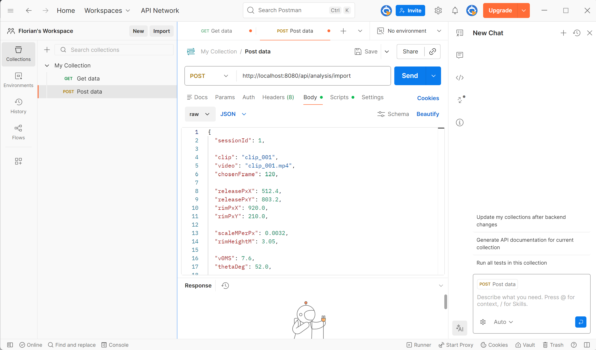
