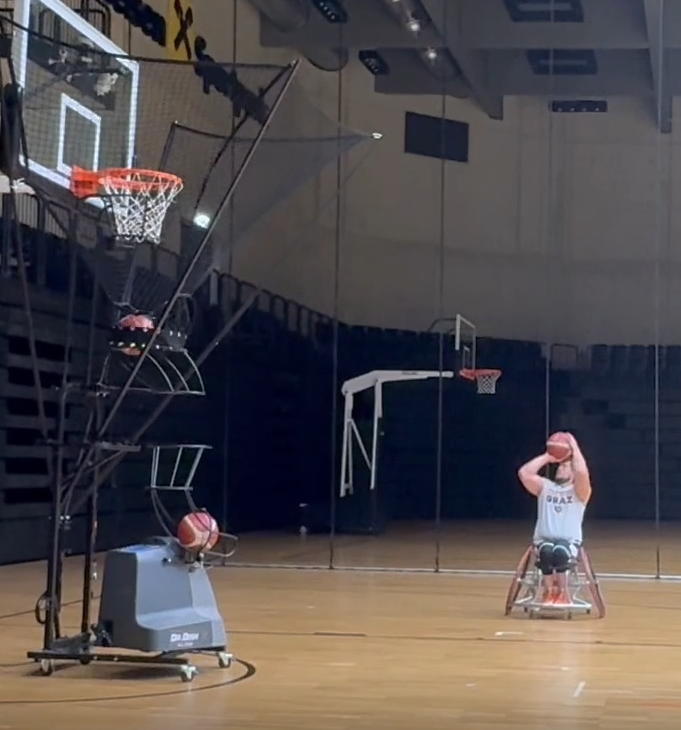
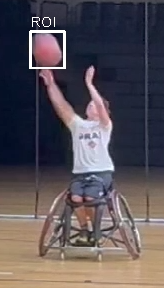
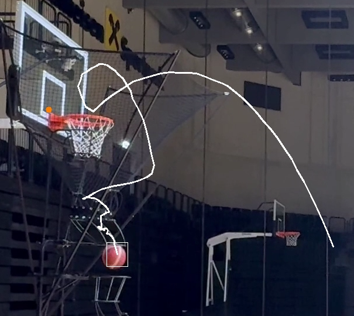

# Teilaufgabe Schüler Wolfgruber  
\textauthor{Wolfgruber Bastian}
## Implementierung der Ist-Flugbahn (Konzept und Visualisierung)

### Begriffserklärung: Ist-Flugbahn
Die Ist-Flugbahn beschreibt die tatsächlich ausgeführte Fluglinie des Basketballs
während eines realen Wurfes. Sie basiert auf der Analyse von Videomaterial und stellt
somit die reale Bewegung des Balls dar. Im Gegensatz zur Soll-Flugbahn handelt es sich
bei der Ist-Flugbahn nicht um ein theoretisches Modell, sondern um gemessene Daten,
die direkt aus dem Video gewonnen werden.

Ziel der Ist-Flugbahn ist es, den realen Bewegungsverlauf des Basketballs möglichst
präzise zu erfassen und visuell darzustellen, um diesen später mit der berechneten
Soll-Flugbahn vergleichen zu können.

---

## Ausgangsmaterial und Videovorbereitung

#### Rohmaterial der Videoaufnahmen

{width=20%}

Das Rohmaterial für die Analyse der Ist-Flugbahn wurde in Graz bei einer
Rollstuhl-Basketball-Mannschaft aufgenommen. Die Videoaufnahmen enthielten mehrere
Basketballwürfe in einer durchgehenden Sequenz.

Um eine gezielte Analyse einzelner Würfe zu ermöglichen, wurde das Rohmaterial in
mehrere kurze Videoclips aufgeteilt, wobei jeder Clip genau einen Wurf enthält.
Diese Clips wurden separat gerendert und dienen als standardisierte Eingabedaten
für die weitere Verarbeitung.

Für das Schneiden und Vorbereiten der Videos wurde die Software DaVinci Resolve
verwendet. Dadurch konnte eine gleichbleibende Qualität der Videoclips sowie eine
klare zeitliche Abgrenzung der einzelnen Würfe sichergestellt werden.

---

## Technische Umsetzung der Ist-Flugbahn

Die Implementierung der Ist-Flugbahn erfolgte mithilfe der Programmiersprache Python
in der Entwicklungsumgebung Visual Studio Code. Python eignet sich besonders für
Bild- und Videoverarbeitung sowie für experimentelle und wissenschaftliche Anwendungen.

Zur Erkennung der Ist-Flugbahn wird der Basketball in jedem Frame des Videos verfolgt.
Aus den ermittelten Ballpositionen werden diskrete Punkte erzeugt, welche den
tatsächlichen Flugweg des Balls beschreiben. Diese Punkte werden anschließend
miteinander verbunden und grafisch im Videobild dargestellt.

Eine erste funktionsfähige Version der Ist-Flugbahn wurde erfolgreich umgesetzt
und bildet die Grundlage für den späteren Vergleich mit der Soll-Flugbahn.

---

## Tracking des Basketballs

Ein zentraler Bestandteil der Ist-Flugbahn ist das zuverlässige Tracking des Balls
über mehrere Frames hinweg. Dabei wird der Basketball als Zielobjekt definiert und
seine Position kontinuierlich im Videobild erfasst.

### Herausforderungen beim Tracking
Zu Beginn der Entwicklung traten Probleme beim Tracking des korrekten Objekts auf.
Insbesondere wurde in manchen Fällen nicht der Basketball, sondern die Hand des
Schützen verfolgt. Dieses Problem trat vor allem dann auf, wenn Ball und Hand räumlich
sehr nahe beieinander lagen.

In solchen Situationen identifizierte der Tracking-Algorithmus fälschlicherweise
die größere oder stärker bewegte Objektregion als Ziel. Dies führte zu fehlerhaften
Flugbahnen und machte eine zuverlässige Analyse unmöglich.

---

## Lösungsansatz: Manuelle Initialisierung der Region of Interest (ROI)

#### Manuelle Auswahl der Region of Interest (ROI)

Zur Lösung dieses Problems wurde ein manueller Initialisierungsschritt eingeführt.
Dabei wird ein Frame ausgewählt, in dem der Basketball eindeutig sichtbar und klar
von der Hand des Spielers getrennt ist.

In diesem Frame wird eine präzise Region of Interest (ROI) um den Ball definiert.
Diese ROI dient als Startpunkt für den Tracker und stellt sicher, dass ausschließlich
der Basketball als Zielobjekt erkannt und verfolgt wird.

Durch diese gezielte Initialisierung konnte verhindert werden, dass der Tracker
auf die Spielerhand wechselt. Die Stabilität und Genauigkeit des Balltrackings
wurden dadurch deutlich verbessert.

Zusätzlich wird eine Plausibilitätsprüfung eingesetzt, bei der unplausible
Bewegungssprünge des Balls zwischen zwei Frames erkannt werden. In solchen Fällen
wird das Tracking abgebrochen, um fehlerhafte Ergebnisse zu vermeiden.

---

## Visualisierung der Ist-Flugbahn

{width=30%}

Die erfassten Ballpositionen werden zur Visualisierung der Ist-Flugbahn genutzt.
Dabei werden die einzelnen Tracking-Punkte in zeitlicher Reihenfolge miteinander
verbunden und als Linie im Videobild dargestellt.

Die Visualisierung erfolgt entweder als Overlay in einer Videosequenz oder als
Einzelbild mit eingezeichneter Ist-Flugbahn. Dadurch wird der reale Bewegungsverlauf
des Balls anschaulich dargestellt und kann intuitiv analysiert werden.

Diese Darstellung bildet die Grundlage für den späteren Vergleich mit der Soll-Flugbahn
und ermöglicht es, Abweichungen zwischen idealem und tatsächlichem Wurfverlauf
klar zu erkennen.

---

## Aktueller Stand der Ist-Flugbahn-Komponente

Die Ist-Flugbahn-Komponente ist aktuell funktionsfähig und liefert stabile Ergebnisse.
Das Balltracking funktioniert zuverlässig, sofern der Tracker korrekt initialisiert
wird und der Ball im Videomaterial eindeutig sichtbar ist.

Die erzeugte Ist-Flugbahn dient bereits als valide Grundlage für den Vergleich mit der
Soll-Flugbahn und stellt einen wesentlichen Bestandteil der Videoanalyse dar.

---

## Architektur der Videoanalyse-Pipeline

Die Videoanalyse ist als datengetriebene Pipeline konzipiert. Ausgangspunkt sind
Rohvideos einzelner Basketballwürfe, welche durch mehrere klar getrennte
Verarbeitungsschritte in strukturierte Analyseergebnisse überführt werden.

Die Architektur folgt dabei dem Prinzip einer sauberen Trennung zwischen
Eingabedaten, Konfiguration und Kalibrierung, Verarbeitungsskripten sowie
Ausgabeartefakten. Dadurch wird eine hohe Nachvollziehbarkeit, Wiederholbarkeit
und Erweiterbarkeit der Analyse gewährleistet.

---
## Offene Punkte und Ausblick

Ein noch offener Punkt ist die vollständige Zusammenführung der Ist- und Soll-Flugbahn
in einer gemeinsamen Vergleichskomponente. Dabei müssen insbesondere die zeitliche
Synchronisation der Flugbahnen, die Umrechnung der Koordinatensysteme sowie
unvermeidbare Tracking-Abweichungen berücksichtigt werden.

Die Kombination beider Flugbahnen stellt einen wichtigen nächsten Entwicklungsschritt dar,
um Spieler*innen ein direktes visuelles Feedback über Abweichungen zwischen realem
und idealem Wurfverlauf zu ermöglichen.

---

## Eingesetzte Programmiersprache und Bibliotheken (Ist-Flugbahn)

### Programmiersprache: Python

Die Ist-Flugbahn wurde in Python implementiert. Python eignet sich besonders für
Computer-Vision-Anwendungen und wissenschaftliche Auswertungen und ermöglicht eine
schnelle Entwicklung sowie gute Wartbarkeit.

**Vorteile:**
- Hohe Entwicklungsgeschwindigkeit  
- Große Auswahl an Bibliotheken für Bildverarbeitung und Numerik  
- Gute Lesbarkeit und einfache Wartung  
- Plattformunabhängig  

**Nachteile:**
- Geringere Performance als kompilierte Sprachen  
- Abhängigkeit von externen Bibliotheken  
- Für Echtzeit-Systeme teilweise zusätzlicher Optimierungsbedarf  

**Alternativen:**
- C++ (sehr performant, aber deutlich höherer Entwicklungsaufwand)  
- MATLAB (stark für Analyse, aber lizenzpflichtig)  
- Java (gut für Backend, weniger verbreitet für Computer Vision)

---

### OpenCV (`cv2`)

OpenCV ist die zentrale Bibliothek für die Videoverarbeitung und das Tracking.
Sie wird für das Laden der Videos, das Balltracking, die Benutzerinteraktion
sowie das Zeichnen der Overlays verwendet.

**Vorteile:**
- Leistungsfähige Computer-Vision-Bibliothek  
- Viele fertige Tracking-Algorithmen  
- Gute Dokumentation und große Community  

**Nachteile:**
- Tracker teilweise nur in `opencv-contrib-python` verfügbar  
- Tracking fehleranfällig bei Verdeckungen oder schlechten Lichtverhältnissen  

---

### NumPy (`numpy`)

NumPy wird zur Speicherung und Weiterverarbeitung der ermittelten Ballpositionen
verwendet. Die Koordinaten werden als numerische Arrays gespeichert und anschließend
in CSV-Dateien exportiert.

**Vorteile:**
- Effiziente Verarbeitung numerischer Daten  
- Standardformat für wissenschaftliche Auswertungen  

**Nachteile:**
- Höherer Speicherbedarf bei großen Datenmengen  

---

### JSON und Dateisystem (`json`, `os`)

Zur Speicherung von Metadaten und Analyseergebnissen wird das JSON-Format verwendet.
Zusätzlich werden mit der `os`-Bibliothek Projektpfade und Ausgabeverzeichnisse
verwaltet.

**Vorteile:**
- Plattformunabhängiges, gut lesbares Datenformat  
- Ideal für Datenaustausch mit Backend und Frontend  

**Nachteile:**
- Für sehr große Datenmengen weniger effizient als binäre Formate  
