# Teilaufgabe Wolfgruber Bastian
\textauthor{Wolfgruber Bastian}

## Theorie

### Begriffserklärung: Ist-Flugbahn

Die Ist-Flugbahn beschreibt die tatsächlich ausgeführte Fluglinie des Basketballs
während eines realen Wurfes. Sie basiert auf der Analyse von Videomaterial und stellt
somit die reale Bewegung des Balls dar. Im Gegensatz zur Soll-Flugbahn handelt es sich
bei der Ist-Flugbahn nicht um ein theoretisches Modell, sondern um gemessene Daten,
die direkt aus dem Video gewonnen werden.

Ziel der Ist-Flugbahn ist es, den realen Bewegungsverlauf des Basketballs möglichst
präzise zu erfassen und visuell darzustellen, um diesen später mit der berechneten
Soll-Flugbahn vergleichen zu können.

#### Bedeutung der Ist-Flugbahn für die Analyse von Würfen

Die Analyse der Ist-Flugbahn ermöglicht eine objektive Bewertung eines
Basketballwurfes. Während Spielerinnen und Spieler den eigenen Wurf häufig
nur subjektiv wahrnehmen, liefert die Videoanalyse eine messbare und
reproduzierbare Darstellung des tatsächlichen Bewegungsverlaufs.

Durch die Rekonstruktion der Ist-Flugbahn können verschiedene Eigenschaften
eines Wurfes untersucht werden. Dazu gehören beispielsweise die Höhe der
Flugbahn, der seitliche Verlauf des Balls sowie mögliche Abweichungen vom
idealen Zielpunkt.

Diese Informationen können genutzt werden, um Unterschiede zwischen
verschiedenen Würfen zu analysieren und gezielt Verbesserungsmöglichkeiten
für die Wurftechnik abzuleiten.

### Tracking des Basketballs

Das Tracking des Basketballs dient in dieser Arbeit nicht nur der technischen
Erfassung von Bewegungsdaten, sondern bildet die Grundlage für ein visuelles
Feedback, das den Schützen bei der Analyse und Verbesserung seines Wurfes
unterstützt.

Durch das kontinuierliche Verfolgen des Balls über mehrere Frames hinweg
kann der tatsächliche Flugweg des Basketballs rekonstruiert und sichtbar
gemacht werden.

#### Funktionsprinzip des Balltrackings

Beim Tracking wird der Basketball als Zielobjekt definiert, dessen Position
in jedem einzelnen Frame des Videos bestimmt wird. Die Position des Balls
wird dabei typischerweise durch Koordinaten im zweidimensionalen
Bildkoordinatensystem beschrieben.

Durch die kontinuierliche Bestimmung dieser Koordinaten entsteht eine
Abfolge von Positionspunkten, die den Bewegungsverlauf des Balls im
Videobild beschreiben.

Werden diese Punkte miteinander verbunden, ergibt sich eine Linie, die
den tatsächlichen Flugweg des Basketballs repräsentiert. [@cao_automatic_2021]

### Architektur der Videoanalyse-Pipeline

In der Videoanalyse werden komplexe Auswertungen häufig als
datengetriebene Pipeline modelliert. Eine solche Pipeline beschreibt
eine Abfolge klar definierter Verarbeitungsschritte, bei denen Rohdaten
schrittweise in strukturierte Analyseergebnisse überführt werden. [@szeliski_computer_2022]

#### Aufbau einer Analysepipeline

Ausgangspunkt einer Videoanalyse-Pipeline sind Rohvideos, welche visuelle
Informationen in Form von Bildsequenzen enthalten.

Diese Rohdaten werden in mehreren aufeinanderfolgenden Schritten
verarbeitet. Typische Verarbeitungsschritte sind beispielsweise:

- Vorverarbeitung der Videodaten  
- Erkennung und Tracking relevanter Objekte  
- Speicherung der ermittelten Positionsdaten  
- Visualisierung der Analyseergebnisse  

Jeder dieser Schritte erfüllt eine klar definierte Aufgabe innerhalb der
Analysepipeline. [@szeliski_computer_2022]

#### Vorteile einer modularen Architektur

Ein zentrales Gestaltungsprinzip moderner Videoanalyse-Pipelines ist die
saubere Trennung von Verantwortlichkeiten.

Dabei werden Eingabedaten, Konfigurationsparameter,
Verarbeitungskomponenten sowie Ausgabedaten logisch voneinander getrennt.

Diese Struktur erleichtert die Wartung des Systems und erhöht die
Nachvollziehbarkeit einzelner Verarbeitungsschritte.

Durch die modulare Architektur können einzelne Komponenten unabhängig
voneinander angepasst oder erweitert werden, ohne die gesamte Pipeline
verändern zu müssen.

Darüber hinaus unterstützt eine klar strukturierte Pipeline die
Reproduzierbarkeit der Analyseergebnisse. Werden identische
Eingabedaten und Konfigurationen verwendet, lassen sich
Verarbeitungsschritte konsistent nachvollziehen und Ergebnisse
zuverlässig vergleichen. [@szeliski_computer_2022]

### Objekt-Tracking in Videosequenzen

Objekt-Tracking bezeichnet in der Videoanalyse die kontinuierliche
Verfolgung eines bestimmten Objekts über mehrere aufeinanderfolgende
Frames hinweg.

Ziel ist es, die Position des Objekts in jedem Einzelbild zu bestimmen
und daraus dessen Bewegungsverlauf abzuleiten. [@opencv_library_2015]

#### Beispiele für Tracking-Verfahren

In der Videoanalyse existieren verschiedene Verfahren zur
Verfolgung von Objekten über mehrere Frames hinweg. Diese
Tracking-Algorithmen unterscheiden sich insbesondere in ihrer
Genauigkeit, Geschwindigkeit und Robustheit gegenüber
Veränderungen im Bild. [@lukezic_discriminative_2018]

##### CSRT-Tracker

Der CSRT-Tracker (Discriminative Correlation Filter with Channel and Spatial Reliability)
gehört zu den robusteren Tracking-Verfahren in OpenCV. Er nutzt
Korrelationsfilter, um das Erscheinungsbild eines Objekts zu
modellieren und dessen Position in aufeinanderfolgenden Frames
wiederzufinden.

Ein Vorteil des CSRT-Trackers ist seine hohe Genauigkeit und
Robustheit gegenüber Veränderungen in Größe, Perspektive oder
Teilverdecken des Objekts. Dadurch eignet er sich besonders für
Anwendungen, bei denen ein Objekt präzise verfolgt werden muss.

Der Nachteil besteht darin, dass der Algorithmus im Vergleich zu
einfacheren Trackern mehr Rechenleistung benötigt und daher
langsamer arbeiten kann. [@lukezic_discriminative_2018]

##### MOSSE-Tracker

Der MOSSE-Tracker (Minimum Output Sum of Squared Error) ist ein
sehr schneller Tracking-Algorithmus, der ebenfalls auf
Korrelationsfiltern basiert.

Im Gegensatz zum CSRT-Tracker ist MOSSE deutlich effizienter und
eignet sich besonders für Anwendungen mit hohen
Verarbeitungsgeschwindigkeiten oder Echtzeitanforderungen.

Allerdings ist MOSSE weniger robust gegenüber starken
Veränderungen des Objektbildes oder komplexen Szenen, weshalb
die Trackinggenauigkeit geringer sein kann. [@opencv_library_2015]

#### Funktionsweise von Tracking-Algorithmen

Tracking-Algorithmen analysieren die Bildinformationen jedes Frames
und versuchen, das zuvor definierte Zielobjekt erneut zu identifizieren.

Dabei werden verschiedene visuelle Merkmale verwendet, beispielsweise:

- Farbe  
- Form  
- Textur  
- Bewegungsrichtung  

Durch den Vergleich dieser Merkmale zwischen aufeinanderfolgenden
Frames kann der Algorithmus die Position des Objekts im Video
verfolgen. [@opencv_library_2015]

#### Herausforderungen beim Objekt-Tracking

In realen Videosequenzen treten häufig Situationen auf, die das
Tracking erschweren.

Dazu gehören unter anderem:

- teilweise Verdeckungen des Objekts  
- schnelle Bewegungen  
- wechselnde Lichtverhältnisse  
- ähnliche Objekte im Hintergrund  

Diese Faktoren können dazu führen, dass ein Tracker das Zielobjekt
verliert oder ein falsches Objekt verfolgt. [@lukezic_discriminative_2018]

### Fehlerquellen und Unsicherheiten beim Tracking

Beim Objekt-Tracking können verschiedene Fehlerquellen auftreten,
welche die Genauigkeit der ermittelten Objektpositionen beeinflussen.

Diese Unsicherheiten ergeben sich sowohl aus den Eigenschaften
des Videomaterials als auch aus den eingesetzten Tracking-Algorithmen. 
[@lukezic_discriminative_2018]

#### Einfluss der Videoqualität

Die Qualität des Videomaterials hat einen erheblichen Einfluss auf
die Zuverlässigkeit von Tracking-Algorithmen. Da das Tracking direkt
auf den Bildinformationen jedes Frames basiert, können Einschränkungen
der Videoqualität die Erkennung und Verfolgung des Zielobjekts
deutlich erschweren.

Eine geringe Auflösung kann dazu führen, dass der Basketball im Bild
nur durch wenige Pixel dargestellt wird. Dadurch werden wichtige
visuelle Merkmale wie Form, Farbe oder Konturen weniger deutlich
erkennbar. In solchen Fällen kann es für den Algorithmus schwierig
sein, den Ball eindeutig vom Hintergrund zu unterscheiden.

Ein weiterer Einflussfaktor ist die Bewegungsunschärfe
(Motion Blur), die insbesondere bei schnellen Bewegungen auftritt.
Da sich der Basketball während eines Wurfes mit hoher Geschwindigkeit
durch das Bild bewegt, kann er in einzelnen Frames unscharf oder
verzerrt dargestellt werden. Dadurch verliert der Ball seine klare
kreisförmige Struktur, was die zuverlässige Identifikation des
Objekts erschwert.

Auch die Beleuchtungssituation spielt eine wichtige Rolle.
Schlechte Lichtverhältnisse oder starke Schatten können dazu führen,
dass sich die Farb- und Helligkeitswerte des Balls verändern.
Wenn der Kontrast zwischen dem Ball und dem Hintergrund zu gering
ist, kann der Algorithmus Schwierigkeiten haben, das Zielobjekt
korrekt zu erkennen.

Zusätzlich kann Bildrauschen die Bildqualität negativ beeinflussen.
Bildrauschen entsteht beispielsweise bei schlechten
Lichtverhältnissen oder durch die Kamera selbst und führt zu
zufälligen Helligkeitsschwankungen im Bild. Diese Störungen können
dazu führen, dass einzelne Pixel fälschlicherweise als Teil des
Zielobjekts interpretiert werden.

Alle diese Faktoren können die Genauigkeit des Trackings
beeinträchtigen und dazu führen, dass der Algorithmus den Ball
nicht korrekt erkennt, seine Position ungenau bestimmt oder
das Zielobjekt vollständig verliert. [@lukezic_discriminative_2018]

#### Verdeckungen und ähnliche Objekte

Beim Objekt-Tracking kann es zu Problemen kommen, wenn das Zielobjekt
nicht vollständig sichtbar ist oder sich visuell ähnliche Objekte im
Bild befinden. In solchen Situationen kann der Tracking-Algorithmus
Schwierigkeiten haben, das korrekte Objekt eindeutig zu identifizieren.

Eine häufige Herausforderung sind sogenannte Verdeckungen
(Occlusions). Dabei wird das Zielobjekt teilweise oder vollständig
von anderen Bildinhalten überlagert. In der Praxis bedeutet dies,
dass der Basketball beispielsweise kurzzeitig von der Hand des
Spielers, vom Arm oder von anderen Personen im Bild verdeckt
werden kann.

Wenn der Ball nicht vollständig sichtbar ist, fehlen dem
Tracking-Algorithmus wichtige visuelle Informationen wie Form,
Farbe oder Konturen. Dadurch kann es passieren, dass der
Algorithmus das Objekt nicht mehr eindeutig erkennt und das
Tracking verliert.

Ein weiteres Problem entsteht durch visuell ähnliche Objekte im
Bild. Tracking-Algorithmen identifizieren ein Objekt häufig anhand
bestimmter Merkmale wie Farbe, Form oder Bewegung. Wenn sich im
Bild andere Objekte befinden, die ähnliche Merkmale besitzen,
kann der Algorithmus diese fälschlicherweise als Zielobjekt
interpretieren.

Im Kontext eines Basketballwurfs kann dies beispielsweise
auftreten, wenn sich die Farbe des Balls stark von der
Spielerhand oder Teilen der Kleidung kaum unterscheidet.
Auch runde oder bewegte Objekte im Hintergrund könnten
vom Algorithmus irrtümlich als Ball erkannt werden.

In solchen Fällen kann der Tracker von einem Frame zum
nächsten auf ein falsches Objekt wechseln. Dieses Phänomen
wird als Fehltracking bezeichnet und führt dazu, dass die
ermittelten Positionsdaten nicht mehr dem tatsächlichen
Bewegungsverlauf des Basketballs entsprechen.

Solche Situationen stellen eine große Herausforderung für
Tracking-Systeme dar und müssen bei der Entwicklung von
Videoanalyseverfahren berücksichtigt werden. [@lukezic_discriminative_2018]

#### Algorithmische Einschränkungen

Viele Tracking-Verfahren basieren auf bestimmten Annahmen über
das Erscheinungsbild oder die Bewegung eines Objekts.

Beispielsweise gehen einige Algorithmen davon aus, dass sich
die Form, Größe oder Farbe eines Objekts über mehrere Frames
hinweg nur geringfügig verändert.

In realen Szenarien können diese Annahmen jedoch nicht immer
vollständig erfüllt werden. Schnelle Bewegungen,
Perspektivänderungen oder teilweise Verdeckungen können dazu
führen, dass sich das Erscheinungsbild eines Objekts stark
verändert.

In solchen Situationen kann ein Tracking-Algorithmus Schwierigkeiten
haben, das Zielobjekt korrekt wiederzuerkennen oder seine Position
genau zu bestimmen.

Darüber hinaus können manche Tracking-Verfahren empfindlich auf
starke Bewegungen oder abrupte Richtungsänderungen reagieren.
Wenn sich ein Objekt zwischen zwei Frames sehr stark bewegt,
kann der Algorithmus Schwierigkeiten haben, die neue Position
korrekt zu bestimmen.

Diese algorithmischen Einschränkungen führen dazu, dass
Tracking-Ergebnisse in realen Anwendungen immer mit einer
gewissen Unsicherheit behaftet sind. [@opencv_library_2015]

### Region of Interest (ROI)

Eine Region of Interest (ROI) bezeichnet einen definierten Bildbereich
innerhalb eines Frames, der für eine weitere Analyse ausgewählt wird.

Durch die Einschränkung auf eine ROI kann die Rechenkomplexität
reduziert werden, da nur ein kleiner Teil des Bildes verarbeitet
werden muss. [@szeliski_computer_2022]

#### Vorteile der Verwendung einer ROI

Die Verwendung einer ROI bietet mehrere Vorteile.

Zum einen wird die Verarbeitungsgeschwindigkeit erhöht, da weniger
Bilddaten analysiert werden müssen.

Zum anderen kann die Genauigkeit von Analyseverfahren verbessert
werden, da sich der Algorithmus auf einen relevanten Bereich des
Bildes konzentriert und störende Hintergrundinformationen ignoriert.
[@szeliski_computer_2022]

#### Manuelle und automatische ROI-Auswahl

Eine Region of Interest kann auf unterschiedliche Weise definiert werden.
Grundsätzlich wird zwischen einer automatischen Auswahl durch Algorithmen
und einer manuellen Auswahl durch Benutzerinteraktion unterschieden.
Welche Methode eingesetzt wird, hängt von der jeweiligen Anwendung,
der Qualität des Videomaterials sowie den Anforderungen an Genauigkeit
und Automatisierung ab.[@szeliski_computer_2022]

##### Manuelle ROI-Auswahl

Bei der manuellen ROI-Auswahl wird der relevante Bildbereich durch eine
Benutzerinteraktion festgelegt. Dabei markiert die Benutzerin oder der
Benutzer direkt im Bild den Bereich, der für die weitere Analyse verwendet
werden soll.

Diese Methode wird häufig dann eingesetzt, wenn das Zielobjekt im Bild
eindeutig erkennbar ist, automatische Erkennungsverfahren jedoch
unzuverlässige Ergebnisse liefern würden. Dies kann beispielsweise bei
schlechter Videoqualität, starken Bewegungen oder bei visuell ähnlichen
Objekten im Hintergrund der Fall sein.

Der Vorteil der manuellen Auswahl liegt in ihrer hohen Zuverlässigkeit,
da der relevante Bildbereich bewusst und gezielt festgelegt wird.
Der Nachteil besteht darin, dass ein manueller Eingriff erforderlich ist
und der Prozess daher weniger automatisiert abläuft.[@szeliski_computer_2022]

##### Automatische ROI-Auswahl

Bei der automatischen ROI-Auswahl wird der relevante Bildbereich durch
einen Algorithmus bestimmt. Dabei analysiert das System das Bild
selbstständig und versucht, das Zielobjekt anhand bestimmter Merkmale
wie Farbe, Form oder Bewegung zu identifizieren.

Diese Methode eignet sich besonders für Anwendungen, bei denen große
Mengen an Videodaten verarbeitet werden müssen oder eine vollständig
automatisierte Analyse angestrebt wird.

Allerdings hängt die Zuverlässigkeit der automatischen Auswahl stark von
der Qualität des Videomaterials sowie von der Komplexität der Szene ab.
In Situationen mit Verdeckungen, schnellen Bewegungen oder ähnlichen
Objekten im Hintergrund kann es zu Fehlklassifikationen kommen.[@opencv_selectroi_2026]

### Visualisierung von Bewegungsdaten

Die Visualisierung von Bewegungsdaten beschreibt die grafische
Darstellung von Positions- oder Bewegungsinformationen, die aus
Mess- oder Analyseprozessen gewonnen wurden.

Ziel ist es, komplexe Bewegungsabläufe anschaulich darzustellen und
eine intuitive Interpretation der Daten zu ermöglichen. [@opencv_drawing_2026]

#### Darstellung von Bewegungsabläufen

In der Videoanalyse erfolgt die Visualisierung häufig durch das
Einzeichnen von Punkten, Linien oder Kurven direkt im Videobild.

Werden aufeinanderfolgende Positionspunkte eines Objekts miteinander
verbunden, entsteht eine visuelle Repräsentation der Bewegung.

Im Fall eines Basketballwurfs ergibt sich daraus eine Kurve, die
den Flugweg des Balls beschreibt. [@opencv_drawing_2026]

#### Nutzen der Visualisierung

Solche Visualisierungen ermöglichen es, Bewegungsverläufe zu
vergleichen, Abweichungen zu erkennen und dynamische Prozesse
besser zu analysieren.

Insbesondere im sportlichen Kontext können visuelle Darstellungen
dazu beitragen, Bewegungsabläufe verständlicher zu machen und
Verbesserungsmöglichkeiten zu identifizieren. Durch die grafische
Darstellung einer Bewegung wird der Ablauf intuitiv nachvollziehbar,
auch für Personen ohne technische Vorkenntnisse.

Ein weiterer wichtiger Nutzen besteht im Vergleich zwischen der
tatsächlichen Flugbahn eines Wurfes und einer berechneten
Soll-Flugbahn. Während die Ist-Flugbahn den realen Bewegungsverlauf
des Balls darstellt, beschreibt die Soll-Flugbahn einen theoretisch
optimalen Wurfverlauf.

Durch die gleichzeitige Darstellung beider Flugbahnen können
Abweichungen zwischen dem tatsächlichen und dem idealen Verlauf
direkt erkannt werden. Dadurch lässt sich beispielsweise feststellen,
ob ein Wurf zu flach, zu steil oder seitlich versetzt ausgeführt
wurde.

Diese visuelle Gegenüberstellung ermöglicht es, die Qualität eines
Wurfes objektiver zu bewerten und liefert eine hilfreiche Grundlage
für die Analyse und Verbesserung der Wurftechnik. [@opencv_drawing_2026]

### Eingesetzte Softwarewerkzeuge und Bibliotheken

Für die Entwicklung und Vorbereitung der Videoanalyse wurden verschiedene
Softwarewerkzeuge eingesetzt. Diese Werkzeuge unterstützen unterschiedliche
Arbeitsschritte im Analyseprozess, von der Vorbereitung des Videomaterials
bis zur Implementierung der eigentlichen Analysealgorithmen.

Die Auswahl der Programme erfolgte auf Basis ihrer Funktionalität,
Verfügbarkeit sowie ihrer Eignung für wissenschaftliche und technische
Entwicklungsprozesse.

#### Programmiersprache: Python

Python ist eine weit verbreitete Programmiersprache, die besonders
häufig in den Bereichen Datenanalyse, wissenschaftliche Berechnung
sowie Bild- und Videoverarbeitung eingesetzt wird.

Ein wesentlicher Vorteil von Python ist die große Anzahl verfügbarer
Bibliotheken, die komplexe Aufgaben der Datenverarbeitung und
Computer Vision unterstützen. Dadurch können Analyseverfahren
effizient implementiert werden, ohne grundlegende Funktionen
vollständig selbst entwickeln zu müssen.

Darüber hinaus zeichnet sich Python durch eine übersichtliche und
leicht verständliche Syntax aus. Dies erleichtert sowohl die
Entwicklung als auch die Wartung von Programmen und macht Python
besonders geeignet für Projekte, in denen experimentelle oder
analytische Verfahren umgesetzt werden.

Ein weiterer Vorteil ist die große Entwicklergemeinschaft sowie
die umfangreiche Dokumentation vieler Bibliotheken. Dadurch stehen
zahlreiche Ressourcen und Beispiele zur Verfügung, die die
Entwicklung komplexer Anwendungen unterstützen. [@python_foundation_2026]

**Vorteile:**
- Gut lesbare und leicht verständliche Programmiersprache  
- Große Auswahl an Bibliotheken für Datenanalyse und Computer Vision  
- Große Entwicklergemeinschaft und umfangreiche Dokumentation  
- Plattformunabhängig und auf vielen Systemen einsetzbar  

**Nachteile:**
- Geringere Ausführungsgeschwindigkeit im Vergleich zu kompilierten Sprachen wie C++  
- Abhängigkeit von externen Bibliotheken für viele spezialisierte Funktionen  
- Für Echtzeitanwendungen teilweise zusätzliche Optimierung notwendig  

#### OpenCV (`cv2`)

OpenCV (Open Source Computer Vision Library) ist eine weit verbreitete
Bibliothek für Bild- und Videoverarbeitung. Sie stellt eine Vielzahl
von Funktionen zur Verfügung, die für Anwendungen im Bereich
Computer Vision benötigt werden.

Dazu gehören unter anderem das Laden und Verarbeiten von Videodaten,
die Analyse einzelner Frames, die Implementierung von
Objekterkennungs- und Trackingverfahren sowie verschiedene Methoden
zur Visualisierung von Analyseergebnissen.

OpenCV wird häufig in wissenschaftlichen Projekten, industriellen
Bildverarbeitungssystemen sowie in Forschungsanwendungen eingesetzt
und bildet eine zentrale Grundlage für viele Computer-Vision-Systeme.

**Vorteile:**
- Leistungsfähige und weit verbreitete Computer-Vision-Bibliothek  
- Große Auswahl an Bildverarbeitungs- und Trackingalgorithmen  
- Gute Dokumentation und große Entwicklergemeinschaft  

**Nachteile:**
- Einige Tracking-Algorithmen sind nur über zusätzliche Pakete wie `opencv-contrib-python` verfügbar  
- Trackingverfahren können empfindlich auf Verdeckungen oder schwierige Lichtverhältnisse reagieren [@opencv_library_2015]

#### NumPy (`numpy`)

NumPy ist eine zentrale Bibliothek für numerische Berechnungen in Python.
Sie stellt effiziente Datenstrukturen für große Mengen numerischer Daten
bereit und ermöglicht schnelle mathematische Operationen auf diesen
Datenstrukturen.

Im Bereich der Videoanalyse wird NumPy häufig verwendet, um
Positionsdaten, Bildinformationen oder andere numerische Werte
in Form von Arrays zu speichern und weiterzuverarbeiten.

Durch die effiziente Implementierung numerischer Operationen eignet
sich NumPy besonders für wissenschaftliche Anwendungen, in denen große
Datenmengen analysiert oder verarbeitet werden müssen.

**Vorteile:**
- Effiziente Verarbeitung numerischer Daten  
- Standardbibliothek für wissenschaftliche Berechnungen in Python  
- Gute Integration mit anderen Analyse- und Bildverarbeitungsbibliotheken  

**Nachteile:**
- Höherer Speicherbedarf bei sehr großen Datenmengen  
[@harris_numpy_2020]

#### JSON und Dateisystem (`json`, `os`)

Für die strukturierte Speicherung von Konfigurations- und
Metadaten wird häufig das JSON-Format (JavaScript Object Notation)
verwendet.

JSON ist ein textbasiertes Datenformat, das sich besonders gut
für den Austausch strukturierter Daten zwischen verschiedenen
Softwarekomponenten eignet. Aufgrund seiner klaren Struktur und
der guten Lesbarkeit wird es häufig für Konfigurationsdateien,
Analyseergebnisse oder Schnittstellen zwischen Systemkomponenten
verwendet.

Die Python-Bibliothek `json` ermöglicht das Lesen und Schreiben
von JSON-Daten, während die Bibliothek `os` grundlegende Funktionen
zur Verwaltung von Dateien und Verzeichnissen bereitstellt.

Diese Bibliotheken werden häufig eingesetzt, um Dateipfade zu
verwalten, Projektstrukturen zu organisieren oder Analyseergebnisse
in strukturierter Form zu speichern.

**Vorteile:**
- Plattformunabhängiges und gut lesbares Datenformat  
- Einfache Integration in verschiedene Programmiersprachen  
- Gut geeignet für Konfigurationsdateien und Datenaustausch  

**Nachteile:**
- Für sehr große Datenmengen weniger effizient als binäre Speicherformate
[@ecma_json_2017]

#### Entwicklungsumgebung: Visual Studio Code

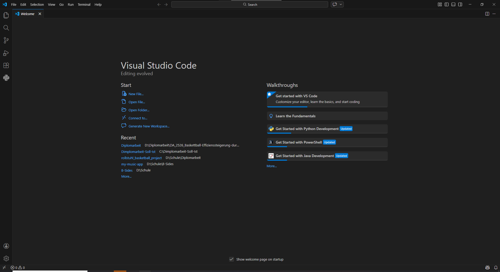{width=\textwidth}

Für die Implementierung der Analysealgorithmen wurde die
Entwicklungsumgebung Visual Studio Code verwendet.

Visual Studio Code ist ein moderner, plattformunabhängiger
Quellcode-Editor, der sich besonders für Softwareentwicklung mit
Programmiersprachen wie Python eignet. Die Entwicklungsumgebung bietet
umfangreiche Funktionen zur Unterstützung des Programmierprozesses,
wie beispielsweise Syntaxhervorhebung, integriertes Debugging,
Erweiterungen für verschiedene Programmiersprachen sowie eine direkte
Integration von Versionskontrollsystemen.

Ein weiterer Vorteil von Visual Studio Code ist die große Anzahl an
Erweiterungen (Extensions), die speziell für Datenanalyse und
Computer-Vision-Projekte verfügbar sind. Dazu gehören unter anderem
Python-Extensions, die Funktionen wie Code-Vervollständigung,
Fehleranalyse und interaktive Ausführung von Skripten ermöglichen.

Durch diese Eigenschaften eignet sich Visual Studio Code besonders gut
für experimentelle Entwicklungsprozesse, wie sie in Projekten der
Bild- und Videoverarbeitung häufig auftreten. [@microsoft_vscode_2026]

#### Videobearbeitung: DaVinci Resolve

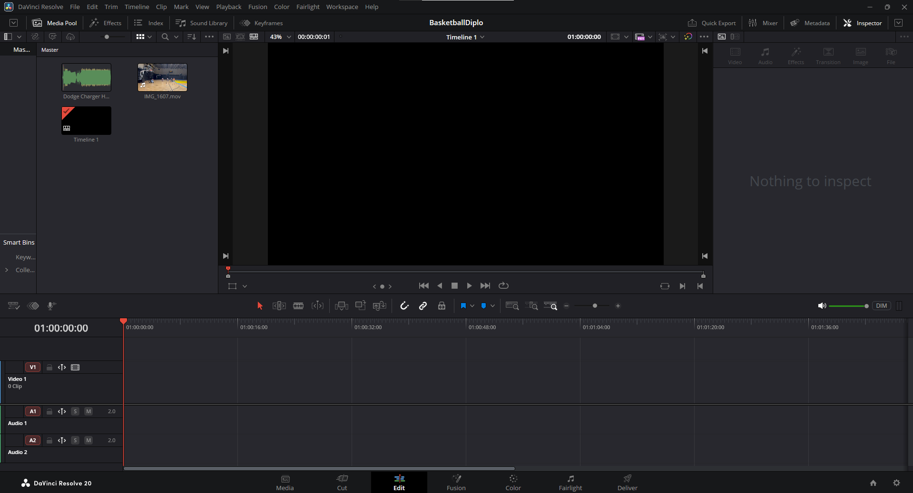{width=\textwidth}

Zur Vorbereitung des Videomaterials wurde die Videoschnittsoftware
DaVinci Resolve eingesetzt.

DaVinci Resolve ist eine professionelle Software für Videobearbeitung,
Farbkorrektur und Rendering. Im Rahmen dieser Arbeit wurde das Programm
verwendet, um das Rohmaterial der Videoaufnahmen zu schneiden und in
einzelne Videosequenzen aufzuteilen.

Die ursprünglichen Aufnahmen enthielten mehrere Würfe in einer
durchgehenden Sequenz. Für die Analyse der Flugbahnen war es jedoch
notwendig, einzelne Würfe separat zu betrachten. Daher wurden die
Videoaufnahmen in mehrere kurze Clips aufgeteilt, wobei jeder Clip
genau einen Wurf enthält.

Ein weiterer Vorteil von DaVinci Resolve ist die Möglichkeit,
Videomaterial mit konstanter Qualität und stabilen Exportformaten
zu rendern. Dadurch konnten einheitliche Videodateien erzeugt werden,
die als standardisierte Eingabedaten für die anschließende
Videoanalyse verwendet werden konnten. [@blackmagic_resolve_2026]

## Praktische Arbeit

### Ausgangsmaterial und Videovorbereitung

#### Rohmaterial der Videoaufnahmen

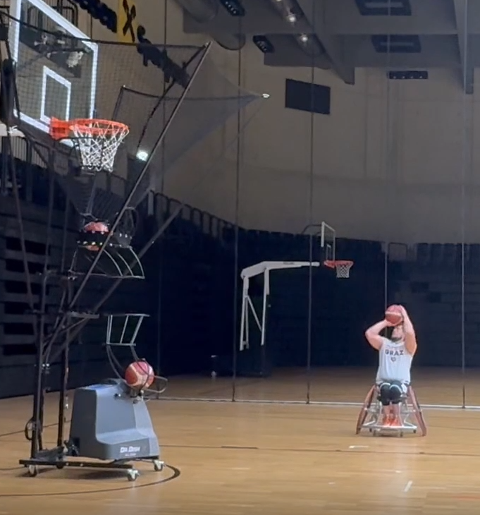{width=%}

Das Rohmaterial für die Analyse der Ist-Flugbahn wurde in Graz bei einer
Rollstuhl-Basketball-Mannschaft aufgenommen. Die Videoaufnahmen enthielten
mehrere Basketballwürfe in einer durchgehenden Sequenz.

Die Aufnahmen dienen als Grundlage für die spätere Videoanalyse und enthalten
die Bewegungen des Basketballs während verschiedener Würfe. Da die Analyse
auf einzelnen Wurfbewegungen basiert, mussten die relevanten Sequenzen zunächst
aus dem Rohmaterial herausgefiltert werden.

#### Videobearbeitung mit DaVinci Resolve

Um eine gezielte Analyse einzelner Würfe zu ermöglichen, wurde das Rohmaterial
in mehrere kurze Videoclips aufgeteilt, wobei jeder Clip genau einen Wurf enthält.
Diese Clips wurden separat gerendert und dienen als standardisierte Eingabedaten
für die weitere Verarbeitung.

Für das Schneiden und Vorbereiten der Videos wurde die Videoschnittsoftware
DaVinci Resolve verwendet. Die Software ermöglicht es, Videomaterial präzise zu
bearbeiten, einzelne Sequenzen zu extrahieren und in einem geeigneten Format
zu exportieren.

Durch die Aufteilung in einzelne Wurfsequenzen konnte sichergestellt werden,
dass jede Analyse auf einem klar definierten Bewegungsablauf basiert.
Gleichzeitig sorgt der Export der Clips für eine gleichbleibende Qualität
und ein einheitliches Format der Eingabedaten.

Diese vorbereiteten Videodateien bilden die Grundlage für die anschließende
Videoanalyse sowie für das Tracking des Basketballs.

### Technische Umsetzung der Ist-Flugbahn

Die Berechnung der Ist-Flugbahn erfolgt durch eine Videoanalyse des
Basketballwurfs. Ziel dieses Verarbeitungsschrittes ist es, den
Bewegungsverlauf des Balls über mehrere Videoframes hinweg zu
rekonstruieren und daraus die tatsächliche Flugbahn zu bestimmen.

Die Implementierung wurde in der Programmiersprache Python
realisiert und nutzt insbesondere die Bibliothek OpenCV für die
Videoverarbeitung und das Objekttracking.

Zu Beginn der Analyse wird das entsprechende Wurfvideo geladen und
Frame für Frame verarbeitet. Der Benutzer wählt zunächst einen
geeigneten Startframe aus, in dem der Basketball klar sichtbar ist.
In diesem Frame wird anschließend eine Region of Interest (ROI)
um den Ball definiert. Diese ROI dient als Ausgangspunkt für den
Trackingprozess.

Für die eigentliche Verfolgung des Basketballs wird ein
Objekttracking-Verfahren aus der OpenCV-Bibliothek verwendet.
Abhängig von der verfügbaren OpenCV-Version kommen dabei
Tracker wie CSRT oder MOSSE zum Einsatz. Diese Tracker
verfolgen ein zuvor definiertes Objekt über mehrere Frames hinweg
und aktualisieren kontinuierlich eine Bounding Box um den Ball.

Aus der Bounding Box wird in jedem Frame der Mittelpunkt des Balls
berechnet. Die Folge dieser Mittelpunkte bildet eine diskrete
Trajektorie, welche den tatsächlichen Flugweg des Basketballs im
Bildkoordinatensystem beschreibt.

Während des Trackings wird zusätzlich eine Plausibilitätsprüfung
durchgeführt. Dabei wird überprüft, ob sich der Ball zwischen zwei
Frames nur innerhalb eines realistischen Abstands bewegt.

Falls der Tracker das Objekt verliert oder ein unrealistisch großer
Positionssprung erkannt wird, wird das Tracking abgebrochen, um
fehlerhafte Flugbahnen zu vermeiden.

Ein weiterer wichtiger Referenzpunkt ist der Korbring (Rim).
Die Position des Rings wird zuvor durch eine Kalibrierung bestimmt
und während der Analyse im Bild markiert. Diese Information dient
unter anderem dazu, den Wurfverlauf später mit der Soll-Flugbahn
vergleichen zu können.

Während des Trackings werden alle ermittelten Ballpositionen
gespeichert. Nach Abschluss der Analyse werden diese Punkte
miteinander verbunden und als Ist-Flugbahn im Videobild
visualisiert.

Neben der grafischen Darstellung werden die Positionsdaten des
Balls zusätzlich in einer CSV-Datei gespeichert. Dadurch können
die Trackingdaten später weiterverarbeitet oder für weitere
Analysen genutzt werden.

Das resultierende Overlaybild mit der eingezeichneten Ist-Flugbahn
sowie die exportierten Trackingdaten bilden die Grundlage für den
anschließenden Vergleich mit der berechneten Soll-Flugbahn. [@bradski_opencv_2000]

### Automatische Ballerkennung und ihre Grenzen

Zu Beginn der Entwicklung wurde versucht, den Basketball in jedem Frame des Videos
automatisch zu erkennen. Ziel dieses Ansatzes war es, den gesamten Analyseprozess
weitgehend zu automatisieren, sodass keine manuelle Auswahl des Balls notwendig
ist. In einem solchen Szenario würde der Algorithmus den Ball in jedem Frame
selbstständig identifizieren und seine Position bestimmen.

Die ermittelten Ballpositionen könnten anschließend direkt zur Rekonstruktion der
Ist-Flugbahn verwendet werden. In der praktischen Umsetzung zeigte sich jedoch,
dass eine vollständig automatische Ballerkennung im vorliegenden Videomaterial
nicht zuverlässig funktioniert.

Die Ursachen hierfür liegen in mehreren technischen Herausforderungen, die bei
realen Sportaufnahmen auftreten.

#### Bewegungsunschärfe des Basketballs

Während der Flugphase bewegt sich der Basketball mit hoher Geschwindigkeit durch
das Bild. Abhängig von der Bildrate der Kamera und der Belichtungszeit entsteht
dadurch Bewegungsunschärfe (Motion Blur).

In diesen Frames verliert der Ball seine klar definierte Kreisform und erscheint
teilweise verzerrt oder verschwommen. Algorithmen, die auf geometrischen Merkmalen
wie Kreisdetektion basieren, können den Ball in solchen Situationen nicht mehr
zuverlässig identifizieren.

Dies führt dazu, dass der Ball in einzelnen Frames nicht erkannt wird oder
fälschlicherweise andere Bildbereiche als Zielobjekt identifiziert werden.
[@tai_motion_2011]

#### Ähnliche Farben und Bildstrukturen

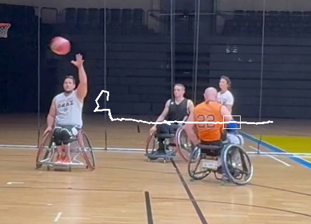{width=100%}

*Abbildung: Beispiel eines Basketballwurfs während der Analyse. Das orange Trikot eines Spielers weist eine ähnliche Farbgebung wie der Basketball auf, wodurch die automatische Erkennung und das Tracking des Balls erschwert werden können.*

Ein weiteres Problem ergibt sich aus visuell ähnlichen Bildbereichen im Hintergrund.
Elemente wie Hauttöne, Teile der Sportbekleidung oder Linien des Spielfelds können
farblich oder strukturell dem Basketball ähneln.

Automatische Verfahren, die auf Farbsegmentierung oder einfachen
Schwellenwertmethoden basieren, können diese Bildbereiche teilweise nicht
zuverlässig vom Ball unterscheiden. Dadurch entstehen Fehlklassifikationen, bei
denen der Algorithmus einen falschen Bildbereich als Ball interpretiert.

Solche Fehler führen zu inkonsistenten Positionsdaten und können die rekonstruierte
Flugbahn stark verfälschen. [@yilmaz_object_2006]

#### Verdeckungen während der Abwurfphase

Besonders problematisch ist die Phase unmittelbar vor dem Abwurf des Balls.
In dieser Situation befindet sich der Basketball sehr nahe an der Hand des
Spielers und kann teilweise von der Hand oder vom Arm verdeckt werden.

In einzelnen Frames ist der Ball dadurch nur teilweise sichtbar oder überlagert
mit anderen Bildobjekten. Automatische Erkennungsverfahren können in diesen
Situationen das Zielobjekt häufig nicht eindeutig identifizieren.

Gerade diese Phase ist jedoch für die Analyse der Flugbahn besonders wichtig,
da hier der Übergang vom Abwurf zur Flugbewegung stattfindet. [@yilmaz_object_2006]

#### Unterschiedliche Ballgrößen im Bild

Die Größe des Basketballs im Bild verändert sich abhängig von seiner Entfernung
zur Kamera. Während der Ball sich durch den Raum bewegt, kann sein projizierter
Durchmesser im Bild variieren.

Viele Detektionsverfahren benötigen jedoch eine ungefähre Erwartung über die
Größe des zu erkennenden Objekts. Wird dieser Bereich zu eng gewählt, wird der
Ball in manchen Frames nicht erkannt. Wird er zu groß gewählt, steigt die
Wahrscheinlichkeit für Fehlklassifikationen. [@yilmaz_object_2006]

#### Verwechslung mit anderen Objekten im Bild

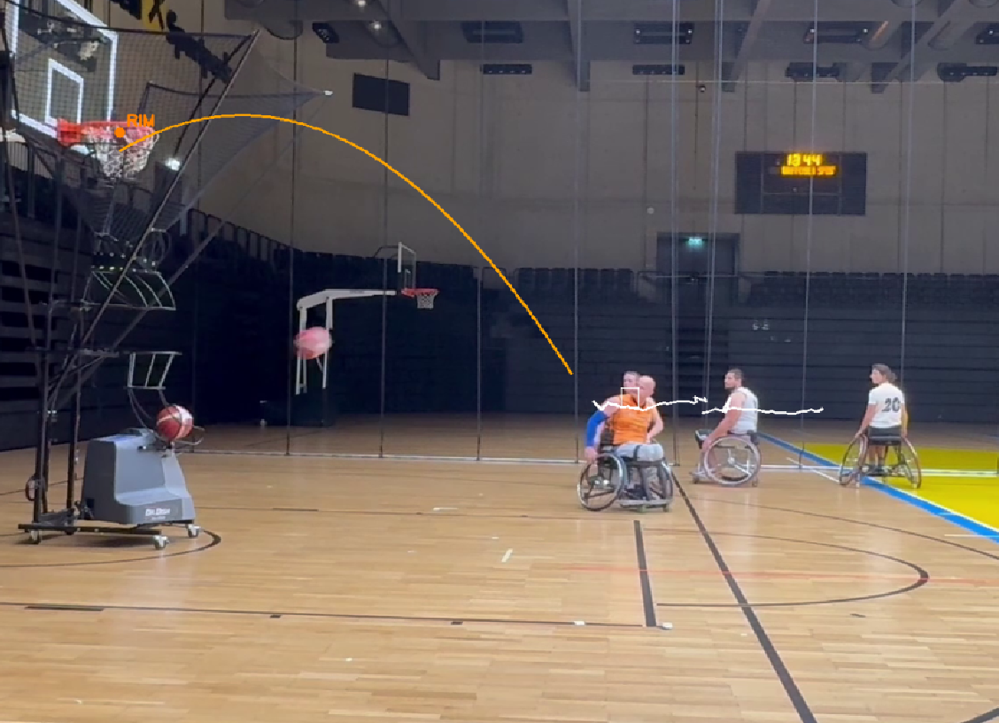{width=100%}

Ein weiteres Problem der automatischen Ballerkennung bestand darin, dass der
Algorithmus in einigen Situationen nicht den Basketball selbst, sondern andere
Bildobjekte als Ziel identifizierte. Besonders häufig trat dieses Problem in der
Phase unmittelbar vor dem Abwurf auf, wenn sich der Ball sehr nahe an der Hand
des Spielers befindet.

Da Hand und Ball in dieser Situation räumlich eng beieinander liegen und sich
gleichzeitig bewegen, können automatische Verfahren Schwierigkeiten haben, das
korrekte Objekt eindeutig zu identifizieren. In einigen Fällen wurde daher
fälschlicherweise die Hand des Spielers als Zielobjekt erkannt.

Dies liegt unter anderem daran, dass viele Tracking- und Detektionsverfahren
Bildregionen anhand bestimmter Merkmale wie Größe, Bewegung oder Kontrast
bewerten. Befindet sich die Hand näher an der Kamera oder weist eine stärkere
Bewegung auf, kann der Algorithmus diese Region irrtümlich als das relevante
Objekt interpretieren.

Die Folge solcher Fehlklassifikationen sind unplausible Positionsdaten, bei
denen der berechnete Flugverlauf nicht mehr der tatsächlichen Bewegung des
Basketballs entspricht. Bereits einzelne Fehlzuordnungen können dabei die
rekonstruierte Flugbahn deutlich verfälschen.

Aus diesem Grund war eine rein automatische Objekterkennung für die vorliegenden
Videoaufnahmen nicht ausreichend zuverlässig und musste durch ein stabileres
Trackingverfahren mit manueller Initialisierung ergänzt werden. [@yilmaz_object_2006]

#### Konsequenzen für die Flugbahnbestimmung

Für die Rekonstruktion der Ist-Flugbahn ist eine kontinuierliche und konsistente
Positionsfolge des Balls erforderlich. Einzelne Fehlklassifikationen oder
nicht erkannte Frames können bereits zu sichtbaren Fehlern in der berechneten
Flugbahn führen.

Da eine vollständig automatische Ballerkennung unter den gegebenen Bedingungen
keine ausreichend stabilen Ergebnisse lieferte, wurde dieser Ansatz verworfen.
Stattdessen wurde ein Tracking-Verfahren eingesetzt, bei dem der Ball nach einer
Initialisierung kontinuierlich über die Videosequenz hinweg verfolgt wird.
[@opencv_drawing_2026]

### Lösungsansatz: Manuelle Initialisierung der Region of Interest (ROI)

#### Manuelle Auswahl der Region of Interest (ROI)

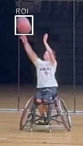{width=60%}

Zur Lösung dieses Problems wurde ein manueller Initialisierungsschritt eingeführt.
Dabei wird ein Frame ausgewählt, in dem der Basketball eindeutig sichtbar und klar
von der Hand des Spielers getrennt ist.

In diesem Frame wird eine präzise Region of Interest (ROI) um den Ball definiert.
Diese ROI dient als Startpunkt für den Tracker und stellt sicher, dass ausschließlich
der Basketball als Zielobjekt erkannt und verfolgt wird.

Durch diese gezielte Initialisierung konnte verhindert werden, dass der Tracker
auf die Spielerhand wechselt. Die Stabilität und Genauigkeit des Balltrackings
wurden dadurch deutlich verbessert.

Zusätzlich wird eine Plausibilitätsprüfung eingesetzt, bei der unplausible
Bewegungssprünge des Balls zwischen zwei Frames erkannt werden. In solchen Fällen
wird das Tracking abgebrochen, um fehlerhafte Ergebnisse zu vermeiden.

~~~~~~~~~~~~~~~~~~~~~~~~~~~~~~~~~~~~~~~~~~~~~~~{caption="Manuelle Auswahl einer Region of Interest (ROI) für den Basketball" .python}
# Startframe anzeigen
frame = start_frame.copy()

# Benutzer wählt eine ROI um den Basketball
roi = cv2.selectROI("Ball ROI auswählen", frame, False, False)

# ROI Koordinaten speichern
x, y, w, h = map(int, roi)

# Mittelpunkt des Balls berechnen
cx = x + w / 2
cy = y + h / 2

# ROI als Startpunkt für den Tracker verwenden
tracker = cv2.TrackerCSRT_create()
tracker.init(frame, (x, y, w, h))

print("ROI gesetzt:", roi)
~~~~~~~~~~~~~~~~~~~~~~~~~~~~~~~~~~~~~~~~~~~~~~~

#### Manuelle Auswahl des Korbrings (Rim)

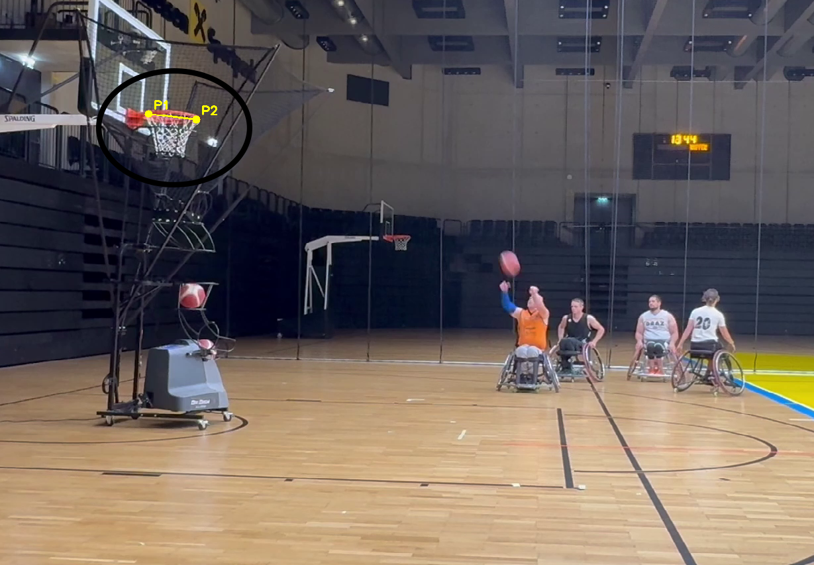{width=\textwidth}

Neben dem Basketball wird auch die Position des Korbrings manuell im Bild
festgelegt. Der Korbring dient als wichtiger Referenzpunkt für die Analyse
der Flugbahn und ermöglicht es, die Position des Balls relativ zum Ziel
des Wurfes zu bestimmen.

Hierfür wird in einem geeigneten Frame eine Region of Interest um den
Korbring definiert. Da sich der Korb während der Aufnahme nicht bewegt,
reicht eine einmalige Auswahl aus, um seine Position im Bild zu bestimmen.

Die Position des Korbrings wird anschließend als Referenzkoordinate im
Bildkoordinatensystem gespeichert. Diese Referenz kann später verwendet
werden, um die Flugbahn des Basketballs relativ zum Korb zu analysieren
oder um visuelle Hilfselemente, wie beispielsweise eine Soll-Flugbahn,
korrekt im Bild zu platzieren.

~~~~~~~~~~~~~~~~~~~~~~~~~~~~~~~~~~~~~~~~~~~~~~~{caption="Manuelle Auswahl der Korbposition (Rim) im Bild" .python}
# Frame anzeigen
frame = start_frame.copy()

# Benutzer klickt die Position des Rims
rim_roi = cv2.selectROI("Rim auswählen", frame, False, False)

x, y, w, h = map(int, rim_roi)

# Mittelpunkt des Rims berechnen
rim_cx = x + w / 2
rim_cy = y + h / 2

# Rim-Koordinate speichern
rim_position = (rim_cx, rim_cy)

print("Rim Position:", rim_position)
~~~~~~~~~~~~~~~~~~~~~~~~~~~~~~~~~~~~~~~~~~~~~~~

Durch die manuelle Auswahl des Korbrings wird sichergestellt, dass die
Referenzposition unabhängig von Bildrauschen, Hintergrundstrukturen oder
anderen visuellen Störeinflüssen eindeutig festgelegt ist.

### Visualisierung der Flugbahnen

Die visuelle Darstellung der berechneten Flugbahnen stellt einen wichtigen
Bestandteil der Videoanalyse dar. Durch die grafische Aufbereitung der
ermittelten Positionsdaten wird der Bewegungsverlauf des Basketballs für
Beobachter*innen leicht nachvollziehbar.

Die Visualisierung ermöglicht es, die Bewegung des Balls nicht nur
numerisch auszuwerten, sondern auch direkt im Kontext der ursprünglichen
Videoaufnahme zu betrachten. Dadurch können charakteristische Eigenschaften
des Wurfes, wie beispielsweise die Höhe der Flugbahn oder seitliche
Abweichungen, intuitiv erkannt werden. [@opencv_drawing_2026]

#### Visualisierung der Ist-Flugbahn

Zur Darstellung der Ist-Flugbahn werden die während des Trackings
ermittelten Ballpositionen verwendet. Für jedes Videoframe wird die
Position des Basketballs im Bildkoordinatensystem bestimmt und als
Punkt gespeichert.

Diese einzelnen Punkte werden anschließend in zeitlicher Reihenfolge
miteinander verbunden. Dadurch entsteht eine Linie, welche den
tatsächlichen Flugweg des Basketballs im Video darstellt.

Die Darstellung erfolgt als Overlay direkt über dem Videobild,
sodass der Bewegungsverlauf des Balls im Kontext der ursprünglichen
Aufnahme sichtbar bleibt.

Je nach Ausgang des Wurfes ergeben sich jedoch unterschiedliche
Trackingverläufe, da sich der Ball nach einem erfolgreichen Wurf
anders verhält als nach einem Fehlwurf.

~~~~~~~~~~~~~~~~~~~~~~~~~~~~~~~~~~~~~~~~~~~~~~~{caption="Visualisierung der Ist-Flugbahn" .python}
# Kopie des aktuellen Videoframes erstellen
overlay = frame.copy()

# Trackingpunkte verbinden
for i in range(1, len(positions_px)):
    x1, y1 = positions_px[i-1]
    x2, y2 = positions_px[i]

    cv2.line(
        overlay,
        (int(x1), int(y1)),
        (int(x2), int(y2)),
        (255, 255, 255),
        2
    )

# Aktuellen Ballpunkt markieren
cx, cy = positions_px[-1]
cv2.circle(overlay, (int(cx), int(cy)), 4, (255,255,255), -1)

cv2.imshow("Ist-Flugbahn", overlay)
~~~~~~~~~~~~~~~~~~~~~~~~~~~~~~~~~~~~~~~~~~~~~~~

Das Listing zeigt vereinfacht, wie aus den während des Trackings ermittelten Ballpositionen eine Ist-Flugbahn erzeugt wird. Die einzelnen Positionspunkte werden in zeitlicher Reihenfolge miteinander verbunden und als Overlay auf dem Videoframe dargestellt.

##### Korberfolg

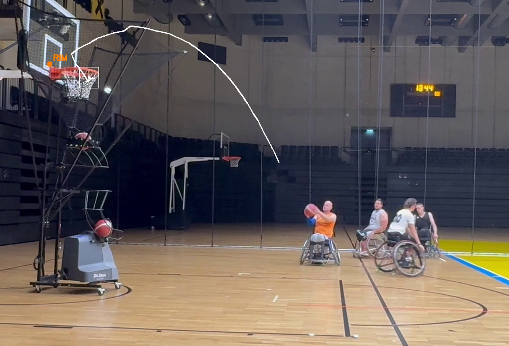{width=%}

Bei einem erfolgreichen Wurf fällt der Basketball durch den Korb
und verlässt anschließend den relevanten Bereich des Wurfverlaufs.
Um diesen Moment automatisiert zu erkennen, wird die zuvor manuell
definierte Position des Korbrings (Rim) als Referenzpunkt verwendet.

Der Rim wird zu Beginn der Analyse einmal im Bild markiert und seine
Position im Bildkoordinatensystem gespeichert. Während des Trackings
wird anschließend kontinuierlich überprüft, wie sich die Position des
Basketballs relativ zu diesem Referenzpunkt verändert.

Ein Korberfolg wird angenommen, wenn sich der Ball mehrere aufeinander-
folgende Frames unterhalb der Rim-Position befindet. Diese Bedingung
deutet darauf hin, dass der Ball den Korb passiert hat und sich
unterhalb des Rings befindet.

Die Verwendung mehrerer Frames verhindert dabei Fehlinterpretationen,
beispielsweise wenn der Ball kurzzeitig den Rim berührt oder sich
nur in dessen Nähe befindet.

Sobald diese Bedingung erfüllt ist, wird der Wurf als erfolgreich
klassifiziert und das Tracking beendet. Dadurch wird sichergestellt,
dass nur der eigentliche Wurfverlauf, vom Abwurf bis zum Durchqueren
des Korbs, in die Analyse der Ist-Flugbahn einfließt.
~~~~~~~~~~~~~~~~~~~~~~~~~~~~~~~~~~~~~~~~~~~~~~~{caption="Erkennung eines Korberfolgs anhand der Rim-Position" .python}
frames_below_rim = 0
threshold_frames = 3

for (cx, cy) in positions_px:

    # Prüfen ob Ball unter dem Rim liegt
    if cy > rim_cy:
        frames_below_rim += 1
    else:
        frames_below_rim = 0

    # Wenn mehrere Frames unterhalb -> Treffer
    if frames_below_rim >= threshold_frames:
        print("Korberfolg erkannt - Tracking wird beendet")
        break
~~~~~~~~~~~~~~~~~~~~~~~~~~~~~~~~~~~~~~~~~~~~~~~
Nachfolgende Bewegungen des Balls, etwa beim Aufprall auf dem Boden
oder beim Kontakt mit dem Netz, werden nicht mehr in die
Flugbahnberechnung aufgenommen.

##### Fehlwurf

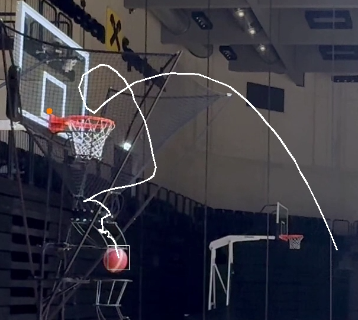{width=%}

Bei einem Fehlwurf trifft der Basketball den Korb nicht und
bewegt sich anschließend weiter durch das Bild, beispielsweise
in Richtung Boden oder zurück ins Spielfeld.

In diesem Fall wird das Tracking nicht sofort beendet, sondern
weitergeführt, solange der Ball im Bild sichtbar bleibt.
Dadurch kann auch der weitere Bewegungsverlauf des Balls
dokumentiert werden.

Die Visualisierung der Ist-Flugbahn enthält somit nicht nur
den eigentlichen Wurf, sondern auch die anschließende Bewegung
des Balls nach dem Fehlwurf.

Diese zusätzlichen Trackingpunkte können hilfreich sein, um
den Verlauf des Wurfes vollständig zu verstehen und mögliche
Abweichungen vom Zielpunkt besser zu analysieren.

#### Gemeinsame Darstellung von Ist- und Soll-Flugbahn

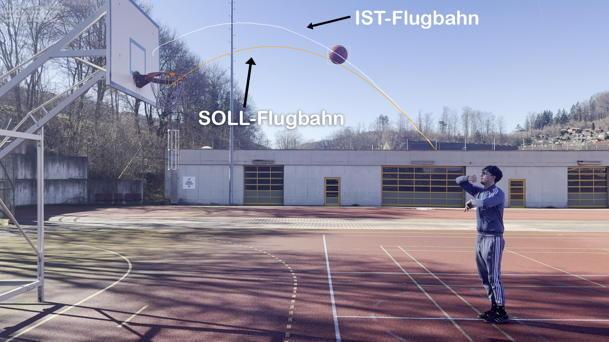{width=100%}

Neben der Visualisierung der tatsächlichen Flugbahn wird auch eine Darstellung
erstellt, bei der Ist-Flugbahn und Soll-Flugbahn gleichzeitig angezeigt werden.
Dabei wird die berechnete ideale Flugbahn gemeinsam mit der realen Bewegung
des Basketballs über das Videobild gelegt.

Durch diese kombinierte Darstellung können Unterschiede zwischen dem
tatsächlich ausgeführten Wurf und dem theoretisch optimalen Verlauf direkt
sichtbar gemacht werden. Abweichungen im Abwurfwinkel, in der Höhe der
Flugbahn oder in der seitlichen Richtung lassen sich dadurch leicht erkennen.

~~~~~~~~~~~~~~~~~~~~~~~~~~~~~~~~~~~~~~~~~~~~~~~{caption="Gemeinsame Darstellung von Ist- und Soll-Flugbahn" .python}
overlay = frame.copy()

# IST-Flugbahn zeichnen
for i in range(1, len(positions_px)):
    x1, y1 = positions_px[i-1]
    x2, y2 = positions_px[i]
    cv2.line(overlay, (int(x1), int(y1)), (int(x2), int(y2)), (255,255,255), 2)

# SOLL-Flugbahn zeichnen
for i in range(1, len(soll_traj_px)):
    x1, y1 = soll_traj_px[i-1]
    x2, y2 = soll_traj_px[i]
    cv2.line(overlay, (int(x1), int(y1)), (int(x2), int(y2)), (0,140,255), 2)

cv2.imwrite("wurf_combined_overlay.png", overlay)
~~~~~~~~~~~~~~~~~~~~~~~~~~~~~~~~~~~~~~~~~~~~~~~

Die gleichzeitige Darstellung beider Flugbahnen bildet die Grundlage für
eine visuelle Analyse des Wurfes und ermöglicht es, dem Spieler ein
direktes Feedback über mögliche Verbesserungen seiner Wurftechnik zu geben.

#### Export der Trackingdaten als CSV-Datei

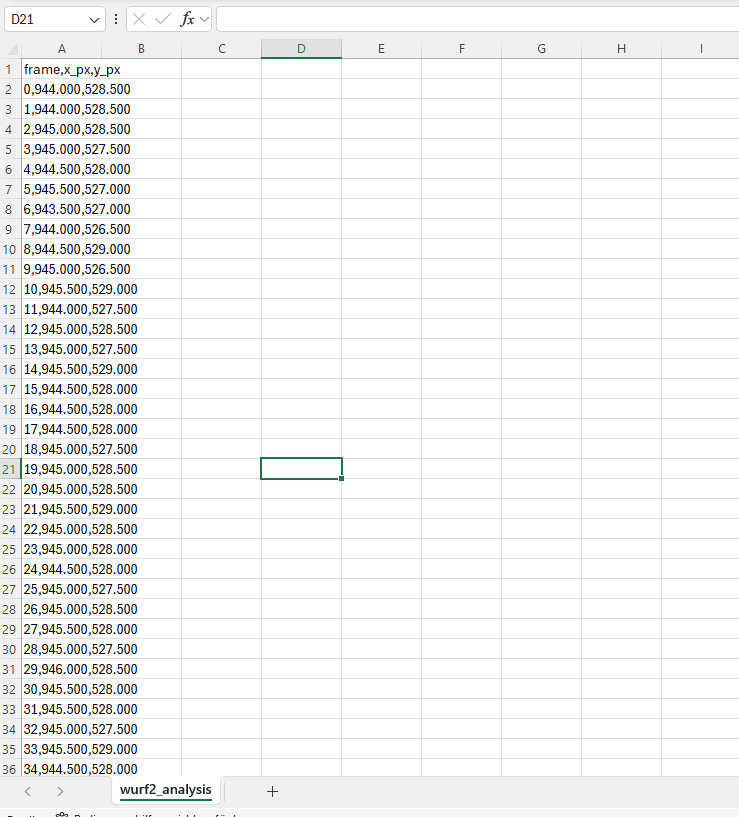{width=100%}

Neben der grafischen Darstellung der Flugbahn werden die während des Trackings
ermittelten Positionsdaten des Basketballs zusätzlich in einer CSV-Datei
gespeichert.

In dieser Datei wird für jedes verarbeitete Frame die entsprechende
Position des Balls im Bildkoordinatensystem abgelegt. Typischerweise enthält
die Datei dabei Informationen wie die Frame-Nummer sowie die X- und
Y-Koordinaten des Basketballs.

Der Export der Daten in das CSV-Format hat mehrere Vorteile. Zum einen
ermöglicht das Format eine einfache und standardisierte Speicherung der
Trackingdaten. CSV-Dateien können von vielen Programmen und
Programmiersprachen problemlos gelesen und weiterverarbeitet werden.

Zum anderen dient die CSV-Datei als Schnittstelle zwischen verschiedenen
Systemkomponenten der Anwendung. Die im Analyseprozess erzeugten Daten
können dadurch sowohl im Backend weiterverarbeitet als auch an ein
Frontend-System übergeben werden.

Im Backend können die gespeicherten Daten beispielsweise für zusätzliche
Berechnungen, statistische Analysen oder zur Generierung weiterer
Visualisierungen genutzt werden. Im Frontend können die Koordinaten
verwendet werden, um die Flugbahn dynamisch darzustellen oder interaktive
Visualisierungen für Nutzer*innen bereitzustellen.

Durch die strukturierte Speicherung der Trackingdaten wird somit
sichergestellt, dass die Ergebnisse der Videoanalyse nicht nur visuell
verfügbar sind, sondern auch flexibel in anderen Komponenten des
Systems weiterverwendet werden können.

### Technische Herausforderungen bei der Erstellung des Overlays

Nach der erfolgreichen Ermittlung der Ist- und Soll-Flugbahn bestand der nächste
Schritt darin, beide Flugbahnen gemeinsam über das ursprüngliche Videomaterial zu
legen. Ziel dieser Darstellung ist es, den realen Bewegungsverlauf des Basketballs
und die berechnete ideale Flugbahn gleichzeitig sichtbar zu machen.

Durch diese kombinierte Visualisierung können Abweichungen zwischen dem
tatsächlichen Wurf und dem theoretisch optimalen Verlauf unmittelbar erkannt
werden.

Bei der Umsetzung dieser Overlay-Darstellung traten jedoch mehrere technische
Probleme auf, die zunächst zu fehlerhaften oder qualitativ unzureichenden
Ergebnissen führten.

#### Falsche Skalierung des Overlays

Ein erstes Problem bestand in der falschen Skalierung der erzeugten Visualisierung.
In einigen Fällen wurde die berechnete Flugbahn auf eine Bildgröße gerendert, die
nicht exakt der Auflösung des Originalvideos entsprach.

Dadurch erschien das Overlay entweder zu groß oder verschoben im Verhältnis zum
Videobild. Die eingezeichnete Flugbahn lag somit nicht exakt auf der tatsächlichen
Position des Balls.

Dieses Problem trat insbesondere dann auf, wenn unterschiedliche Auflösungen
zwischen Eingabebild, internen Verarbeitungsstrukturen und dem final gerenderten
Ausgabebild verwendet wurden.

Um eine korrekte Darstellung zu gewährleisten, musste sichergestellt werden,
dass alle Verarbeitungsschritte im gleichen Koordinatensystem und mit identischer
Bildauflösung arbeiten. [@opencv_docs_2026]

#### Qualitätsverluste im gerenderten Bild

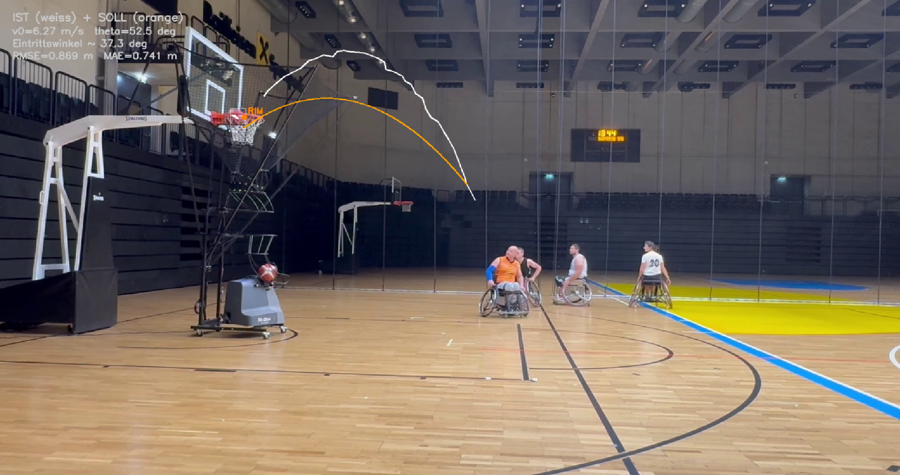{width=110%}

Ein weiteres Problem war eine teilweise reduzierte Bildqualität im finalen
Overlay. Während der Verarbeitung kam es zu mehreren Konvertierungen der
Bilddaten sowie zu erneuten Encoding-Schritten bei der Videoausgabe.

Diese mehrfachen Verarbeitungsschritte führten teilweise zu sichtbaren
Qualitätsverlusten im Vergleich zum ursprünglichen Videomaterial.

Die Qualitätsverluste äußerten sich unter anderem in unscharfen Linien der
Flugbahn oder einer insgesamt reduzierten Bildschärfe.

Zur Verbesserung der Darstellung wurden die Renderparameter angepasst und
darauf geachtet, dass möglichst wenige verlustbehaftete Konvertierungsschritte
durchgeführt werden. [@opencv_docs_2026]

#### Synchronisationsprobleme zwischen Flugbahn und Videoframe

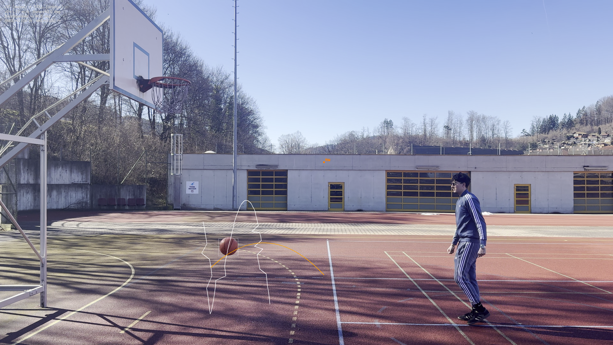{width=110%}

Zusätzlich traten in frühen Versionen der Visualisierung Probleme bei der
zeitlichen Synchronisation zwischen Trackingdaten und Videoframes auf.

In einigen Fällen wurde die Flugbahn nicht exakt auf dem Frame dargestellt,
zu dem die ermittelte Ballposition gehörte. Dadurch konnte eine leichte
Verschiebung zwischen der tatsächlichen Ballposition im Video und der
eingezeichneten Flugbahn entstehen.

Die Ursache lag darin, dass die gespeicherten Trackingpunkte zunächst nicht
immer eindeutig mit der Frame-Nummer des Originalvideos verknüpft waren.

Um dieses Problem zu lösen, wurde eine klare Zuordnung zwischen Trackingdaten
und Frame-Nummern eingeführt. Jeder ermittelte Ballpunkt wird dabei direkt
mit dem entsprechenden Frame des Videos gespeichert.

Dadurch kann bei der Visualisierung sichergestellt werden, dass die
Flugbahn exakt auf dem zugehörigen Videoframe dargestellt wird.
[@szeliski_computer_2022]
#### Ergebnis der Optimierungen

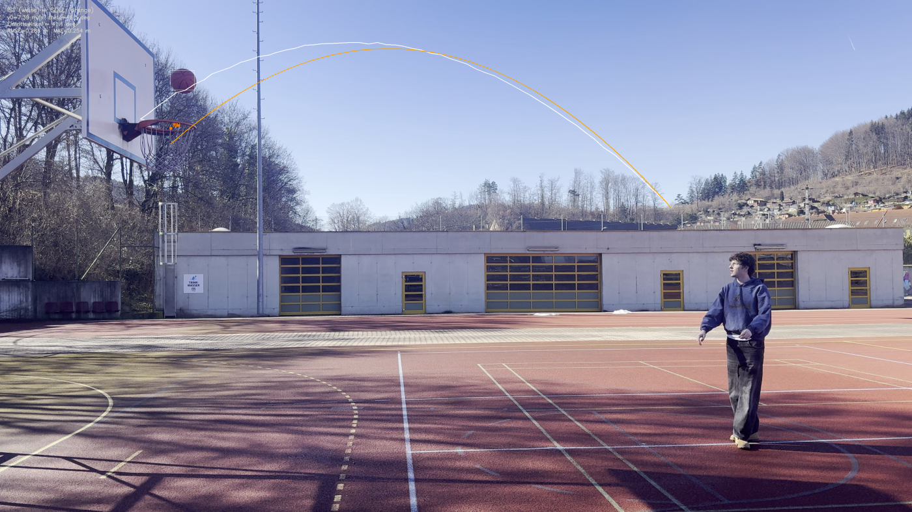{ width=1200px }

Durch die beschriebenen Anpassungen konnte eine stabile und visuell konsistente
Overlay-Darstellung erreicht werden. Die Ist- und Soll-Flugbahn lassen sich nun
korrekt skaliert und zeitlich synchron über dem Videomaterial darstellen.

Der Bewegungsverlauf des Basketballs wird dadurch klar nachvollziehbar und
kann direkt mit der idealen Flugbahn verglichen werden.

Diese Darstellung bildet die Grundlage für die anschließende Analyse des
Wurfverlaufs und ermöglicht es, Abweichungen zwischen realer und idealer
Flugbahn unmittelbar zu erkennen.

### Ausblick

Das entwickelte System zur Analyse von Basketballwürfen stellt eine funktionsfähige Grundlage für die visuelle Auswertung von Wurfbewegungen dar. Durch die Kombination aus Videoanalyse, Balltracking und der Visualisierung von Ist- und Soll-Flugbahn kann der Bewegungsverlauf eines Wurfes nachvollziehbar dargestellt und analysiert werden.

Trotz der erfolgreichen Umsetzung bestehen verschiedene Möglichkeiten zur Weiterentwicklung des Systems. Ein möglicher nächster Schritt besteht in der Verbesserung der automatischen Objekterkennung. Der derzeitige Ansatz basiert auf einer manuellen Initialisierung des Balltrackings, um Fehlklassifikationen zu vermeiden. In zukünftigen Versionen könnte ein erweitertes Verfahren zur automatischen Objekterkennung integriert werden, beispielsweise durch den Einsatz moderner Machine-Learning- oder Deep-Learning-Modelle. Dadurch ließe sich der Analyseprozess weiter automatisieren.

Ein weiterer Ansatzpunkt liegt in der Erweiterung der physikalischen Analyse der Flugbahn. Der Vergleich zwischen Ist- und Soll-Flugbahn könnte um zusätzliche Kennwerte ergänzt werden, etwa den Abwurfwinkel, die Anfangsgeschwindigkeit des Balls oder den Eintrittswinkel am Korb. Solche Parameter könnten eine noch genauere Bewertung der Wurftechnik ermöglichen.

Darüber hinaus wäre eine Integration der Analyse in ein interaktives Frontend denkbar. Die ermittelten Trackingdaten werden bereits strukturiert gespeichert und könnten in einer grafischen Benutzeroberfläche genutzt werden, um Würfe interaktiv darzustellen, zu vergleichen oder statistisch auszuwerten.

Langfristig könnte das System zudem auf andere Sportarten oder Bewegungsanalysen übertragen werden. Die grundlegende Methode der Videoanalyse und Objektverfolgung eignet sich prinzipiell auch für andere Szenarien, in denen Bewegungsabläufe untersucht werden sollen.

Insgesamt zeigt die entwickelte Anwendung, dass sich durch den Einsatz moderner Computer-Vision-Verfahren eine anschauliche und objektive Analyse von Basketballwürfen realisieren lässt. Die vorgestellte Implementierung bildet damit eine solide Grundlage für zukünftige Erweiterungen und weiterführende Anwendungen im Bereich der sportwissenschaftlichen Videoanalyse.

 
